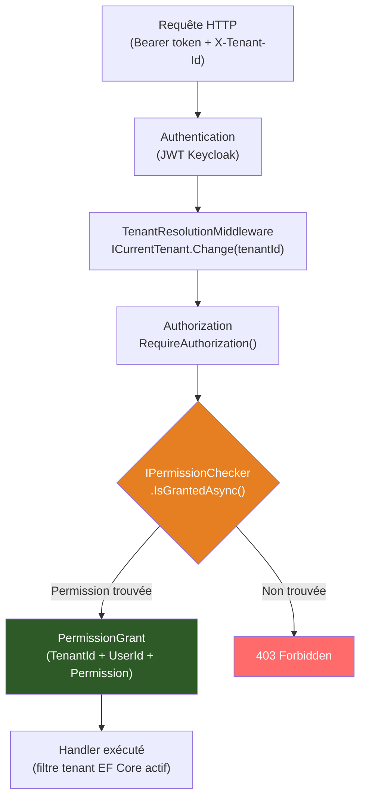

# Policy d'autorisation basée sur le tenant

## Problème

Un endpoint doit vérifier que l'utilisateur possède une permission spécifique
**dans le contexte du tenant actif**. Les rôles globaux ne suffisent pas :
un utilisateur peut être `admin` dans le tenant A mais simple `reader` dans le tenant B.

## Solution

### Déclarer la permission

```csharp
using Granit.Authorization.Abstractions;

namespace MyApp.Authorization;

public sealed class PatientPermissionDefinitionProvider : IPermissionDefinitionProvider
{
    public void DefinePermissions(IPermissionDefinitionContext context)
    {
        PermissionGroup group = context.AddGroup("Patients");

        group.AddPermission("Patients.Create");
        group.AddPermission("Patients.Read");
        group.AddPermission("Patients.Update");
        group.AddPermission("Patients.Delete");
    }
}
```

> Les `displayName` localisés sont optionnels. Voir la
> [documentation complète](../framework/security/authorization.md#définir-les-permissions)
> pour l'ajout de `LocalizableString`.

### Vérifier dans le endpoint

```csharp
using Granit.Authorization;
using Granit.Core.MultiTenancy;
using Microsoft.AspNetCore.Http;
using Microsoft.AspNetCore.Http.HttpResults;

namespace MyApp.Endpoints;

internal static class PatientEndpoints
{
    internal static async Task<Results<Ok<List<Patient>>, ForbidHttpResult>> GetAllAsync(
        IPermissionChecker permissionChecker,
        ICurrentTenant currentTenant,
        AppDbContext db,
        CancellationToken ct)
    {
        // Vérifie la permission dans le contexte du tenant actif
        bool isGranted = await permissionChecker.IsGrantedAsync("Patients.Read");

        if (!isGranted)
        {
            return TypedResults.Forbid();
        }

        // Le filtre tenant est appliqué automatiquement par EF Core
        List<Patient> patients = await db.Patients.ToListAsync(ct);

        return TypedResults.Ok(patients);
    }
}
```

## Explication



### Points clés

- **`IPermissionChecker`** résout automatiquement le `TenantId` et le `UserId`
  depuis `ICurrentTenant` et `ICurrentUserService`. Pas besoin de les passer
  explicitement.
- **`PermissionGrant`** est une entité EF Core stockant le triplet
  `(TenantId, UserId/RoleName, PermissionName)`. Elle est persistée via
  `Granit.Authorization.EntityFrameworkCore`.
- **Cache** : les permissions sont mises en cache par tenant pour éviter
  des requêtes SQL à chaque appel. Le cache est invalidé lors de l'écriture
  d'un nouveau `PermissionGrant`.
- **Admin bypass** : si `KeycloakOptions.AdminRoleName` est configuré,
  les utilisateurs avec ce rôle contournent toutes les vérifications de permission.

## Attribution d'une permission

```csharp
// Attribuer la permission à un rôle dans un tenant
await permissionGrantRepository.InsertAsync(new PermissionGrant
{
    TenantId = currentTenant.Id,
    ProviderName = "Role",
    ProviderKey = "doctor",
    Name = "Patients.Create"
});
```

## Liens

- [Autorisation](../framework/security/authorization.md)
- [Multi-tenancy](../framework/data/multi-tenancy.md)
- [Pattern Claims-Based Identity](../patterns/security/claims-based-identity.md)
