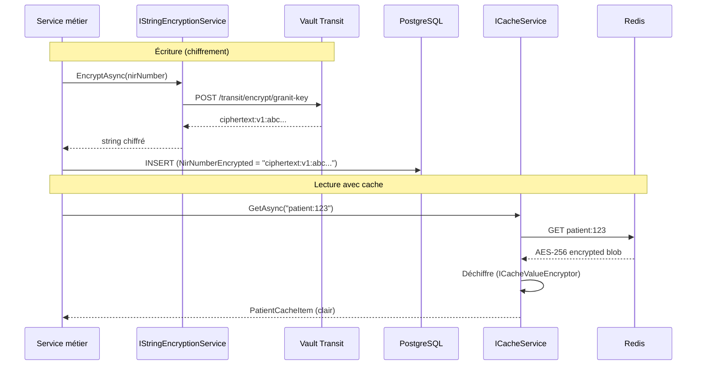

# Chiffrer des données sensibles (Transit Vault + cache)

## Problème

Des données de santé (NIR, diagnostics, coordonnées de patients) doivent être
chiffrées au repos (ISO 27001) et en transit. Le chiffrement doit être transparent
pour le code métier, y compris dans le cache distribué.

## Solution

### Chiffrement de champs via IStringEncryptionService

```csharp
using Granit.Encryption;

namespace MyApp.Services;

public sealed class PatientService(
    AppDbContext db,
    IStringEncryptionService encryption)
{
    public async Task<Guid> CreateAsync(
        string firstName,
        string lastName,
        string nirNumber,
        CancellationToken cancellationToken)
    {
        Patient patient = new()
        {
            FirstName = firstName,
            LastName = lastName,
            // Chiffrement avant persistance
            NirNumberEncrypted = await encryption.EncryptAsync(nirNumber, ct)
        };

        db.Patients.Add(patient);
        await db.SaveChangesAsync(ct);

        return patient.Id;
    }

    public async Task<string?> GetNirAsync(Guid patientId, CancellationToken cancellationToken)
    {
        Patient? patient = await db.Patients.FindAsync([patientId], ct);
        if (patient is null)
        {
            return null;
        }

        // Déchiffrement à la lecture
        return await encryption.DecryptAsync(patient.NirNumberEncrypted, ct);
    }
}
```

### Cache chiffré transparent

```csharp
using Granit.Caching;

namespace MyApp.Caching;

/// <summary>
/// Cache item for patient data. The [CacheEncrypted] attribute
/// enables transparent AES-256 encryption of cached values.
/// </summary>
[CacheEncrypted]
public sealed class PatientCacheItem
{
    public Guid Id { get; set; }
    public string FirstName { get; set; } = string.Empty;
    public string LastName { get; set; } = string.Empty;
}

// Usage
public sealed class PatientCacheService(
    ICacheService<PatientCacheItem> cache,
    AppDbContext db)
{
    public async Task<PatientCacheItem?> GetAsync(Guid id, CancellationToken cancellationToken)
    {
        string cacheKey = $"patient:{id}";

        // Lecture du cache (déchiffrement automatique)
        PatientCacheItem? cached = await cache.GetAsync(cacheKey, ct);
        if (cached is not null)
        {
            return cached;
        }

        // Fallback base de données
        Patient? patient = await db.Patients.FindAsync([id], ct);
        if (patient is null)
        {
            return null;
        }

        PatientCacheItem item = new()
        {
            Id = patient.Id,
            FirstName = patient.FirstName,
            LastName = patient.LastName
        };

        // Stockage en cache (chiffrement automatique)
        await cache.SetAsync(cacheKey, item, ct);

        return item;
    }
}
```

## Explication



### Deux niveaux de chiffrement

| Niveau | Mécanisme | Usage |
| --- | --- | --- |
| **Champ** | `IStringEncryptionService` → Vault Transit | NIR, diagnostics, données nominatives sensibles |
| **Cache** | `[CacheEncrypted]` → AES-256 local | Valeurs en cache Redis contenant des données sensibles |

### Configuration Vault Transit

```json
{
  "Vault": {
    "Address": "https://vault.internal:8200",
    "AuthMethod": "Kubernetes",
    "Transit": {
      "MountPoint": "transit",
      "KeyName": "granit-key"
    }
  }
}
```

### Points clés

- **Vault Transit** ne stocke jamais les données en clair. Le chiffrement/déchiffrement
  se fait via l'API Vault — la clé de chiffrement ne quitte jamais Vault.
- **Rotation de clé** : Vault supporte la rotation de clé transparente.
  Les anciennes données restent lisibles (la version de la clé est dans le ciphertext).
- **`[CacheEncrypted]`** chiffre la valeur sérialisée avant de l'envoyer à Redis.
  Même si Redis est compromis, les données sont illisibles.
- **Performance** : le chiffrement Transit ajoute ~2ms par opération. Le cache
  évite de déchiffrer à chaque lecture.

## Liens

- [Chiffrement](../framework/security/encryption.md)
- [Vault](../framework/security/vault.md)
- [Caching](../framework/data/caching.md)
