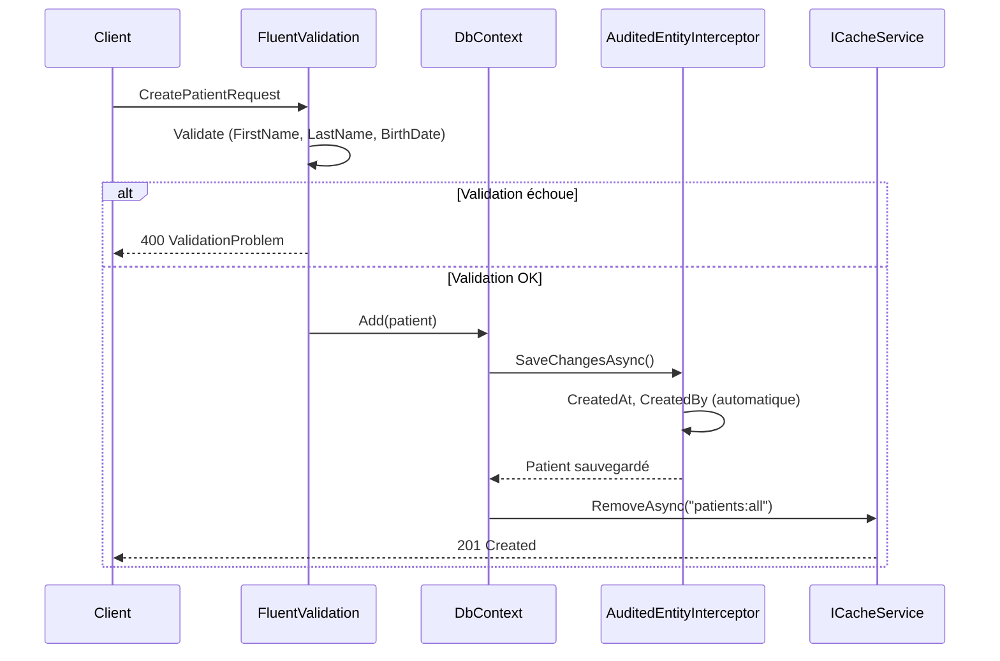

# Endpoint : valider, stocker et invalider le cache

## Problème

Un endpoint reçoit des données métier, les valide, les persiste en base,
et doit invalider les entrées de cache liées pour garantir la cohérence.

## Solution

```csharp
using FluentValidation;
using Granit.Caching;
using Microsoft.AspNetCore.Http;
using Microsoft.AspNetCore.Http.HttpResults;
using Microsoft.EntityFrameworkCore;

namespace MyApp.Endpoints;

internal static class PatientEndpoints
{
    internal static async Task<Results<Created<Patient>, ValidationProblem>> CreateAsync(
        CreatePatientRequest request,
        IValidator<CreatePatientRequest> validator,
        AppDbContext db,
        ICacheService<PatientListCache> cache,
        CancellationToken cancellationToken)
    {
        // 1. Valider
        FluentValidation.Results.ValidationResult validation =
            await validator.ValidateAsync(request, ct);

        if (!validation.IsValid)
        {
            return TypedResults.ValidationProblem(
                validation.ToDictionary());
        }

        // 2. Stocker
        Patient patient = new()
        {
            FirstName = request.FirstName,
            LastName = request.LastName,
            BirthDate = request.BirthDate
        };

        db.Patients.Add(patient);
        await db.SaveChangesAsync(ct);

        // 3. Invalider le cache
        await cache.RemoveAsync("patients:all", ct);

        return TypedResults.Created($"/api/patients/{patient.Id}", patient);
    }
}

public sealed class CreatePatientValidator : AbstractValidator<CreatePatientRequest>
{
    public CreatePatientValidator()
    {
        RuleFor(x => x.FirstName).NotEmpty().MaximumLength(100);
        RuleFor(x => x.LastName).NotEmpty().MaximumLength(100);
        RuleFor(x => x.BirthDate).LessThan(DateTimeOffset.UtcNow);
    }
}
```

## Explication



### Points clés

- **FluentValidation** : le validateur est enregistré dans le conteneur DI
  et injecté dans le handler. Granit recommande un validateur par request DTO.
- **Intercepteur automatique** : `AuditedEntityInterceptor` remplit `CreatedAt`,
  `CreatedBy`, `Id` sans code manuel.
- **Invalidation ciblée** : `RemoveAsync` supprime uniquement la clé concernée.
  Pour une invalidation groupée, utiliser un préfixe de clé et `RemoveByPrefixAsync`.
- **Cache chiffré** : si l'entité contient des données sensibles, annoter le type cache
  avec `[CacheEncrypted]` pour un chiffrement AES-256 transparent.

## Variante : invalidation via événement

Pour découpler la logique d'invalidation du endpoint, publier un événement
Wolverine :

```csharp
// Dans le handler
await bus.PublishAsync(new PatientCreatedEvent(patient.Id));

// Handler dédié (exécuté de manière asynchrone via Outbox)
public static class PatientCacheInvalidationHandler
{
    public static async Task HandleAsync(
        PatientCreatedEvent evt,
        ICacheService<PatientListCache> cache,
        CancellationToken cancellationToken) =>
        await cache.RemoveAsync("patients:all", ct);
}
```

## Liens

- [Caching](../framework/data/caching.md)
- [Persistance](../framework/data/persistence.md)
- [Validation](../framework/utilities/validation/index.md)
- [Pattern Cache-Aside](../patterns/cloud-saas/cache-aside.md)
