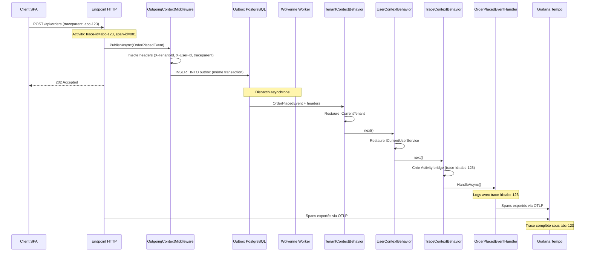

# Traçage bout en bout (API → job asynchrone)

## Problème

Une requête HTTP déclenche un traitement asynchrone via Wolverine. On veut
suivre l'ensemble de l'opération dans Grafana/Tempo sous un seul `TraceId`,
du client HTTP jusqu'au worker background.

## Solution

### Endpoint HTTP

```csharp
using Microsoft.AspNetCore.Http;
using Microsoft.AspNetCore.Http.HttpResults;
using Microsoft.Extensions.Logging;
using Wolverine;

namespace MyApp.Endpoints;

internal static class OrderEndpoints
{
    internal static async Task<Accepted> PlaceOrderAsync(
        PlaceOrderRequest request,
        IMessageBus bus,
        ILogger<PlaceOrderRequest> logger,
        CancellationToken ct)
    {
        // Le TraceId est automatiquement propagé par Granit
        logger.LogInformation(
            "Placing order for {ProductId}, quantity {Quantity}",
            request.ProductId, request.Quantity);

        await bus.PublishAsync(new OrderPlacedEvent(
            request.ProductId,
            request.Quantity));

        return TypedResults.Accepted(value: (string?)null);
    }
}

public sealed record PlaceOrderRequest(Guid ProductId, int Quantity);
public sealed record OrderPlacedEvent(Guid ProductId, int Quantity);
```

### Handler Wolverine

```csharp
using Microsoft.Extensions.Logging;

namespace MyApp.Handlers;

/// <summary>
/// Processes an order placement asynchronously.
/// The TraceId, TenantId, and UserId are restored automatically
/// by Wolverine context behaviors before this handler runs.
/// </summary>
public static class OrderPlacedEventHandler
{
    public static async Task HandleAsync(
        OrderPlacedEvent evt,
        AppDbContext db,
        ILogger logger,
        CancellationToken ct)
    {
        // Ce log apparaît sous le même TraceId que la requête HTTP
        logger.LogInformation(
            "Processing order for {ProductId}, quantity {Quantity}",
            evt.ProductId, evt.Quantity);

        Order order = new()
        {
            ProductId = evt.ProductId,
            Quantity = evt.Quantity,
            Status = OrderStatus.Processing
        };

        db.Orders.Add(order);
        await db.SaveChangesAsync(ct);

        logger.LogInformation("Order {OrderId} created", order.Id);
    }
}
```

## Explication



### Points clés

- **Propagation automatique** : `OutgoingContextMiddleware` capture le `traceparent`
  W3C, le `TenantId` et le `UserId` dans les headers de l'envelope Wolverine.
- **Bridge Activity** : `TraceContextBehavior` crée une `Activity` enfant liée
  au `trace-id` d'origine. Toutes les traces OpenTelemetry du handler
  apparaissent sous la même trace parente.
- **Corrélation logs/traces** : chaque log Serilog inclut `TraceId` et `SpanId`.
  Dans Grafana, un clic sur un log ouvre la trace correspondante dans Tempo.
- **Outbox transactionnel** : l'événement est persisté dans la même transaction
  que les données métier. Pas de perte de message, même en cas de crash.

## Visualisation dans Grafana

Dans **Grafana Tempo**, la trace `abc-123` affiche :

```text
POST /api/orders (12ms)
├── PublishAsync: OrderPlacedEvent (2ms)
└── [Wolverine] OrderPlacedEventHandler (45ms)
    ├── EF Core: INSERT INTO orders (8ms)
    └── Commit transaction (3ms)
```

Dans **Grafana Loki**, filtrer par `TraceId` :

```logql
{service_name="my-app"} | json | TraceId = "abc-123"
```

## Liens

- [Observabilité](../framework/diagnostics/observability.md)
- [Wolverine Tracing](../framework/diagnostics/wolverine-tracing.md)
- [Wolverine](../framework/messaging/wolverine.md)
- [Pattern Transactional Outbox](../patterns/cloud-saas/transactional-outbox.md)
