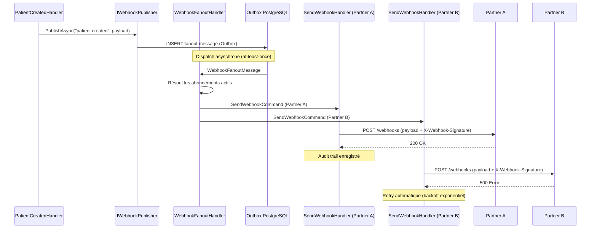

# Publier un webhook sur un événement métier

## Problème

Quand un événement métier se produit (nouveau patient, rendez-vous confirmé),
il faut notifier des systèmes externes via HTTP POST avec garantie de livraison,
signature HMAC pour l'authenticité, et audit trail ISO 27001.

## Solution

### Publier l'événement

```csharp
using Granit.Webhooks;
using Wolverine;

namespace MyApp.Handlers;

public static class PatientCreatedHandler
{
    public static async Task HandleAsync(
        PatientCreatedEvent evt,
        IWebhookPublisher webhookPublisher,
        CancellationToken cancellationToken)
    {
        await webhookPublisher.PublishAsync(
            eventType: "patient.created",
            payload: new
            {
                PatientId = evt.PatientId,
                CreatedAt = evt.CreatedAt
            },
            ct);
    }
}
```

### Enregistrer un abonnement

```csharp
// Via l'API d'administration ou en base de données
WebhookSubscription subscription = new()
{
    EventType = "patient.created",
    TargetUrl = "https://partner.example.com/webhooks/granit",
    Secret = "hmac-secret-shared-with-partner",
    IsActive = true
};
```

### Vérifier côté récepteur

Le récepteur vérifie la signature HMAC-SHA256 :

```csharp
// Côté partenaire (pas dans Granit)
string signature = request.Headers["X-Webhook-Signature"];
string payload = await new StreamReader(request.Body).ReadToEndAsync();

string expected = ComputeHmacSha256(payload, sharedSecret);
bool isValid = CryptographicOperations.FixedTimeEquals(
    Encoding.UTF8.GetBytes(signature),
    Encoding.UTF8.GetBytes(expected));
```

## Explication



### Points clés

- **Fan-out** : `IWebhookPublisher` crée un message de fan-out. Le
  `WebhookFanoutHandler` résout tous les abonnements actifs pour cet
  `eventType` et crée un `SendWebhookCommand` par abonnement.
- **Outbox transactionnel** : le message de fan-out est persisté dans
  la même transaction que l'événement métier. Pas de perte de webhook.
- **Signature HMAC-SHA256** : chaque webhook est signé avec le secret
  partagé de l'abonnement. Le header `X-Webhook-Signature` permet au
  récepteur de vérifier l'authenticité et l'intégrité.
- **Retry** : en cas d'échec HTTP (4xx/5xx), Wolverine relance avec
  backoff exponentiel. Après épuisement des tentatives, le message
  est envoyé en Dead Letter Queue.
- **Audit trail** : chaque tentative d'envoi est enregistrée (statut HTTP,
  durée, erreur éventuelle) pour conformité ISO 27001.

### Configuration

```json
{
  "Webhooks": {
    "MaxRetryAttempts": 5,
    "RetryDelaySeconds": [10, 30, 120, 600, 3600],
    "SignatureHeaderName": "X-Webhook-Signature",
    "TimeoutSeconds": 30
  }
}
```

## Liens

- [Webhooks](../framework/messaging/webhooks.md)
- [Wolverine](../framework/messaging/wolverine.md)
- [Pattern Transactional Outbox](../patterns/cloud-saas/transactional-outbox.md)
