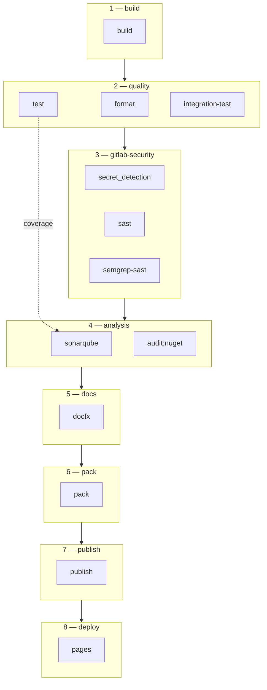

# Pipeline CI/CD — Granit (framework)

Pipeline GitLab CI pour le framework Granit : compilation, qualité, sécurité,
analyse, packaging NuGet et publication sur GitLab Package Registry.

## Audience

- **Développeur** : comprendre les étapes de validation avant merge
- **Ingénieur DevOps** : configurer les variables CI, maintenir le pipeline
- **SRE** : diagnostiquer les échecs de pipeline

## Vue d'ensemble



Le pipeline se déclenche sur :

- **Merge Request** : validation complète (format + tests + sécurité + analyse)
- **Push sur `develop` ou `main`** : idem sans Trivy FS
- **Tag `vX.Y.Z` sur `main`** : build + test + pack + publish (release)

## Stratégie de cache

Les artifacts `bin/obj` sont trop volumineux (~20K fichiers, >500 Mo) pour être
partagés via artifacts GitLab. Chaque job recompile indépendamment avec le
cache NuGet (`Directory.Packages.props` comme clé de cache).

Restore rapide : **~5-10 secondes** grâce au cache NuGet.

## Stages détaillés

### build

Validation de compilation et réchauffement du cache NuGet.
Les tests d'intégration sont exclus (`-p:SkipIntegrationTests=true`).

### quality

Trois jobs parallèles :

| Job | Description | Bloquant |
| --- | --- | --- |
| `format` | `dotnet format --verify-no-changes` | Oui |
| `test` | Tests unitaires + coverage (OpenCover + Cobertura) | Oui |
| `integration-test` | Testcontainers (PostgreSQL via Docker natif) | Non (`allow_failure`) |

#### Tests d'intégration

Le job `integration-test` utilise Testcontainers .NET pour démarrer deux
conteneurs PostgreSQL et valider l'isolation physique par tenant (HDS).

Le runner Docker dispose du socket Docker monté nativement — pas besoin de
DinD (`docker:27-dind`). Testcontainers se connecte au daemon local et les
conteneurs sont accessibles directement sur `localhost`.

### gitlab-security

Scans de sécurité GitLab (templates inclus) :

| Job | Outil | Bloquant |
| --- | --- | --- |
| `secret_detection` | GitLab Secret Detection | Oui |
| `semgrep-sast` | Semgrep | Oui |
| `sast` | GitLab SAST | Non |

### analysis

| Job | Description | Bloquant |
| --- | --- | --- |
| `sonarqube` | Analyse statique + coverage (nécessite `SONAR_HOST_URL` + `SONAR_TOKEN`) | Non |
| `audit:nuget` | `dotnet list package --vulnerable` — échoue si HIGH/CRITICAL | Non |

SonarQube reçoit les rapports OpenCover du job `test` via artifacts.

### docs

Génération de la documentation API via **DocFX** :

- `docfx` : génère le site statique dans `_site/`
- `pages` : publie sur GitLab Pages (uniquement sur `main`)

### pack

Crée les packages NuGet avec versionnement automatique :

| Contexte | Version |
| --- | --- |
| Tag `vX.Y.Z` | `X.Y.Z` (release) |
| Branche develop/main | `0.1.0-dev.<pipeline_iid>` (prerelease) |

### publish

Pousse les `.nupkg` sur le **GitLab Package Registry** du projet.
Utilise `CI_JOB_TOKEN` — aucune variable secrète requise.

## Variables CI/CD

### Requises

Aucune — le pipeline utilise le `CI_JOB_TOKEN` natif de GitLab.

### Optionnelles

| Variable | Description | Masked |
| --- | --- | --- |
| `SONAR_HOST_URL` | URL du serveur SonarQube | Non |
| `SONAR_TOKEN` | Token d'authentification SonarQube | Oui |

## Consommation des packages Granit

Les applications consommatrices ajoutent le GitLab Package
Registry comme source NuGet dans leur CI :

```xml
<packageSources>
  <add key="gitlab-granit"
       value="https://gitlab.digitaldynamics.be/api/v4/projects/6/packages/nuget/index.json" />
</packageSources>
<packageSourceMapping>
  <packageSource key="gitlab-granit">
    <package pattern="Granit.*" />
  </packageSource>
</packageSourceMapping>
```

Authentification via `CI_JOB_TOKEN` (credentials dans `<packageSourceCredentials>`).

## Dépannage

### Le job `test` échoue avec un timeout

Augmenter les variables de timeout :

```yaml
variables:
  VSTEST_CONNECTION_TIMEOUT: "300"
  XUNIT_LAUNCH_TIMEOUT: "300"
```

### SonarQube affiche 0% de coverage

Vérifier que :

1. Le job `test` produit des artifacts `**/coverage.opencover.xml`
2. Le job `sonarqube` a `needs: [test]` avec `artifacts: true`
3. Le paramètre `sonar.cs.opencover.reportsPaths` pointe vers `**/coverage.opencover.xml`
4. Si SonarScanner .NET v8+, ajouter `/d:sonar.projectBaseDir="${CI_PROJECT_DIR}"`

### Integration-test : `Failed to connect to 172.17.0.x`

Le conteneur Testcontainers retourne l'IP du bridge Docker au lieu du hostname
DinD. Vérifier que :

1. `DOCKER_HOST=tcp://docker:2375` est défini
2. `TESTCONTAINERS_HOST_OVERRIDE=docker` est défini
3. La fixture de test implémente `ApplyHostOverride()` (fallback sur `DOCKER_HOST`)

### `audit:nuget` échoue

Une dépendance NuGet a une vulnérabilité HIGH ou CRITICAL connue. Consulter
le rapport `vulnerability-report.txt` dans les artifacts du job.
