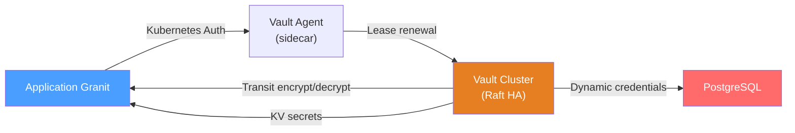
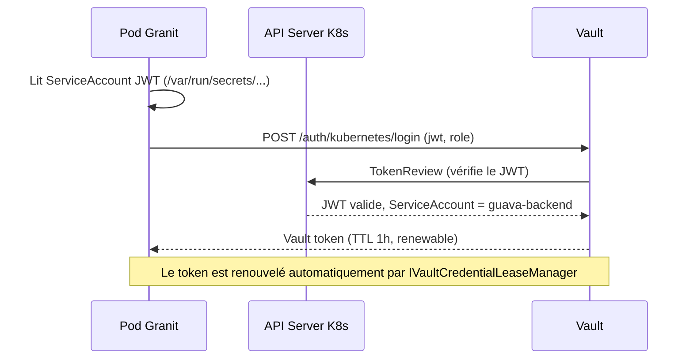
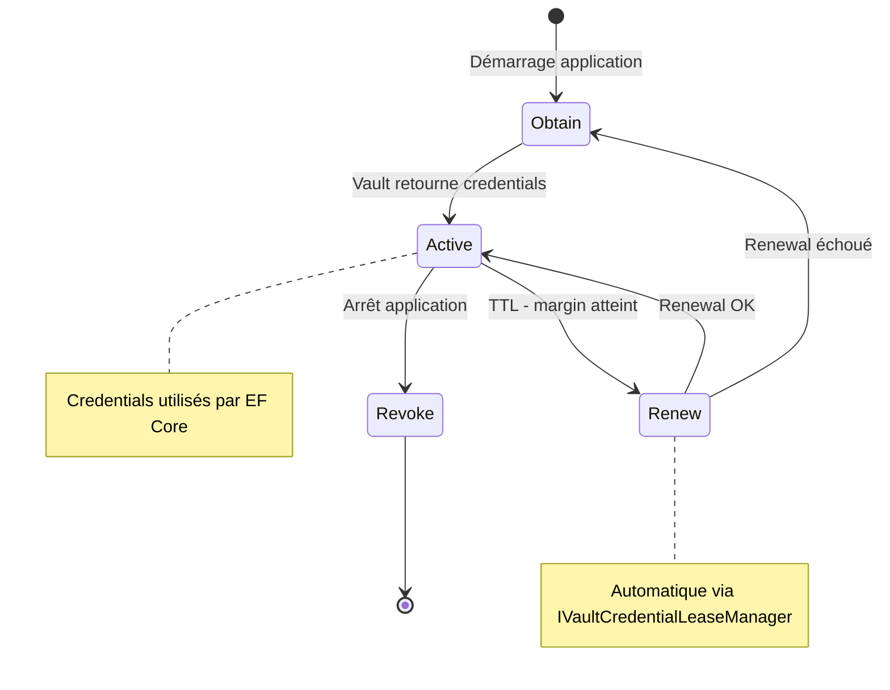

# Configuration Vault en production

## Architecture



## Authentification Kubernetes

En production, Granit s'authentifie auprès de Vault via le ServiceAccount
Kubernetes du pod :

```json
{
  "Vault": {
    "Address": "https://vault.internal:8200",
    "AuthMethod": "Kubernetes",
    "Kubernetes": {
      "Role": "guava-backend",
      "ServiceAccountTokenPath": "/var/run/secrets/kubernetes.io/serviceaccount/token"
    }
  }
}
```

### Flux d'authentification



## Credentials dynamiques PostgreSQL

Vault génère des identifiants PostgreSQL éphémères avec un TTL court.
Le `IVaultCredentialLeaseManager` de Granit gère automatiquement le cycle
de vie des leases.

### Configuration

```json
{
  "Vault": {
    "Database": {
      "MountPoint": "database",
      "RoleName": "guava-readonly",
      "LeaseTtlSeconds": 3600,
      "LeaseRenewalMarginSeconds": 300
    }
  }
}
```

### Cycle de vie d'un lease



### Points clés

- **Pas de mot de passe statique** : les credentials sont générés dynamiquement
  et expirent automatiquement.
- **Rotation transparente** : le `IVaultCredentialLeaseManager` renouvelle le lease
  avant expiration. EF Core utilise les nouveaux credentials sans interruption.
- **Révocation au shutdown** : à l'arrêt du pod, les credentials sont révoqués
  pour limiter la fenêtre d'exposition.

## Transit Engine (chiffrement de champs)

Le Transit Engine chiffre et déchiffre des données sans exposer la clé de chiffrement.

### Configuration

```json
{
  "Vault": {
    "Transit": {
      "MountPoint": "transit",
      "KeyName": "granit-hds"
    }
  }
}
```

### Rotation de clé

La rotation de clé Transit est transparente :

```bash
# Rotation de la clé (Vault CLI ou API)
vault write -f transit/keys/granit-hds/rotate

# Les anciennes données restent lisibles
# La version de la clé est encodée dans le ciphertext (vault:v2:xxx...)
```

Après rotation, les nouvelles écritures utilisent la nouvelle version de clé.
Les anciennes données sont déchiffrées avec l'ancienne version (stockée dans
le ciphertext prefix).

## Monitoring Vault

| Métrique | Seuil d'alerte | Description |
| --- | --- | --- |
| Lease count | > 1000 | Nombre de leases actifs (fuite potentielle) |
| Token renewal failures | > 0 sur 5 min | Perte d'accès imminente |
| Seal status | sealed = true | Vault scellé — intervention requise |
| Storage backend latency | > 100ms | Dégradation du stockage Raft |

## Liens

- [Vault](../framework/security/vault.md)
- [Chiffrement](../framework/security/encryption.md)
- [Recette : chiffrer des données sensibles](../cookbook/chiffrement-donnees-sensibles.md)
