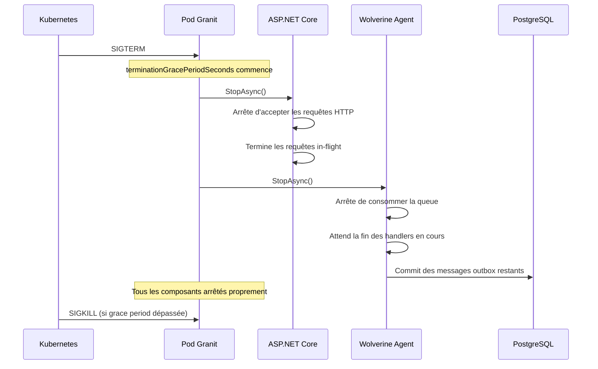

# Déploiement Kubernetes

## Probes de santé

Granit enregistre trois endpoints de health check conformes aux conventions
Kubernetes :

| Probe | Endpoint | Rôle |
| --- | --- | --- |
| **Liveness** | `/health/live` | L'application est vivante (pas de deadlock) |
| **Readiness** | `/health/ready` | L'application peut recevoir du trafic (DB, Redis OK) |
| **Startup** | `/health/startup` | L'application a fini son initialisation |

### Configuration Kubernetes

```yaml
apiVersion: apps/v1
kind: Deployment
metadata:
  name: guava-backend
spec:
  template:
    spec:
      containers:
        - name: app
          image: registry.digitaldynamics.be/guava-backend:1.2.0
          ports:
            - containerPort: 8080
          livenessProbe:
            httpGet:
              path: /health/live
              port: 8080
            initialDelaySeconds: 5
            periodSeconds: 10
            failureThreshold: 3
          readinessProbe:
            httpGet:
              path: /health/ready
              port: 8080
            initialDelaySeconds: 10
            periodSeconds: 5
            failureThreshold: 3
          startupProbe:
            httpGet:
              path: /health/startup
              port: 8080
            initialDelaySeconds: 5
            periodSeconds: 5
            failureThreshold: 30
```

> La **startup probe** tolère jusqu'à 150 secondes (30 x 5s) pour le
> premier démarrage. C'est nécessaire pour les opérations lentes :
> obtention des credentials Vault, migrations EF Core, warm-up du cache.

## Resource limits

### Recommandations pour .NET 10

```yaml
resources:
  requests:
    cpu: "250m"
    memory: "256Mi"
  limits:
    cpu: "1000m"
    memory: "512Mi"
```

| Paramètre | Valeur | Justification |
| --- | --- | --- |
| `requests.cpu` | 250m | Garantie minimale pour le GC et le JIT |
| `requests.memory` | 256Mi | Heap .NET + overhead conteneur |
| `limits.cpu` | 1000m | Burst pour les pics de requêtes |
| `limits.memory` | 512Mi | Prévient les OOM kill avec marge |

> Ajuster selon le profil de l'application. Les applications avec traitement
> d'images ou de fichiers volumineux nécessitent plus de mémoire.

## Rolling update

```yaml
spec:
  strategy:
    type: RollingUpdate
    rollingUpdate:
      maxUnavailable: 0
      maxSurge: 1
```

- **`maxUnavailable: 0`** : aucun pod n'est retiré tant que le nouveau n'est pas
  `Ready`. Zéro interruption de service.
- **`maxSurge: 1`** : un seul pod supplémentaire est créé pendant le déploiement.

## Graceful shutdown

Le graceful shutdown est critique pour les applications Granit utilisant Wolverine.
Il faut coordonner l'arrêt de trois composants :



### Configuration `terminationGracePeriodSeconds`

```yaml
spec:
  template:
    spec:
      terminationGracePeriodSeconds: 60
```

| Composant | Temps de drain estimé | Notes |
| --- | --- | --- |
| ASP.NET Core | 5-10s | Requêtes HTTP in-flight |
| Wolverine | 10-30s | Handlers en cours + commit outbox |
| MigrationBatchWorker | 0-300s | Batch de migration en cours (timeout 5 min) |
| Vault lease revocation | 1-2s | Révocation des credentials dynamiques |

> **Recommandation** : `terminationGracePeriodSeconds: 60` pour une application
> standard. Augmenter à `120` si des migrations longues sont possibles.
> Le `MigrationBatchWorker` termine toujours le batch courant avant de s'arrêter
> (voir [migrations.md](../framework/data/migrations.md)).

## PgBouncer (connection pooling)

Pour les applications multi-tenant avec de nombreuses connexions simultanées,
utiliser PgBouncer en sidecar :

```yaml
containers:
  - name: pgbouncer
    image: bitnami/pgbouncer:1.22
    ports:
      - containerPort: 6432
    env:
      - name: POSTGRESQL_HOST
        value: "pg-primary.database"
      - name: POSTGRESQL_PORT
        value: "5432"
      - name: PGBOUNCER_POOL_MODE
        value: "transaction"
      - name: PGBOUNCER_MAX_CLIENT_CONN
        value: "200"
      - name: PGBOUNCER_DEFAULT_POOL_SIZE
        value: "20"
```

L'application se connecte à `localhost:6432` au lieu de PostgreSQL directement.
Le `pool_mode: transaction` est compatible avec les credentials dynamiques Vault
(le pooler ne maintient pas de connexion persistante).

## Secrets Kubernetes

Les secrets sont injectés via **Vault Agent Injector** ou **CSI Secret Store Driver** :

```yaml
# Vault Agent Injector (annotations)
annotations:
  vault.hashicorp.com/agent-inject: "true"
  vault.hashicorp.com/role: "guava-backend"
  vault.hashicorp.com/agent-inject-secret-db: "database/creds/guava-readonly"
```

> Ne **jamais** stocker de secrets dans les `ConfigMap` ou `Secret` Kubernetes
> en clair. Utiliser Vault pour la gestion centralisée des secrets.

## Liens

- [Health checks](../framework/diagnostics/diagnostics.md)
- [Configuration Vault](configuration-vault.md)
- [Migrations](../framework/data/migrations.md)
