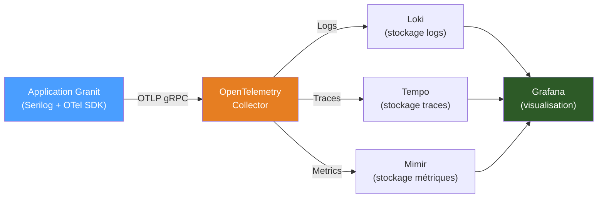

# Observabilité en production

## Architecture LGTM

Granit exporte les signaux d'observabilité via OTLP vers une stack LGTM souveraine :



## Configuration application

```json
{
  "Observability": {
    "ServiceName": "my-backend",
    "ServiceVersion": "1.2.0",
    "OtlpEndpoint": "http://otel-collector.monitoring:4317",
    "OtlpProtocol": "grpc"
  }
}
```

| Propriété | Description | Défaut |
| --- | --- | --- |
| `ServiceName` | Identifiant du service dans les signaux | Nom de l'assembly |
| `ServiceVersion` | Version du service | `0.0.0` |
| `OtlpEndpoint` | URL du collector OTLP | `null` (console) |
| `OtlpProtocol` | Protocole d'export (`grpc` ou `http`) | `grpc` |

## Logs structurés (Loki)

### Queries LogQL utiles

```logql
# Erreurs du dernier jour pour un service
{service_name="my-backend"} | json | Level = "Error"

# Requêtes lentes (> 500ms)
{service_name="my-backend"} | json | RequestDuration > 500

# Activité d'un tenant spécifique
{service_name="my-backend"} | json | TenantId = "tenant-123"

# Erreurs d'un utilisateur spécifique (audit ISO 27001)
{service_name="my-backend"} | json | UserId = "john.doe" | Level = "Error"

# Corrélation avec un TraceId
{service_name="my-backend"} | json | TraceId = "abc123def456"
```

### Enrichissement automatique

Chaque log Serilog est enrichi par Granit avec :

| Propriété | Source | Description |
| --- | --- | --- |
| `ServiceName` | Configuration | Identifiant du service |
| `Environment` | `ASPNETCORE_ENVIRONMENT` | Environnement d'exécution |
| `TenantId` | `ICurrentTenant` | Tenant actif (si multi-tenancy) |
| `UserId` | `ICurrentUserService` | Utilisateur authentifié |
| `TraceId` | `Activity.Current` | Identifiant de trace OpenTelemetry |
| `SpanId` | `Activity.Current` | Identifiant de span |
| `MachineName` | Système | Nom du pod Kubernetes |

## Traces distribuées (Tempo)

### Instrumentation automatique

Granit instrumente automatiquement :

- **ASP.NET Core** : requêtes HTTP entrantes
- **HttpClient** : requêtes HTTP sortantes
- **EF Core** : requêtes SQL
- **Wolverine** : handlers de messages (via `TraceContextBehavior`)
- **Redis** : opérations de cache

### Corrélation logs ↔ traces

Dans Grafana, activer la **data source correlation** entre Loki et Tempo.
Un clic sur un `TraceId` dans un log ouvre automatiquement la trace
correspondante dans Tempo.

## Métriques (Mimir)

### Métriques exposées

| Métrique | Type | Description |
| --- | --- | --- |
| `http_server_request_duration_seconds` | Histogram | Durée des requêtes HTTP |
| `http_server_active_requests` | UpDownCounter | Requêtes HTTP en cours |
| `db_client_operation_duration_seconds` | Histogram | Durée des opérations DB |
| `dotnet_gc_collections_total` | Counter | Collections GC .NET |
| `dotnet_process_memory_bytes` | Gauge | Mémoire utilisée par le process |

### Dashboards Grafana recommandés

1. **Vue d'ensemble** : taux de requêtes, taux d'erreur (4xx/5xx), p50/p95/p99 latence
2. **Base de données** : durée des requêtes SQL, pool de connexions, requêtes lentes
3. **Cache** : hit ratio, latence Redis, évictions
4. **Wolverine** : messages traités/s, messages en erreur, profondeur de queue
5. **Infrastructure** : CPU, mémoire, GC, threads

## Alerting

### Alertes recommandées

| Alerte | Condition | Sévérité |
| --- | --- | --- |
| Taux d'erreur HTTP élevé | `rate(http_5xx) / rate(http_total) > 0.05` sur 5 min | Critical |
| Latence P99 élevée | `p99(http_duration) > 2s` sur 5 min | Warning |
| Vault lease renewal failure | Log `"Vault lease renewal failed"` | Critical |
| Pool de connexions DB saturé | `db_pool_active / db_pool_max > 0.9` | Warning |
| Wolverine DLQ non vide | `wolverine_dead_letter_count > 0` | Warning |

### Configuration des alertes dans Grafana

Les alertes sont définies dans Grafana via l'API ou l'interface.
Canaux de notification recommandés :

- **Critical** : PagerDuty / OpsGenie → astreinte SRE
- **Warning** : Slack `#ops-alerts`
- **Info** : email hebdomadaire de synthèse

## Rétention

| Signal | Rétention recommandée | Exigence ISO 27001 |
| --- | --- | --- |
| Logs | 90 jours (hot) + 3 ans (cold) | 3 ans minimum |
| Traces | 30 jours | Non requis |
| Métriques | 1 an | Non requis |

> **ISO 27001** : l'audit trail (logs d'accès aux données de santé) doit être
> conservé **3 ans minimum**. Configurer la rétention Loki en conséquence.

## Liens

- [Observabilité](../framework/diagnostics/observability.md)
- [Logging](../framework/diagnostics/logging.md)
- [Wolverine Tracing](../framework/diagnostics/wolverine-tracing.md)
- [Recette : traçage bout en bout](../cookbook/tracage-bout-en-bout.md)
