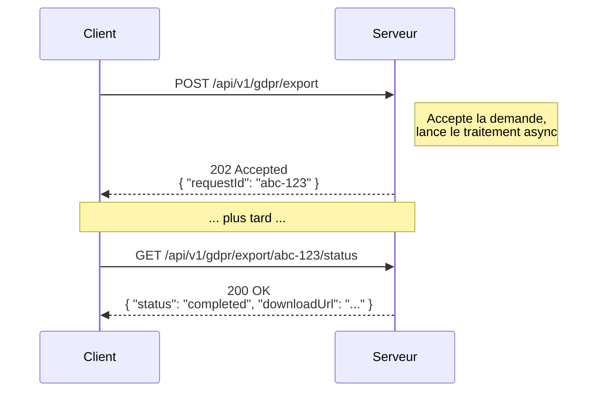

# Codes de retour HTTP

Conventions pour les codes de retour HTTP des APIs Granit et applications
consommatrices.

> **Voir aussi** : [api-documentation.md](api-documentation.md) pour la génération
> OpenAPI et la déclaration des réponses via attributs.

## Principes

Les codes HTTP doivent refléter la **sémantique réelle** de l'opération, pas
simplement « ça a marché » (200) ou « ça a échoué » (500). Un code précis permet
aux consommateurs d'adapter leur comportement sans parser le body.

Tous les clients HTTP standards (fetch, axios, HttpClient, SDK générés par OpenAPI)
traitent **tout code 2xx comme un succès**. Utiliser 201, 202 ou 204 au lieu de 200
ne casse aucun consommateur.

## Codes de succès (2xx)

| Code | Nom | Quand l'utiliser | Body attendu |
| ---- | --- | ---------------- | ------------ |
| 200 | OK | La requête est traitée et le résultat est dans la réponse | Oui — le résultat |
| 201 | Created | Une ressource a été créée | Oui — la ressource créée + header `Location` |
| 202 | Accepted | La demande est acceptée mais le traitement est **asynchrone** | Oui — identifiant de suivi (voir ci-dessous) |
| 204 | No Content | L'opération a réussi, il n'y a rien à retourner | Non — body vide |

### Quand utiliser 200 vs 202

- **200** : le résultat est **immédiat** et complet. L'appelant reçoit la réponse
  finale dans le body (ex. : `GET /users/me`, `POST /auth/login`).

- **202** : le serveur **accepte la demande** mais le traitement n'est pas terminé.
  Le résultat sera disponible plus tard (ex. : export de données, génération de
  rapport, effacement RGPD).



### Contrat du 202 — obligations du serveur

Un 202 **doit** fournir au consommateur un moyen de suivre l'avancement.
Retourner un 202 avec un body vide et aucune indication de suite est interdit :
le consommateur ne saurait pas quoi faire.

Options possibles (au moins une est obligatoire) :

| Mécanisme | Description | Exemple |
| --------- | ----------- | ------- |
| Body avec identifiant | Le body contient un `requestId` ou `jobId` | `{ "requestId": "abc-123" }` |
| Header `Location` | URL de polling pour vérifier l'état | `Location: /api/v1/gdpr/export/abc-123/status` |
| Webhook / notification | Le serveur notifie le consommateur quand c'est prêt | Événement via WebSocket, e-mail, callback URL |

### Quand utiliser 204

Le 204 est le bon choix quand l'opération réussit mais qu'il n'y a **rien
d'utile à retourner** :

- `DELETE /api/v1/gdpr/erasure` — les données sont supprimées, rien à renvoyer
- `PUT /api/v1/settings` — les paramètres sont sauvegardés, le client les connaît déjà
- `POST /api/v1/notifications/mark-read` — accusé de réception sans payload

> **Attention** : ne pas utiliser 204 pour une suppression asynchrone. Si le
> traitement prend du temps, utiliser 202 avec un identifiant de suivi.

## Codes d'erreur client (4xx)

| Code | Nom | Quand l'utiliser |
| ---- | --- | ---------------- |
| 400 | Bad Request | Requête syntaxiquement invalide (JSON malformé, type incorrect) |
| 401 | Unauthorized | Token absent ou expiré — l'utilisateur doit s'authentifier |
| 403 | Forbidden | Authentifié mais pas autorisé pour cette opération |
| 404 | Not Found | Ressource introuvable (uniquement sur les routes avec paramètre `{id}`) |
| 409 | Conflict | Conflit de concurrence (version obsolète, doublon) |
| 422 | Unprocessable Entity | Validation métier échouée (règles FluentValidation) |
| 429 | Too Many Requests | Rate limiting déclenché |

> **Convention Granit** : les erreurs 4xx et 5xx utilisent le format
> `application/problem+json` (RFC 7807). Le transformer
> `ProblemDetailsResponseOperationTransformer` déclare automatiquement ces
> réponses dans la documentation OpenAPI.

## Codes d'erreur serveur (5xx)

| Code | Nom | Quand l'utiliser |
| ---- | --- | ---------------- |
| 500 | Internal Server Error | Erreur inattendue côté serveur |
| 502 | Bad Gateway | Service en amont inaccessible (Keycloak, Vault, S3) |
| 503 | Service Unavailable | Application en maintenance ou surchargée |

## Déclaration dans le code

### Endpoint Wolverine HTTP

```csharp
[Tags("GDPR")]
[EndpointSummary(
    summary: "Request personal data export",
    description: "Initiates an asynchronous export of all personal data.")]
[ProducesResponseType(StatusCodes.Status202Accepted)]
[WolverinePost("/api/v1/gdpr/export", Name = "RequestDataExport")]
public static async Task<IResult> Handle(
    RequestDataExportCommand command,
    IMessageBus bus)
{
    Guid requestId = Guid.NewGuid();
    await bus.PublishAsync(new DataExportRequested(requestId, command.UserId));

    return Results.Accepted(
        uri: $"/api/v1/gdpr/export/{requestId}/status",
        value: new { requestId });
}
```

### Contrôleur MVC

```csharp
[HttpDelete("erasure")]
[ProducesResponseType(StatusCodes.Status204NoContent)]
public async Task<IActionResult> ErasePersonalData(
    [FromBody] EraseDataCommand command)
{
    await _mediator.SendAsync(command);
    return NoContent();
}
```

## Considérations HDS

- **Audit trail** : les codes de retour sont enregistrés dans les traces
  OpenTelemetry (`http.response.status_code`). Un code précis facilite
  l'analyse post-incident et les audits HDS.
- **Export RGPD (article 20)** : doit utiliser 202 car l'export est asynchrone
  (collecte multi-module, génération de fichier, chiffrement). Le consommateur
  reçoit un identifiant pour suivre l'avancement.
- **Effacement RGPD (article 17)** : peut utiliser 204 si le traitement est
  synchrone, ou 202 si l'effacement implique plusieurs systèmes en cascade.
