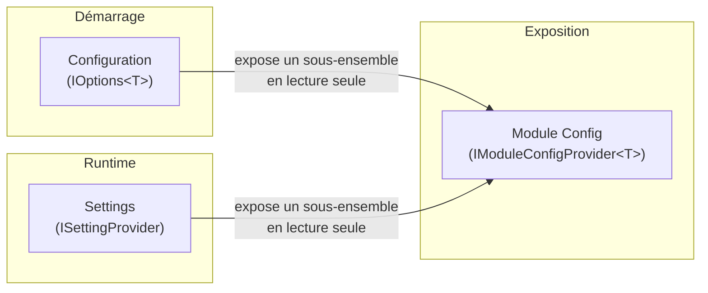

# Configuration et paramétrage

Granit propose trois mécanismes distincts pour gérer les valeurs de paramétrage
d'une application. Choisir le bon mécanisme est essentiel pour éviter les confusions
et garantir la cohérence architecturale.

## Les trois mécanismes



| Critère | Configuration | Settings | Module Config |
| --- | --- | --- | --- |
| **Quand** | Au démarrage | Au runtime | Au runtime (lecture seule) |
| **Source** | `appsettings.json`, env vars, Vault | Base de données | Dépend de l'implémentation |
| **Modifiable** | Redéploiement ou redémarrage | En ligne (API/UI) | Non (lecture seule) |
| **Typage** | Fort (`IOptions<T>`) | Faible (`string`) | Fort (record DTO) |
| **Scope** | Application | User > Tenant > Global > Config > Default | Application (ou module) |
| **Qui consomme** | Backend uniquement | Backend + frontend | Frontend principalement |
| **Interface** | `IOptions<T>` | `ISettingProvider` | `IModuleConfigProvider<T>` |

## Arbre de décision

```text
La valeur doit-elle changer sans redéploiement ?
├── NON → Configuration (IOptions<T>)
│   └── Le frontend a-t-il besoin de cette valeur ?
│       ├── OUI → Ajouter un IModuleConfigProvider<T> qui l'expose
│       └── NON → IOptions<T> suffit
│
└── OUI → Settings (ISettingProvider)
    ├── Valeur par utilisateur ? → Provider U (order=100)
    ├── Valeur par tenant ?      → Provider T (order=200)
    └── Valeur globale ?         → Provider G (order=300)
        └── Le frontend a-t-il besoin de cette valeur ?
            ├── OUI → Endpoint dédié ou IModuleConfigProvider<T>
            └── NON → ISettingProvider suffit
```

## Exemples concrets

| Besoin | Mécanisme | Pourquoi |
| --- | --- | --- |
| Timeout HTTP des webhooks (10s) | Configuration | Valeur technique, fixée au démarrage |
| `StorePayload` (stocker les bodies) | Configuration | Décision d'architecture, nécessite un redéploiement |
| Thème de l'interface (dark/light) | Settings | Choix utilisateur, modifiable en ligne |
| Limite d'upload (50 Mo) | Settings | Configurable par tenant, sans redéploiement |
| Le frontend doit savoir si `StorePayload` est actif | Module Config | Expose `IOptions<WebhooksOptions>` au frontend en lecture seule |
| Le CMP doit connaître les cookies enregistrés | Module Config | Agrège 2 registries et les expose au frontend |

## Documentation détaillée

| Document | Contenu |
| --- | --- |
| [sources.md](sources.md) | Sources de configuration (appsettings.json, env vars, Vault), surcharge par environnement, convention `SectionName` |
| [options.md](options.md) | Pattern `IOptions<T>`, déclaration, binding, validation, `PostConfigure`, bonnes pratiques |
| [settings.md](settings.md) | Paramètres dynamiques (`ISettingProvider`/`ISettingManager`), cascade U > T > G > C > D, chiffrement HDS, persistance EF Core |
| [module-config.md](module-config.md) | Pattern `IModuleConfigProvider<T>`, endpoint `GET /{module}/config`, personnalisation, implémentations existantes |

## Règles importantes

- **Ne jamais exposer `IOptions<T>` directement** au frontend — toujours passer par
  un `IModuleConfigProvider<T>` qui projette un sous-ensemble dans un DTO public
- **Ne jamais stocker de secrets** dans les fichiers de configuration
  (utiliser Vault ou des variables d'environnement sécurisées)
- **`ISettingProvider` n'est pas un remplacement d'`IOptions<T>`** — les deux
  coexistent et servent des cas d'usage différents
- **`IModuleConfigProvider<T>` vit dans `Granit.Core.Modularity`** — pas de
  dépendance ASP.NET Core. L'extension HTTP `MapGranitModuleConfig` vit dans
  `Granit.Core.Endpoints`
