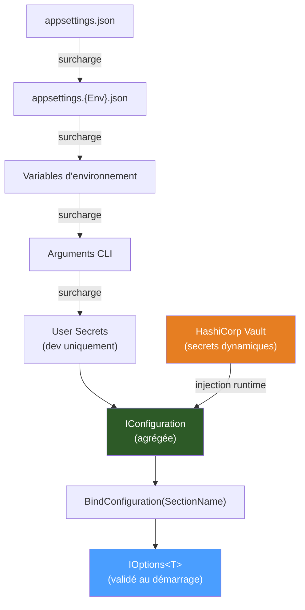

# Configuration

`Granit` s'appuie entièrement sur le système de configuration natif
d'ASP.NET Core. Aucune abstraction supplémentaire n'est introduite — les packages Granit
exploitent le pattern `IOptions<T>` standard et respectent la hiérarchie de configuration
de la plateforme.

> **Référence Microsoft** :
> [Configuration dans ASP.NET Core](https://learn.microsoft.com/fr-fr/aspnet/core/fundamentals/configuration/)

## Sources de configuration

ASP.NET Core charge la configuration depuis plusieurs sources dans un ordre précis. Chaque
source peut surcharger les valeurs des sources précédentes :

```text
appsettings.json
    ↓ (surcharge)
appsettings.{Environnement}.json    (Development, Staging, Production)
    ↓ (surcharge)
Variables d'environnement
    ↓ (surcharge)
Arguments de ligne de commande
    ↓ (surcharge)
User Secrets (développement local uniquement)
```



> **Secrets en production** : les secrets (mots de passe, tokens, clés API) ne sont
> **jamais** dans les fichiers de configuration. Ils sont injectés via HashiCorp Vault
> (voir [vault.md](../../security/vault.md)) ou via des variables d'environnement sécurisées dans
> Kubernetes.

## Pattern IOptions\<T\>

Le pattern `IOptions<T>` est la manière standard d'accéder à la configuration dans les
services Granit. Il offre :

- **Typage fort** : les options sont des classes C# fortement typées
- **Validation** : possibilité de valider les options au démarrage
- **Testabilité** : facilement mockable ou instancié avec `Options.Create()`
- **Rechargement** : `IOptionsMonitor<T>` supporte le rechargement à chaud

### Déclarer un bloc d'options

Chaque package Granit qui nécessite de la configuration expose une classe d'options
avec une constante `SectionName` :

```csharp
public sealed class KeycloakOptions
{
    // Convention : constante SectionName = section dans appsettings.json
    public const string SectionName = "Keycloak";

    public string Authority { get; set; } = string.Empty;
    public string ClientId { get; set; } = string.Empty;
    public bool RequireHttpsMetadata { get; set; } = true;
}
```

### Enregistrer les options

Les méthodes d'extension Granit lient automatiquement les options à la configuration
via `BindConfiguration`. La configuration est résolue depuis le conteneur DI
(`IConfiguration` enregistré par le host) — aucun paramètre n'est requis :

```csharp
// Dans JwtBearerServiceCollectionExtensions.cs
services.AddOptions<JwtBearerAuthOptions>()
    .BindConfiguration(JwtBearerAuthOptions.SectionName)
    .ValidateDataAnnotations()
    .ValidateOnStart();
```

### Consommer les options dans un service

```csharp
public class MyService
{
    private readonly KeycloakOptions _options;

    public MyService(IOptions<KeycloakOptions> options)
    {
        _options = options.Value;
    }
}
```

## Accès à la configuration dans les modules Granit

Le système de modules Granit transmet la configuration via `ServiceConfigurationContext`.
C'est le point d'accès à la configuration lors de la phase d'initialisation d'un module :

```csharp
[DependsOn(typeof(GranitSecurityModule))]
public class MyAppHostModule : GranitModule
{
    public override void ConfigureServices(ServiceConfigurationContext context)
    {
        // Lecture d'une valeur brute
        var connectionString = context.Configuration.GetConnectionString("Default");

        // Binding d'une section vers une classe d'options (pattern standard)
        context.Services.AddOptions<MyModuleOptions>()
            .BindConfiguration(MyModuleOptions.SectionName)
            .ValidateDataAnnotations()
            .ValidateOnStart();
    }
}
```

## Accès à IConfiguration dans un service

Pour les cas où `IOptions<T>` n'est pas adapté (configuration dynamique, clés variables),
`IConfiguration` peut être injecté directement :

```csharp
public class MyService
{
    private readonly IConfiguration _configuration;

    public MyService(IConfiguration configuration)
    {
        _configuration = configuration;
    }

    public string GetDynamicValue(string key)
    {
        return _configuration[key] ?? string.Empty;
    }
}
```

> Préférer `IOptions<T>` à `IConfiguration` dans la grande majorité des cas.
> L'injection directe d'`IConfiguration` est réservée aux scénarios où la clé de
> configuration est déterminée dynamiquement à l'exécution.

## Convention SectionName

Tous les packages Granit qui exposent des options respectent cette convention :

- La classe d'options déclare `public const string SectionName = "...";`
- La section correspond à une clé de premier niveau dans `appsettings.json`
- La méthode d'extension lie automatiquement la section sans configuration supplémentaire

```text
appsettings.json
├── "Authentication"    → JwtBearerAuthOptions    (Granit.Authentication.JwtBearer)
├── "Keycloak"          → KeycloakOptions          (Granit.Authentication.Keycloak)
├── "Vault"             → VaultOptions             (Granit.Vault)
└── "Observability"     → ObservabilityOptions     (Granit.Observability)
```

## Configuration par package Granit

### Granit.Authentication.JwtBearer

```json
{
  "Authentication": {
    "Authority": "https://auth.example.com/realms/my-realm",
    "Audience": "my-backend",
    "RequireHttpsMetadata": true
  }
}
```

```csharp
builder.AddGranit<MyAppHostModule>();
// ou directement :
builder.Services.AddGranitJwtBearer();
```

### Granit.Authentication.Keycloak

```json
{
  "Keycloak": {
    "Authority": "https://auth.example.com/realms/my-realm",
    "ClientId": "my-backend",
    "AdminRole": "admin",
    "RoleClaimsSource": "realm_access"
  }
}
```

```csharp
builder.Services.AddGranitKeycloak();
```

### Granit.Vault

```json
{
  "Vault": {
    "Address": "https://vault.example.com",
    "AuthMethod": "Kubernetes",
    "KubernetesRole": "my-backend",
    "DatabaseMountPoint": "database",
    "DatabaseRoleName": "readwrite",
    "TransitMountPoint": "transit"
  }
}
```

```csharp
builder.Services.AddGranitVault();
```

> **En développement local**, `AuthMethod` peut être `"Token"` avec `"Token": "root-token-dev"`.
> Ce mode est **interdit en production**.

### Granit.Timing

```json
{
  "Clock": {
    "DefaultTimezone": "Europe/Brussels"
  }
}
```

```csharp
builder.Services.AddGranitTiming();
```

> Si `DefaultTimezone` n'est pas spécifié, UTC est utilisé par défaut.

### Granit.Observability

```json
{
  "Observability": {
    "ServiceName": "my-backend",
    "ServiceVersion": "1.0.0",
    "Environment": "production",
    "OtlpEndpoint": "http://otel-collector:4317",
    "EnableTracing": true,
    "EnableMetrics": true
  }
}
```

```csharp
builder.AddGranitObservability();
```

## Surcharge par environnement

La configuration spécifique à un environnement est placée dans
`appsettings.{Environnement}.json`. Ce fichier surcharge `appsettings.json` :

**`appsettings.Development.json`** :

```json
{
  "Authentication": {
    "Authority": "http://localhost:8080/realms/my-realm",
    "RequireHttpsMetadata": false
  },
  "Vault": {
    "Address": "http://localhost:8200",
    "AuthMethod": "Token",
    "Token": "root-token-dev"
  },
  "Observability": {
    "OtlpEndpoint": "http://localhost:4317",
    "Environment": "development"
  }
}
```

**`appsettings.Production.json`** :

```json
{
  "Authentication": {
    "Authority": "http://keycloak.keycloak.svc.cluster.local:80/realms/my-realm",
    "RequireHttpsMetadata": false
  }
}
```

> En production Kubernetes, l'authority interne est utilisée pour éviter la sortie réseau
> depuis les pods vers l'extérieur du cluster. La validation des tokens reste complète
> (signature JWT vérifiée).

## Lecture des options dans Program.cs

Le `Program.cs` type d'une application consommatrice :

```csharp
var builder = WebApplication.CreateBuilder(args);

// Granit charge tous les modules et leur configuration via IConfiguration
await builder.AddGranitAsync<MyAppHostModule>();

var app = builder.Build();

app.UseAuthentication();
app.UseMultiTenancy();
app.UseAuthorization();

await app.UseGranitAsync();
await app.RunAsync();
```

La configuration est transmise automatiquement depuis `builder.Configuration`
(qui agrège `appsettings.json`, variables d'environnement, etc.) vers tous les modules
via `ServiceConfigurationContext.Configuration`.

## Validation des options au démarrage

Les packages Granit activent `ValidateDataAnnotations()` et `ValidateOnStart()` par défaut
pour détecter les erreurs de configuration tôt (fail-fast). Chaque méthode `AddGranit*()`
utilise le pattern standard :

```csharp
services.AddOptions<KeycloakOptions>()
    .BindConfiguration(KeycloakOptions.SectionName)
    .ValidateDataAnnotations()
    .ValidateOnStart();
```

Si une option annotée avec `[Required]`, `[Url]`, `[Range]`, etc. est invalide ou manquante,
l'application lève une exception au démarrage plutôt qu'à l'exécution.

## Secrets via HashiCorp Vault

Les valeurs sensibles (mots de passe, tokens, clés de chiffrement) ne sont pas dans
les fichiers de configuration. Elles sont injectées depuis Vault via le package
`Granit.Vault` :

```csharp
// Les credentials PostgreSQL sont obtenus dynamiquement depuis Vault
// et injectés dans le DbContext via IVaultCredentialLeaseManager
builder.Services.AddGranitVault();
```

Voir [vault.md](../../security/vault.md) pour le détail de l'intégration Vault.

## Bonnes pratiques

1. **Toujours utiliser `IOptions<T>`** — ne jamais injecter `IConfiguration`
   directement dans un service métier
2. **Valeurs par défaut raisonnables** — chaque propriété d'options doit avoir une
   valeur par défaut utilisable (convention over configuration)
3. **`SectionName` constant** — facilite la recherche dans la codebase et garantit
   la cohérence entre le code et `appsettings.json`
4. **Secrets hors fichiers** — aucun secret (token, mot de passe, clé) dans
   `appsettings.json` ni dans `appsettings.Production.json`
5. **`appsettings.Development.json` non commité** — ajouter au `.gitignore` si des
   valeurs locales sensibles y sont présentes (tokens de dev Vault, etc.)
6. **`ValidateOnStart()` en production** — détecte les mauvaises configurations au
   démarrage plutôt qu'à l'exécution

## Comparaison avec ABP ISettingProvider

Granit n'implémente pas l'équivalent d'`ISettingProvider` d'ABP (paramètres
dynamiques stockés en base de données). Les raisons :

| Critère | ASP.NET Core `IOptions<T>` | ABP `ISettingProvider` |
| --- | --- | --- |
| Source | Fichiers + env vars + Vault | Base de données |
| Modification | Déploiement ou redémarrage | En ligne (UI/API) |
| Typage | Fort (classes C#) | Faible (string) |
| Scope | Application | Par tenant, par utilisateur |
| Complexité | Faible | Élevée |

Pour les paramètres dynamiques par tenant ou par utilisateur, utiliser le package
`Granit.MultiTenancy` (voir [multi-tenancy.md](../../data/multi-tenancy.md)) et une table de
configuration dédiée dans la base de données applicative.
