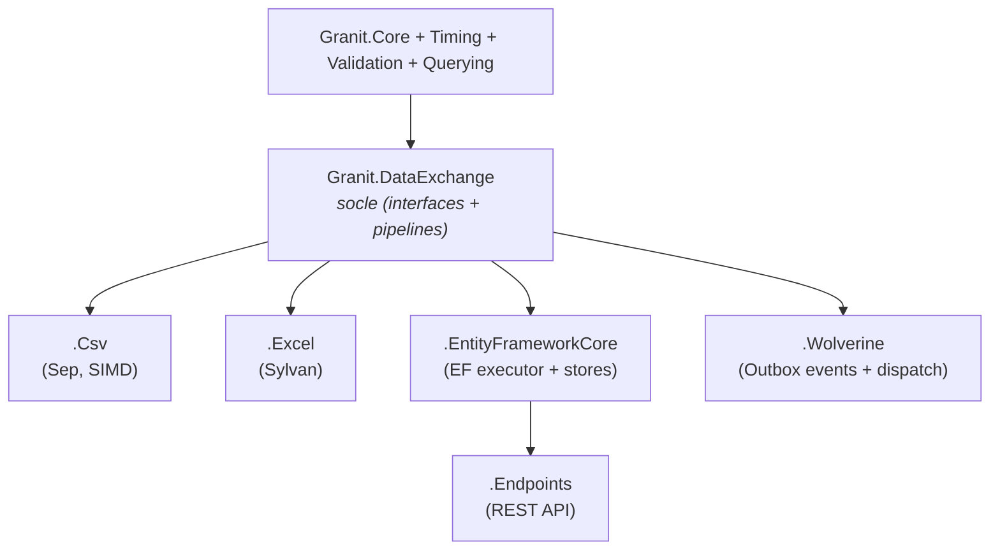
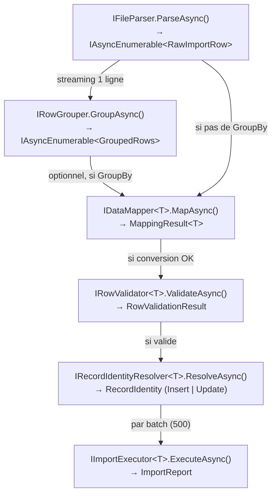
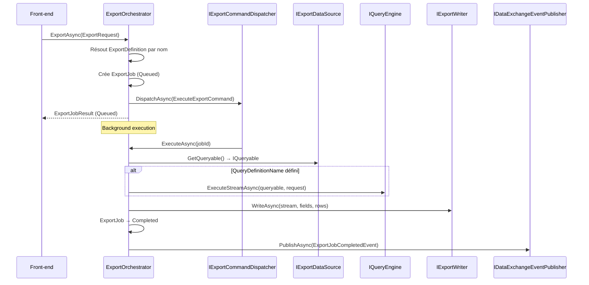
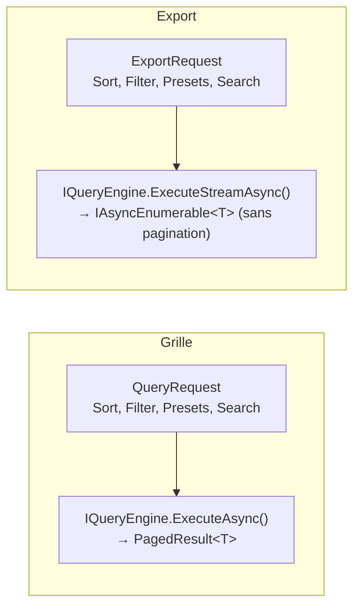
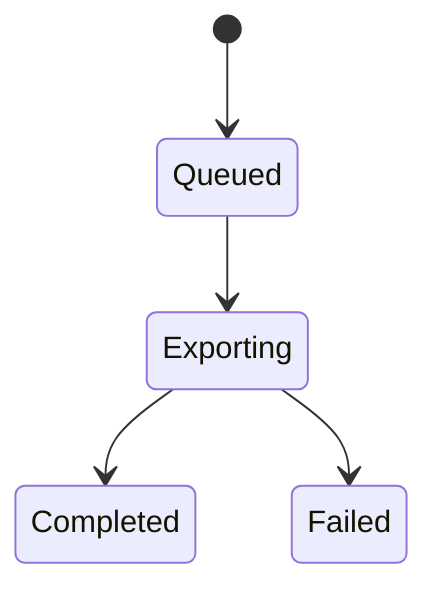

# Data Exchange

`Granit.DataExchange` est le socle des pipelines d'import et d'export de données du
framework Granit. Il fournit :

- **Import** : un mini-ETL intégré **Extract → Map → Validate → Execute**, avec un
  moteur de suggestion de mapping intelligent à 4 niveaux et un support de roundtrip
  (INSERT vs UPDATE).
- **Export** : un pipeline de génération de fichiers (CSV, Excel) avec définition
  fluente, presets sauvegardables, intégration `QueryDefinition` pour le
  filtrage/tri, et support de background jobs.



> **Packages de parsing** : `Granit.DataExchange.Csv` utilise
> [Sep](https://github.com/nietras/Sep) (MIT, SIMD) et `Granit.DataExchange.Excel`
> utilise [Sylvan.Data.Excel](https://github.com/MarkPflug/Sylvan.Data.Excel)
> (MIT, zero-dep). ClosedXML reste dédié à la **génération** dans
> `Granit.DocumentGeneration.Excel`.

## Installation

```bash
dotnet add package Granit.DataExchange
```

Puis ajouter un ou plusieurs parseurs :

```bash
dotnet add package Granit.DataExchange.Csv
dotnet add package Granit.DataExchange.Excel
```

## Enregistrement DI

### Import

```csharp
// Socle import (interfaces, pipeline, options)
services.AddGranitDataExchange();

// Parseurs (au moins un requis)
services.AddGranitDataExchangeCsv();
services.AddGranitDataExchangeExcel();

// Définition d'import par entité
services.AddImportDefinition<Patient, PatientImportDefinition>();

// IA optionnelle (remplace le NullSemanticMappingService par défaut)
services.AddSemanticMappingService<MistralSemanticMappingService>();
```

### Export

```csharp
// Socle export (orchestrateur, options, dispatch)
services.AddGranitDataExport();

// Définition d'export par entité
services.AddExportDefinition<Patient, PatientExportDefinition>();

// Data source (accès aux données + sécurité)
services.AddScoped<IExportDataSource<Patient>, PatientExportDataSource>();

// Writers (au moins un requis)
services.AddSingleton<IExportWriter, CsvExportWriter>();
services.AddSingleton<IExportWriter, ClosedXmlExportWriter>();
```

## Pipeline

Le pipeline complet est exécuté en arrière-plan (Wolverine) :


### Étapes d'exécution



Tout le pipeline est en streaming via `IAsyncEnumerable`. Seul le batch courant
(500 entités) et les erreurs cumulées sont en mémoire.

## Suggestion de mapping (4 niveaux)

`IMappingSuggestionService` applique 4 stratégies par ordre de confiance décroissante.
Les colonnes déjà matchées par un niveau supérieur sont exclues des niveaux suivants.

| Niveau | Source | Confiance |
| --- | --- | --- |
| 1. Sauvegardé | `IMappingStore` (mappings précédents) | `Saved` |
| 2. Exact | Nom de propriété, DisplayName ou alias (case-insensitive) | `Exact` |
| 3. Fuzzy | Distance de Levenshtein normalisée (seuil configurable, défaut 0.8) | `Fuzzy` |
| 4. Sémantique | `ISemanticMappingService` (IA optionnelle) | `Semantic` |

> **Garantie RGPD/HDS** : l'interface `ISemanticMappingService` ne reçoit que les
> **en-têtes** de colonnes et les **métadonnées de schéma** (`FieldMetadata`).
> Aucune donnée métier (`RawImportRow.Values`) ne traverse la frontière IA.

## Import Definition (Fluent API)

Chaque entité importable est déclarée via une `ImportDefinition<TEntity>` :

```csharp
public sealed class PatientImportDefinition : ImportDefinition<Patient>
{
    public override string Name => "Acme.PatientImport";

    protected override void Configure(ImportDefinitionBuilder<Patient> builder)
    {
        builder
            .HasBusinessKey(p => p.Niss)
            .Property(p => p.Niss, p => p
                .DisplayName("NISS")
                .Aliases("Numéro national", "National ID")
                .Required())
            .Property(p => p.FirstName, p => p
                .DisplayName("Prénom")
                .Aliases("First Name", "Voornaam"))
            .Property(p => p.LastName, p => p
                .DisplayName("Nom")
                .Aliases("Last Name", "Achternaam"))
            .Property(p => p.Email, p => p
                .DisplayName("Email")
                .Aliases("Courriel", "Mail", "E-mail"))
            .Property(p => p.BirthDate, p => p
                .DisplayName("Date de naissance")
                .Format("dd/MM/yyyy"))
            .ExcludeOnUpdate(p => p.CreatedAt);
    }
}
```

### Propriétés de la Fluent API

| Méthode | Description |
| --- | --- |
| `Property(expr, config?)` | Déclare une propriété importable (whitelist explicite) |
| `HasBusinessKey(expr)` | Clé métier pour résolution INSERT vs UPDATE |
| `HasCompositeKey(exprs)` | Clé composite (plusieurs propriétés) |
| `HasExternalId()` | Active la résolution par External ID (pattern Odoo) |
| `ExcludeOnUpdate(expr)` | Propriété jamais écrasée lors d'un UPDATE |
| `GroupBy(column)` | Regroupement parent/enfants par colonne |
| `HasMany(collection, config)` | Collection enfant (requiert `GroupBy`) |

### Import parent/enfants (GroupBy)

Pour un fichier plat où un parent s'étend sur plusieurs lignes :

```csharp
public sealed class OrderImportDefinition : ImportDefinition<Order>
{
    public override string Name => "Acme.OrderImport";

    protected override void Configure(ImportDefinitionBuilder<Order> builder)
    {
        builder
            .GroupBy("Numéro")
            .Property(o => o.OrderNumber, p => p.DisplayName("Numéro").Required())
            .Property(o => o.ClientName, p => p.DisplayName("Client"))
            .HasMany(o => o.Lines, child =>
            {
                child.Property(l => l.ProductName, p => p.DisplayName("Produit"));
                child.Property(l => l.Quantity, p => p.DisplayName("Quantité"));
            })
            .HasBusinessKey(o => o.OrderNumber);
    }
}
```

Le fichier doit être trié par clé de groupe. Seul le groupe courant est bufferisé
en mémoire.

## Configuration

```json
{
  "DataExchange": {
    "DefaultMaxFileSizeMb": 50,
    "DefaultBatchSize": 500,
    "FuzzyMatchThreshold": 0.8
  }
}
```

| Option | Défaut | Description |
| --- | --- | --- |
| `DefaultMaxFileSizeMb` | 50 | Taille maximale de fichier (Mo) |
| `DefaultBatchSize` | 500 | Taille des batchs pour l'exécution |
| `FuzzyMatchThreshold` | 0.8 | Seuil de similarité Levenshtein (0.0–1.0) |

## Rapport d'import

`ImportReport` ne contient que les statistiques globales et les lignes en erreur
(pas les lignes réussies). Pour 100 000 lignes et 50 erreurs, seuls ~50 objets
`ImportRowError` sont en mémoire.

```csharp
ImportReport report = await executor.ExecuteAsync(entities, options);

// Statistiques
report.TotalRows;       // 100000
report.SucceededRows;   // 99950
report.FailedRows;      // 50
report.InsertedRows;    // 80000
report.UpdatedRows;     // 19950
report.Duration;        // TimeSpan

// Erreurs détaillées (seules les lignes en erreur)
foreach (ImportRowError error in report.RowErrors)
{
    // error.RowNumber, error.Kind, error.ErrorCodes, error.Message
}
```

## Packages associés

| Package | Rôle |
| --- | --- |
| `Granit.DataExchange.Csv` | Parseur CSV via Sep (SIMD, zero-alloc) |
| `Granit.DataExchange.Excel` | Parseur Excel via Sylvan.Data.Excel (streaming) |
| `Granit.DataExchange.EntityFrameworkCore` | Executor EF Core, stores, identity resolvers |
| `Granit.DataExchange.Endpoints` | API REST + Wolverine (upload, preview, execute, rapport) |

## Parseur CSV (`Granit.DataExchange.Csv`)

Implémente `IFileParser` via [Sep](https://github.com/nietras/Sep) (MIT, SIMD
AVX-512/NEON, zero-alloc). Accepte les MIME types `text/csv` et `application/csv`.

### Fonctionnalités

- **Streaming** : `ParseAsync` retourne un `IAsyncEnumerable<RawImportRow>` —
  une seule ligne en mémoire à la fois
- **Séparateur configurable** : virgule par défaut, point-virgule, tabulation, etc.
  via `FileParsingOptions.Separator`
- **RFC 4180** : guillemets gérés (valeurs contenant le séparateur, retours à la
  ligne dans les champs)
- **Encodage** : UTF-8 par défaut (avec support BOM), ou encodage explicite via
  `FileParsingOptions.Encoding`
- **Valeurs vides** : les cellules vides sont retournées comme `null` dans
  `RawImportRow.Values`

### Exemple d'utilisation

```csharp
// Enregistrement DI
services.AddGranitDataExchangeCsv();

// Utilisation directe (tests, scripts)
SepCsvFileParser parser = new();

// Extraction des en-têtes
using FileStream stream = File.OpenRead("patients.csv");
FileParsingOptions options = new() { Separator = ";" };
IReadOnlyList<string> headers = await parser.ExtractHeadersAsync(stream, options);
// → ["NISS", "Prénom", "Nom", "Email"]

// Preview (10 premières lignes)
stream.Position = 0;
IReadOnlyList<string[]> preview = await parser.ReadPreviewAsync(stream, options, maxRows: 10);

// Parsing complet (streaming)
stream.Position = 0;
await foreach (RawImportRow row in parser.ParseAsync(stream, options))
{
    // row.RowNumber = 1, 2, 3...
    // row.Values["NISS"] = "85073100145"
}
```

### Options de parsing

| Option | Défaut | Description |
| --- | --- | --- |
| `Separator` | `","` | Séparateur de colonnes (premier caractère utilisé) |
| `Encoding` | `null` | Encodage du fichier (`null` = UTF-8 auto-détecté) |
| `QuoteChar` | `"\""` | Caractère de guillemet (géré par Sep nativement) |
| `SkipRows` | `0` | Lignes à ignorer avant l'en-tête |
| `HeaderRowIndex` | `0` | Index de la ligne d'en-tête (après `SkipRows`) |

## Parseur Excel (`Granit.DataExchange.Excel`)

Implémente `IFileParser` via [Sylvan.Data.Excel](https://github.com/MarkPflug/Sylvan.Data.Excel)
(MIT, zero-dep, streaming `DbDataReader`). Accepte les formats `.xlsx`, `.xls` et `.xlsb`
via les MIME types correspondants.

### Fonctionnalités

- **Streaming** : `ParseAsync` retourne un `IAsyncEnumerable<RawImportRow>` via
  `ExcelDataReader.ReadAsync()` — lecture progressive, une seule ligne en mémoire
- **Multi-format** : `.xlsx` (Open XML), `.xls` (BIFF), `.xlsb` (Binary)
- **Sélection de feuille** : `FileParsingOptions.SheetName` permet de cibler une
  feuille spécifique (première feuille par défaut)
- **Détection du format** : `FileParsingOptions.MimeType` détermine le
  `ExcelWorkbookType` utilisé par Sylvan
- **Valeurs vides** : les cellules vides sont retournées comme `null` dans
  `RawImportRow.Values`

### Exemple d'utilisation

```csharp
// Enregistrement DI
services.AddGranitDataExchangeExcel();

// Utilisation directe (tests, scripts)
SylvanExcelFileParser parser = new();

// Extraction des en-têtes
using FileStream stream = File.OpenRead("patients.xlsx");
FileParsingOptions options = new()
{
    MimeType = "application/vnd.openxmlformats-officedocument.spreadsheetml.sheet",
};
IReadOnlyList<string> headers = await parser.ExtractHeadersAsync(stream, options);
// → ["NISS", "Prénom", "Nom", "Email"]

// Preview (10 premières lignes)
stream.Position = 0;
IReadOnlyList<string[]> preview = await parser.ReadPreviewAsync(stream, options, maxRows: 10);

// Parsing complet (streaming)
stream.Position = 0;
await foreach (RawImportRow row in parser.ParseAsync(stream, options))
{
    // row.RowNumber = 1, 2, 3...
    // row.Values["NISS"] = "85073100145"
}

// Sélection d'une feuille spécifique
FileParsingOptions sheetOptions = new()
{
    MimeType = "application/vnd.openxmlformats-officedocument.spreadsheetml.sheet",
    SheetName = "Patients",
};
```

### MIME types supportés

| MIME type | Format | Extension |
| --- | --- | --- |
| `application/vnd.openxmlformats-officedocument.spreadsheetml.sheet` | Open XML | `.xlsx` |
| `application/vnd.ms-excel` | BIFF (Excel 97–2003) | `.xls` |
| `application/vnd.ms-excel.sheet.binary.macroenabled.12` | Binary | `.xlsb` |

## Persistance EF Core (`Granit.DataExchange.EntityFrameworkCore`)

Couche de persistance EF Core pour le pipeline DataExchange. Fournit un `DataExchangeDbContext`
isolé, les stores (mappings sauvegardés, import jobs), les identity resolvers (business key,
composite key, external ID) et l'executor batché.

### Installation

```bash
dotnet add package Granit.DataExchange.EntityFrameworkCore
```

### Enregistrement DI

```csharp
// Host builder — enregistre le DataExchangeDbContext isolé
builder.AddGranitDataExchangeEntityFrameworkCore(opts =>
    opts.UseNpgsql(connectionString));

// Par entité — executor et identity resolver
services.AddImportExecutor<Patient, AppDbContext>();
services.AddBusinessKeyResolver<Patient, AppDbContext>();

// Ou composite key / external ID :
// services.AddCompositeKeyResolver<Patient, AppDbContext>();
// services.AddExternalIdResolver<Patient, AppDbContext>();
```

### Double DbContext

Le package manipule **deux** DbContexts distincts :

1. **`DataExchangeDbContext`** (isolé, propriété du package) — stocke `ImportJob`,
   `SavedMappingEntity`, `ExternalIdMappingEntity`. Utilisé via `IDbContextFactory<>`.
2. **DbContext applicatif** (ex. `AppDbContext`) — contient les entités importées
   (ex. `Patient`). Fourni par l'application.

Les classes génériques (`EfImportExecutor`, identity resolvers) prennent **deux paramètres
de type** : `<TEntity, TContext>` où `TContext : DbContext`.

### Tables créées

| Table | Entité | Rôle |
| --- | --- | --- |
| `data_exchange_jobs` | `ImportJob` | Suivi du cycle de vie des imports |
| `data_exchange_saved_mappings` | `SavedMappingEntity` | Mappings sauvegardés par définition + tenant |
| `data_exchange_external_id_mappings` | `ExternalIdMappingEntity` | Mapping ID externe → ID interne |

### Identity Resolvers

| Resolver | Usage |
| --- | --- |
| `BusinessKeyResolver` | Clé métier unique (ex. NISS) via `HasBusinessKey()` |
| `CompositeKeyResolver` | Clé composite (ex. Nom + Email) via `HasCompositeKey()` |
| `ExternalIdResolver` | ID externe (pattern Odoo `__export__`) via `HasExternalId()` |

### EfImportExecutor

L'executor persiste les entités validées en batch :

1. Crée le `TContext` via `IDbContextFactory<TContext>`
2. Ouvre une transaction
3. Streame les `ValidatedRow<TEntity>` par batch de `BatchSize`
4. Par row : Insert → `Add()`, Update → copie via `SetValues()`
5. Tous les N rows : `SaveChangesAsync()`, report progress
6. Erreurs selon `ErrorBehavior` (FailFast / SkipErrors / CollectAll)
7. DryRun : rollback de la transaction
8. Commit et retourne `ImportReport`

## Endpoints REST (`Granit.DataExchange.Endpoints`)

Minimal API protégée par la permission `DataExchange.Imports.Execute`. 10 endpoints répartis
en 4 groupes : listing, upload, exécution et rapport.

### Installation

```bash
dotnet add package Granit.DataExchange.Endpoints
```

### Enregistrement

```csharp
// Module (si module system utilisé)
[DependsOn(typeof(GranitDataExchangeEndpointsModule))]

// Routing (dans Program.cs ou Startup)
app.MapDataExchangeEndpoints();

// Avec options personnalisées
app.MapDataExchangeEndpoints(opts =>
{
    opts.ApiPrefix = "api/v1";
    opts.RoutePrefix = "imports";
    opts.RequiredRole = "admin";
});
```

### Routes

#### Listing (admin)

| Méthode | Route | Retour | Description |
| --- | --- | --- | --- |
| `GET` | `/jobs` | 200 OK | Liste paginée des import jobs (filtre par `status`, `page`, `pageSize`) |

#### Upload et mapping (Story #496)

| Méthode | Route | Retour | Description |
| --- | --- | --- | --- |
| `POST` | `/` | 201 Created | Upload fichier + crée un ImportJob |
| `POST` | `/{jobId}/preview` | 200 OK | Headers, preview rows, suggestions de mapping |
| `PUT` | `/{jobId}/mappings` | 204 NoContent | Confirme les mappings choisis par l'utilisateur |

#### Exécution (Story #497)

| Méthode | Route | Retour | Description |
| --- | --- | --- | --- |
| `POST` | `/{jobId}/execute` | 202 Accepted | Dispatch asynchrone (Channel ou Wolverine) |
| `POST` | `/{jobId}/dry-run` | 200 OK | Exécution synchrone dry-run → rapport |
| `GET` | `/{jobId}` | 200 / 404 | Status du job |
| `DELETE` | `/{jobId}` | 204 / 404 | Annule le job (si pas en cours) |

#### Rapport (Story #498)

| Méthode | Route | Retour | Description |
| --- | --- | --- | --- |
| `GET` | `/{jobId}/report` | 200 / 404 | Rapport JSON complet |
| `GET` | `/{jobId}/correction-file` | File / 204 / 404 | Fichier de correction (lignes en erreur) |

### Configuration

```json
{
  "DataExchangeEndpoints": {
    "ApiPrefix": "",
    "RoutePrefix": "data-exchange",
    "RequiredRole": "granit-data-exchange-admin",
    "TagName": "Data Import"
  }
}
```

### Permissions

Le module enregistre automatiquement les permissions `DataExchange.Imports.Execute`
et `DataExchange.Exports.Execute` dans le système RBAC Granit. En production,
attribuer ces permissions au rôle Keycloak souhaité via
`IPermissionManager.SetAsync()` ou `GranitAuthorizationOptions.AdminRoles`.

### Dispatch asynchrone

L'endpoint `POST /{jobId}/execute` utilise un `IImportCommandDispatcher` pour
envoyer la commande en arrière-plan. L'implémentation par défaut utilise un
`Channel<ExecuteImportCommand>` consommé par un `BackgroundService` interne.
Les applications utilisant Wolverine peuvent remplacer le dispatcher pour
bénéficier du Outbox.

---

## Export de données

Le pipeline d'export génère des fichiers CSV ou Excel à partir d'une
`ExportDefinition<TEntity>`. Il s'intègre avec `Granit.Querying` pour
réutiliser le même filtrage/tri que la grille.



### ExportDefinition (Fluent API)

Chaque entité exportable est déclarée via une `ExportDefinition<TEntity>`.
Seuls les champs déclarés dans `Configure()` sont disponibles à l'export (whitelist).

```csharp
public sealed class PatientExportDefinition : ExportDefinition<Patient>
{
    public override string Name => "Acme.PatientExport";

    // Lien vers la QueryDefinition pour filtrage/tri (optionnel)
    public override string? QueryDefinitionName => "Acme.Patients";

    protected override void Configure(ExportDefinitionBuilder<Patient> builder)
    {
        builder
            .IncludeBusinessKey()
            .Field(p => p.LastName, f => f.Header("Nom"))
            .Field(p => p.FirstName, f => f.Header("Prénom"))
            .Field(p => p.Email)
            .Field(p => p.BirthDate, f => f.Header("Date de naissance").Format("dd/MM/yyyy"))
            .Field(p => p.Company, c => c.Name, f => f.Header("Société"));
    }
}
```

#### Fluent API

| Méthode | Description |
| --- | --- |
| `Field(expr, config?)` | Champ simple (propriété directe) |
| `Field(nav, prop, config?)` | Champ navigation (dot notation, ex. `Company.Name`) |
| `IncludeId()` | Inclut l'ID pour export roundtrip |
| `IncludeBusinessKey()` | Inclut la clé métier pour roundtrip |

#### Configuration de champ (`ExportFieldBuilder`)

| Méthode | Description |
| --- | --- |
| `Header(string)` | En-tête personnalisé (sinon nom de propriété) |
| `Format(string)` | Format d'affichage (ex. `"dd/MM/yyyy"` pour les dates) |
| `Order(int)` | Ordre explicite (sinon auto-incrémenté) |

### IExportDataSource

Le data source fournit le `IQueryable<T>` de base. C'est ici que s'appliquent
l'isolation tenant, les ACL et les `Include()` pour les propriétés de navigation.

```csharp
public sealed class PatientExportDataSource : IExportDataSource<Patient>
{
    private readonly AppDbContext _db;
    private readonly ICurrentTenant _tenant;

    public PatientExportDataSource(AppDbContext db, ICurrentTenant tenant)
    {
        _db = db;
        _tenant = tenant;
    }

    public IQueryable<Patient> GetQueryable() =>
        _db.Patients
            .Include(p => p.Company)
            .Where(p => p.TenantId == _tenant.Id);
}
```

> **Important** : le data source doit inclure les `Include()` pour toutes les
> propriétés de navigation déclarées dans la définition d'export. Sans `Include()`,
> la valeur exportée sera `null`.

### Intégration QueryDefinition (filtrage et tri)

Quand `QueryDefinitionName` est renseigné, le pipeline d'export utilise
`IQueryEngine<TEntity>.ExecuteStreamAsync()` pour appliquer les mêmes filtres
et tri que la grille. Les champs `Sort`, `Filter`, `Presets` et `Search` de
`ExportRequest` sont mappés vers un `QueryRequest`.



Si `QueryDefinitionName` est `null`, aucun filtrage/tri n'est appliqué :
l'export streame toutes les entités retournées par `GetQueryable()`.

### Export Presets

Les presets sont des configurations d'export sauvegardables (pattern Odoo).
Chaque preset stocke les champs sélectionnés, le format et l'option d'inclusion d'ID.

```csharp
ExportPreset preset = new(
    DefinitionName: "Acme.PatientExport",
    PresetName: "Export mensuel",
    SelectedFields: ["LastName", "FirstName", "Email"],
    Format: "xlsx",
    IncludeIdForImport: false);
```

Les presets sont gérés par `IExportPresetStore`. Le store par défaut est un
null-object ; `Granit.DataExchange.EntityFrameworkCore` fournit une
implémentation EF Core persistée.

### ExportJob et cycle de vie

Chaque export crée un `ExportJob` qui suit un cycle de vie :



| Propriété | Description |
| --- | --- |
| `DefinitionName` | Nom de la définition d'export |
| `Format` | Format de sortie (`csv`, `xlsx`) |
| `Status` | État courant (`Queued`, `Exporting`, `Completed`, `Failed`) |
| `RowCount` | Nombre de lignes exportées |
| `FileName` | Nom du fichier généré |
| `BlobReference` | Référence blob pour le téléchargement |
| `ErrorMessage` | Message d'erreur (si `Failed`) |

### Configuration export

```json
{
  "DataExport": {
    "BackgroundThreshold": 1000
  }
}
```

| Option | Défaut | Description |
| --- | --- | --- |
| `BackgroundThreshold` | 1000 | Seuil de lignes au-delà duquel l'export est dispatché en arrière-plan |

### Dispatch asynchrone

`ExportOrchestrator.ExportAsync()` crée le job puis dispatche via
`IExportCommandDispatcher`. L'implémentation par défaut utilise un
`Channel<ExecuteExportCommand>` consommé par un `BackgroundService`.
Les applications utilisant Wolverine peuvent remplacer le dispatcher
(`Granit.DataExchange.Wolverine`).

### Endpoints REST export

Les endpoints d'export sont enregistrés automatiquement par
`app.MapDataExchangeEndpoints()` sous le préfixe `/data-exchange/export`.

#### Définitions et introspection

| Méthode | Route | Retour | Description |
| --- | --- | --- | --- |
| `GET` | `/export/definitions` | 200 OK | Liste les définitions d'export enregistrées |
| `GET` | `/export/definitions/{name}/fields` | 200 / 404 | Champs disponibles pour une définition |

#### Jobs (listing, création, suivi, téléchargement)

| Méthode | Route | Retour | Description |
| --- | --- | --- | --- |
| `GET` | `/export/jobs` | 200 OK | Liste paginée des export jobs (filtre par `status`, `page`, `pageSize`) |
| `POST` | `/export/jobs` | 201 Created | Crée et dispatche un export job |
| `GET` | `/export/jobs/{jobId}` | 200 / 404 | Status d'un job |
| `GET` | `/export/jobs/{jobId}/download` | File / 400 / 404 | Télécharge le fichier exporté |

#### Presets

| Méthode | Route | Retour | Description |
| --- | --- | --- | --- |
| `GET` | `/export/presets/{definitionName}` | 200 OK | Liste les presets pour une définition |
| `POST` | `/export/presets` | 201 Created | Sauvegarde ou met à jour un preset |
| `DELETE` | `/export/presets/{definitionName}/{presetName}` | 204 / 404 | Supprime un preset |

### Roundtrip import/export

L'export supporte le pattern roundtrip (inspiré Odoo « Je veux mettre à jour
les données ») :

1. **Export** avec `IncludeIdForImport = true` → le fichier contient la colonne `Id`
2. L'utilisateur modifie le fichier (correction de données)
3. **Import** du fichier modifié → `IRecordIdentityResolver` détecte les entités
   existantes via l'ID et effectue un UPDATE au lieu d'un INSERT

## Événements lifecycle

Les orchestrateurs publient des événements quand un job atteint un état terminal.
Ces événements permettent de câbler des notifications, de l'audit ou toute autre
logique réactive côté applicatif.

### Événements

| Événement | Publié quand | Champs clés |
| --- | --- | --- |
| `ImportJobCompletedEvent` | Import terminé (Completed, PartiallyCompleted, Failed) | `ImportJobId`, `DefinitionName`, `Status`, `UserId`, compteurs (Total/Succeeded/Failed/Inserted/Updated/Skipped) |
| `ExportJobCompletedEvent` | Export terminé (Completed, Failed) | `ExportJobId`, `DefinitionName`, `Status`, `UserId`, `RowCount`, `ErrorMessage` |

Aucune donnée personnelle (PII) n'est incluse dans les événements (HDS-compliant).

### Publication

Les événements sont publiés via `IDataExchangeEventPublisher`, une abstraction
suivant le même pattern que `IImportCommandDispatcher` :

- **Par défaut** : `NullDataExchangeEventPublisher` (no-op, singleton)
- **Avec Wolverine** : `WolverineDataExchangeEventPublisher` publié via
  `IMessageBus.PublishAsync()` (Outbox durable, garantie de livraison)

L'enregistrement est automatique :

```csharp
// Le no-op est enregistré par AddGranitDataImport() / AddGranitDataExport()
// Le Wolverine publisher remplace automatiquement quand GranitDataExchangeWolverineModule est chargé
```

### Consommation (côté applicatif)

Créer un handler Wolverine pour réagir aux événements. Exemple avec
`INotificationPublisher` (pattern identique à `ExportCompletedHandler` dans
guava-backend pour la RGPD) :

```csharp
public static class ImportJobCompletedHandler
{
    public static async Task Handle(
        ImportJobCompletedEvent evt,
        INotificationPublisher notificationPublisher,
        CancellationToken cancellationToken)
    {
        await notificationPublisher.PublishAsync(
            AppNotifications.ImportCompleted,
            new ImportCompletedData
            {
                JobId = evt.ImportJobId,
                DefinitionName = evt.DefinitionName,
                Status = evt.Status.ToString(),
                TotalRows = evt.TotalRows,
                FailedRows = evt.FailedRows,
            },
            recipientUserIds: [evt.UserId],
            ct).ConfigureAwait(false);
    }
}
```

## Voir aussi

- [ADR-019 — Sep pour le parsing CSV](../../ADR/ADR-019-sep-parsing-csv.md)
- [ADR-020 — Sylvan.Data.Excel pour le parsing Excel](../../ADR/ADR-020-sylvan-data-excel-parsing.md)
- [Querying](querying.md) — module de filtrage/tri/pagination utilisé par l'export
