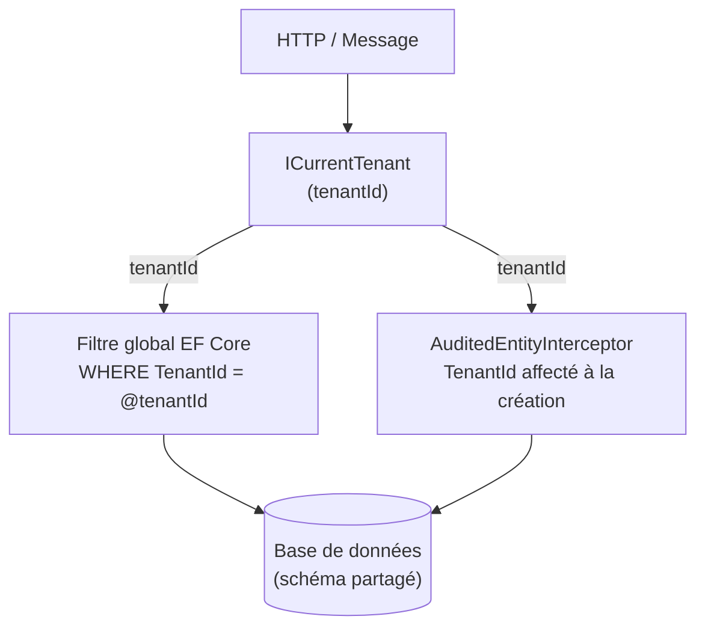
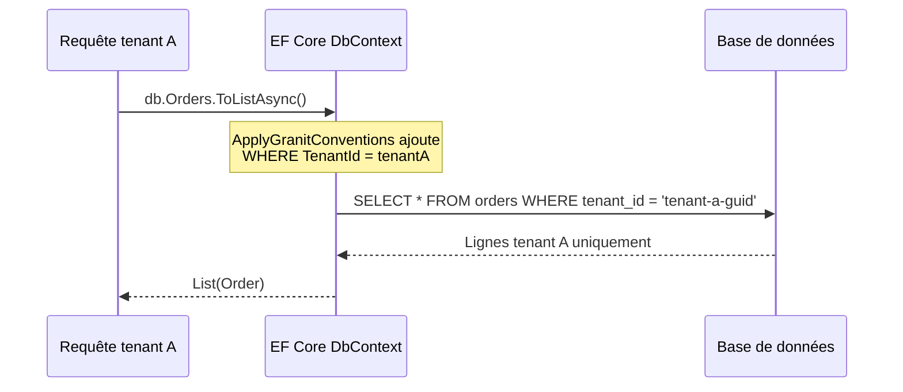

# Isolation SharedDatabase

## Vue d'ensemble

Le pattern **SharedDatabase** est la stratégie la plus simple : tous les tenants
partagent la même base de données et le même schéma. L'isolation est assurée par
un filtre global EF Core sur la colonne `TenantId`, appliqué automatiquement à
toutes les entités implémentant `IMultiTenant`.

Ce pattern est adapté aux plateformes SaaS à très fort nombre de tenants (> 1 000)
où les contraintes ISO 27001 n'exigent pas d'isolation physique ni de sauvegarde par tenant.

> **Avertissement ISO 27001** — Le filtre SQL est la seule barrière entre les données
> des tenants. Un oubli de filtre (requête SQL brute, projection LINQ sans
> `ApplyGranitConventions`) expose les données de tous les tenants. Pour les
> applications ISO 27001, privilégier
> [Tenant-per-Schema](isolation-tenant-per-schema.md) ou
> [Tenant-per-Database](isolation-tenant-per-database.md).

## Architecture



### Fonctionnement du filtre global



Le filtre est appliqué par `ApplyGranitConventions` dans `OnModelCreating`.
Il utilise une closure sur `ICurrentTenant.Id` (via `AsyncLocal<T>`), réévaluée
à chaque requête. Le filtre est actif par défaut et peut être désactivé
temporairement via `IDataFilter.Disable<IMultiTenant>()`.

## Prérequis

- `Granit.Persistence` (version courante)
- `Granit.MultiTenancy` enregistré dans le module hôte
- Les entités multi-tenant implémentent `IMultiTenant` (`Guid? TenantId`)
- `ApplyGranitConventions(currentTenant, dataFilter)` appelé dans `OnModelCreating`

## Installation

```csharp
// Program.cs
builder.Services.AddDbContextFactory<ApplicationDbContext>(
    opts => opts.UseNpgsql(builder.Configuration.GetConnectionString("Default")),
    ServiceLifetime.Scoped);
```

Aucune extension spécifique n'est requise : le filtre global est géré par
`ApplyGranitConventions`, et `AuditedEntityInterceptor` affecte `TenantId`
automatiquement à la création des entités.

## Entités multi-tenant

```csharp
public sealed class Order : Entity<Guid>, IMultiTenant, IAuditable
{
    public Guid? TenantId { get; set; }
    public string Reference { get; set; } = string.Empty;
    public decimal Amount { get; set; }

    // IAuditable
    public DateTimeOffset CreatedAt { get; set; }
    public string? CreatedBy { get; set; }
    public DateTimeOffset? LastModifiedAt { get; set; }
    public string? LastModifiedBy { get; set; }
}
```

Le `DbContext` applique les conventions dans `OnModelCreating` :

```csharp
public sealed class ApplicationDbContext(
    DbContextOptions<ApplicationDbContext> options,
    ICurrentTenant? currentTenant = null,
    IDataFilter? dataFilter = null) : DbContext(options)
{
    public DbSet<Order> Orders => Set<Order>();

    protected override void OnModelCreating(ModelBuilder modelBuilder)
    {
        base.OnModelCreating(modelBuilder);
        modelBuilder.ApplyGranitConventions(currentTenant, dataFilter);
    }
}
```

> **Important** : ne pas ajouter de `HasQueryFilter` manuel sur `TenantId` —
> `ApplyGranitConventions` gère le filtre centralement.

## Désactiver le filtre temporairement

Pour les opérations cross-tenant (migration, rapport global, tâche de fond) :

```csharp
using IDisposable _ = dataFilter.Disable<IMultiTenant>();

// Toutes les requêtes EF Core ignorent le filtre TenantId
var allOrders = await db.Orders.ToListAsync(cancellationToken);
```

> **Attention** : désactiver le filtre expose les données de tous les tenants.
> À utiliser uniquement dans un contexte contrôlé (administration, migration).

## Comportement en l'absence de tenant

Si `ICurrentTenant.IsAvailable` est `false`, le filtre global compare `TenantId`
à `null`. Les entités dont `TenantId` est `null` sont retournées (données
partagées / non affectées à un tenant).

Ce comportement est volontaire : il permet aux endpoints publics (health checks,
configuration globale) de fonctionner sans contexte tenant.

## Façade unifiée

Pour utiliser SharedDatabase avec la façade `AddGranitIsolatedDbContext` :

```csharp
builder.Services.AddGranitIsolatedDbContext<ApplicationDbContext>(
    configureShared: static opts =>
        opts.UseNpgsql(builder.Configuration.GetConnectionString("Default")));
```

```json
{
  "TenantIsolation": {
    "Strategy": "SharedDatabase"
  }
}
```

`SharedDatabase` est la stratégie par défaut si `TenantIsolation:Strategy`
n'est pas spécifié.

## Compatibilité par fournisseur de base de données

| Fournisseur    | Support | Notes                                    |
| -------------- | ------- | ---------------------------------------- |
| **PostgreSQL** | Oui     | Filtre global `WHERE tenant_id = @id`    |
| **SQL Server** | Oui     | Filtre global `WHERE TenantId = @id`     |
| **MySQL**      | Oui     | Filtre global                            |
| **Oracle**     | Oui     | Filtre global                            |
| **SQLite**     | Oui     | Filtre global (tests, apps embarquées)   |
| **Cosmos DB**  | Oui     | Filtre global + partition key `TenantId` |

> **SharedDatabase** est la stratégie la plus universelle : tout provider EF Core
> la supporte, car l'isolation repose sur un filtre LINQ traduit en SQL.

## Considérations de sécurité

- **Filtre obligatoire** : `ApplyGranitConventions` dans chaque `DbContext`
- **Requêtes SQL brutes** : ajouter `WHERE TenantId = @tenantId` manuellement
- **`IgnoreQueryFilters()`** : interdit sauf contexte administration contrôlé
- **Audit** : `AuditedEntityInterceptor` affecte `TenantId` automatiquement
- **Sauvegarde par tenant** : non possible, sauvegarde de la base entière
- **Données soft-deleted** : filtre `IsDeleted` global (cumulé avec `TenantId`)

## Voir aussi

- [Compatibilité des fournisseurs EF Core](compatibilite-providers.md)
- [Isolation Tenant-per-Database](isolation-tenant-per-database.md)
- [Isolation Tenant-per-Schema](isolation-tenant-per-schema.md)
- [Sélection de stratégie d'isolation](isolation-strategie.md)
- [Multi-tenancy — résolution du tenant](multi-tenancy.md)
