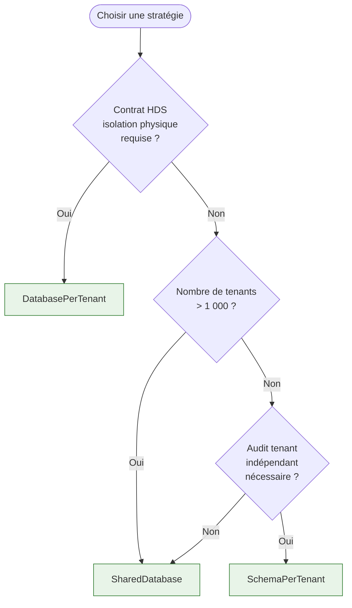
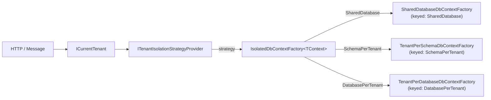

# Sélection de stratégie d'isolation multi-tenant

## Vue d'ensemble

`Granit.Persistence` propose trois patterns d'isolation des données tenant. Ce guide aide
à choisir le bon pattern selon les contraintes métier, HDS et coût d'infrastructure.

## Tableau comparatif

| Critère | SharedDatabase | SchemaPerTenant | DatabasePerTenant |
| --- | --- | --- | --- |
| **Isolation physique** | Aucune (filtre SQL) | Schéma PostgreSQL dédié | Base de données dédiée |
| **Isolation logique** | Filtre global `TenantId` | `SET search_path` | Connexion dédiée |
| **Coût infrastructure** | Très faible | Faible | Élevé (N bases) |
| **Nombre de tenants** | Illimité | ≤ ~1 000 par base | ≤ ~200 (PgBouncer conseillé) |
| **Migration données** | Un seul schéma | Par tenant (onboarding) | Par tenant (onboarding) |
| **Sauvegardes** | Base entière | Base entière (pg\_dump -n) | Par base |
| **Fuite de données** | Risque si filtre absent | Risque si pool non sécurisé | Impossible |
| **Certif. HDS isolée** | Non recommandé | Possible (avec audit) | Recommandé |

## Arbre de décision



## Configuration statique

La stratégie est lue depuis `appsettings.json` (section `TenantIsolation`) :

```json
{
  "TenantIsolation": {
    "Strategy": "SchemaPerTenant"
  }
}
```

Valeurs acceptées : `SharedDatabase` (défaut), `DatabasePerTenant`, `SchemaPerTenant`.

Une valeur invalide déclenche une `OptionsValidationException` au démarrage de l'application
(fail-fast).

## Installation

### Une seule stratégie fixe

Pour un déploiement avec une stratégie unique et connue à l'avance, utiliser directement
l'extension dédiée :

```csharp
// SharedDatabase (filtre TenantId global)
builder.Services.AddDbContextFactory<AppDbContext>(
    opts => opts.UseNpgsql(builder.Configuration.GetConnectionString("Default")));

// SchemaPerTenant
builder.Services.AddTenantPerSchemaDbContext<AppDbContext>(
    static opts => opts.UseNpgsql(connectionString),
    static schema => schema.Prefix = "tenant_");

// DatabasePerTenant
builder.Services.AddSingleton<ITenantConnectionStringProvider, VaultConnectionStringProvider>();
builder.Services.AddTenantPerDatabaseDbContext<AppDbContext>(
    static (opts, cs) => opts.UseNpgsql(cs));
```

### Façade unifiée (stratégie configurable)

`AddGranitIsolatedDbContext` enregistre `IsolatedDbContextFactory<TContext>` comme
`IDbContextFactory<TContext>`. La stratégie active est lue depuis `appsettings.json` via
`ConfigurationTenantIsolationStrategyProvider`.

```csharp
// Program.cs — toutes les stratégies activées
builder.Services.AddSingleton<ITenantConnectionStringProvider, VaultConnectionStringProvider>();

builder.Services.AddGranitIsolatedDbContext<AppDbContext>(
    configureShared: static opts =>
        opts.UseNpgsql(builder.Configuration.GetConnectionString("Default")),
    configureDatabasePerTenant: static (opts, cs) =>
        opts.UseNpgsql(cs),
    configureSchemaPerTenant: static opts =>
        opts.UseNpgsql(builder.Configuration.GetConnectionString("Default")),
    configureTenantSchema: static schema =>
    {
        schema.NamingConvention = TenantSchemaNamingConvention.TenantId;
        schema.Prefix = "tenant_";
    });
```

L'extension enregistre automatiquement :

- `ITenantIsolationStrategyProvider` → `ConfigurationTenantIsolationStrategyProvider` (TryAdd)
- `IDbContextFactory<AppDbContext>` (keyed) pour chaque stratégie configurée
- `IDbContextFactory<AppDbContext>` → `IsolatedDbContextFactory<AppDbContext>` (façade, TryAdd)
- `AppDbContext` (Scoped) → résolu via la façade

## Architecture de la façade



La stratégie résolue est loguée au niveau `Debug` :

```text
Resolving DbContext<AppDbContext> using isolation strategy SchemaPerTenant for tenant 3fa85f64...
```

## Provider dynamique custom

Pour router certains tenants vers une stratégie différente (ex : premium → `DatabasePerTenant`,
standard → `SchemaPerTenant`), implémenter `ITenantIsolationStrategyProvider` :

```csharp
public sealed class CatalogTenantIsolationStrategyProvider(
    ITenantRepository tenantRepository) : ITenantIsolationStrategyProvider
{
    public async ValueTask<TenantIsolationStrategy> GetStrategyAsync(
        Guid? tenantId,
        CancellationToken cancellationToken = default)
    {
        if (tenantId is null)
        {
            return TenantIsolationStrategy.SharedDatabase;
        }

        Tenant tenant = await tenantRepository.GetByIdAsync(tenantId.Value, cancellationToken)
            ?? throw new InvalidOperationException($"Tenant {tenantId} introuvable.");

        return tenant.IsPremium
            ? TenantIsolationStrategy.DatabasePerTenant
            : TenantIsolationStrategy.SchemaPerTenant;
    }
}
```

Enregistrer avant `AddGranitIsolatedDbContext` pour que `TryAdd` conserve l'implémentation :

```csharp
builder.Services.AddScoped<ITenantIsolationStrategyProvider, CatalogTenantIsolationStrategyProvider>();
builder.Services.AddGranitIsolatedDbContext<AppDbContext>(...);
```

## Considérations de sécurité HDS

| Point de vigilance | SharedDatabase | SchemaPerTenant | DatabasePerTenant |
| --- | --- | --- | --- |
| Filtre requis | `HasQueryFilter(TenantId)` dans le modèle EF Core | Automatique (search\_path) | Automatique (connexion) |
| Risque pool Npgsql | Faible (filtre SQL) | **Critique** — `SET search_path` inconditionnel obligatoire | Aucun |
| Audit EF Core | `AuditedEntityInterceptor` auto | `AuditedEntityInterceptor` auto | `AuditedEntityInterceptor` auto |
| Données soft-deleted | Filtre `IsDeleted` global | Filtre `IsDeleted` global | Filtre `IsDeleted` global |

## Voir aussi

- [Isolation Tenant-per-Database](isolation-tenant-per-database.md)
- [Isolation Tenant-per-Schema](isolation-tenant-per-schema.md)
- [Multi-tenancy — résolution du tenant](multi-tenancy.md)
