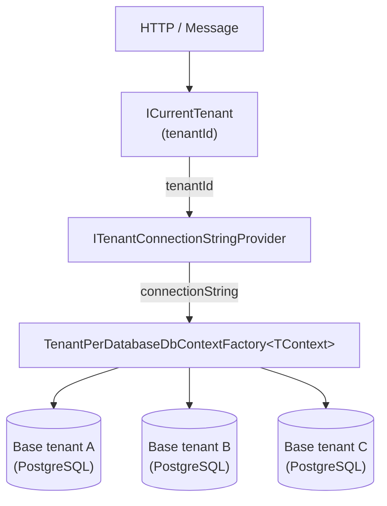

# Isolation Tenant-per-Database

## Vue d'ensemble

Le pattern **Tenant-per-Database** attribue une base de données PostgreSQL physiquement
distincte à chaque tenant. C'est le niveau d'isolation le plus fort disponible dans Granit :
chaque tenant possède son propre schéma, ses propres index et ses propres credentials.

Ce pattern est recommandé pour les applications HDS traitant des données de santé sensibles,
ou pour les tenants dont le contrat exige une isolation physique (ex : CHU, établissements
soumis à des audits externes).

## Architecture



## Prérequis

- `Granit.Persistence` ≥ version courante
- `Granit.MultiTenancy` enregistré dans le module hôte
- Une base de données PostgreSQL provisionnée par tenant (Terraform, scripts de migration, etc.)
- Une implémentation de `ITenantConnectionStringProvider`

## Installation

```csharp
// Program.cs
builder.Services.AddSingleton<ITenantConnectionStringProvider, VaultTenantConnectionStringProvider>();

builder.Services.AddTenantPerDatabaseDbContext<ApplicationDbContext>(
    static (opts, connectionString) => opts.UseNpgsql(connectionString));
```

L'extension enregistre :

- `IDbContextFactory<ApplicationDbContext>` → `TenantPerDatabaseDbContextFactory<ApplicationDbContext>`
- `ApplicationDbContext` (Scoped) → résolu via la factory

La sémantique `TryAdd` est utilisée : une factory déjà enregistrée (test d'intégration, override)
est conservée sans modification.

## Implémenter ITenantConnectionStringProvider

### Avec HashiCorp Vault (recommandé en production HDS)

> `TenantDatabaseOptions`, `GetEncryptedCredential` et `BuildConnectionString` sont des
> exemples d'implémentation côté application — à adapter à votre configuration Vault et
> à votre catalogue de tenants.

```csharp
public sealed class VaultTenantConnectionStringProvider(
    ITransitEncryptionService vault,
    IOptions<TenantDatabaseOptions> options) : ITenantConnectionStringProvider
{
    public async Task<string> GetConnectionStringAsync(Guid tenantId, CancellationToken cancellationToken = default)
    {
        // Résoudre les credentials dynamiques Vault pour ce tenant.
        string credential = await vault.DecryptAsync(
            options.Value.GetEncryptedCredential(tenantId), ct);

        return BuildConnectionString(tenantId, credential);
    }
}
```

### Avec une configuration statique (développement / tests)

```csharp
services.AddSingleton<ITenantConnectionStringProvider>(
    _ => new DelegateTenantConnectionStringProvider(tenantId =>
        Task.FromResult(configuration[$"Tenants:{tenantId}:ConnectionString"]
            ?? throw new InvalidOperationException($"Tenant {tenantId} not configured."))));
```

## Comportement en l'absence de tenant

Si `ICurrentTenant.IsAvailable` est `false` (aucun tenant résolu), la factory lève une
`InvalidOperationException` immédiatement, sans aucun fallback silencieux. Ce comportement
est intentionnel : accéder aux données sans contexte tenant violerait l'isolation HDS/RGPD.

```text
InvalidOperationException: No active tenant context. Ensure the tenant is resolved before
accessing per-tenant data (HTTP: TenantResolutionMiddleware; messaging: TenantContextBehavior).
```

## Intégration Wolverine (Outbox + handler)

Quand `Granit.Wolverine.Postgresql` est utilisé, l'extension `AddGranitWolverineWithPostgresqlPerTenant<TContext>()`
configure automatiquement la factory avec Npgsql. Il n'est pas nécessaire d'appeler
`AddTenantPerDatabaseDbContext` en plus.

```csharp
// Program.cs — avec Wolverine Outbox
builder.Services.AddSingleton<ITenantConnectionStringProvider, VaultTenantConnectionStringProvider>();

builder.AddGranitWolverineWithPostgresqlPerTenant<ApplicationDbContext>();
```

## Audit trail HDS

`AuditedEntityInterceptor` est câblé automatiquement dans chaque `DbContext` créé par la
factory lorsqu'il est présent dans le conteneur DI (enregistré par `AddGranitPersistence()`).
Cela garantit le suivi des opérations par tenant, conformément à l'exigence HDS de rétention
de 3 ans.

## Considérations infrastructure

| Aspect | Recommandation |
| --- | --- |
| Provisionnement | Terraform + module PostgreSQL OVHcloud FR |
| Credentials | HashiCorp Vault — credentials dynamiques, rotation automatique |
| Migrations | Une migration EF Core par tenant, déclenchée au déploiement |
| Connexions | PgBouncer recommandé si N tenants > 50 (réduction des connexions PostgreSQL) |
| Chiffrement | TLS obligatoire — `SslMode=Require` dans la connection string |

## Voir aussi

- [Isolation Tenant-per-Schema](isolation-tenant-per-schema.md)
- [Sélection de stratégie d'isolation](isolation-strategie.md)
- [Multi-tenancy — résolution du tenant](multi-tenancy.md)
