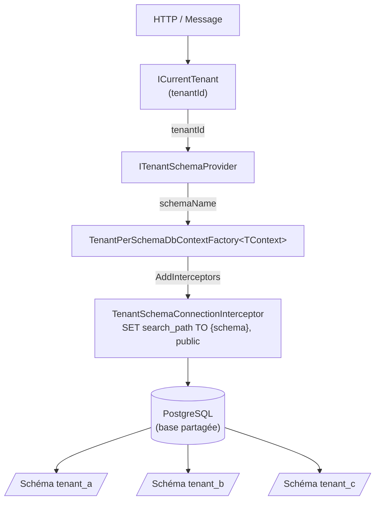
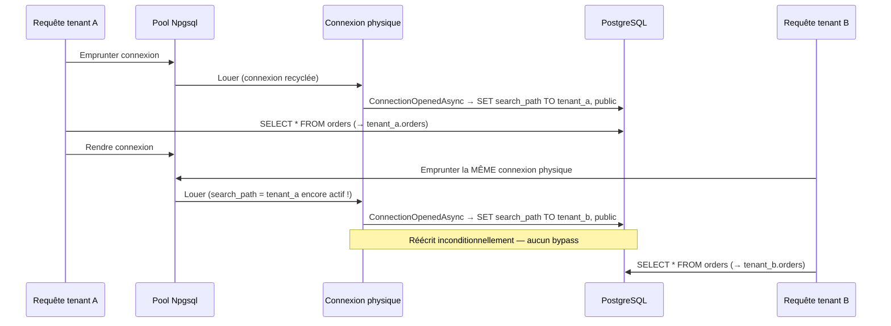

# Isolation Tenant-per-Schema

## Vue d'ensemble

Le pattern **Tenant-per-Schema** utilise une base de données PostgreSQL partagée, avec un
schéma dédié par tenant. Chaque tenant dispose de ses propres tables (`tenant_<id>.orders`,
`tenant_<id>.patients`, etc.) isolées par le mécanisme `search_path` de PostgreSQL.

Ce pattern offre un bon compromis entre isolation des données et coût d'infrastructure :
une seule base de données, mais une séparation logique forte entre tenants. Il est adapté
aux plateformes SaaS à fort nombre de tenants (> 100) dont les contrats n'exigent pas
d'isolation physique.

> **Avertissement HDS** — Dans un contexte de données de santé, évaluer si l'isolation
> logique par schéma est suffisante au regard du contrat client et du niveau de risque.
> Pour les établissements soumis à audit externe ou hébergement HDS certifié, privilégier
> le pattern [Tenant-per-Database](isolation-tenant-per-database.md).

## Architecture



### Sécurité du pool de connexions Npgsql



Le `TenantSchemaConnectionInterceptor` exécute `SET search_path` à **chaque** ouverture
de connexion depuis le pool, sans condition. Toute tentative d'ajouter un cache ou un
guard « déjà configuré » constituerait une **faille HDS critique** (cross-tenant data leak).

## Prérequis

- `Granit.Persistence` ≥ version courante
- `Granit.MultiTenancy` enregistré dans le module hôte
- Un schéma PostgreSQL provisionné par tenant (Flyway, Liquibase, migration EF Core dédiée)
- Connection string unique (base partagée) accessible par l'application

## Installation

```csharp
// Program.cs
builder.Services.AddTenantPerSchemaDbContext<ApplicationDbContext>(
    static opts => opts.UseNpgsql(builder.Configuration.GetConnectionString("Default")),
    static schema =>
    {
        schema.NamingConvention = TenantSchemaNamingConvention.TenantId;
        schema.Prefix = "tenant_";
    });
```

L'extension enregistre automatiquement :

- `TenantSchemaOptions` (configurable via le second paramètre)
- `ITenantSchemaProvider` → `DefaultTenantSchemaProvider` (sauf si déjà enregistré)
- `IDbContextFactory<ApplicationDbContext>` → `TenantPerSchemaDbContextFactory<ApplicationDbContext>`
- `ApplicationDbContext` (Scoped) → résolu via la factory

La sémantique `TryAdd` est utilisée : tout service déjà enregistré (test d'intégration,
provider personnalisé) est conservé sans modification.

## Conventions de nommage des schémas

### TenantId (par défaut, recommandé)

Le nom du schéma est construit à partir du GUID du tenant sans tirets, préfixé :

```text
prefix + tenantId.ToString("N")
→ "tenant_3fa85f6457174562b3fc2c963f66afa6"
```

| Option | Valeur par défaut | Description |
| --- | --- | --- |
| `NamingConvention` | `TenantId` | Génération automatique depuis le GUID |
| `Prefix` | `"tenant_"` | Préfixe du nom de schéma |

### TenantName ou Custom

Ces conventions nécessitent une implémentation personnalisée de `ITenantSchemaProvider`.
`DefaultTenantSchemaProvider` lève une `InvalidOperationException` pour ces deux modes.

## Implémenter un ITenantSchemaProvider personnalisé

```csharp
public sealed class DatabaseTenantSchemaProvider(
    ITenantRepository tenantRepository) : ITenantSchemaProvider
{
    public async ValueTask<string> GetSchemaNameAsync(
        Guid tenantId,
        CancellationToken cancellationToken = default)
    {
        Tenant tenant = await tenantRepository.GetByIdAsync(tenantId, cancellationToken)
            ?? throw new InvalidOperationException($"Tenant {tenantId} introuvable.");

        return tenant.SchemaName;
    }
}
```

Enregistrer avant `AddTenantPerSchemaDbContext` pour que `TryAdd` conserve l'implémentation :

```csharp
builder.Services.AddScoped<ITenantSchemaProvider, DatabaseTenantSchemaProvider>();

builder.Services.AddTenantPerSchemaDbContext<ApplicationDbContext>(
    static opts => opts.UseNpgsql(connectionString));
```

## Comportement en l'absence de tenant

Si `ICurrentTenant.IsAvailable` est `false`, la factory lève une `InvalidOperationException`
immédiatement. L'intercepteur ne modifie pas le `search_path` (la connexion utilise le
`search_path` par défaut PostgreSQL, soit `public`).

```text
InvalidOperationException: No active tenant context. Ensure the tenant is resolved before
accessing per-tenant data (HTTP: TenantResolutionMiddleware; messaging: TenantContextBehavior).
```

## Provisionnement des schémas

### Avec EF Core Migrations

```csharp
// Créer le schéma au premier accès tenant
await using ApplicationDbContext ctx = await factory.CreateDbContextAsync();
await ctx.Database.ExecuteSqlRawAsync(
    $"CREATE SCHEMA IF NOT EXISTS {schemaName}");
await ctx.Database.MigrateAsync();
```

### Avec Flyway / Liquibase (recommandé en production)

Configurer un pipeline de migration par tenant lors du provisionnement (onboarding) ;
chaque tenant déclenche une migration ciblée sur son schéma.

## Considérations infrastructure

| Aspect | Recommandation |
| --- | --- |
| Nombre de tenants | Adapté jusqu'à ~1 000 schémas par base PostgreSQL |
| Credentials | Un seul compte applicatif avec `USAGE` sur tous les schémas tenants |
| Migrations | Par tenant, sur déclenchement (onboarding / mise à jour) |
| PgBouncer | Configurer en mode `transaction` — compatible avec `search_path` dynamique |
| Sauvegardes | Granularité base entière — restauration par tenant via `pg_dump -n schéma` |
| Chiffrement | TLS obligatoire — `SslMode=Require` dans la connection string |

## Voir aussi

- [Isolation Tenant-per-Database](isolation-tenant-per-database.md)
- [Sélection de stratégie d'isolation](isolation-strategie.md)
- [Multi-tenancy — résolution du tenant](multi-tenancy.md)
