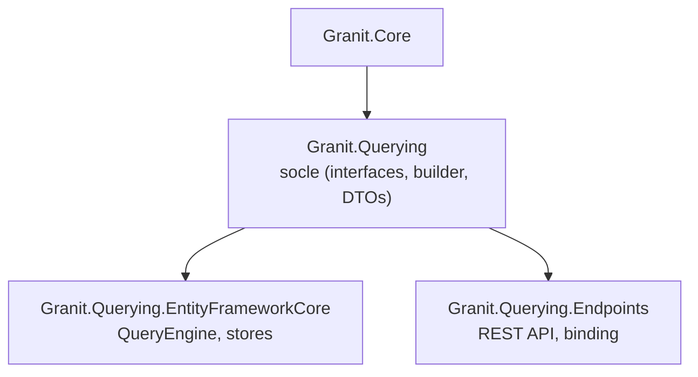

# Querying

`Granit.Querying` est le socle déclaratif de requêtage du framework Granit.
Il fournit un pipeline complet : **filtres typés → presets → quick filters
→ recherche globale → tri → pagination (offset + keyset) → groupement**, avec métadonnées auto-générées
pour le frontend et vues sauvegardées persistantes.



> **Inspirations** : Odoo (FilterGroups, SavedViews, DatePeriod),
> [Spatie Query Builder](https://spatie.be/docs/laravel-query-builder)
> (whitelist-first), HotChocolate (inférence d'opérateurs par type CLR),
> ABP Framework (DTOs paginés, `IPagedResult`).

## Installation

```bash
dotnet add package Granit.Querying
dotnet add package Granit.Querying.EntityFrameworkCore
dotnet add package Granit.Querying.Endpoints
```

## Enregistrement DI

> **Note** : les exemples utilisent `UseNpgsql()` (PostgreSQL). Granit est agnostique :
> tout provider EF Core est supporté (`UseSqlServer()`, `UseSqlite()`, etc.).

```csharp
// Socle (interfaces, NullSavedViewStore)
services.AddGranitQuerying();

// Définition par entité
services.AddQueryDefinition<Patient, PatientQueryDefinition>();

// Persistance EF Core (DbContext isolé + EfCoreSavedViewStore)
builder.AddGranitQueryingEntityFrameworkCore(opts =>
    opts.UseNpgsql(connectionString));

// Endpoints (dans Program.cs)
app.MapQueryEndpoints<Patient>(
    "/api/patients",
    sp => sp.GetRequiredService<AppDbContext>().Patients.AsNoTracking());
```

## Query Definition (Fluent API)

Chaque entité requêtable est déclarée via une `QueryDefinition<TEntity>` :

```csharp
public sealed class PatientQueryDefinition : QueryDefinition<Patient>
{
    public override string Name => "Acme.Patients";

    protected override void Configure(QueryDefinitionBuilder<Patient> builder) =>
        builder
            .Column(p => p.Niss, c => c.Label("NISS").Filterable().Sortable())
            .Column(p => p.Email, c => c.Label("Email").Filterable())
            .Column(p => p.LastName, c => c.Label("Nom").Filterable().Sortable())
            .Column(p => p.BirthDate, c => c.Label("Date de naissance").Filterable())
            .Column(p => p.Status, c => c.Label("Statut").Filterable())
            .GlobalSearch(p => p.Niss, p => p.Email, p => p.LastName)
            .FilterGroup("Status", g => g
                .Preset("Active", p => p.Status == PatientStatus.Active, isDefault: true)
                .Preset("Inactive", p => p.Status == PatientStatus.Inactive))
            .DateFilter(p => p.BirthDate, DatePeriod.ThisYear)
            .AllowGroupBy(p => p.Status)
            .Aggregate(p => p.BirthDate, AggregateFunction.Count, "total")
            .DefaultSort("-LastName")
            .DefaultPageSize(25)
            .MaxPageSize(100);
}
```

### Sécurité whitelist-first

**Rien n'est filtrable, triable ou groupable par défaut.** Chaque champ doit être
déclaré explicitement via `.Filterable()`, `.Sortable()` ou `.AllowGroupBy()`.
Les requêtes contenant des champs non déclarés sont silencieusement ignorées.

### Propriétés du builder

| Méthode | Description |
| --- | --- |
| `Column(expr, config?)` | Déclare une colonne (whitelist explicite) |
| `GlobalSearch(exprs)` | Propriétés pour la recherche textuelle (OR, LIKE) |
| `FilterGroup(name, config)` | Groupe de presets mutuellement exclusifs |
| `DateFilter(expr, default?)` | Filtre de date avec période par défaut |
| `AllowGroupBy(expr)` | Autorise le groupement par cette propriété |
| `Aggregate(expr, fn, alias)` | Agrégat calculé dans les groupes (Sum, Avg, Min, Max, Count) |
| `QuickFilter(name, pred, default?)` | Filtre indépendant toggleable (style Odoo) |
| `QuickFilter(name, label, pred, default?)` | Idem avec libellé custom |
| `DefaultSort(sort)` | Tri par défaut (ex. `"-createdAt,lastName"`) |
| `DefaultPageSize(n)` | Taille de page par défaut |
| `MaxPageSize(n)` | Taille de page maximale (clamped) |
| `SupportsCursorPagination(expr)` | Active la pagination keyset sur la propriété donnée |

### Inférence d'opérateurs

Les opérateurs de filtre sont inférés automatiquement à partir du type CLR :

| Type CLR | Opérateurs |
| --- | --- |
| `string` | Eq, Contains, StartsWith, EndsWith, In |
| `int`, `decimal`, `double` | Eq, Gt, Gte, Lt, Lte, In, Between |
| `DateTime`, `DateOnly`, `DateTimeOffset` | Eq, Gt, Gte, Lt, Lte, Between |
| `bool` | Eq |
| `enum` | Eq, In |
| `Guid` | Eq, In |

## DTOs de requête et réponse

### QueryRequest

```csharp
public sealed record QueryRequest
{
    public int? Page { get; init; }         // pagination offset (1-based)
    public int? PageSize { get; init; }     // clamped à MaxPageSize
    public string? Cursor { get; init; }    // pagination keyset (base64)
    public string? Search { get; init; }    // recherche globale
    public string? Sort { get; init; }      // "-createdAt,lastName"
    public IReadOnlyDictionary<string, string>? Filter { get; init; }
    public IReadOnlyDictionary<string, string>? Presets { get; init; }
    public IReadOnlyList<string>? QuickFilters { get; init; }
    public string? GroupBy { get; init; }
}
```

### PagedResult

```csharp
public sealed record PagedResult<T>(
    IReadOnlyList<T> Items,
    int TotalCount,
    string? NextCursor = null);
```

### GroupedResult

```csharp
public sealed record GroupedResult<T>(
    IReadOnlyList<GroupEntry<T>> Groups,
    int TotalCount);
```

## Filter Groups (Odoo-style)

Les filter groups permettent de regrouper des presets liés à un même concept
(ex. statut, catégorie). La sémantique est :

- **OR** au sein d'un groupe (un preset actif parmi N)
- **AND** entre groupes

```csharp
builder
    .FilterGroup("Status", g => g
        .Preset("Active", p => p.IsActive, isDefault: true)
        .Preset("Archived", p => !p.IsActive))
    .FilterGroup("Category", g => g
        .Preset("Electronics", p => p.Category == "Electronics")
        .Preset("Books", p => p.Category == "Books"));
```

Les presets marqués `isDefault: true` sont appliqués automatiquement quand aucun
preset n'est spécifié pour le groupe.

## Quick Filters (filtres indépendants)

Les quick filters sont des filtres toggleables indépendants, inspirés des filtres
Odoo comme « Mes rendez-vous », « Non lus », « Archivés ». Contrairement aux
presets (mutuellement exclusifs dans un groupe), chaque quick filter est activable
ou désactivable individuellement.

| | **Presets (FilterGroups)** | **QuickFilters** |
| --- | --- | --- |
| UI | Radio buttons / sélection exclusive | Checkboxes indépendantes |
| Sémantique intra-groupe | **OR** (un seul choix actif) | Pas de groupe |
| Sémantique inter-éléments | **AND** entre groupes | **AND** entre filtres actifs |
| Query string | `presets[status]=Active` | `quickFilters=MyItems,Unread` |

### Déclaration

```csharp
builder
    .QuickFilter("MyAppointments", "Mes rendez-vous",
        p => p.AssignedTo == currentUserId, isDefault: true)
    .QuickFilter("Unread", "Non lus",
        p => !p.IsRead)
    .QuickFilter("Archived", "Archivés",
        p => p.IsArchived);
```

Les quick filters marqués `isDefault: true` sont appliqués automatiquement quand
aucun quick filter n'est explicitement demandé.

### Query string

```text
GET /api/appointments?quickFilters=MyAppointments,Unread
```

Les filtres sont combinés en **AND** : seuls les éléments satisfaisant tous les
filtres actifs sont retournés.

## Pipeline d'exécution

Le `QueryEngine<T>` orchestre le pipeline complet :

```text
QueryRequest
    │
    ▼ parse filter dict → FilterCriteria[]
    │
    ▼ whitelist validate (champs déclarés uniquement)
    │
    ▼ ApplyFilters (expression trees, AND)
    │
    ▼ ApplyPresets (OR dans un groupe, AND entre groupes)
    │
    ▼ ApplyQuickFilters (AND entre filtres actifs)
    │
    ▼ ApplyGlobalSearch (OR sur GlobalSearchProperties, LIKE)
    │
    ▼ ApplySort (dynamique via expression trees)
    │
    ├── Pagination offset : Count → Skip/Take → PagedResult<T>
    ├── Pagination keyset : WHERE > cursor → Take+1 → PagedResult<T>
    └── GroupBy : GroupBy → Select(key, count) → GroupedResult<T>
```

Toutes les expressions sont construites dynamiquement via `System.Linq.Expressions`
(pas de Dynamic LINQ). Aucun risque d'injection SQL.

## Pagination

### Offset (par défaut)

```text
GET /api/patients?page=2&pageSize=25
```

La taille de page est automatiquement clampée à `MaxPageSize`.

### Keyset (cursor)

Activé via `SupportsCursorPagination()` dans la définition. Le cursor est un
identifiant base64url-encoded, opaque pour le client :

```text
GET /api/patients?cursor=eyJpZCI6ImFiYy4uLiJ9&pageSize=25
```

Le moteur utilise un filtre `WHERE id > cursor_id` + `Take(pageSize + 1)`
pour déterminer s'il y a une page suivante sans COUNT supplémentaire.

## Query String (Endpoints)

Le `QueryRequestBinder` parse la query string avec la syntaxe `filter[field.op]=value` :

```text
GET /api/patients?page=1&pageSize=20&search=Dupont
    &filter[status.eq]=active
    &filter[age.gte]=18
    &presets[category]=Electronics
    &sort=-createdAt,lastName
    &groupBy=status
```

| Paramètre | Format | Exemple |
| --- | --- | --- |
| `page` | entier (1-based) | `page=2` |
| `pageSize` | entier | `pageSize=25` |
| `cursor` | base64url | `cursor=abc123` |
| `search` | texte libre | `search=Dupont` |
| `sort` | `-` pour desc, séparés par `,` | `sort=-createdAt,name` |
| `filter[field.op]` | opérateur après le `.` | `filter[age.gte]=18` |
| `presets[group]` | nom du preset | `presets[status]=Active` |
| `quickFilters` | noms séparés par `,` | `quickFilters=MyItems,Unread` |
| `groupBy` | nom de propriété | `groupBy=category` |

## Metadata endpoint

`GET /meta` retourne les métadonnées complètes de la définition de requête,
permettant au frontend de construire dynamiquement les contrôles de filtre, tri
et pagination.

```json
{
  "columns": [
    { "name": "Niss", "label": "NISS", "type": "String", "isSortable": true, "isFilterable": true }
  ],
  "filterableFields": [
    { "name": "Niss", "type": "String", "operators": ["Eq", "Contains", "StartsWith", "EndsWith", "In"] }
  ],
  "sortableFields": [{ "name": "Niss" }, { "name": "LastName" }],
  "presetFilterGroups": [
    {
      "name": "Status",
      "label": "Status",
      "presets": [
        { "name": "Active", "label": "Active", "isDefault": true },
        { "name": "Inactive", "label": "Inactive", "isDefault": false }
      ]
    }
  ],
  "quickFilters": [
    { "name": "MyAppointments", "label": "Mes rendez-vous", "isDefault": true },
    { "name": "Unread", "label": "Non lus", "isDefault": false }
  ],
  "dateFilters": [],
  "groupByFields": [{ "name": "Status", "type": "PatientStatus" }],
  "pagination": { "defaultPageSize": 25, "maxPageSize": 100, "supportsCursor": false },
  "defaultSort": "-LastName"
}
```

## Saved Views (vues sauvegardées)

Inspirées de `ir.filters` d'Odoo, les saved views permettent à chaque utilisateur
de persister ses combinaisons filtre + tri + groupement + colonnes visibles.

### Interface

```csharp
public interface ISavedViewStore
{
    Task<IReadOnlyList<SavedView>> GetListAsync(
        string entityType, string userId, Guid? tenantId, CancellationToken cancellationToken);
    Task<SavedView?> GetAsync(Guid id, CancellationToken cancellationToken);
    Task CreateAsync(SavedView view, CancellationToken cancellationToken);
    Task UpdateAsync(SavedView view, CancellationToken cancellationToken);
    Task DeleteAsync(Guid id, CancellationToken cancellationToken);
    Task SetDefaultAsync(Guid id, string userId, string entityType, CancellationToken cancellationToken);
}
```

Par défaut, le `NullSavedViewStore` est enregistré et lève `NotImplementedException`.
Activer la persistance avec `Granit.Querying.EntityFrameworkCore` :

```csharp
builder.AddGranitQueryingEntityFrameworkCore(opts =>
    opts.UseNpgsql(connectionString));
```

### Table créée

| Table | Index unique |
| --- | --- |
| `querying_saved_views` | `(EntityType, UserId, Name, TenantId)` |

### Endpoints CRUD

| Méthode | Route | Description |
| --- | --- | --- |
| `GET` | `/saved-views` | Liste les vues (personnelles + partagées) |
| `POST` | `/saved-views` | Crée une vue |
| `PUT` | `/saved-views/{id}` | Met à jour une vue |
| `DELETE` | `/saved-views/{id}` | Supprime une vue |
| `POST` | `/saved-views/{id}/set-default` | Définit la vue par défaut |

## Persistance EF Core

### QueryEngine

`QueryEngine<T>` est l'orchestrateur principal. Il reçoit une `QueryDefinition<T>`
et exécute le pipeline complet sur un `IQueryable<T>` source.

```csharp
public interface IQueryEngine<TEntity> where TEntity : class
{
    Task<PagedResult<TEntity>> ExecuteAsync(
        IQueryable<TEntity> source, QueryRequest request, CancellationToken cancellationToken);
    Task<GroupedResult<TEntity>> ExecuteGroupedAsync(
        IQueryable<TEntity> source, QueryRequest request, CancellationToken cancellationToken);
    QueryMetadata GetMetadata(IReadOnlyList<SavedViewSummary>? savedViews = null);
}
```

### Expression trees

Toutes les opérations de filtrage, tri et groupement utilisent des expression trees
construits dynamiquement. Aucune dépendance à `System.Linq.Dynamic.Core`.

| Classe interne | Rôle |
| --- | --- |
| `FilterExpressionBuilder` | Construit `Expression<Func<T, bool>>` depuis `FilterCriteria` |
| `QueryableFilterExtensions` | ApplyFilters, ApplyGlobalSearch, ApplyPresets, ApplyQuickFilters |
| `QueryableSortExtensions` | OrderBy/ThenBy dynamique via expressions |
| `QueryablePaginationExtensions` | Offset (Skip/Take) et keyset (cursor) |
| `QueryableGroupByExtensions` | GroupBy dynamique + agrégats |
| `CursorEncoder` | Encode/decode base64url pour la pagination keyset |

## Endpoints REST

### Enregistrement

```csharp
app.MapQueryEndpoints<Patient>(
    "/api/patients",
    sp => sp.GetRequiredService<AppDbContext>().Patients.AsNoTracking(),
    opts =>
    {
        opts.TagName = "Patients";
        opts.AuthorizationPolicy = "Patients.Read";
        opts.IncludeMetaEndpoint = true;       // défaut: true
        opts.IncludeSavedViewEndpoints = true;  // défaut: true
    });
```

### Routes enregistrées

| Méthode | Route | Description |
| --- | --- | --- |
| `GET` | `/` | Requête paginée ou groupée |
| `GET` | `/meta` | Métadonnées de la définition |
| `GET` | `/saved-views` | Liste les vues sauvegardées |
| `POST` | `/saved-views` | Crée une vue |
| `PUT` | `/saved-views/{id}` | Met à jour une vue |
| `DELETE` | `/saved-views/{id}` | Supprime une vue |
| `POST` | `/saved-views/{id}/set-default` | Définit la vue par défaut |

## Packages associés

| Package | Rôle |
| --- | --- |
| `Granit.Querying` | Socle : builder, DTOs, filtres, métadonnées, ISavedViewStore |
| `Granit.Querying.EntityFrameworkCore` | QueryEngine, expression trees, EfCoreSavedViewStore |
| `Granit.Querying.Endpoints` | REST API, `filter[field.op]=value` binding, saved views CRUD |

## Voir aussi

- [ADR-007 — TanStack Table](https://gitlab.digitaldynamics.be/digital-dynamics/granit-front/-/blob/develop/docs/ADR/ADR-007-tanstack-table.md) (granit-front)
