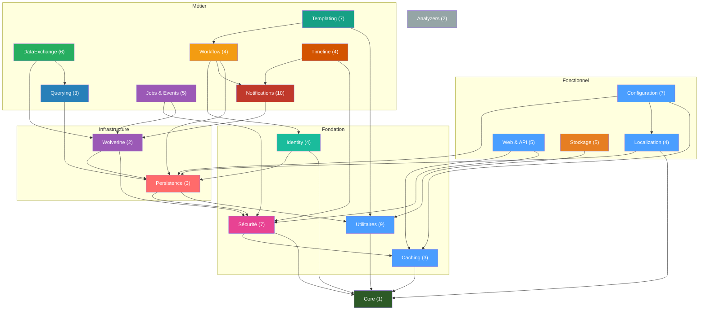
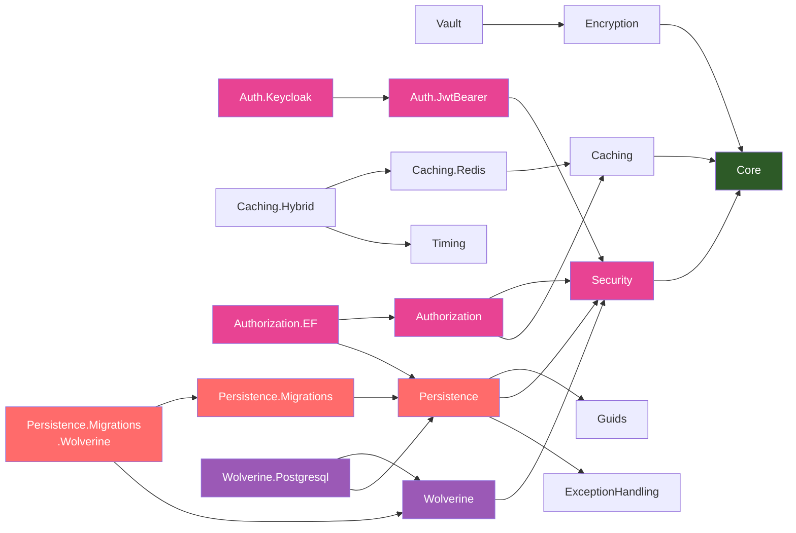
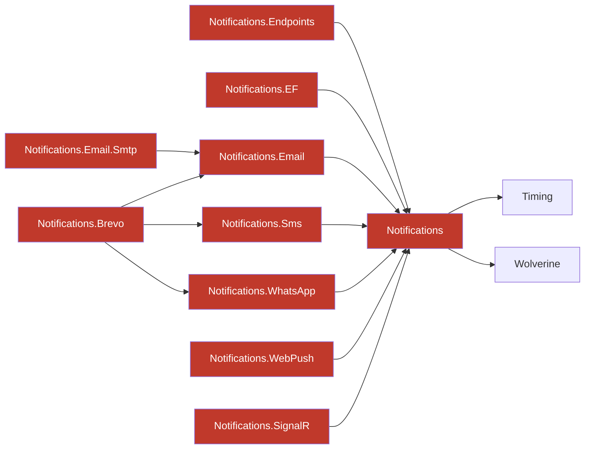
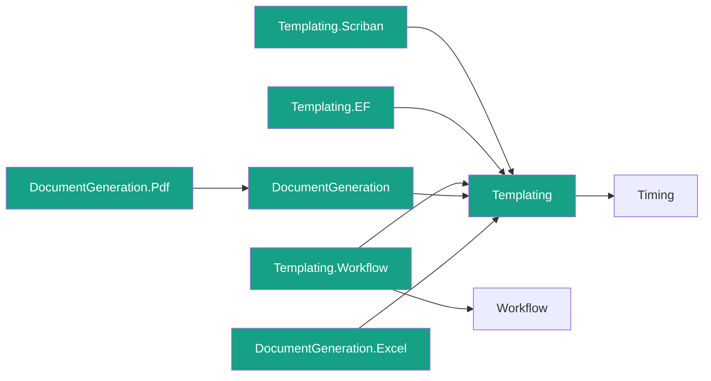
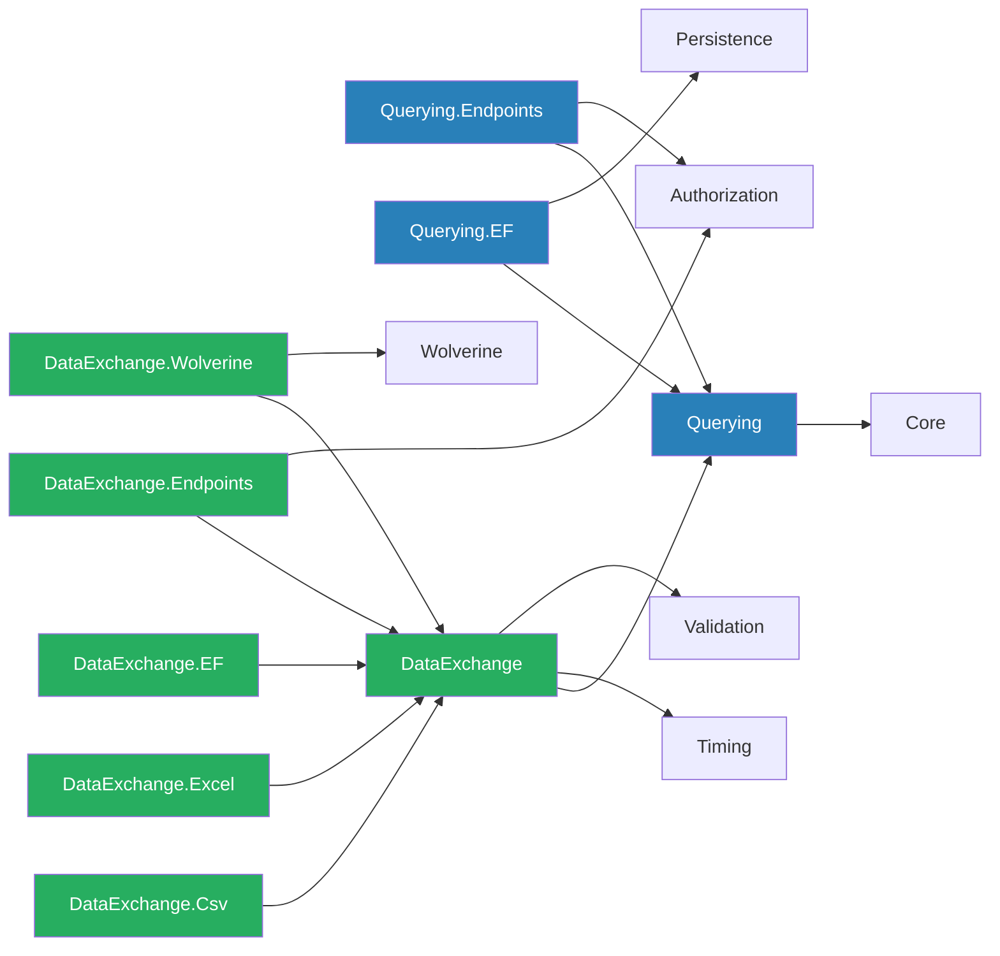
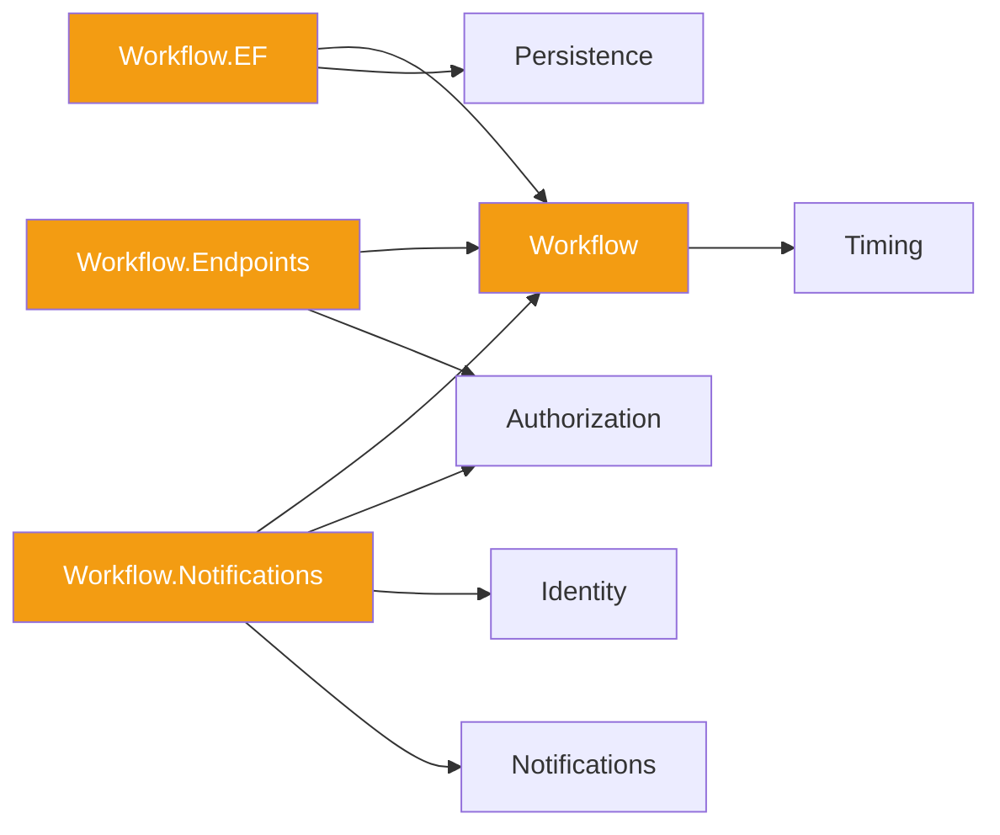
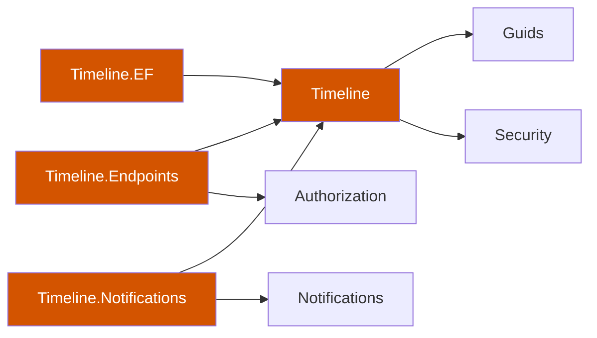
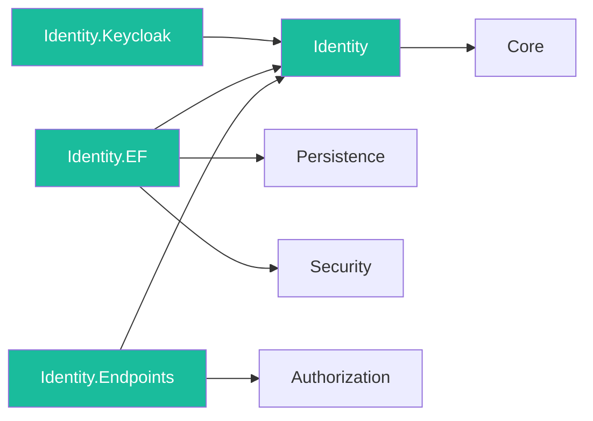

# Graphe de dépendances inter-modules

## Vue d'ensemble

Ce document illustre les dépendances entre les 92 packages source Granit.
Les flèches indiquent le sens de la dépendance : `A → B` signifie « A
dépend de B ». Le package racine `Granit.Core` n'a aucune dépendance.

> **Conventions de lisibilité** :
>
> - Les dépendances transitives vers `Granit.Core` sont omises lorsqu'un
>   package dépend déjà d'un autre module qui dépend de Core.
> - Dans la vue synthétique, le pattern systématique `*.Endpoints →
>   Authorization` est omis (mentionné dans les règles de couplage).

## Vue synthétique

Chaque nœud représente un domaine fonctionnel avec le nombre de packages
entre parenthèses.

**Composition des domaines :**

| Domaine | Packages |
| ------- | -------- |
| Utilitaires | Timing, Guids, Diagnostics, Validation, ExceptionHandling, Observability, MultiTenancy, Privacy, Cors |
| Identity | Identity, Identity.Keycloak, Identity.EntityFrameworkCore, Identity.Endpoints |
| Sécurité | Security, Encryption, Vault, Auth.JwtBearer, Auth.Keycloak, Authorization, Authorization.EF |
| Configuration | Settings (2), Features (2), ReferenceData (3) |
| Web & API | ApiVersioning, ApiDocumentation, Cookies, Cookies.Klaro, Idempotency |
| Stockage | BlobStorage (3), Imaging (2) |
| Jobs & Events | BackgroundJobs (3), Webhooks (2) |

---

## Détails par domaine

### Sécurité, Caching & Persistence

La colonne vertébrale du framework : sécurité, cache distribué et couche
de données.

### Notifications

Fan-out multi-canal avec agrégateur Brevo.

### Templating & DocumentGeneration

Pipeline de rendu : modèle → moteur → document.

### Querying & DataExchange

Pipeline de données : recherche/filtrage, import/export.

### Workflow

Cycle de vie (FSM, publication).

### Timeline

Audit trail ISO 27001 (flux d'activité, commentaires, suivi).

### Identity

Cache local des utilisateurs identity provider. Le package de base
(`Granit.Identity`) expose les abstractions provider-agnostic
(`IIdentityProvider`, `IUserLookupService`, `IUserCacheStats`).
`Granit.Identity.Keycloak` implémente `IIdentityProvider` via l'Admin
API Keycloak. Le package EF Core fournit le cache-aside local
(`UserCacheEntry`, staleness threshold, login-time sync, événements
Wolverine) et les endpoints exposent CRUD, sync, RGPD
(erasure/pseudonymisation), webhook HMAC et health check.

---

## Domaines simples

Packages dont la structure interne ne nécessite pas de diagramme dédié.

### Utilitaires

| Package | Dépend de |
| ------- | --------- |
| `Granit.Timing` | `Core` |
| `Granit.Security` | `Core` |
| `Granit.ExceptionHandling` | `Core` |
| `Granit.Observability` | `Core` |
| `Granit.MultiTenancy` | `Core` |
| `Granit.Privacy` | `Core` |
| `Granit.Cors` | `Core` |
| `Granit.Guids` | `Timing` |
| `Granit.Diagnostics` | `Timing` |
| `Granit.Validation` | `ExceptionHandling`, `Localization` |

### Localization

| Package | Dépend de |
| ------- | --------- |
| `Granit.Localization` | `Core` |
| `Granit.Localization.EntityFrameworkCore` | `Localization`, `Persistence` |
| `Granit.Localization.Endpoints` | `Localization`, `Authorization` |
| `Granit.Localization.SourceGenerator` | aucune (source generator) |

### Configuration (Settings, Features, ReferenceData)

| Package | Dépend de |
| ------- | --------- |
| `Granit.Settings` | `Caching`, `Encryption`, `Security` |
| `Granit.Settings.EntityFrameworkCore` | `Settings`, `Persistence` |
| `Granit.Features` | `Caching`, `Localization` |
| `Granit.Features.EntityFrameworkCore` | `Features`, `Persistence` |
| `Granit.ReferenceData` | `Core` |
| `Granit.ReferenceData.Endpoints` | `ReferenceData` |
| `Granit.ReferenceData.EntityFrameworkCore` | `ReferenceData`, `Persistence` |

### Stockage & Imaging

| Package | Dépend de |
| ------- | --------- |
| `Granit.BlobStorage` | `Guids` |
| `Granit.BlobStorage.EntityFrameworkCore` | `BlobStorage` |
| `Granit.BlobStorage.S3` | `BlobStorage` |
| `Granit.Imaging` | `Core` |
| `Granit.Imaging.MagickNet` | `Imaging` |

### Web & API

| Package | Dépend de |
| ------- | --------- |
| `Granit.ApiVersioning` | `Core` |
| `Granit.ApiDocumentation` | `ApiVersioning`, `Security` |
| `Granit.Cookies` | `Timing` |
| `Granit.Cookies.Klaro` | `Cookies` |
| `Granit.Idempotency` | `Caching`, `Security` |

### Jobs & Events

| Package | Dépend de |
| ------- | --------- |
| `Granit.BackgroundJobs` | `Timing`, `Wolverine` |
| `Granit.BackgroundJobs.EntityFrameworkCore` | `BackgroundJobs` |
| `Granit.BackgroundJobs.Endpoints` | `BackgroundJobs`, `Authorization` |
| `Granit.Webhooks` | `Timing`, `Wolverine` |
| `Granit.Webhooks.EntityFrameworkCore` | `Webhooks` |

### Analyzers

| Package | Dépend de |
| ------- | --------- |
| `Granit.Analyzers` | aucune (Roslyn analyzer) |
| `Granit.Analyzers.CodeFixes` | `Analyzers` |

---

## Légende des couleurs

| Couleur | Signification |
| ------- | ------------- |
| Vert foncé | `Core` — racine sans dépendance |
| Bleu | Utilitaires, Localization, Configuration, Web |
| Rose | Sécurité & Authentification |
| Rouge | Persistence — couche transversale critique |
| Violet | Wolverine — messaging et Outbox |
| Orange | BlobStorage — stockage objet |
| Orange foncé | Timeline — audit ISO 27001 |
| Vert sarcelle | Templating & DocumentGeneration |
| Rouge foncé | Notifications — fan-out multi-canal |
| Bleu acier | Querying — recherche, filtrage, tri, pagination |
| Vert | DataExchange — import/export (mini-ETL) |
| Or | Workflow — FSM et cycle de vie publication |
| Turquoise | Identity — fournisseurs d'identité |
| Mauve | Imaging — traitement d'images |
| Gris | Analyzers — pas de dépendance runtime |

## Propriétés du graphe

- **187 projets** (92 sources + 95 tests), **zéro dépendance circulaire**
- **Profondeur maximale** : 5 niveaux (ex. Core → Security → Wolverine →
  Notifications → Email → Smtp, ou Core → Timing → Persistence →
  Workflow.EF → Workflow.Endpoints)
- **Modules feuilles** : les packages `*.EntityFrameworkCore` et `*.S3` sont
  presque toujours des feuilles — exception : `Workflow.EntityFrameworkCore`
  qui est référencé par `Workflow.Endpoints` et `Templating.Workflow`
- **Racines sans dépendance** : `Granit.Core`, `Granit.Analyzers`,
  `Granit.Localization.SourceGenerator`
- **Soft dependency** : `ICurrentTenant` est dans `Granit.Core`, pas dans
  `Granit.MultiTenancy`

## Règles de couplage

1. **Core ne dépend de rien** — c'est le fondement du framework
2. **Les packages fonctionnels ne référencent jamais les packages
   `*.EntityFrameworkCore`** — les abstractions sont dans le package de base,
   les implémentations EF dans le package `*.EntityFrameworkCore`
3. **`Granit.MultiTenancy` est une dépendance optionnelle** — les modules
   utilisent `ICurrentTenant` de `Granit.Core.MultiTenancy`
4. **Les packages `*.Endpoints` dépendent de `Granit.Authorization`** pour
   la protection des routes (pattern systématique)
5. **Wolverine est le seul bus de messages** — tous les modules asynchrones
   passent par lui (Notifications, Webhooks, BackgroundJobs,
   DataExchange.Wolverine, Persistence.Migrations.Wolverine)
6. **`Persistence.Migrations` est découplé de Wolverine** — le dispatch est
   abstrait par `IMigrationBatchDispatcher` (Channel par défaut, Wolverine
   en option via `Granit.Persistence.Migrations.Wolverine`)
7. **Brevo est un agrégateur multi-canal** — il dépend de Email, Sms et
   WhatsApp pour fournir un fournisseur unifié

## Choix architecturaux intentionnels

Certains patterns dans le graphe de dépendances apparaissent comme des anomalies
lors d'un audit mais sont des choix délibérés. Cette section documente chacun
d'entre eux pour éviter de reproposer les mêmes « corrections ».

### 1. Packages `*.EntityFrameworkCore` avec DbContext isolé (sans `Granit.Persistence`)

7 packages EF utilisent un DbContext autonome via `IDbContextFactory<T>` au lieu
du `DbContext` applicatif géré par `Granit.Persistence` :

- `Granit.Authorization.EntityFrameworkCore`
- `Granit.BackgroundJobs.EntityFrameworkCore`
- `Granit.Localization.EntityFrameworkCore`
- `Granit.Features.EntityFrameworkCore`
- `Granit.Settings.EntityFrameworkCore`
- `Granit.Webhooks.EntityFrameworkCore`
- `Granit.BlobStorage.EntityFrameworkCore`

**Justification** : ces modules sont INSERT-only (audit ISO 27001) ou gèrent des
données d'infrastructure, pas des entités métier. Ils utilisent
`IDbContextFactory` pour la thread safety (handlers Wolverine parallèles) et
n'ont besoin ni de `AuditedEntityInterceptor` ni de `SoftDeleteInterceptor`.

### 2. `Caching.Hybrid` → `StackExchangeRedis`

`HybridCache` (.NET 9+) nécessite un backend distribué L2 pour fonctionner en
mode hybride (L1 MemoryCache + L2 distribué). Redis est le seul backend
supporté par la stack Granit. Cette dépendance est donc structurelle.

### 3. `DataExchange` → `Querying`

Le couplage est export-only : `DataExchange` lit les `QueryDefinition` via
réflexion pour générer les exports tabulaires (colonnes, filtres, tri). Le
module import n'utilise aucun type Querying. Ce couplage minimal est préférable
à la duplication des métadonnées de colonnes.

### 4. `DocumentGeneration.Excel` → `Templating`

Le package XLSX (ClosedXML) court-circuite le pipeline HTML → render car XLSX
est un format binaire. `ClosedXmlTemplateEngine` retourne un
`BinaryRenderedContent` qui saute l'étape `IDocumentRenderer`. La référence
vers `Templating` est nécessaire pour `ITextTemplateRenderer` (rendu des
cellules Scriban) et les types polymorphiques (`RenderedContent`).

### 5. `Notifications.Endpoints` sans RBAC

Tous les endpoints de `Granit.Notifications.Endpoints` sont des opérations
per-user self-service : inbox, préférences, subscriptions, follow/unfollow.
Chaque endpoint filtre par `GetUserId(user)` et ne peut accéder qu'aux données
de l'utilisateur connecté. `.RequireAuthorization()` (authentifié, sans policy
RBAC) est suffisant — aucune donnée admin n'est exposée.

## Voir aussi

- [THIRD-PARTY-NOTICES.md](../../THIRD-PARTY-NOTICES.md) — licences des
  dépendances externes (NuGet tiers)
