# Graphe de dépendances inter-modules

## Vue d'ensemble

Ce diagramme illustre les dépendances entre tous les packages Granit. Les
flèches indiquent le sens de la dépendance : `A → B` signifie « A dépend
de B ». Le package racine `Granit.Core` n'a aucune dépendance.

## Diagramme complet

```mermaid
flowchart BT
    CORE["Granit.Core\n(Module system, Domain,\nMulti-Tenancy soft dep)"]

    style CORE fill:#2d5a27,color:#fff

    %% Couche Utilitaires (dépend uniquement de Core)
    TIMING["Granit.Timing"] --> CORE
    GUIDS["Granit.Guids"] --> CORE
    SEC["Granit.Security"] --> CORE
    EXC["Granit.ExceptionHandling"] --> CORE
    VALID["Granit.Validation"] --> CORE
    CACHE["Granit.Caching"] --> CORE
    ENCR["Granit.Encryption"] --> CORE
    DIAG["Granit.Diagnostics"] --> CORE
    OBS["Granit.Observability"] --> CORE
    MT["Granit.MultiTenancy"] --> CORE

    style TIMING fill:#4a9eff,color:#fff
    style GUIDS fill:#4a9eff,color:#fff
    style SEC fill:#4a9eff,color:#fff
    style EXC fill:#4a9eff,color:#fff
    style VALID fill:#4a9eff,color:#fff
    style CACHE fill:#4a9eff,color:#fff
    style ENCR fill:#4a9eff,color:#fff
    style DIAG fill:#4a9eff,color:#fff
    style OBS fill:#4a9eff,color:#fff
    style MT fill:#4a9eff,color:#fff

    %% Couche Caching avancée
    CACHE_REDIS["Granit.Caching\n.StackExchangeRedis"] --> CACHE
    CACHE_HYB["Granit.Caching.Hybrid"] --> CACHE

    %% Couche Persistence
    PERS["Granit.Persistence"] --> CORE
    PERS --> TIMING
    PERS --> GUIDS
    PERS --> SEC
    PERS --> EXC

    PERS_MIG["Granit.Persistence\n.Migrations"] --> PERS

    PERS_MIG_WOL["Granit.Persistence\n.Migrations.Wolverine"] --> PERS_MIG
    PERS_MIG_WOL --> WOL

    style PERS fill:#ff6b6b,color:#fff

    %% Couche Auth
    JWT["Granit.Authentication\n.JwtBearer"] --> SEC
    KC["Granit.Authentication\n.Keycloak"] --> JWT

    AUTHZ["Granit.Authorization"] --> SEC
    AUTHZ --> CACHE

    AUTHZ_EF["Granit.Authorization\n.EntityFrameworkCore"] --> AUTHZ

    %% Couche Messaging (Wolverine)
    WOL["Granit.Wolverine"] --> CORE
    WOL --> SEC

    WOL_PG["Granit.Wolverine\n.Postgresql"] --> WOL

    style WOL fill:#9b59b6,color:#fff

    %% Couche Localization
    LOC["Granit.Localization"] --> CORE
    LOC_EF["Granit.Localization\n.EntityFrameworkCore"] --> LOC
    LOC_EP["Granit.Localization\n.Endpoints"] --> LOC
    LOC_EP --> AUTHZ
    LOC_SG["Granit.Localization\n.SourceGenerator"] --> LOC

    %% Couche Fonctionnelle
    FEAT["Granit.Features"] --> CORE
    FEAT --> CACHE
    FEAT --> LOC

    FEAT_EF["Granit.Features\n.EntityFrameworkCore"] --> FEAT

    BGJOBS["Granit.BackgroundJobs"] --> CORE
    BGJOBS --> SEC
    BGJOBS --> TIMING
    BGJOBS --> WOL

    BGJOBS_EF["Granit.BackgroundJobs\n.EntityFrameworkCore"] --> BGJOBS
    BGJOBS_EP["Granit.BackgroundJobs\n.Endpoints"] --> BGJOBS

    BLOB["Granit.BlobStorage"] --> CORE
    BLOB --> GUIDS
    BLOB --> TIMING

    BLOB_EF["Granit.BlobStorage\n.EntityFrameworkCore"] --> BLOB
    BLOB_S3["Granit.BlobStorage.S3"] --> BLOB

    style BLOB fill:#e67e22,color:#fff

    %% Couche Settings
    SETT["Granit.Settings"] --> CORE
    SETT --> CACHE
    SETT --> ENCR
    SETT --> SEC

    SETT_EF["Granit.Settings\n.EntityFrameworkCore"] --> SETT

    %% Couche Webhooks
    WH["Granit.Webhooks"] --> CORE
    WH --> WOL

    WH_EF["Granit.Webhooks\n.EntityFrameworkCore"] --> WH

    %% Couche Idempotency
    IDEMP["Granit.Idempotency"] --> CORE
    IDEMP --> CACHE
    IDEMP --> SEC

    %% Couche API
    APIV["Granit.ApiVersioning"] --> CORE
    APIDOC["Granit.ApiDocumentation"] --> CORE
    APIDOC --> SEC

    %% Couche Vault
    VAULT["Granit.Vault"] --> CORE
    VAULT --> ENCR

    %% Analyzers (pas de dépendance runtime)
    ANLZ["Granit.Analyzers"]
    ANLZ_CF["Granit.Analyzers\n.CodeFixes"]

    style ANLZ fill:#95a5a6,color:#fff
    style ANLZ_CF fill:#95a5a6,color:#fff
```

## Légende

| Couleur | Signification |
|---------|---------------|
| Vert foncé | `Granit.Core` — racine sans dépendance |
| Bleu | Couche utilitaires — dépend uniquement de Core |
| Rouge | Persistence — couche transversale critique |
| Violet | Wolverine — messaging et Outbox |
| Orange | BlobStorage — stockage objet |
| Gris | Analyzers — pas de dépendance runtime |

## Propriétés du graphe

- **Zéro dépendance circulaire** — le build de 92 projets passe avec 0 erreurs
- **Profondeur maximale** : 4 niveaux (Core → Security → Wolverine → BackgroundJobs)
- **Modules feuilles** : les packages `*.EntityFrameworkCore` et `*.S3` sont toujours des feuilles
- **Soft dependency** : `ICurrentTenant` est dans `Granit.Core`, pas dans `Granit.MultiTenancy`

## Règles de couplage

1. **Core ne dépend de rien** — c'est le fondement du framework
2. **Les packages fonctionnels ne référencent jamais les packages `*.EntityFrameworkCore`**
3. **`Granit.MultiTenancy` est une dépendance optionnelle** — les modules utilisent
   `ICurrentTenant` de `Granit.Core.MultiTenancy`
4. **Les packages `*.Endpoints` dépendent de `Granit.Authorization`** pour la protection des routes
5. **Wolverine est le seul bus de messages** — tous les modules asynchrones passent par lui
6. **`Persistence.Migrations` est découplé de Wolverine** — le dispatch est abstrait par
   `IMigrationBatchDispatcher` (Channel par défaut, Wolverine en option via
   `Granit.Persistence.Migrations.Wolverine`)
