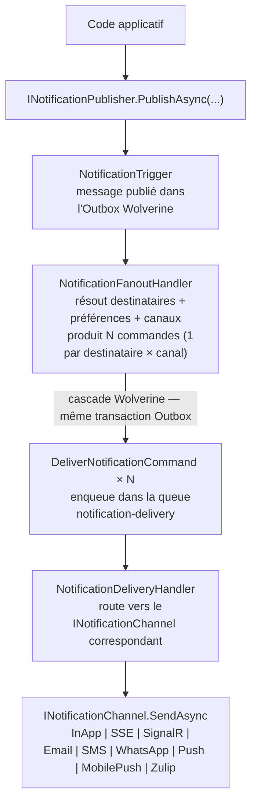

# Messagerie — Granit.Notifications

Moteur de notifications **multi-canal** pour les applications Granit.
Publie des notifications aux utilisateurs via InApp, SSE, SignalR, Email, SMS, WhatsApp,
Web Push, Mobile Push et Zulip.
Basé sur Wolverine (Outbox at-least-once), conforme ISO 27001 (audit trail immuable) et RGPD.

Quatorze packages composables :

| Package | Rôle |
| --- | --- |
| `Granit.Notifications` | Core : abstractions, définitions, fan-out Wolverine, canal InApp, stores InMemory |
| `Granit.Notifications.EntityFrameworkCore` | Stores durables EF Core + intercepteur de suivi d'entités |
| `Granit.Notifications.SignalR` | Temps réel browser via hub SignalR + Redis backplane K8s |
| `Granit.Notifications.Sse` | Temps réel browser via Server-Sent Events natif .NET 10, sans Redis |
| `Granit.Notifications.Endpoints` | API REST Minimal API (inbox, préférences, followers, tokens push) |
| `Granit.Notifications.Email` | Abstraction `IEmailSender` + canal Email (Keyed Services) |
| `Granit.Notifications.Email.Smtp` | Provider MailKit SMTP (clé `"Smtp"`) |
| `Granit.Notifications.Sms` | Abstraction `ISmsSender` + canal SMS (Keyed Services) |
| `Granit.Notifications.WhatsApp` | Abstraction `IWhatsAppSender` + canal WhatsApp (templates Meta pré-approuvés) |
| `Granit.Notifications.Brevo` | Provider unifié Email + SMS + WhatsApp via API Brevo |
| `Granit.Notifications.WebPush` | Web Push W3C VAPID (souveraineté, pas de FCM/APNs) |
| `Granit.Notifications.MobilePush` | Abstraction `IMobilePushSender` + canal MobilePush (Keyed Services), token store |
| `Granit.Notifications.MobilePush.Fcm` | Provider Firebase Cloud Messaging v1 (clé `"Fcm"`) |
| `Granit.Notifications.Zulip` | Canal Zulip Bot API pour alertes infra (self-hosted) |

## Architecture



Le fan-out et la livraison sont **entièrement découplés** : Wolverine publie les `N`
commandes dans l'Outbox avant de rendre la main à l'application. Les livraisons s'effectuent
en parallèle (jusqu'à `MaxParallelDeliveries`) avec une politique de retry exponentielle
durable.

### Résolution des destinataires

Le `NotificationFanoutHandler` résout les destinataires selon trois stratégies, par ordre
de priorité :

1. **Liste explicite** — `PublishAsync(type, data, recipientUserIds)` : les destinataires
   sont fournis directement par l'application.
2. **Followers d'entité** — `PublishToEntityFollowersAsync(type, data, entity)` : résolution
   via `INotificationSubscriptionStore.GetEntityFollowerIdsAsync()`.
3. **Abonnés au type** — `PublishToSubscribersAsync(type, data)` : résolution via
   `INotificationSubscriptionStore.GetSubscriberIdsAsync()`.

Pour chaque destinataire, le handler consulte `INotificationPreferenceStore` afin de
filtrer les canaux désactivés (sauf si `AllowUserOptOut = false` dans la définition).

## Installation rapide

### Module de base (stores en mémoire, développement/tests)

```csharp
[DependsOn(typeof(GranitNotificationsModule))]
public sealed class MyAppModule : GranitModule { }
```

### Module avec EF Core (production)

```csharp
[DependsOn(typeof(GranitNotificationsEntityFrameworkCoreModule))]
public sealed class MyAppModule : GranitModule { }
```

L'enregistrement EF Core se fait via l'extension `AddGranitNotificationsEntityFrameworkCore` :

> **Note** : les exemples utilisent `UseNpgsql()` (PostgreSQL). Granit est agnostique :
> tout provider EF Core est supporté (`UseSqlServer()`, `UseSqlite()`, etc.).

```csharp
builder.AddGranitNotificationsEntityFrameworkCore(
    opts => opts.UseNpgsql(connectionString));
```

### Ajout des canaux

```csharp
// SSE temps réel (natif .NET 10, sans dépendance Redis)
builder.Services.AddGranitNotificationsSse();

// OU SignalR temps réel (avec Redis backplane pour K8s)
builder.Services.AddGranitNotificationsSignalR(redisConnectionString);

// Email via MailKit SMTP
builder.Services.AddGranitNotificationsEmail();
builder.Services.AddGranitNotificationsEmailSmtp();

// SMS
builder.Services.AddGranitNotificationsSms();

// WhatsApp
builder.Services.AddGranitNotificationsWhatsApp();

// Web Push VAPID
builder.Services.AddGranitNotificationsPush();

// Mobile Push (Capacitor / apps natives)
builder.Services.AddGranitNotificationsMobilePush();
builder.Services.AddGranitNotificationsMobilePushFcm(); // Provider FCM

// Zulip (alertes infra, self-hosted)
builder.Services.AddGranitNotificationsZulip();

// Provider unifié Brevo (Email + SMS + WhatsApp)
builder.Services.AddGranitNotificationsBrevo();
```

### Endpoints REST

```csharp
app.MapGranitNotificationEndpoints();

// SSE stream (si Granit.Notifications.Sse est installé)
app.MapGranitSseNotificationEndpoints();
```

Le préfixe par défaut est `notifications`. Le versioning est hérité du groupe
de routes parent (`MapGroup("api/v{version:apiVersion}")`) dans `Program.cs`.

```csharp
app.MapGranitNotificationEndpoints();
```

### Configuration minimale

```json
{
  "Notifications": {
    "MaxParallelDeliveries": 8,
    "SignalR": {
      "RedisConnectionString": "redis:6379"
    },
    "Email": {
      "Provider": "Smtp",
      "SenderAddress": "noreply@example.com",
      "SenderName": "Mon Application"
    }
  }
}
```

## Définition des notifications

Chaque type de notification est déclaré via une classe dérivant de `NotificationType<TData>`.
Les instances sont des singletons applicatifs :

```csharp
public sealed class OrderShippedNotification : NotificationType<OrderShippedData>
{
    public static readonly OrderShippedNotification Instance = new();

    public override string Name => "Orders.Shipped";
    public override NotificationSeverity DefaultSeverity => NotificationSeverity.Info;
    public override IReadOnlyList<string> DefaultChannels =>
        [NotificationChannels.InApp, NotificationChannels.Email, NotificationChannels.Push];
}

public sealed record OrderShippedData
{
    public required string OrderId { get; init; }
    public required string TrackingNumber { get; init; }
}
```

### Enregistrement au démarrage

Les définitions sont enregistrées via un `INotificationDefinitionProvider` :

```csharp
public sealed class OrderNotificationDefinitionProvider : INotificationDefinitionProvider
{
    public void Define(INotificationDefinitionContext context)
    {
        context.Add(new NotificationDefinition("Orders.Shipped")
        {
            DisplayName = "Commande expédiée",
            Description = "Notification envoyée lorsqu'une commande est expédiée.",
            GroupName = "Commandes",
            DefaultChannels = [NotificationChannels.InApp, NotificationChannels.Email],
            AllowUserOptOut = true,
        });
    }
}

// Dans ConfigureServices :
services.AddNotificationDefinitions<OrderNotificationDefinitionProvider>();
```

### AllowUserOptOut

Le champ `AllowUserOptOut` contrôle si l'utilisateur peut désactiver la notification :

- `true` (défaut) — l'utilisateur peut opt-out par canal via ses préférences.
- `false` — la notification est toujours envoyée (alertes sécurité, brèches RGPD).

## Publication

`INotificationPublisher` est la façade applicative. Trois méthodes de publication :

### Destinataires explicites

```csharp
public sealed class OrderService(INotificationPublisher notifications)
{
    public async Task ShipOrderAsync(Order order, CancellationToken cancellationToken)
    {
        // ... logique métier ...

        await notifications.PublishAsync(
            OrderShippedNotification.Instance,
            new OrderShippedData
            {
                OrderId = order.Id.ToString(),
                TrackingNumber = order.TrackingNumber,
            },
            recipientUserIds: [order.CustomerId],
            ct);
    }
}
```

### Abonnés au type

```csharp
await notifications.PublishToSubscribersAsync(
    SystemMaintenanceNotification.Instance,
    new SystemMaintenanceData { ScheduledAt = maintenanceDate },
    ct);
```

### Followers d'entité (style Odoo)

```csharp
await notifications.PublishToEntityFollowersAsync(
    PatientStatusChangedNotification.Instance,
    new PatientStatusChangedData { NewStatus = "Active" },
    relatedEntity: new EntityReference("Patient", patient.Id.ToString()),
    ct);
```

L'implémentation `WolverineNotificationPublisher` sérialise les données en `JsonElement`
et publie un `NotificationTrigger` dans la queue Wolverine. Le tenant actif
(`ICurrentTenant`) est automatiquement propagé dans l'enveloppe.

## Canaux

### InApp

Canal intégré dans le package core. Persiste chaque notification dans `UserNotification`
via `IUserNotificationStore`. La base de données est la **source de vérité** ; les autres
canaux (Email, SMS, Push) sont des copies (principe Django).

Les notifications InApp sont consultées via l'API REST (inbox) ou le fil d'activité
(entity activity feed).

États possibles : `Unread` (0), `Read` (1).

### SignalR

Pousse les notifications en temps réel vers les clients browser connectés. Chaque
utilisateur est placé dans un groupe SignalR identifié par son `userId`.

Le hub `NotificationHub` gère automatiquement l'ajout/suppression des connexions aux groupes.
Le client reçoit l'événement `ReceiveNotification` avec un `SignalRNotificationMessage`.

En déploiement Kubernetes multi-pod, activer le **Redis backplane** :

```csharp
builder.Services.AddGranitNotificationsSignalR("redis:6379");
```

Le préfixe du canal Redis est `granit-notifications` pour éviter les collisions.

### SSE (Server-Sent Events)

Alternative légère à SignalR pour le push unidirectionnel (Server→Client). Utilise
`TypedResults.ServerSentEvents()` natif .NET 10 avec un `ISseConnectionManager` basé
sur `Channel<T>` pour le routage par utilisateur.

Chaque requête SSE (`GET /notifications/stream`) reste suspendue et reçoit les
notifications en temps réel via le protocole SSE standard (`text/event-stream`).
Le multi-onglet/multi-appareil est géré nativement : chaque connexion HTTP est
indépendante.

```csharp
// Enregistrement DI
builder.Services.AddGranitNotificationsSse();

// Mapping de l'endpoint
app.MapGranitSseNotificationEndpoints();
```

L'endpoint retourne un `RouteGroupBuilder` que l'application peut configurer
(authentification, versioning, préfixe) :

```csharp
app.MapGranitSseNotificationEndpoints()
    .RequireAuthorization();
```

Un heartbeat sentinel (`NotificationTypeName == "__heartbeat__"`) est envoyé toutes
les 30 secondes (configurable) pour maintenir la connexion à travers les proxies.
Les clients doivent filtrer ces messages.

**Différences avec SignalR :**

| Aspect | SignalR | SSE |
| --- | --- | --- |
| Protocole | WebSocket bidirectionnel | HTTP unidirectionnel |
| Backplane K8s | Redis | Wolverine `ToAllPeers()` (pas de dépendance supplémentaire) |
| Bundle npm | `@microsoft/signalr` (~45 kB) | `@microsoft/fetch-event-source` (~2 kB) |
| Tests front | Stub `HubConnection` | Mock `fetch` standard |

> **Note** : SignalR et SSE sont **mutuellement exclusifs**. N'enregistrez qu'un seul
> canal temps réel dans votre application.

### Email

Résout le provider d'envoi à l'exécution via **.NET Keyed Services** (`EmailChannelOptions.Provider`).
Le canal utilise `IRecipientResolver` pour obtenir l'adresse email du destinataire.

Providers disponibles :

| Clé | Package | Implémentation |
| --- | --- | --- |
| `"Smtp"` | `Granit.Notifications.Email.Smtp` | `MailKitEmailSender` |
| `"Brevo"` | `Granit.Notifications.Brevo` | `BrevoNotificationProvider` |

### SMS

Résout le provider via Keyed Services (`SmsChannelOptions.Provider`). Utilise
`IRecipientResolver` pour obtenir le numéro de téléphone (format E.164).

Providers disponibles :

| Clé | Package | Implémentation |
| --- | --- | --- |
| `"Brevo"` | `Granit.Notifications.Brevo` | `BrevoNotificationProvider` |

### WhatsApp

Canal basé sur les **templates pré-approuvés Meta**. Le nom du template est dérivé du
`NotificationTypeName`. La langue est résolue dans l'ordre : `Culture` du trigger,
`PreferredCulture` du destinataire, puis `"fr"` par défaut.

Providers disponibles :

| Clé | Package | Implémentation |
| --- | --- | --- |
| `"Brevo"` | `Granit.Notifications.Brevo` | `BrevoNotificationProvider` |

### Push (Web Push W3C VAPID)

Implémentation conforme au standard W3C Push API avec authentification VAPID.
Pas de dépendance envers FCM (Google) ou APNs (Apple) : **souveraineté totale**.

Chaque utilisateur peut enregistrer plusieurs souscriptions browser (multi-onglet,
multi-appareil) via `IPushSubscriptionStore`. Les souscriptions expirées
(HTTP 410 Gone) sont automatiquement nettoyées.

La clé privée VAPID doit être stockée dans **Vault** en production.

### MobilePush (Capacitor / apps natives)

Canal push pour les applications mobiles construites avec **Capacitor** (transformation
de app-front en app iOS/Android). Utilise le pattern **Keyed Services** pour résoudre
le provider d'envoi (FCM, APNs, etc.) à l'exécution.

Le canal résout les **device tokens** de l'utilisateur via `IMobilePushTokenReader`, puis
délègue l'envoi au provider enregistré (`IMobilePushSender`).

> **ISO 27001 / Sécurité :** le payload push est un **wake-up notification** uniquement
> (titre + corps générique). Aucune donnée de santé (PII) ne transite dans le payload
> FCM/APNs. Le contenu complet est récupéré par l'application via l'API REST sécurisée.

#### Gestion des tokens

Les device tokens sont gérés via `IMobilePushTokenWriter` / `IMobilePushTokenReader`.
Chaque token est associé à un `UserId`, une `MobilePlatform` (Android/iOS) et un
`TenantId` optionnel.

En mode développement, un `InMemoryMobilePushTokenStore` est utilisé. En production,
`EfCoreMobilePushTokenStore` (fourni par `Granit.Notifications.EntityFrameworkCore`)
persiste les tokens dans PostgreSQL avec un index unique sur `(DeviceToken, TenantId)`.

#### Endpoints REST

| Méthode | Route | Description |
| --- | --- | --- |
| `POST` | `/notifications/push-tokens` | Enregistrer un device token |
| `DELETE` | `/notifications/push-tokens/{deviceToken}` | Supprimer un device token |
| `GET` | `/notifications/push-tokens` | Lister les tokens de l'utilisateur |

#### Provider FCM

Le package `Granit.Notifications.MobilePush.Fcm` fournit `FcmMobilePushSender`, enregistré
sous la clé `"Fcm"`. Il utilise l'API Firebase Cloud Messaging v1 (HTTP) avec
authentification OAuth2 via service account.

Les tokens invalidés (réponse `UNREGISTERED`) déclenchent automatiquement un événement
`MobilePushTokenInvalidated` via Wolverine pour nettoyage asynchrone.

Providers disponibles :

| Clé | Package | Implémentation |
| --- | --- | --- |
| `"Fcm"` | `Granit.Notifications.MobilePush.Fcm` | `FcmMobilePushSender` |

### Zulip (alertes infra)

Canal d'envoi vers un serveur **Zulip self-hosted** via l'API Bot. Destiné aux
notifications d'infrastructure (alertes système, monitoring, CI/CD) envoyées vers
des streams Zulip internes.

Le canal envoie les notifications dans un **stream par défaut** (configurable) avec
un **topic par défaut**. Le contenu est formaté en Markdown (syntaxe Zulip).

L'authentification utilise un **bot Zulip** (email + API key) via Basic auth.
Les credentials doivent être stockés dans **Vault** en production.

> **Souveraineté :** Zulip est **self-hosted** sur l'hébergement européen.
> Aucune dépendance envers un service cloud US (Slack, Teams, Discord).

## Architecture multi-provider (Keyed Services)

Les canaux Email, SMS et WhatsApp utilisent le pattern **.NET 8 Keyed Services** pour
découvrir le provider à l'exécution. Cela permet de changer de fournisseur par
configuration sans modifier le code :

```json
{
  "Notifications": {
    "Email": {
      "Provider": "Brevo",
      "SenderAddress": "noreply@example.com"
    },
    "Sms": {
      "Provider": "Brevo"
    },
    "WhatsApp": {
      "Provider": "Brevo"
    }
  }
}
```

Le package `Granit.Notifications.Brevo` enregistre une **implémentation unifiée**
(`BrevoNotificationProvider`) qui implémente simultanément `IEmailSender`, `ISmsSender`
et `IWhatsAppSender`, enregistrée sous la clé `"Brevo"` pour les trois interfaces.

Pour ajouter un nouveau provider, il suffit d'implémenter l'interface correspondante
et de l'enregistrer comme Keyed Service :

```csharp
services.AddKeyedSingleton<IEmailSender, SendGridEmailSender>("SendGrid");
```

Puis de configurer la clé dans `appsettings.json` :

```json
{
  "Notifications": {
    "Email": {
      "Provider": "SendGrid"
    }
  }
}
```

## Entity Tracking style Odoo

Le module offre un système de suivi d'entités inspiré du **chatter Odoo** : les
utilisateurs peuvent suivre une entité métier et recevoir automatiquement des
notifications lorsque des propriétés surveillées changent.

### ITrackedEntity

Implémenter `ITrackedEntity` sur les entités EF Core à surveiller :

```csharp
public sealed class Patient : Entity, ITrackedEntity
{
    public static string EntityTypeName => "Patient";
    public string GetEntityId() => Id.ToString();

    public string Status { get; set; } = string.Empty;
    public string AssignedDoctorId { get; set; } = string.Empty;

    public static IReadOnlyDictionary<string, TrackedPropertyConfig> TrackedProperties => new Dictionary<string, TrackedPropertyConfig>
    {
        ["Status"] = new()
        {
            NotificationTypeName = "Patient.StatusChanged",
            Severity = NotificationSeverity.Warning,
        },
        ["AssignedDoctorId"] = new()
        {
            NotificationTypeName = "Patient.DoctorAssigned",
            Severity = NotificationSeverity.Info,
        },
    };
}
```

### EntityTrackingInterceptor

L'intercepteur EF Core `EntityTrackingInterceptor` (fourni par
`Granit.Notifications.EntityFrameworkCore`) détecte automatiquement les modifications
sur les propriétés tracées lors du `SaveChangesAsync` et publie un
`EntityStateChangedData` aux followers de l'entité.

Le payload `EntityStateChangedData` contient :

| Propriété | Description |
| --- | --- |
| `EntityType` | Nom du type d'entité (ex. `"Patient"`) |
| `EntityId` | Identifiant de l'entité |
| `PropertyName` | Nom de la propriété modifiée |
| `OldValue` | Ancienne valeur (sérialisée en string) |
| `NewValue` | Nouvelle valeur |
| `ChangedAt` | Date-heure de la modification |
| `ChangedByUserId` | Identifiant de l'utilisateur ayant effectué la modification |

### Followers

Les utilisateurs suivent/ne suivent plus une entité via `INotificationSubscriptionStore` :

```csharp
await subscriptionStore.FollowEntityAsync(userId, "Patient", patientId, tenantId, ct);
await subscriptionStore.UnfollowEntityAsync(userId, "Patient", patientId, tenantId, ct);
```

Ou via les endpoints REST :

- `POST /notifications/entity/{entityType}/{entityId}/follow`
- `DELETE /notifications/entity/{entityType}/{entityId}/follow`

## API REST

Les endpoints sont mappés via `app.MapGranitNotificationEndpoints()`. Tous les endpoints
requièrent une authentification.

### Inbox

| Méthode | Route | Description |
| --- | --- | --- |
| `GET` | `/notifications` | Liste paginée des notifications de l'utilisateur |
| `GET` | `/notifications/unread/count` | Nombre de notifications non lues |
| `POST` | `/notifications/{id}/read` | Marquer une notification comme lue |
| `POST` | `/notifications/read-all` | Marquer toutes les notifications comme lues |

### Fil d'activité (Activity Feed)

| Méthode | Route | Description |
| --- | --- | --- |
| `GET` | `/notifications/entity/{entityType}/{entityId}` | Notifications liées à une entité |

### Préférences

| Méthode | Route | Description |
| --- | --- | --- |
| `GET` | `/notifications/preferences` | Préférences de l'utilisateur |
| `PUT` | `/notifications/preferences` | Modifier une préférence (type + canal) |
| `GET` | `/notifications/types` | Liste des types de notification enregistrés |

### Abonnements

| Méthode | Route | Description |
| --- | --- | --- |
| `GET` | `/notifications/subscriptions` | Abonnements de l'utilisateur |
| `POST` | `/notifications/subscriptions/{typeName}` | S'abonner à un type |
| `DELETE` | `/notifications/subscriptions/{typeName}` | Se désabonner d'un type |

### Entity Followers

| Méthode | Route | Description |
| --- | --- | --- |
| `POST` | `/notifications/entity/{entityType}/{entityId}/follow` | Suivre une entité |
| `DELETE` | `/notifications/entity/{entityType}/{entityId}/follow` | Ne plus suivre |
| `GET` | `/notifications/entity/{entityType}/{entityId}/followers` | Liste des followers |

## Multi-tenancy

`NotificationFanoutHandler` et `WolverineNotificationPublisher` respectent la règle de
**soft dependency** sur `ICurrentTenant` (défini dans `Granit.Core.MultiTenancy`) :

1. Si `ICurrentTenant.IsAvailable == true` : utilise `ICurrentTenant.Id` (contexte HTTP
   ou background).
2. Sinon : utilise `NotificationTrigger.TenantId` (passé explicitement par l'émetteur),
   ou `null` si aucun tenant n'est actif.

Le module fonctionne avec ou sans `GranitMultiTenancyModule` installé. Un `NullTenantContext`
(`IsAvailable = false`) est enregistré par défaut dans `Granit.Core`.

Toutes les entités du domaine (`UserNotification`, `NotificationSubscription`,
`NotificationPreference`) implémentent `IMultiTenant` pour garantir l'isolation des données
par tenant.

Les endpoints REST résolvent le `TenantId` via `ICurrentTenant` pour filtrer les données.

## Configuration

Exemple complet de configuration `appsettings.json` :

```json
{
  "Notifications": {
    "MaxParallelDeliveries": 8,

    "Sse": {
      "HeartbeatIntervalSeconds": 30
    },

    "SignalR": {
      "RedisConnectionString": "redis:6379"
    },

    "Email": {
      "Provider": "Brevo",
      "SenderAddress": "noreply@example.com",
      "SenderName": "Mon Application"
    },

    "Smtp": {
      "Host": "smtp.example.com",
      "Port": 587,
      "UseSsl": true,
      "Username": "api-user",
      "Password": "vault://secret/smtp-password"
    },

    "Sms": {
      "Provider": "Brevo",
      "SenderId": "MonApp"
    },

    "WhatsApp": {
      "Provider": "Brevo"
    },

    "Push": {
      "VapidSubject": "mailto:admin@example.com",
      "VapidPublicKey": "BBase64UrlSafe...",
      "VapidPrivateKey": "vault://secret/vapid-private-key"
    },

    "Brevo": {
      "ApiKey": "vault://secret/brevo-api-key",
      "DefaultSenderEmail": "noreply@example.com",
      "DefaultSenderName": "Mon Application",
      "DefaultSmsSenderId": "MonApp",
      "BaseUrl": "https://api.brevo.com/v3"
    },

    "MobilePush": {
      "Provider": "Fcm"
    },

    "Fcm": {
      "ProjectId": "my-firebase-project",
      "ServiceAccountJson": "vault://secret/fcm-service-account",
      "TimeoutSeconds": 30
    },

    "Zulip": {
      "DefaultStream": "alerts",
      "DefaultTopic": "system"
    },

    "ZulipBot": {
      "BaseUrl": "https://zulip.internal.digitaldynamics.be",
      "BotEmail": "granit-bot@zulip.internal.digitaldynamics.be",
      "ApiKey": "vault://secret/zulip-bot-api-key",
      "TimeoutSeconds": 30
    }
  }
}
```

> **ISO 27001 / Sécurité :** les valeurs sensibles (`ApiKey`, `VapidPrivateKey`, `Password`)
> doivent être injectées depuis **Vault** en production. Ne jamais les stocker en clair
> dans les fichiers de configuration.

### NotificationsOptions (`"Notifications"`)

| Propriété | Type | Défaut | Description |
| --- | --- | --- | --- |
| `MaxParallelDeliveries` | `int` | `8` | Parallélisme de la queue `notification-delivery` |

## Politique de retry

Les erreurs de livraison lèvent une `NotificationDeliveryException`. Wolverine la capture
et replanifie la livraison selon le calendrier exponentiel suivant :

| Tentative | Délai d'attente | Temps écoulé (total) |
| --- | --- | --- |
| 1 | 10 secondes | 10 s |
| 2 | 1 minute | ~1 min 10 s |
| 3 | 5 minutes | ~6 min 10 s |
| 4 | 30 minutes | ~36 min 10 s |
| 5 | 2 heures | ~2 h 36 min |

Après épuisement des 5 tentatives, le message est déplacé dans la **Dead Letter Queue**
Wolverine pour investigation manuelle. Le store `INotificationDeliveryStore` conserve
chaque tentative (succès ou échec).

> **Pourquoi Wolverine plutôt que Polly ?**
> Polly travaille en mémoire : un crash entre deux tentatives perd la livraison.
> Wolverine persiste chaque replanification dans l'Outbox PostgreSQL, ce qui garantit
> la livraison at-least-once conforme ISO 27001 même après un redémarrage de l'application.

## Observabilité

### ActivitySource

Le handler de livraison utilise `System.Diagnostics.Stopwatch` pour mesurer la durée
de chaque livraison. Chaque tentative (succès ou échec) est enregistrée dans
`NotificationDeliveryAttempt` avec la durée en millisecondes.

### Logs structurés

Le module utilise `ILogger` avec des logs structurés pour faciliter le requêtage dans
Loki :

- `LogDebug` — livraison réussie (canal, deliveryId, notificationId).
- `LogWarning` — canal non enregistré (graceful degradation) ou échec de livraison.

Exemple de requête LogQL :

```text
{app="mon-application"} |= "NotificationDeliveryHandler" | json | ChannelName="Email"
```

### Audit trail ISO 27001

L'entité `NotificationDeliveryAttempt` est **INSERT-only** : aucune donnée d'audit ne
peut être modifiée ou supprimée. En mode InMemory (`NullNotificationDeliveryStore`),
l'audit est désactivé. En production avec EF Core (`EfCoreNotificationDeliveryStore`),
chaque tentative est persistée dans PostgreSQL.

Propriétés enregistrées :

| Propriété | Description |
| --- | --- |
| `DeliveryId` | Identifiant unique de la livraison |
| `NotificationId` | Identifiant de la notification source |
| `NotificationTypeName` | Type de notification |
| `ChannelName` | Canal utilisé |
| `RecipientUserId` | Destinataire |
| `TenantId` | Tenant concerné |
| `OccurredAt` | Date-heure de la tentative |
| `DurationMs` | Durée en millisecondes |
| `ErrorMessage` | Message d'erreur (null si succès) |
| `IsSuccess` | Résultat de la tentative |

## Conformité ISO 27001

- L'Outbox Wolverine garantit la livraison **at-least-once** sans perte en cas de crash
- `NotificationDeliveryAttempt` est INSERT-only : aucune donnée d'audit ne peut être modifiée
- Les logs structurés incluent `NotificationId`, `ChannelName`, `RecipientUserId` — **jamais
  de PII** (email, téléphone, contenu de la notification)
- Les secrets (clés VAPID, credentials SMTP, clés API Brevo) doivent être **chiffrés via Vault**
- L'infrastructure doit rester **en Europe**
- Conservation des `NotificationDeliveryAttempt` : **3 ans minimum** (politique de purge applicative)

## Câblage des événements lifecycle

Le framework fournit des packages de câblage qui connectent automatiquement les événements
de cycle de vie des autres modules au système de notification. Ce découplage permet à chaque
module de rester indépendant tout en bénéficiant de notifications automatiques.

### Granit.Workflow.Notifications

Le package `Granit.Workflow.Notifications` connecte les transitions de workflow au système
de notification. Lorsqu'un workflow change d'état, les **followers de l'entité** sont notifiés
automatiquement.

```text
WorkflowStateChangedEvent (IDomainEvent)
      │
WorkflowStateChangedHandler (Wolverine)
      │
INotificationPublisher.PublishToEntityFollowersAsync(...)
      │
NotificationFanoutHandler → N livraisons (InApp, SignalR, ...)
```

**Événement source** : `WorkflowStateChangedEvent` — événement domaine non-générique
(les états sont sérialisés en `string` pour permettre un handler Wolverine unique).

**Type de notification** : `WorkflowStateChangedNotificationType` — singleton framework
(`workflow.state_changed`), canaux par défaut : InApp + SignalR.

**Données** : `WorkflowStateChangedNotificationData` — contient `EntityType`, `EntityId`,
`PreviousState`, `NewState`, `TransitionedBy`.

**Résolution des destinataires** : via `PublishToEntityFollowersAsync` — seuls les
utilisateurs qui suivent l'entité concernée reçoivent la notification (style Odoo chatter).

Installation :

```csharp
[DependsOn(typeof(GranitWorkflowNotificationsModule))]
public sealed class MyAppModule : GranitModule { }
```

> **ISO 27001** : le payload ne contient pas de PII — uniquement des identifiants techniques
> (`EntityId`, `TransitionedBy` sous forme d'ID utilisateur).

### Câblage applicatif (niveau application)

Les événements suivants sont câblés **au niveau applicatif** (backend consommateur) car les
définitions de notification et les données métier sont spécifiques à l'application.

#### RGPD — Suppression de données personnelles

Deux événements `IIntegrationEvent` du module Privacy sont connectés aux notifications :

```text
PersonalDataDeletionRequestedEvent          PersonalDataDeletedEvent
      │                                           │
PersonalDataDeletionRequestedHandler        PersonalDataDeletedHandler
      │                                           │
PublishAsync(recipientUserIds: [userId])     PublishToSubscribersAsync(...)
      │                                           │
Notification au demandeur                   Notification aux admins/DPO
```

- **`PersonalDataDeletionRequestedEvent`** → notifie l'utilisateur qui a fait la demande
  (Art. 17 RGPD). Canal : InApp + Email. `AllowUserOptOut = false`.
- **`PersonalDataDeletedEvent`** → notifie les administrateurs/DPO abonnés que la
  suppression a été traitée par un fournisseur. Canal : InApp + Email. `AllowUserOptOut = false`.

> **RGPD** : les données de notification ne contiennent aucune PII — uniquement des
> identifiants (`RequestId`, `ProviderName`, `AffectedRecords`).

#### Sécurité — Suppression d'utilisateur

```text
IdentityUserDeletedEvent (IIntegrationEvent)
      │
IdentityUserDeletedNotificationHandler (Wolverine)
      │
PublishToSubscribersAsync(...)
      │
Notification aux admins abonnés
```

- **`IdentityUserDeletedEvent`** → notifie les administrateurs abonnés qu'un utilisateur
  a été supprimé du fournisseur d'identité. Canal : InApp + Email. `AllowUserOptOut = false`.

> **ISO 27001** : notification obligatoire pour la piste d'audit. Le payload ne contient que
> l'identifiant technique (`UserId`), jamais de données nominatives.

### Tableau récapitulatif

| Événement | Package / Module | Destinataires | Canaux | Opt-out |
| --- | --- | --- | --- | --- |
| `WorkflowStateChangedEvent` | `Granit.Workflow.Notifications` | Entity followers | InApp, SSE/SignalR | Oui |
| `ImportJobCompletedEvent` | MyApp.Modules.DataExchange | Entity followers | InApp, SSE/SignalR | Oui |
| `ExportJobCompletedEvent` | MyApp.Modules.DataExchange | Entity followers | InApp, SSE/SignalR | Oui |
| `PersonalDataDeletionRequestedEvent` | MyApp.Modules.Security | Demandeur | InApp, Email | Non |
| `PersonalDataDeletedEvent` | MyApp.Modules.Security | Abonnés (admins/DPO) | InApp, Email | Non |
| `IdentityUserDeletedEvent` | MyApp.Modules.Security | Abonnés (admins) | InApp, Email | Non |

## Dépendances Granit

| Direction | Modules |
| --- | --- |
| **Dépend de** | `Granit.Core`, `Granit.Timing`, `Granit.Wolverine` |
| **Utilisé par** | `Granit.Notifications.EntityFrameworkCore`, `Granit.Notifications.SignalR`, `Granit.Notifications.Sse`, `Granit.Notifications.Endpoints`, `Granit.Notifications.Email`, `Granit.Notifications.Sms`, `Granit.Notifications.WhatsApp`, `Granit.Notifications.WebPush`, `Granit.Notifications.MobilePush`, `Granit.Notifications.Zulip` |

> Voir le [graphe de dépendances complet](../dependencies.md).
