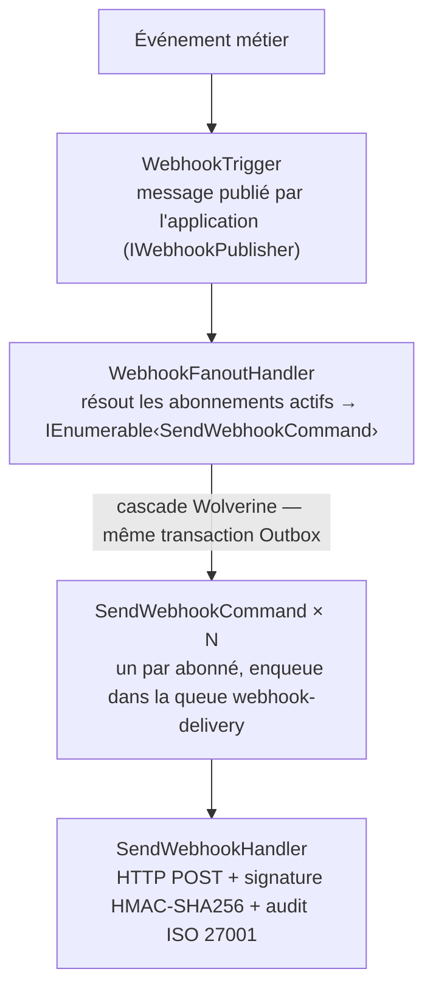

# Messagerie — Granit.Webhooks

Moteur de webhooks **sortants** pour les applications Granit.
Notifie des systèmes tiers via HTTP POST lorsqu'un événement métier survient.
Basé sur Wolverine (Outbox at-least-once), conforme ISO 27001 (audit trail immuable).

Deux packages composables :

| Package | Rôle |
| --- | --- |
| `Granit.Webhooks` | Moteur core : fan-out, envoi HTTP, signature HMAC, retry, audit |
| `Granit.Webhooks.EntityFrameworkCore` | Stores durables PostgreSQL (abonnements + tentatives de livraison) |

## Architecture



Le fan-out et l'envoi sont **entièrement découplés** : Wolverine publie les `N` commandes
dans l'Outbox avant de rendre la main à l'application. Les livraisons s'effectuent en parallèle
(jusqu'à `MaxParallelDeliveries`) avec une politique de retry exponentielle durable.

## Installation rapide

```csharp
// Module — stores en mémoire (développement/tests)
[DependsOn(typeof(GranitWebhooksModule))]
public sealed class MyAppModule : GranitModule { }

// Module — stores durables PostgreSQL (production)
[DependsOn(typeof(GranitWebhooksEntityFrameworkCoreModule))]
public sealed class MyAppModule : GranitModule { }
```

```json
// appsettings.json
{
  "Webhooks": {
    "HttpTimeoutSeconds": 10,
    "MaxParallelDeliveries": 20,
    "StorePayload": false
  }
}
```

## Déclencher un webhook

```csharp
public sealed class OrderService(IWebhookPublisher webhooks)
{
    public async Task CreateOrderAsync(CreateOrderRequest request, CancellationToken cancellationToken)
    {
        // … logique métier …

        // Déclenche le fan-out dans l'Outbox — non bloquant
        await webhooks.PublishAsync("order.created", new
        {
            orderId = order.Id,
            amount  = order.TotalAmount,
        }, ct);
    }
}
```

`IWebhookPublisher.PublishAsync<T>` sérialise le payload en `JsonElement` et publie
un `WebhookTrigger` dans la queue Wolverine. Le tenant actif (`ICurrentTenant`) est
automatiquement propagé dans l'enveloppe.

## Contrat de l'enveloppe

Chaque abonné reçoit un HTTP POST avec le corps suivant :

```json
{
  "eventId":   "01951234-abcd-7000-8000-000000000001",
  "eventType": "order.created",
  "tenantId":  "9f3b1234-0000-0000-0000-000000000001",
  "timestamp": "2025-06-01T14:32:00Z",
  "apiVersion": "2025-01-01",
  "data": {
    "orderId": "...",
    "amount":  42.50
  }
}
```

Headers ajoutés à chaque requête :

| Header | Valeur |
| --- | --- |
| `x-granit-signature` | `t=<unix>,v1=<hmac-sha256-hex>` |
| `x-granit-event-id` | UUID de l'événement |
| `x-granit-event-type` | Type d'événement (ex. `order.created`) |

### Vérification de la signature (côté abonné)

```text
toSign  = "<unix_timestamp>.<corps_json>"
secret  = clé partagée de l'abonnement (plaintext côté récepteur)
hmac    = HMAC-SHA256(secret, toSign) — en hex minuscule
attendu = "t=<unix>,v1=<hmac>"
```

La valeur `t=` est incluse dans la chaîne signée pour protéger contre les **attaques par
rejeu** (timestamp trop ancien → refuser la requête, recommandation : ± 5 minutes).

## Gestion des erreurs HTTP

Le handler catégorise chaque code de réponse en trois classes :

| Classe | Codes | Comportement |
| --- | --- | --- |
| **Succès** | 2xx | Enregistre la tentative et continue |
| **Non-retriable sans suspension** | 400, 405, 422 | Enregistre l'échec, ne relance pas |
| **Non-retriable avec suspension** | 401, 403, 404, 410 | Enregistre l'échec, **suspend l'abonnement** |
| **Retriable** | 429, 5xx, timeout | Enregistre l'échec, **relance via Outbox Wolverine** |

La suspension est **automatique et permanente** sur les codes indiquant que l'endpoint
n'est plus valide (401/403 → non autorisé, 404/410 → URL disparue). L'abonnement passe à
`Status = Suspended` et les livraisons suivantes sont ignorées jusqu'à réactivation manuelle.

## Politique de retry

Les erreurs retriables lèvent une `WebhookDeliveryException`. Wolverine la capture et
replanifie la livraison selon le calendrier exponentiel suivant :

| Tentative | Délai d'attente | Temps écoulé (total) |
| --- | --- | --- |
| 1 | 30 secondes | 30 s |
| 2 | 2 minutes | ~2 min 30 s |
| 3 | 10 minutes | ~12 min 30 s |
| 4 | 30 minutes | ~42 min 30 s |
| 5 | 2 heures | ~2 h 43 min |
| 6 | 12 heures | ~14 h 43 min |

Après épuisement des 6 tentatives, le message est déplacé dans la **Dead Letter Queue**
Wolverine pour investigation manuelle. L'audit trail conserve chaque tentative.

> **Pourquoi Wolverine plutôt que Polly ?**
> Polly travaille en mémoire : un crash entre deux tentatives perd la livraison.
> Wolverine persiste chaque replanification dans l'Outbox PostgreSQL → garantie
> at-least-once conforme ISO 27001 même après redémarrage de l'application.

## Options de configuration

### WebhooksOptions (`"Webhooks"`)

| Propriété | Type | Défaut | Contrainte | Description |
| --- | --- | --- | --- | --- |
| `HttpTimeoutSeconds` | `int` | `10` | 5 – 120 | Timeout des requêtes HTTP vers les abonnés |
| `MaxParallelDeliveries` | `int` | `20` | 1 – 100 | Parallélisme de la queue `webhook-delivery` |
| `StorePayload` | `bool` | `false` | — | Stocker le body JSON complet dans chaque tentative de livraison |

> **Attention RGPD/ISO 27001 :** activer `StorePayload` persiste les données de santé en clair dans
> la table d'audit. Vérifier que le chiffrement au repos est activé sur la base et que le DPO
> a validé ce paramétrage avant activation en production.

## Protection des secrets

L'interface `IWebhookSecretProtector` découple la protection des clés de signature
du core du module :

```csharp
public interface IWebhookSecretProtector
{
    ValueTask<string> ProtectAsync(string plainSecret, CancellationToken cancellationToken = default);
    ValueTask<string> UnprotectAsync(string protectedSecret, CancellationToken cancellationToken = default);
}
```

| Implémentation | Utilisation |
| --- | --- |
| `NoOpWebhookSecretProtector` | Développement/tests — secret stocké en clair |
| Implémentation Vault | Production — transit encryption via `Granit.Vault` |

Pour utiliser Vault en production, enregistrer une implémentation personnalisée :

```csharp
builder.Services.Replace(ServiceDescriptor.Scoped<IWebhookSecretProtector, VaultWebhookSecretProtector>());
```

> **Important ISO 27001 :** ne jamais stocker de secret de signature en clair en base de données
> de production. Utiliser `Granit.Vault` ou un KMS conforme.

## Stores d'abonnements et de livraisons

Deux abstractions permettent de remplacer les implémentations selon l'environnement :

```csharp
// Lecture des abonnements actifs par type d'événement et tenant
public interface IWebhookSubscriptionStoreReader
{
    Task<IReadOnlyList<WebhookSubscription>> GetActiveSubscriptionsAsync(
        string eventType, Guid? tenantId, CancellationToken cancellationToken = default);
    Task<WebhookSubscription?> FindByIdAsync(Guid subscriptionId, CancellationToken cancellationToken = default);
}

// Écriture et mutations sur les abonnements
public interface IWebhookSubscriptionStoreWriter
{
    Task DeactivateAsync(Guid subscriptionId, string reason, CancellationToken cancellationToken = default);
}

// Enregistre les tentatives de livraison (audit trail ISO 27001)
public interface IWebhookDeliveryWriter
{
    Task RecordSuccessAsync(SendWebhookCommand command, int httpStatusCode,
        long durationMs, string payloadHash, string? payload, CancellationToken cancellationToken = default);
    Task RecordFailureAsync(SendWebhookCommand command, int? httpStatusCode,
        long durationMs, string errorMessage, string? payload, CancellationToken cancellationToken = default);
    Task SuspendSubscriptionAsync(Guid subscriptionId, string reason, CancellationToken cancellationToken = default);
}

// Lecture des tentatives de livraison (redelivery)
public interface IWebhookDeliveryReader
{
    Task<WebhookDeliveryAttempt?> FindByDeliveryIdAsync(Guid deliveryId, CancellationToken cancellationToken = default);
}
```

| Store | `Granit.Webhooks` | `Granit.Webhooks.EntityFrameworkCore` |
| --- | --- | --- |
| `IWebhookSubscriptionReader` | `InMemoryWebhookSubscriptionStore` | `EfWebhookSubscriptionStore` |
| `IWebhookSubscriptionWriter` | `InMemoryWebhookSubscriptionStore` | `EfWebhookSubscriptionStore` |
| `IWebhookDeliveryWriter` | `NullWebhookDeliveryWriter` (no-op) | `EfWebhookDeliveryStore` |
| `IWebhookDeliveryReader` | `NullWebhookDeliveryReader` (no-op) | `EfWebhookDeliveryStore` |

### Abonnements globaux vs par tenant

Un abonnement avec `TenantId = null` est **global** : il reçoit les événements de tous les
tenants. Un abonnement avec `TenantId = <guid>` est **spécifique** : il ne reçoit que les
événements du tenant correspondant.

```sql
-- Index composite optimisé pour la résolution des abonnements actifs
CREATE INDEX ON webhook_subscriptions (event_type, tenant_id, status);
```

## Schéma de base de données

### `webhook_subscriptions`

| Colonne | Type | Description |
| --- | --- | --- |
| `id` | `uuid` | Identifiant de l'abonnement |
| `target_url` | `varchar(2048)` | URL de livraison |
| `event_type` | `varchar(200)` | Type d'événement (ex. `order.created`) |
| `signing_secret` | `varchar(1000)` | Secret HMAC protégé (chiffré en production) |
| `tenant_id` | `uuid?` | Tenant ciblé — null = abonnement global |
| `status` | `int` | `0` Active, `1` Suspended, `2` Deactivated |
| `consecutive_failure_count` | `int` | Compteur d'échecs consécutifs |
| `last_success_at` | `timestamptz?` | Dernière livraison réussie |
| `suspended_at` | `timestamptz?` | Date de suspension automatique |
| `suspended_by` | `varchar?` | Raison de la suspension |
| `created_at` | `timestamptz` | Audit ISO 27001 — création |
| `created_by` | `varchar?` | Audit ISO 27001 — auteur création |
| `last_modified_at` | `timestamptz?` | Audit ISO 27001 — dernière modification |
| `last_modified_by` | `varchar?` | Audit ISO 27001 — auteur modification |

### `webhook_delivery_attempts`

Table **INSERT-only** (pas de soft delete, pas de cascade delete) — piste d'audit immuable.

| Colonne | Type | Description |
| --- | --- | --- |
| `id` | `uuid` | Identifiant de la tentative |
| `delivery_id` | `uuid` | Identifiant de livraison (unique par tentative initiale) |
| `subscription_id` | `uuid` | Référence à l'abonnement (FK sans cascade) |
| `tenant_id` | `uuid?` | Tenant de l'événement |
| `event_type` | `varchar(200)` | Type d'événement |
| `target_url` | `varchar(2048)` | URL utilisée lors de la tentative |
| `http_status_code` | `int?` | Code HTTP reçu — null en cas de timeout |
| `payload_hash` | `char(64)` | SHA-256 hex du payload (non le payload lui-même) |
| `payload` | `text?` | Body JSON complet — uniquement si `StorePayload = true` |
| `occurred_at` | `timestamptz` | Date-heure de la tentative |
| `duration_ms` | `bigint` | Durée en millisecondes |
| `error_message` | `text?` | Message d'erreur (timeout, exception réseau) |
| `is_success` | `bool` | true si code 2xx |

> **ISO 27001 :** `payload_hash` stocke l'empreinte SHA-256 du payload JSON envoyé, pas le payload
> lui-même. Cela permet de prouver qu'un payload spécifique a été transmis sans stocker de
> données de santé dans la table d'audit.

## Multi-tenancy

`WebhookFanoutHandler` respecte la règle de **soft dependency** sur `ICurrentTenant` :

1. Si `ICurrentTenant.IsAvailable == true` → utilise `ICurrentTenant.Id` (contexte HTTP ou background)
2. Sinon → utilise `WebhookTrigger.TenantId` (passé explicitement par l'émetteur)

Cela garantit que le module fonctionne avec ou sans `GranitMultiTenancyModule` installé.

## Redelivery (rejeu manuel)

Lorsque `StorePayload = true`, les tentatives échouées peuvent être rejouées via le service
`RetryWebhookHandler` ou l'endpoint Minimal API :

```http
POST /webhooks/deliveries/{deliveryId}/retry
```

**Règles de validation :**

| Condition | Code HTTP | Raison |
| --- | --- | --- |
| Tentative introuvable | 404 | `deliveryId` inconnu dans la base |
| Tentative réussie | 400 | Pas de rejeu sur une livraison 2xx |
| Abonnement `Deactivated` | 409 | L'abonnement est définitivement désactivé |
| Abonnement `Suspended` | 202 | Autorisé — permet de tester la réactivation |

Le rejeu publie un **nouveau** `SendWebhookCommand` dans l'Outbox Wolverine avec un
nouveau `DeliveryId`. L'`EventId` de l'enveloppe reprend le `DeliveryId` original pour
permettre la traçabilité.

> **Sans `StorePayload` :** le rejeu est techniquement possible mais le champ `data` de
> l'enveloppe sera un objet vide `{}` car le payload original n'a pas été persisté.

## Endpoint de configuration

```http
GET /webhooks/config
```

Retourne la configuration publique du module :

```json
{ "storePayload": true }
```

Enregistrement dans l'application :

```csharp
app.MapGranitWebhooksConfig();      // GET /webhooks/config
app.MapGranitWebhooksRedelivery();  // POST /webhooks/deliveries/{id}/retry
```

## Conformité ISO 27001

- L'Outbox Wolverine garantit la livraison **at-least-once** sans perte en cas de crash
- `WebhookDeliveryAttempt` est INSERT-only : aucune donnée d'audit ne peut être modifiée
- Le `payload_hash` (SHA-256) permet la non-répudiation sans stocker de données de santé
- Les secrets de signature doivent être **chiffrés via Vault** en production (pas de clair en base)
- L'infrastructure de livraison doit rester **en Europe** (OVHcloud FR) — jamais sur AWS/Azure/GCP
- La durée de conservation des `WebhookDeliveryAttempt` est à paramétrer à **3 ans minimum** via
  une politique de purge applicative (pas de TTL automatique au niveau du module)

## Dépendances Granit

| Direction | Modules |
| --- | --- |
| **Dépend de** | `Granit.Core`, `Granit.Timing`, `Granit.Wolverine` |
| **Utilisé par** | `Granit.Webhooks.EntityFrameworkCore` |

> Voir le [graphe de dépendances complet](../dependencies.md).
