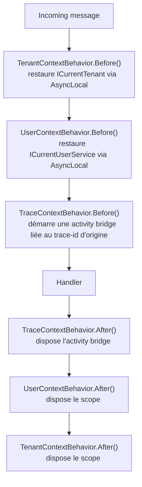
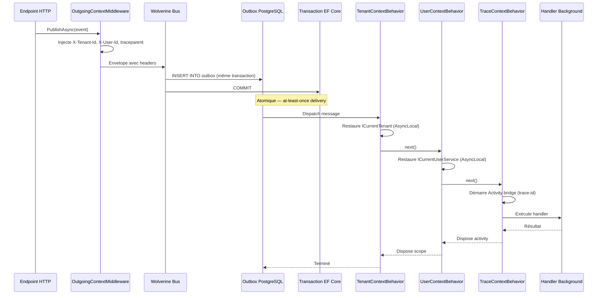

# Messagerie — Granit.Wolverine

Intégration de [WolverineFx](https://wolverinefx.net/) pour les applications Granit.
Deux packages composables :

| Package | Rôle |
| --- | --- |
| `Granit.Wolverine` | Core provider-agnostique : module, routing IDomainEvent, propagation de contexte |
| `Granit.Wolverine.Postgresql` | Outbox PostgreSQL + intégration transactionnelle EF Core |

## Installation rapide

```csharp
// Module — ajoute tout (Outbox PostgreSQL inclus)
[DependsOn(typeof(GranitWolverinePostgresqlModule))]
public sealed class MyAppModule : GranitModule { }
```

```json
// appsettings.json
{
  "Wolverine": {
    "MaxRetryAttempts": 3,
    "RetryDelays": ["00:00:05", "00:00:30", "00:05:00"]
  },
  "WolverinePostgresql": {
    "TransportConnectionString": "Host=db;Database=myapp;Username=app;Password=..."
  }
}
```

## Modules

### GranitWolverineModule

Enregistre le core Wolverine sans persistance.

```csharp
[DependsOn(typeof(GranitSecurityModule), typeof(GranitMultiTenancyModule))]
public sealed class GranitWolverineModule : GranitModule { ... }
```

Configure :

- **Auto-discovery des handler modules** — `IncludeHandlerModules = true` scanne les assemblies
  décorées avec `[assembly: WolverineHandlerModule]`. Élimine les appels centralisés
  `IncludeAssembly()` dans le module hôte.
- **Auto-discovery des validateurs FluentValidation** — `AddGranitValidatorsFromWolverineHandlerModules()`
  scanne les mêmes assemblies et enregistre tous les `IValidator<T>` en scoped.
  Les modules sans handlers Wolverine (ex. CoreModule) doivent garder l'enregistrement manuel
  via `AddGranitValidatorsFromAssemblyContaining<T>()`.
- Routing local des `IDomainEvent` → queue `"domain-events"` (jamais routés vers des transports externes)
- Politique de retry globale lue depuis `WolverineMessagingOptions`
- Propagation de contexte : `OutgoingContextMiddleware`, `TenantContextBehavior`, `UserContextBehavior`, `TraceContextBehavior`
- `WolverineCurrentUserService` comme implémentation de `ICurrentUserService`

### GranitWolverinePostgresqlModule

```csharp
[DependsOn(typeof(GranitWolverineModule), typeof(GranitPersistenceModule))]
public sealed class GranitWolverinePostgresqlModule : GranitModule { ... }
```

Ajoute :

- Outbox PostgreSQL durable (at-least-once delivery, conforme ISO 27001)
- Intégration transactionnelle EF Core (`UseEntityFrameworkCoreTransactions`)
- Application automatique des transactions sur tous les handlers (`AutoApplyTransactions`)

> **Prérequis :** les `DbContext` participant aux transactions Wolverine doivent être enregistrés
> via `services.AddDbContextWithWolverineIntegration<TContext>()` et non `AddDbContext<TContext>()`.

## Options de configuration

### WolverineMessagingOptions (`"Wolverine"`)

| Propriété | Type | Défaut | Description |
| --- | --- | --- | --- |
| `MaxRetryAttempts` | `int` | `3` | Nombre maximum de tentatives de retry |
| `RetryDelays` | `TimeSpan[]` | `[5 s, 30 s, 5 min]` | Délais entre chaque tentative |

### WolverinePostgresqlOptions (`"WolverinePostgresql"`)

| Propriété | Type | Défaut | Description |
| --- | --- | --- | --- |
| `TransportConnectionString` | `string` | — | Chaîne de connexion PostgreSQL (obligatoire) |
| `TransactionMode` | `TransactionMiddlewareMode` | `Eager` | Mode de transaction EF Core |

`TransactionMiddlewareMode.Eager` est le mode ISO 27001-conforme : la transaction est ouverte
explicitement avant tout write. Ne pas utiliser `Lightweight` en production.

## Propagation du contexte

Lors de l'émission d'un message, trois headers sont injectés automatiquement dans l'enveloppe :

| Header | Source | Comportement |
| --- | --- | --- |
| `X-Tenant-Id` | `ICurrentTenant.Id` | Omis si aucun tenant actif |
| `X-User-Id` | `ICurrentUserService.UserId` | Omis si non authentifié |
| `traceparent` | `Activity.Current?.Id` (W3C) | Omis si aucune trace OTel active |

À la réception, les behaviors restaurent le contexte avant l'exécution du handler :





La propagation du `traceparent` permet de corréler visuellement une requête HTTP et tous
ses traitements Wolverine asynchrones dans Grafana/Tempo sous un même `trace-id`.

→ Voir [diagnostics/wolverine-tracing.md](../diagnostics/wolverine-tracing.md) pour le détail.

### WolverineCurrentUserService

Remplace `ICurrentUserService` dans le conteneur DI. Résolution du `UserId` par ordre de priorité :

1. **Override AsyncLocal** — activé par `UserContextBehavior` dans les handlers background
2. **Fallback `IHttpContextAccessor`** — claims JWT pour les requêtes HTTP normales

Garantit que `AuditedEntityInterceptor` enregistre toujours un `ModifiedBy` non null dans
la piste d'audit ISO 27001, même depuis un handler background.

## Enregistrement d'un module applicatif

Chaque module applicatif contenant des handlers Wolverine doit se déclarer avec l'attribut
`[assembly: WolverineHandlerModule]`. `AddGranitWolverine()` active automatiquement la
découverte de ces assemblies (`IncludeHandlerModules = true`) et enregistre leurs validateurs
FluentValidation.

```csharp
// AssemblyInfo.cs — dans le module applicatif
using Wolverine.Attributes;

[assembly: WolverineHandlerModule]
```

Cet attribut remplace les appels manuels `opts.Discovery.IncludeAssembly(typeof(MyModule).Assembly)`
qui étaient auparavant centralisés dans le module hôte.

### Validateurs FluentValidation

Les validateurs (`GranitValidator<T>`) des assemblies `[WolverineHandlerModule]` sont
enregistrés automatiquement en DI (scoped, y compris les types `internal`).

Les modules **sans** handlers Wolverine (ex. un module Core qui ne fait que définir des
entités et des validateurs) doivent garder l'enregistrement manuel :

```csharp
services.AddGranitValidatorsFromAssemblyContaining<MyValidator>();
```

## Écrire un handler

```csharp
// IDomainEvent → routé automatiquement en local
public sealed record OrderCreatedEvent(Guid OrderId) : IDomainEvent;

// Handler — le contexte tenant/utilisateur est restauré automatiquement
public sealed class OrderCreatedHandler
{
    public async Task Handle(OrderCreatedEvent evt, ICurrentTenant tenant, IMessageBus bus)
    {
        // tenant.Id est disponible ici, même en background
        await bus.PublishAsync(new SendConfirmationEmail(evt.OrderId));
    }
}
```

## Conformité ISO 27001

- L'Outbox PostgreSQL garantit la livraison at-least-once sans perte de messages en cas de crash
- `TransactionMiddlewareMode.Eager` assure l'atomicité entre le write EF Core et la mise en queue
- La propagation `X-User-Id` garantit la traçabilité des opérations asynchrones dans l'audit trail
- La chaîne de connexion doit pointer sur une base de données **en Europe**,
  jamais sur un service US (Cloud Act)

## Optionalité — quels packages nécessitent Wolverine ?

Wolverine est **optionnel** dans Granit. La grande majorité des packages (85+)
fonctionnent sans aucune dépendance vers Wolverine. Seuls 8 packages en
dépendent directement :

| Package | Dépendance Wolverine | Raison |
| --- | --- | --- |
| `Granit.Wolverine` | **requise** | Core Wolverine provider-agnostique |
| `Granit.Wolverine.Postgresql` | **requise** | Outbox PostgreSQL + transactions EF Core |
| `Granit.BackgroundJobs` | **requise** | Scheduling via Wolverine message bus |
| `Granit.Notifications` | **requise** | Fan-out multi-canal via message bus |
| `Granit.Webhooks` | **requise** | Delivery fiable via Wolverine pipeline |
| `Granit.Privacy` | **requise** | Orchestration RGPD right-to-erasure via handlers |
| `Granit.DataExchange.Wolverine` | **requise** | Import pipeline long-running via handlers |
| `Granit.Persistence.Migrations.Wolverine` | **requise** | Auto-migrate Wolverine storage tables |

Tous les autres packages (Core, Security, Authorization, Persistence, Caching,
Localization, Settings, Features, Identity, Templating, DocumentGeneration,
BlobStorage, Timeline, Workflow, Querying, etc.) fonctionnent **sans Wolverine**.

> **Règle d'architecture** : si votre application n'a pas besoin de messaging
> asynchrone (background jobs, notifications, webhooks), vous pouvez utiliser
> Granit sans aucune référence à Wolverine.

## Dépendances Granit

| Direction | Modules |
| --- | --- |
| **Dépend de** | `Granit.Core`, `Granit.Security`, `Granit.Validation` |
| **Utilisé par** | `Granit.BackgroundJobs`, `Granit.Webhooks`, `Granit.Wolverine.Postgresql`, `Granit.Persistence.Migrations` |
| **Package PostgreSQL** | `Granit.Wolverine.Postgresql` → ajoute `Granit.Persistence` |

> Voir le [graphe de dépendances complet](../dependencies.md).
