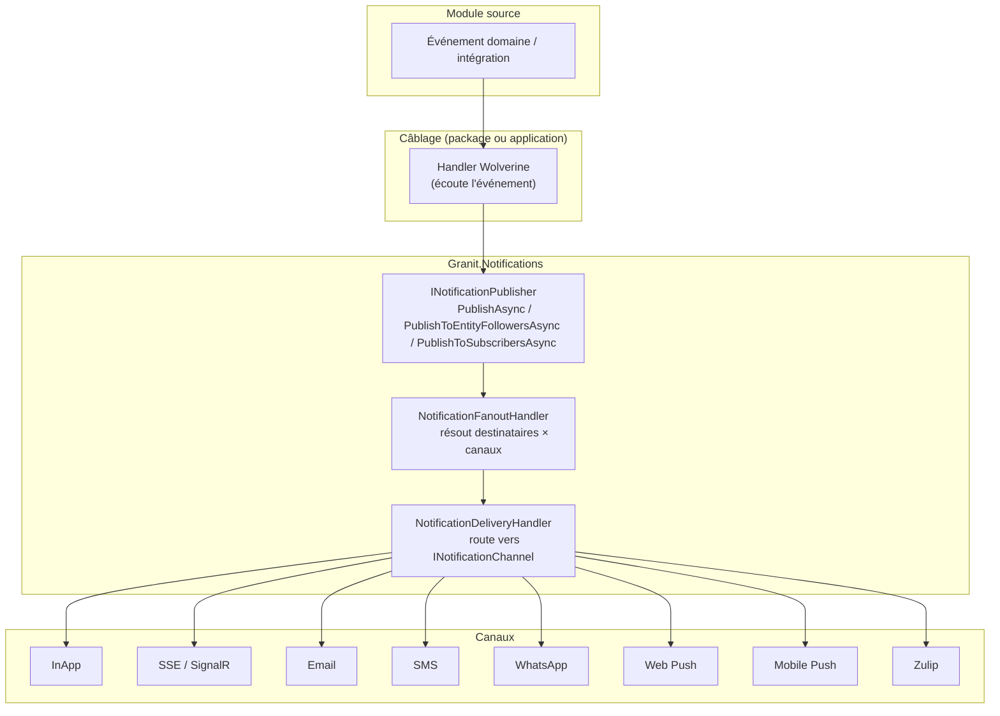
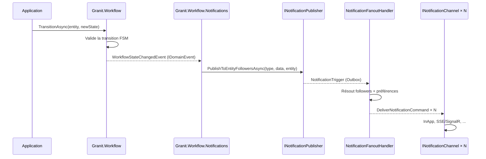
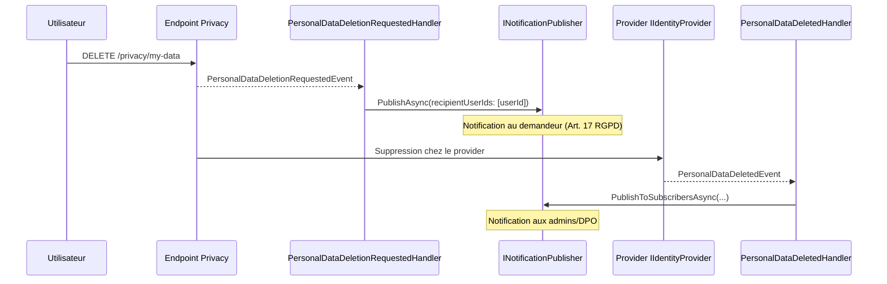
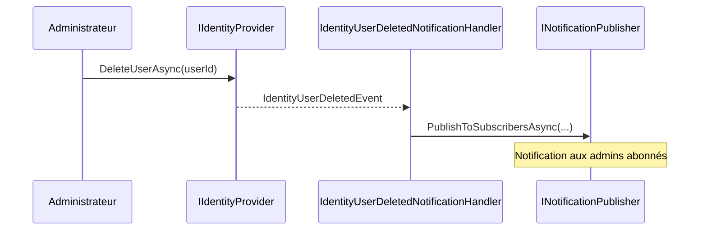
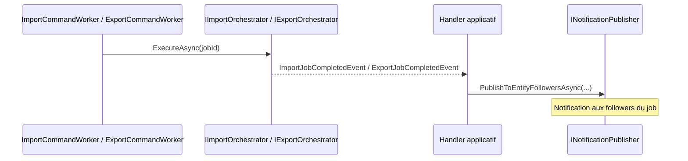

# Câblage Workflow → Notifications

Documentation de l'intégration entre les événements du cycle de vie des modules Granit
et le système de notification. Décrit le flux complet depuis l'événement domaine
jusqu'à la livraison multi-canal.

## Vue d'ensemble

Granit découple les modules métier du système de notification via des **événements domaine**
et des **événements d'intégration**. Chaque module émet ses événements sans connaître les
canaux de livraison — le câblage se fait dans des packages dédiés (`*.Notifications`) ou
au niveau applicatif.



## Câblages framework

### Granit.Workflow.Notifications

Le package `Granit.Workflow.Notifications` connecte les transitions de workflow au système
de notification. Lorsqu'un workflow change d'état, les **followers de l'entité** sont notifiés
automatiquement.



**Événement** : `WorkflowStateChangedEvent` — événement domaine non-générique (les états
sont sérialisés en `string` pour permettre un handler Wolverine unique).

**Type de notification** : `WorkflowStateChangedNotificationType` — singleton framework
(`workflow.state_changed`), canaux par défaut : InApp + SignalR.

**Données** : `WorkflowStateChangedNotificationData` — contient `EntityType`, `EntityId`,
`PreviousState`, `NewState`, `TransitionedBy`.

**Destinataires** : via `PublishToEntityFollowersAsync` — seuls les utilisateurs qui suivent
l'entité concernée reçoivent la notification (style Odoo chatter).

Installation :

```csharp
[DependsOn(typeof(GranitWorkflowNotificationsModule))]
public sealed class MyAppModule : GranitModule { }
```

> **ISO 27001** : le payload ne contient pas de PII — uniquement des identifiants techniques
> (`EntityId`, `TransitionedBy` sous forme d'ID utilisateur).

## Câblages applicatifs

Les événements suivants sont câblés **au niveau applicatif** (backend consommateur) car les
définitions de notification et les données métier sont spécifiques à l'application.

### RGPD — Suppression de données personnelles



| Événement | Destinataires | Canaux | Opt-out |
| --- | --- | --- | --- |
| `PersonalDataDeletionRequestedEvent` | Demandeur (Art. 17) | InApp, Email | Non |
| `PersonalDataDeletedEvent` | Admins/DPO abonnés | InApp, Email | Non |

> **RGPD** : les données de notification ne contiennent aucune PII — uniquement des
> identifiants (`RequestId`, `ProviderName`, `AffectedRecords`).

### Sécurité — Suppression d'utilisateur



| Événement | Destinataires | Canaux | Opt-out |
| --- | --- | --- | --- |
| `IdentityUserDeletedEvent` | Admins abonnés | InApp, Email | Non |

> **ISO 27001** : notification obligatoire pour la piste d'audit. Le payload ne contient que
> l'identifiant technique (`UserId`), jamais de données nominatives.

### Import/Export — Fin de traitement



| Événement | Destinataires | Canaux | Opt-out |
| --- | --- | --- | --- |
| `ImportJobCompletedEvent` | Entity followers | InApp, SSE/SignalR | Oui |
| `ExportJobCompletedEvent` | Entity followers | InApp, SSE/SignalR | Oui |

## Tableau récapitulatif

| Événement | Package / Module | Destinataires | Canaux | Opt-out |
| --- | --- | --- | --- | --- |
| `WorkflowStateChangedEvent` | `Granit.Workflow.Notifications` | Entity followers | InApp, SSE/SignalR | Oui |
| `ImportJobCompletedEvent` | Applicatif (DataExchange) | Entity followers | InApp, SSE/SignalR | Oui |
| `ExportJobCompletedEvent` | Applicatif (DataExchange) | Entity followers | InApp, SSE/SignalR | Oui |
| `PersonalDataDeletionRequestedEvent` | Applicatif (Security) | Demandeur | InApp, Email | Non |
| `PersonalDataDeletedEvent` | Applicatif (Security) | Abonnés (admins/DPO) | InApp, Email | Non |
| `IdentityUserDeletedEvent` | Applicatif (Security) | Abonnés (admins) | InApp, Email | Non |

## Créer un câblage applicatif

Pour câbler un nouvel événement aux notifications :

1. **Créer un `INotificationTypeDefinition`** — définit le type, les canaux par défaut,
   et si l'opt-out est permis.

2. **Créer un handler Wolverine** — écoute l'événement et appelle `INotificationPublisher`.

3. **Enregistrer la définition** — dans `AddGranitNotifications()` ou via l'assembly scanning
   Wolverine.

```csharp
// 1. Définition du type
public sealed class MyEventNotificationType : INotificationTypeDefinition
{
    public string Type => "my-module.my-event";
    public IReadOnlySet<string> DefaultChannels { get; } =
        new HashSet<string> { ChannelNames.InApp, ChannelNames.Email };
    public bool AllowUserOptOut => true;
}

// 2. Handler Wolverine
public static class MyEventNotificationHandler
{
    public static async Task HandleAsync(
        MyDomainEvent @event,
        INotificationPublisher publisher,
        CancellationToken ct)
    {
        await publisher.PublishToEntityFollowersAsync(
            new MyEventNotificationType(),
            new MyEventNotificationData(@event.EntityId, @event.Details),
            @event.EntityType,
            @event.EntityId,
            ct);
    }
}
```

> **Compliance** : ne jamais inclure de PII dans `INotificationData`. Utiliser uniquement
> des identifiants techniques. Le frontend résout les noms affichés via les endpoints.
