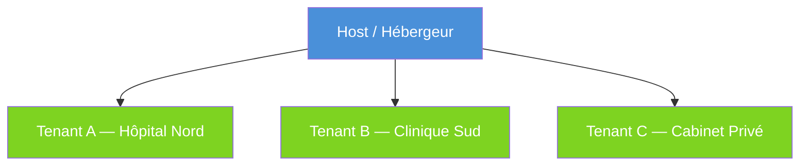
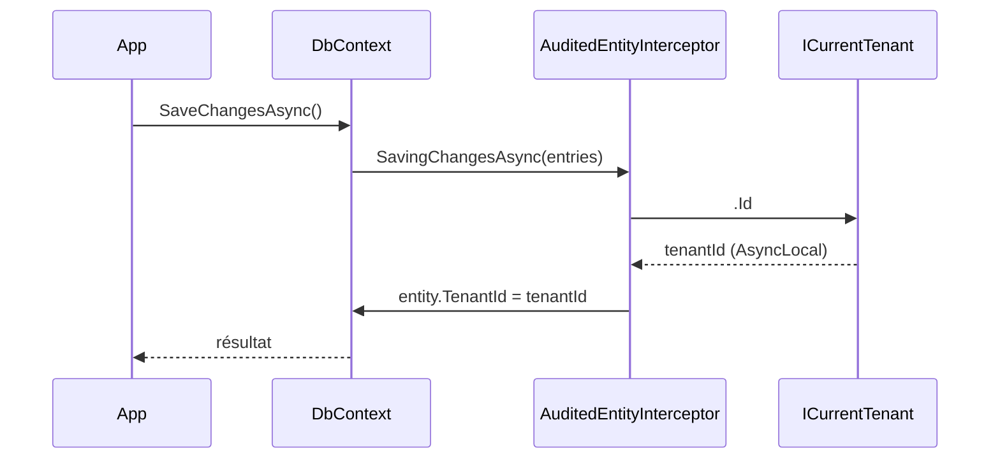
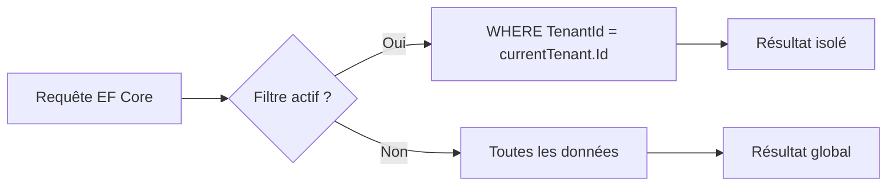
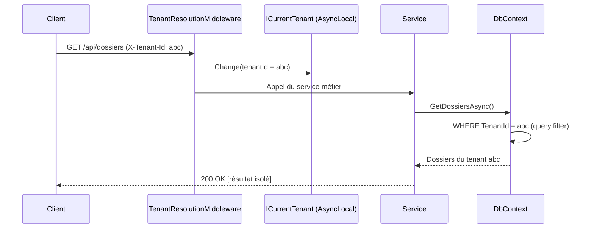

# MultiTenancy

`DigitalDynamics.Foundation.MultiTenancy` fournit la gestion du tenant courant avec
résolution depuis le header HTTP ou le claim JWT, contexte `AsyncLocal` et middleware
ASP.NET Core pour les applications multi-tenant.

## Concepts

### Définition

Une architecture multi-tenant est un modèle où une seule instance logicielle sert
plusieurs clients (**tenants**). Chaque tenant voit uniquement ses propres données,
même si elles cohabitent dans la même base de données.

### Host vs Tenant



| Contexte | `ICurrentTenant.Id` | Données accessibles |
| --- | --- | --- |
| Tenant A actif | `Guid` du tenant A | Données du tenant A + données globales (`TenantId = null`) |
| Host (contexte système) | `null` | Toutes les données (background jobs, admin) |

> **Donnée globale** : `TenantId = null` signifie une ressource partagée entre tous
> les tenants (configuration système, données de référence). Le filtre multi-tenant
> n'est pas appliqué sur ces enregistrements — ils sont toujours visibles.

## Installation

```bash
dotnet add package DigitalDynamics.Foundation.MultiTenancy
```

## Configuration rapide

```csharp
[DependsOn(typeof(FoundationMultiTenancyModule))]
public sealed class AppModule : FoundationModule { }
```

```csharp
// Program.cs — ordre obligatoire dans le pipeline
app.UseAuthentication();
app.UseFoundationMultiTenancy();   // ← après Authentication, avant Authorization
app.UseAuthorization();
```

## appsettings.json

```json
{
  "MultiTenancy": {
    "IsEnabled": true,
    "TenantIdHeaderName": "X-Tenant-Id",
    "TenantIdClaimType": "tenant_id"
  }
}
```

## Résolveurs de tenant

La résolution suit une **chaîne ordonnée** : le premier résolveur non-null gagne.

| Résolveur | Order | Source | Configurable |
| --- | --- | --- | --- |
| `HeaderTenantResolver` | 100 | Header HTTP `X-Tenant-Id` | `TenantIdHeaderName` |
| `JwtClaimTenantResolver` | 200 | Claim `tenant_id` dans `ClaimsPrincipal` | `TenantIdClaimType` |

`JwtClaimTenantResolver` lit `HttpContext.User.FindFirstValue(claimType)` — standard
ASP.NET Core. Compatible avec **tout fournisseur d'identité** qui popule le
`ClaimsPrincipal` : Keycloak, Auth0, Azure AD B2C, IdentityServer, etc. Il n'y a
aucune dépendance sur `Foundation.Security`.

> Pour que `JwtClaimTenantResolver` fonctionne, le middleware d'authentification doit
> être enregistré **avant** `UseFoundationMultiTenancy()` dans le pipeline.

Pour ajouter un résolveur personnalisé :

```csharp
// Implémente ITenantResolver avec un Order < 100 pour le rendre prioritaire
public sealed class SubdomainTenantResolver : ITenantResolver
{
    public int Order => 50;

    public Task<TenantInfo?> ResolveAsync(HttpContext context, CancellationToken ct)
    {
        // Extraire le tenant depuis le sous-domaine
    }
}

// Enregistrement dans le DI
services.AddSingleton<ITenantResolver, SubdomainTenantResolver>();
```

## ICurrentTenant

Accès au tenant courant depuis n'importe quel service :

```csharp
public sealed class PatientService(ICurrentTenant currentTenant)
{
    public async Task<IReadOnlyList<Patient>> GetAllAsync(CancellationToken ct)
    {
        if (!currentTenant.IsAvailable)
            throw new InvalidOperationException("Contexte tenant requis.");

        return await _repo.GetByTenantAsync(currentTenant.Id!.Value, ct);
    }
}
```

### Surcharge temporaire (background jobs, tests)

```csharp
Guid targetTenantId = Guid.Parse("...");

using (currentTenant.Change(targetTenantId, "Acme"))
{
    // Dans ce scope, currentTenant.Id == targetTenantId
    await ProcessTenantDataAsync(ct);
}
// Hors du scope, le tenant précédent est restauré automatiquement
```

La surcharge est basée sur `AsyncLocal` : elle est isolée par flux asynchrone et
n'affecte pas les autres requêtes concurrentes.

### Scopes imbriqués

```csharp
using (currentTenant.Change(tenantA))
{
    // tenantA actif
    using (currentTenant.Change(tenantB))
    {
        // tenantB actif
    }
    // tenantA restauré
}
```

### Opérations cross-tenant (mode host)

Pour accéder aux données de tous les tenants (batch nocturne, admin, migration),
basculer en contexte host en passant `null` :

```csharp
// Background job : traiter tous les tenants
using (currentTenant.Change(null))
{
    // currentTenant.Id == null → contexte host
    // Les query filters EF Core retournent toutes les données
    List<DossierPatient> tous = await db.Dossiers
        .IgnoreQueryFilters()   // désactive aussi ISoftDeletable si besoin
        .ToListAsync(ct);
}
```

Ou, pour itérer sur chaque tenant séparément :

```csharp
foreach (Guid tenantId in await tenantRepository.GetAllIdsAsync(ct))
{
    using (currentTenant.Change(tenantId))
    {
        await ProcessTenantAsync(tenantId, ct);
    }
}
```

> **Sécurité** : les opérations cross-tenant doivent être réservées aux services
> d'infrastructure (jobs, admin). Les endpoints API doivent toujours avoir un tenant
> actif — vérifier `currentTenant.IsAvailable` en entrée des contrôleurs sensibles.

## Isolation des entités — IMultiTenant

Pour isoler les données par tenant au niveau de la base de données, les entités doivent
implémenter `IMultiTenant` (défini dans `Foundation.Core.Domain`).

```csharp
using DigitalDynamics.Foundation.Core.Domain;

public sealed class DossierPatient : FullAuditedEntity, IMultiTenant
{
    public Guid? TenantId { get; set; }
    public string NumeroAdmission { get; set; } = string.Empty;
}
```

### Injection automatique du TenantId

`AuditedEntityInterceptor` (package `Foundation.Persistence`) injecte le `TenantId`
automatiquement à la création depuis `ICurrentTenant` :



### Query filter automatique

Activer l'isolation par tenant dans `OnModelCreating` en passant l'`ICurrentTenant`
injecté dans le DbContext (voir [persistence.md](persistence.md#query-filter-multi-tenant)).



> `TenantId = null` représente une donnée globale (partagée entre tous les tenants).
> Ces données sont **exclues** du filtre multi-tenant — elles ne remontent que si le
> filtre est ignoré ou si la requête est explicitement ciblée.

### Flux complet d'une requête multi-tenant



## Options

### `MultiTenancyOptions` (section `MultiTenancy`)

| Propriété | Type | Défaut | Description |
| --- | --- | --- | --- |
| `IsEnabled` | `bool` | `true` | Active/désactive la résolution du tenant |
| `TenantIdHeaderName` | `string` | `"X-Tenant-Id"` | Nom du header HTTP |
| `TenantIdClaimType` | `string` | `"tenant_id"` | Type du claim JWT |

## Architecture

```text
src/DigitalDynamics.Foundation.MultiTenancy/
├── ICurrentTenant.cs                       (interface publique)
├── TenantInfo.cs                           (record : Id, Name, Identifier)
├── CurrentTenant.cs                        (AsyncLocal, Singleton)
├── MultiTenancyOptions.cs
├── Resolvers/
│   ├── ITenantResolver.cs                  (Task<TenantInfo?> ResolveAsync)
│   ├── HeaderTenantResolver.cs             (order=100)
│   └── JwtClaimTenantResolver.cs           (order=200)
├── Pipeline/
│   └── TenantResolverPipeline.cs           (chaîne ordonnée, first non-null wins)
├── Middleware/
│   └── TenantResolutionMiddleware.cs       (résout + stocke dans ICurrentTenant)
├── FoundationMultiTenancyModule.cs
└── Extensions/
    ├── MultiTenancyServiceCollectionExtensions.cs
    └── MultiTenancyApplicationBuilderExtensions.cs  (UseFoundationMultiTenancy)
```

## Services enregistrés

| Service | Implémentation | Lifetime |
| --- | --- | --- |
| `ICurrentTenant` | `CurrentTenant` | Singleton |
| `ITenantResolver` | `HeaderTenantResolver` | Singleton |
| `ITenantResolver` | `JwtClaimTenantResolver` | Singleton |
| `TenantResolverPipeline` | `TenantResolverPipeline` | Singleton |
| `TenantResolutionMiddleware` | `TenantResolutionMiddleware` | Scoped |

## Sécurité RGPD

- `TenantInfo.Id` (GUID) est une **pseudonymisation** — ne jamais stocker de nom
  ou email dans `ProviderKey` (utilisé par Foundation.Settings)
- Le middleware est positionné après `UseAuthentication()` : le claim JWT est
  disponible lors de la résolution par `JwtClaimTenantResolver`
- `IsEnabled = false` désactive le middleware sans décharger le module (utile
  pour les environnements de test sans multi-tenancy)
