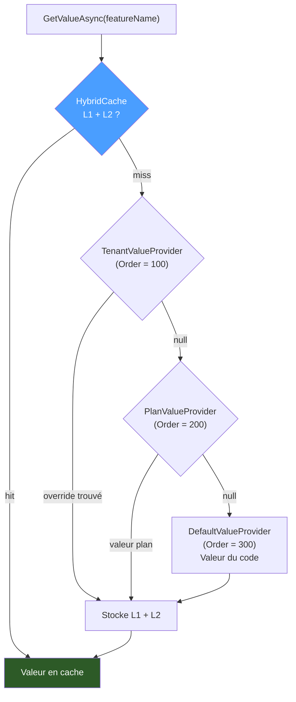

# Feature Management — Granit.Features

`Granit.Features` fournit un framework de gestion des fonctionnalités orienté SaaS.
Il permet d'activer ou de désactiver des fonctionnalités selon le plan commercial
souscrit par un tenant, avec support des overrides individuels pour les accords
commerciaux spéciaux.

| Package | Rôle |
| --- | --- |
| `Granit.Features` | Core : définitions, résolution multi-niveaux, cache hybride, intégration ASP.NET Core et Wolverine |
| `Granit.Features.EntityFrameworkCore` | Persistance EF Core des overrides tenant |

## Concepts

### Types de valeur

| Type | Valeur | Exemple |
| --- | --- | --- |
| `Toggle` | `"true"` / `"false"` | Accès à la vidéo-consultation |
| `Numeric` | Entier long en string | Quota de patients (ex. `"500"`) |
| `Selection` | Valeur parmi une liste | Plan : `"starter"`, `"premium"`, `"enterprise"` |

### Cascade de résolution

```text
Tenant override (100)
    │ null → cascade suivante
Plan value   (200)
    │ null → cascade suivante
Default      (300)   ← valeur déclarée dans le code
```



La résolution s'arrête dès qu'un niveau retourne une valeur non nulle.
Le résultat est mis en cache par `IHybridCache` (L1 in-process + L2 Redis)
et invalidé via `FeatureValueChangedEvent` (Wolverine).

## Installation

```bash
# Core (déclarations + résolution + ASP.NET Core + Wolverine)
dotnet add package Granit.Features

# Persistance des overrides tenant (optionnel)
dotnet add package Granit.Features.EntityFrameworkCore
```

## Configuration du module

### Application sans multi-tenancy (single-tenant)

```csharp
[DependsOn(typeof(GranitFeaturesModule))]
public sealed class AppModule : GranitModule { }
```

`GranitMultiTenancyModule` n'est **pas requis**. Si `ICurrentTenant` est absent du
conteneur DI, le niveau Tenant de la cascade est silencieusement ignoré.

### Application avec multi-tenancy

```csharp
[DependsOn(typeof(GranitFeaturesModule))]
[DependsOn(typeof(GranitMultiTenancyModule))]   // optionnel — active le niveau Tenant
public sealed class AppModule : GranitModule { }
```

### Avec persistance EF Core

```csharp
[DependsOn(typeof(GranitFeaturesModule))]
[DependsOn(typeof(GranitFeaturesEntityFrameworkCoreModule))]
[DependsOn(typeof(GranitMultiTenancyModule))]   // si multi-tenant
public sealed class AppModule : GranitModule { }
```

## Déclaration des features

Implémenter `IFeatureDefinitionProvider` et l'enregistrer au démarrage.

```csharp
public sealed class AcmeFeatureDefinitionProvider : IFeatureDefinitionProvider
{
    public void Define(IFeatureDefinitionContext context)
    {
        IFeatureDefinitionContext.FeatureGroupDefinition saas =
            context.AddGroup("App", "Fonctionnalités SaaS");

        saas.AddFeature("App.VideoConsultation",
            defaultValue: "false",
            valueType: FeatureValueType.Toggle,
            displayName: "Vidéo-consultation");

        saas.AddFeature("App.MaxPatients",
            defaultValue: "50",
            valueType: FeatureValueType.Numeric,
            displayName: "Quota patients",
            numericConstraint: new NumericConstraint(min: 0, max: 10_000));
    }
}
```

```csharp
// Program.cs
services.AddFeatureDefinitions<AcmeFeatureDefinitionProvider>();
```

## Résolution du plan commercial

Implémenter `IPlanIdProvider` et `IPlanFeatureStore` pour activer le niveau Plan.
Sans ces implémentations, la cascade passe directement aux valeurs par défaut.

```csharp
// Résolution du plan à partir du tenant courant
public sealed class AcmePlanIdProvider(ICurrentTenant currentTenant, IAppDb db)
    : IPlanIdProvider
{
    public async Task<string?> GetCurrentPlanIdAsync(CancellationToken cancellationToken)
    {
        if (!currentTenant.IsAvailable) return null;
        AppTenant? tenant = await db.Tenants.FindAsync(currentTenant.Id, ct);
        return tenant?.PlanId;
    }
}

// Valeurs des features par plan (depuis la base ou la config)
public sealed class AcmePlanFeatureStore(IAppDb db) : IPlanFeatureStore
{
    public async Task<string?> GetOrNullAsync(
        string planId, string featureName, CancellationToken cancellationToken) =>
        await db.PlanFeatures
            .Where(f => f.PlanId == planId && f.FeatureName == featureName)
            .Select(f => f.Value)
            .FirstOrDefaultAsync(ct);
}
```

```csharp
services.AddSingleton<IPlanIdProvider, AcmePlanIdProvider>();
services.AddSingleton<IPlanFeatureStore, AcmePlanFeatureStore>();
```

## Utilisation

### Vérification dans un service

```csharp
public sealed class VideoConsultationService(IFeatureChecker featureChecker)
{
    public async Task<bool> IsAvailableAsync(CancellationToken cancellationToken) =>
        await featureChecker.IsEnabledAsync("App.VideoConsultation", ct);

    public async Task<long> GetPatientQuotaAsync(CancellationToken cancellationToken) =>
        await featureChecker.GetNumericAsync("App.MaxPatients", ct);
}
```

### Attribut `[RequiresFeature]` — ASP.NET Core

Retourne HTTP 403 avec `ProblemDetails` (`type: upgrade_required`) si la feature
est désactivée pour le tenant courant.

```csharp
[RequiresFeature("App.VideoConsultation")]
app.MapPost("/video-sessions", CreateVideoSession);
```

### Middleware Wolverine

Rejette les messages Wolverine avant exécution du handler si la feature est inactive.

```csharp
public sealed class CreateVideoSessionHandler
{
    [RequiresFeature("App.VideoConsultation")]
    public async Task Handle(CreateVideoSessionCommand cmd, CancellationToken cancellationToken) { ... }
}
```

### Garde de limite numérique

```csharp
public sealed class PatientService(IFeatureLimitGuard limitGuard, IPatientRepository repo)
{
    public async Task CreateAsync(CreatePatientCommand cmd, CancellationToken cancellationToken)
    {
        long current = await repo.CountAsync(ct);
        await limitGuard.GuardAsync("App.MaxPatients", current, ct);
        // lève FeatureLimitExceededException si current >= limite
        await repo.AddAsync(cmd.ToEntity(), ct);
    }
}
```

### Invalidation du cache

Publier `FeatureValueChangedEvent` via Wolverine après toute modification d'un override.

```csharp
public sealed class OverrideTenantFeatureHandler(IFeatureStoreWriter store, IMessageBus bus)
{
    public async Task Handle(OverrideTenantFeatureCommand cmd, CancellationToken cancellationToken)
    {
        await store.SetAsync(cmd.FeatureName, cmd.TenantId, cmd.Value, ct);
        await bus.PublishAsync(new FeatureValueChangedEvent(cmd.TenantId, cmd.FeatureName), ct);
    }
}
```

## Persistance EF Core

`GranitFeaturesEntityFrameworkCoreModule` remplace `InMemoryFeatureStore` par
`EfCoreFeatureStore` (implémente `IFeatureStoreReader` et `IFeatureStoreWriter`). Les overrides sont stockés dans la table `saas_feature_overrides`
avec une piste d'audit HDS complète (créé par, modifié par, horodatages).

```csharp
// Ajouter la migration dans le DbContext de l'application
// ou utiliser le DbContext fourni par le module :
dotnet ef migrations add AddFeatureOverrides --context FeaturesDbContext
```

## Architecture

```text
src/
  Granit.Features/
  ├── Definitions/       FeatureDefinitionProvider, FeatureDefinitionStore
  ├── ValueTypes/        Toggle | Numeric | Selection, NumericConstraint
  ├── ValueProviders/    Default (300) → Plan (200) → Tenant (100)
  ├── Plans/             IPlanFeatureStore, IPlanIdProvider  (app implements)
  ├── Store/             IFeatureStoreReader, IFeatureStoreWriter, InMemoryFeatureStore (dev/test)
  ├── Checker/           IFeatureChecker — cache all-in-one par tenant
  ├── Cache/             FeatureCacheKey, FeatureCacheInvalidationHandler
  ├── Limits/            IFeatureLimitGuard, FeatureLimitGuard
  ├── Events/            FeatureValueChangedEvent (Wolverine invalidation)
  ├── AspNetCore/        [RequiresFeature], RequiresFeatureEndpointFilter
  └── Wolverine/         RequiresFeatureMiddleware

  Granit.Features.EntityFrameworkCore/
  ├── EfCoreFeatureStore
  └── Internal/          TenantFeatureOverride (entity + config EF Core)
```

## Services enregistrés (`AddGranitFeatures`)

| Service | Implémentation | Lifetime |
| --- | --- | --- |
| `IFeatureDefinitionStore` | `FeatureDefinitionStore` | Singleton |
| `IFeatureStoreReader` | `InMemoryFeatureStore` (remplaçable via `TryAdd`) | Singleton |
| `IFeatureStoreWriter` | `InMemoryFeatureStore` (remplaçable via `TryAdd`) | Singleton |
| `IFeatureValueProvider` (×3) | Default, Plan, Tenant | Scoped |
| `IFeatureChecker` | `FeatureChecker` | Scoped |
| `IFeatureLimitGuard` | `FeatureLimitGuard` | Scoped |

`EfCoreFeatureStore` (module EF Core) remplace `InMemoryFeatureStore` par
`services.AddSingleton<IFeatureStoreReader, EfCoreFeatureStore>()` et
`services.AddSingleton<IFeatureStoreWriter, EfCoreFeatureStore>()`.

## Multi-tenancy optionnelle

`GranitFeaturesModule` ne déclare **aucune dépendance** sur `GranitMultiTenancyModule`.
`ICurrentTenant` est résolu via `IServiceProvider.GetService<ICurrentTenant>()` :

- **Absent** (application single-tenant) → le niveau Tenant retourne `null`, la cascade
  continue vers Plan → Default. Aucune erreur DI.
- **Présent** (application multi-tenant) → comportement normal, override tenant résolu
  en priorité.

## Exceptions

| Exception | Déclencheur |
| --- | --- |
| `FeatureNotEnabledException` | `IFeatureChecker.RequireEnabledAsync()` — feature inactive |
| `FeatureLimitExceededException` | `IFeatureLimitGuard.GuardAsync()` — quota dépassé |
| `FeatureNotFoundException` | `IFeatureDefinitionStore.GetRequired()` — feature inconnue |
| `FeatureValueValidationException` | Valeur incompatible avec les contraintes du `ValueType` |

## Dépendances Granit

| Direction | Modules |
| --------- | ------- |
| **Dépend de** | `Granit.Core`, `Granit.Caching`, `Granit.Localization` |
| **Utilisé par** | `Granit.Features.EntityFrameworkCore` |

> `Features` dépend de `Granit.Caching` (abstraction) et non de
> `Granit.Caching.Hybrid` (implémentation L1+L2). `HybridCache` est
> enregistré en mémoire seule par `GranitCachingModule` ;
> `GranitCachingHybridModule` reconfigure L2 Redis si nécessaire.
> L'application reste libre de choisir son fournisseur de cache.
>
> Voir le [graphe de dépendances complet](../dependencies.md).
