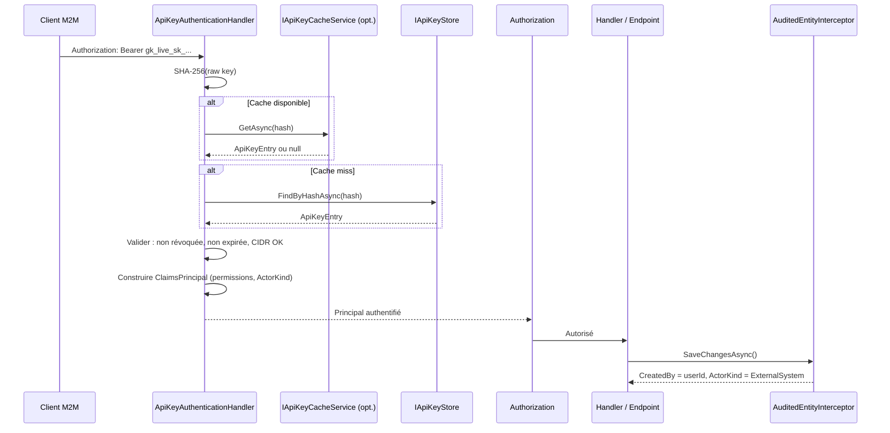

# Authentification par clés API (M2M)

Authentification machine-to-machine (M2M) par clés API pour les intégrations
système-à-système. Inspiré des patterns Stripe (préfixes typés) et Slack (scopes).

## Packages

| Package | Rôle | Module |
| --- | --- | --- |
| `Granit.Security` | `ActorKind`, enrichissement `ICurrentUserService` | `GranitSecurityModule` |
| `Granit.Authentication.ApiKeys` | Handler d'authentification, générateur, CIDR | `GranitAuthenticationApiKeysModule` |
| `Granit.Authentication.ApiKeys.EntityFrameworkCore` | Store EF Core | `GranitAuthenticationApiKeysEntityFrameworkCoreModule` |
| `Granit.Authentication.ApiKeys.Endpoints` | Endpoints CRUD d'administration | `GranitAuthenticationApiKeysEndpointsModule` |

## Architecture

```text
Granit.Security
      ↑  ActorKind, ICurrentUserService (enrichi)
Granit.Authentication.ApiKeys
      ↑  Handler, IApiKeyStore, IApiKeyGenerator, CidrValidator
Granit.Authentication.ApiKeys.EntityFrameworkCore
      ↑  EfCoreApiKeyStore, EfCoreApiKeyAdminStore, ApiKeysDbContext
Granit.Authentication.ApiKeys.Endpoints
         CRUD, rotation, révocation, permissions
```

## Format des clés

Les clés suivent le pattern Stripe avec des préfixes typés :

```text
gk_{environnement}_{type}_{random}
```

| Segment | Valeurs | Description |
| --- | --- | --- |
| `gk_` | Fixe | Préfixe Granit Key |
| Environnement | `live`, `test`, `dev` | Cible de déploiement |
| Type | `sk`, `pk`, `wh`, `ep` | Type de clé |
| Random | 32 octets base62 | Partie secrète (SHA-256 hashée) |

### Types de clés

| Enum | Code | Usage |
| --- | --- | --- |
| `Secret` | `sk` | Authentification serveur-à-serveur |
| `Publishable` | `pk` | Usage client (lecture seule) |
| `Webhook` | `wh` | Signature HMAC des callbacks entrants |
| `Ephemeral` | `ep` | Clés temporaires pour workflows |

**Exemple** : `gk_live_sk_A1b2C3d4E5f6G7h8I9j0K1l2M3n4O5p6`

## ActorKind — distinction des acteurs

L'enum `ActorKind` distingue trois types d'acteurs dans le système :

| Valeur | Description | Exemple |
| --- | --- | --- |
| `User` | Utilisateur humain authentifié via Keycloak | Requête HTTP avec JWT |
| `ExternalSystem` | Système externe authentifié par clé API | Partenaire Labo X |
| `System` | Processus interne (background jobs, CRON) | `SystemCurrentUserService` |

### ICurrentUserService enrichi

Trois propriétés ajoutées via default interface methods (aucun breaking change) :

```csharp
public interface ICurrentUserService
{
    // Propriétés existantes...

    // Nouvelles propriétés (C# 8 default interface methods)
    ActorKind ActorKind => ActorKind.User;
    bool IsMachine => ActorKind is not ActorKind.User;
    Guid? ApiKeyId => null;
}
```

## Installation

### Package socle

```bash
dotnet add package Granit.Authentication.ApiKeys
```

### Persistance EF Core

```bash
dotnet add package Granit.Authentication.ApiKeys.EntityFrameworkCore
```

### Endpoints d'administration

```bash
dotnet add package Granit.Authentication.ApiKeys.Endpoints
```

## Configuration

### Program.cs (modules)

```csharp
[DependsOn(
    typeof(GranitAuthenticationApiKeysModule),
    typeof(GranitAuthenticationApiKeysEntityFrameworkCoreModule),
    typeof(GranitAuthenticationApiKeysEndpointsModule))]
public sealed class MyAppModule : GranitModule { ... }
```

### Program.cs (enregistrement direct)

> **Note** : les exemples utilisent `UseNpgsql()` (PostgreSQL). Granit est agnostique :
> tout provider EF Core est supporté (`UseSqlServer()`, `UseSqlite()`, etc.).

```csharp
// Services
builder.Services.AddGranitApiKeyAuthentication();
builder.Services.AddGranitApiKeysEntityFrameworkCore(options =>
    options.UseNpgsql(connectionString));
builder.Services.AddGranitApiKeysEndpoints();

// Endpoints
app.MapApiKeysEndpoints(options =>
{
    options.RoutePrefix = "api/v1/api-keys";
    options.RequiredRole = "admin";
});
```

### appsettings.json

```json
{
  "Authentication": {
    "Schemes": {
      "ApiKey": {
        "CacheDuration": "00:05:00",
        "TrackLastUsed": true
      }
    }
  }
}
```

## Flux d'authentification



## Sécurité

### Stockage

- Le secret brut n'est **jamais stocké** — seul le hash SHA-256 est persisté
- Le secret complet est retourné **une seule fois** lors de la création
- Les 4 derniers caractères sont conservés pour identification visuelle

### CIDR whitelisting

Restriction IP optionnelle via CIDR (IPv4 et IPv6) :

```csharp
var request = new ApiKeyCreateRequest(
    "Partenaire Labo X",
    ApiKeyType.Secret,
    "live",
    AllowedCidrs: ["10.0.0.0/24", "2001:db8::/32"]);
```

### CacheBehavior

| Valeur | Description |
| --- | --- |
| `Normal` | Cache standard avec TTL configurable (défaut 5 min) |
| `NoCache` | Aucun cache — lookup systématique. Pour les clés HDS critiques |

## Endpoints d'administration

| Méthode | Route | Permission | Description |
| --- | --- | --- | --- |
| GET | `/api-keys` | `ApiKeys.Keys.Read` | Liste paginée des clés |
| GET | `/api-keys/{id}` | `ApiKeys.Keys.Read` | Détail d'une clé |
| POST | `/api-keys` | `ApiKeys.Keys.Create` | Création (retourne le secret) |
| POST | `/api-keys/{id}/revoke` | `ApiKeys.Keys.Revoke` | Révocation |
| POST | `/api-keys/{id}/rotate` | `ApiKeys.Keys.Rotate` | Rotation (révoque + recrée) |
| PUT | `/api-keys/{id}/scopes` | `ApiKeys.Keys.UpdateScopes` | Mise à jour permissions/CIDR |

### Permissions

5 permissions dans le groupe `ApiKeys` :

- `ApiKeys.Keys.Read` — consultation
- `ApiKeys.Keys.Create` — création
- `ApiKeys.Keys.Revoke` — révocation
- `ApiKeys.Keys.Rotate` — rotation
- `ApiKeys.Keys.UpdateScopes` — modification des scopes

## Propagation Wolverine

Le contexte `ActorKind` et `ApiKeyId` est propagé dans les messages Wolverine
via les headers d'enveloppe :

| Header | Valeur | Défaut |
| --- | --- | --- |
| `X-Actor-Kind` | `User`, `ExternalSystem`, `System` | Omis si `User` |
| `X-Api-Key-Id` | GUID de la clé API | Omis si absent |

`UserContextBehavior` restaure ces valeurs côté handler, garantissant que
l'`AuditedEntityInterceptor` enregistre le bon `ActorKind` dans la piste d'audit HDS.

## Entité ApiKeyEntry

```csharp
public class ApiKeyEntry : AuditedEntity, ISoftDeletable, IMultiTenant
{
    public string Name { get; set; }           // Nom d'affichage
    public ApiKeyType Type { get; set; }       // Secret, Publishable, Webhook, Ephemeral
    public string Environment { get; set; }    // live, test, dev
    public string HashedKey { get; set; }      // SHA-256 (jamais le secret brut)
    public string Prefix { get; set; }         // gk_live_sk_
    public string LastFourChars { get; set; }  // 4 derniers caractères
    public List<string> Permissions { get; set; }
    public List<string> AllowedCidrs { get; set; }
    public DateTimeOffset? ExpiresAt { get; set; }
    public DateTimeOffset? LastUsedAt { get; set; }
    public DateTimeOffset? RevokedAt { get; set; }
    public CacheBehavior CacheBehavior { get; set; }
    public Guid? TenantId { get; set; }
}
```

### Indexation EF Core

- Index unique sur `HashedKey` (lookup principal)
- Index sur `TenantId` (filtrage multi-tenant)
- Colonnes `Permissions` et `AllowedCidrs` en jsonb (PostgreSQL)
- Query filter soft delete (`IsDeleted = false`)

## Événements

| Événement | Déclencheur | Usage |
| --- | --- | --- |
| `ApiKeyCreatedEvent` | Création d'une clé | Audit, notification |
| `ApiKeyRevokedEvent` | Révocation | Invalidation cache distribué |
| `ApiKeyRotatedEvent` | Rotation | Invalidation cache + audit |
| `ApiKeyScopesUpdatedEvent` | Mise à jour des scopes | Invalidation cache |

## Conformité HDS / RGPD

| Exigence | Implémentation |
| --- | --- |
| Piste d'audit 3 ans | `AuditedEntity` (CreatedAt/By, ModifiedAt/By) |
| Secret jamais en clair | SHA-256 hash, secret retourné une seule fois |
| Soft delete | `ISoftDeletable` (DeletedAt, DeletedBy) |
| Distinction acteur | `ActorKind` propagé dans l'audit trail |
| Multi-tenant | `IMultiTenant` avec TenantId |
| Chiffrement en transit | HTTPS uniquement |

## Dépendances

| Package | Dépend de |
| --- | --- |
| `Granit.Authentication.ApiKeys` | Security, Timing, Guids, ExceptionHandling, Querying |
| `Granit.Authentication.ApiKeys.EntityFrameworkCore` | Granit.Authentication.ApiKeys, EF Core |
| `Granit.Authentication.ApiKeys.Endpoints` | Granit.Authentication.ApiKeys, Authorization, Validation, ApiDocumentation, Querying |

### Dépendances optionnelles (soft)

- `Granit.Caching` — cache des clés via `IApiKeyCacheService`
- `Granit.Wolverine` — propagation `ActorKind` dans les messages
