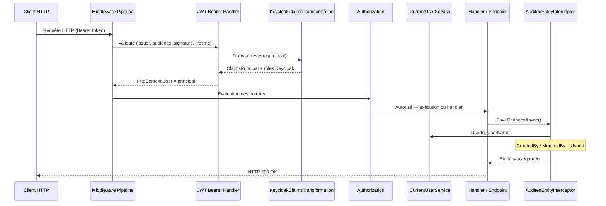

# Authentication & Security

Trois packages constituent la couche d'authentification de Granit,
suivant le pattern ABP Framework : abstractions / implémentation générique / extension IDP.

```text
Granit.Core
      ↑
Granit.Security                   ← ICurrentUserService (interface seule)
      ↑
Granit.Authentication.JwtBearer   ← JWT Bearer générique, CurrentUserService,
      ↑                                  policy "Authenticated"
Granit.Authentication.Keycloak    ← Claims Keycloak, PostConfigure JWT Bearer,
                                         policy "Admin"
      (futur)
Granit.Authentication.Auth0       ← [DependsOn(JwtBearer)]
```

## Packages

| Package | Rôle | Module |
| --- | --- | --- |
| `Granit.Security` | `ICurrentUserService` (abstraction) | `GranitSecurityModule` |
| `Granit.Authentication.JwtBearer` | JWT Bearer générique, `CurrentUserService` | `GranitJwtBearerModule` |
| `Granit.Authentication.Keycloak` | Claims Keycloak, policy `Admin` | `GranitAuthenticationKeycloakModule` |

---

### Flux d'une requête authentifiée



## Granit.Security

Package d'abstractions pures. Ne contient aucune dépendance sur ASP.NET Core.

### Installation

```bash
dotnet add package Granit.Security
```

### ICurrentUserService

```csharp
public interface ICurrentUserService
{
    string? UserId { get; }        // claim "sub"
    string? UserName { get; }      // selon NameClaimType configuré
    string? Email { get; }         // claim "email"
    bool IsAuthenticated { get; }
    IReadOnlyList<string> Roles { get; }
    bool IsInRole(string role);
}
```

Utilisable dans n'importe quel module applicatif via injection de dépendances.
L'implémentation (`CurrentUserService`) est fournie par `Granit.Authentication.JwtBearer`.

```csharp
// Dans un handler Wolverine (method injection)
public static async Task Handle(
    MyCommand command,
    ICurrentUserService currentUser,
    CancellationToken cancellationToken)
{
    var userId = currentUser.UserId;
    var isAdmin = currentUser.IsInRole("admin");
}
```

---

## Granit.Authentication.JwtBearer

Implémentation JWT Bearer générique (OIDC-compatible). Ne connaît aucun IDP spécifique.

### Installation

```bash
dotnet add package Granit.Authentication.JwtBearer
```

### Configuration

```json
{
  "Authentication": {
    "Authority": "https://idp.example.com/realms/my-realm",
    "Audience": "my-client",
    "RequireHttpsMetadata": true,
    "NameClaimType": "sub"
  }
}
```

> `NameClaimType` définit quel claim alimente `User.Identity.Name` (et donc
> `ICurrentUserService.UserName`). La valeur par défaut `"sub"` est conforme RFC 7519
> (toujours présente dans un JWT valide). Keycloak la surcharge à `"preferred_username"`
> via `PostConfigure` dans `Granit.Authentication.Keycloak`.

### Program.cs

Via le système de modules (recommandé) :

```csharp
[DependsOn(typeof(GranitJwtBearerModule))]
public sealed class MyAppModule : GranitModule { ... }
```

Enregistrement direct :

```csharp
builder.Services.AddGranitJwtBearer();
```

> La configuration est résolue automatiquement depuis `IConfiguration` enregistré
> dans le conteneur DI, via `BindConfiguration("Authentication")`.

### JwtBearerAuthOptions

```csharp
public sealed class JwtBearerAuthOptions
{
    public const string SectionName = "Authentication";

    public string Authority { get; set; } = string.Empty;
    public string Audience { get; set; } = string.Empty;
    public bool RequireHttpsMetadata { get; set; } = true;
    public string NameClaimType { get; set; } = "sub";  // RFC 7519
}
```

### Services enregistrés

| Service | Implémentation | Lifetime |
| --- | --- | --- |
| `ICurrentUserService` | `CurrentUserService` | Scoped |
| `IHttpContextAccessor` | Framework | Singleton |

### Policy enregistrée

| Policy | Exigence |
| --- | --- |
| `Authenticated` | Utilisateur authentifié |

---

## Granit.Authentication.Keycloak

Extension Keycloak pour `Granit.Authentication.JwtBearer`.
Dépend transitivement de `Granit.Security` et `Granit.Authentication.JwtBearer`.

### Installation

```bash
dotnet add package Granit.Authentication.Keycloak
```

Un seul package suffit — `Granit.Security` et `Granit.Authentication.JwtBearer`
sont amenés transitivement.

### Configuration

Seule la section `"Keycloak"` est nécessaire. La section `"Authentication"` n'est
**pas** requise quand ce module est utilisé : `PostConfigureAll<JwtBearerOptions>`
applique les valeurs Keycloak après l'initialisation du JWT Bearer.

```json
{
  "Keycloak": {
    "Authority": "https://keycloak.example.com/realms/my-realm",
    "ClientId": "my-client",
    "ClientSecret": "***",
    "RequireHttpsMetadata": true,
    "AdminRole": "admin",
    "RoleClaimsSource": "realm_access"
  }
}
```

### Program.cs

Via le système de modules (recommandé) :

```csharp
[DependsOn(typeof(GranitAuthenticationKeycloakModule))]
public sealed class MyAppModule : GranitModule { ... }
// GranitAuthenticationKeycloakModule amène automatiquement :
// → GranitJwtBearerModule → GranitSecurityModule
```

Enregistrement direct :

```csharp
builder.Services.AddGranitJwtBearer();
builder.Services.AddGranitKeycloak();
```

### KeycloakOptions

```csharp
public sealed class KeycloakOptions
{
    public const string SectionName = "Keycloak";

    public string Authority { get; set; } = string.Empty;
    public string ClientId { get; set; } = string.Empty;
    public string ClientSecret { get; set; } = string.Empty;
    public bool RequireHttpsMetadata { get; set; } = true;
    public string? Audience { get; set; }              // Défaut : ClientId
    public string AdminRole { get; set; } = "admin";
    public string RoleClaimsSource { get; set; } = "realm_access";
}
```

### RoleClaimsSource

| Valeur | Structure JWT | Usage |
| --- | --- | --- |
| `"realm_access"` (défaut) | `realm_access.roles[]` | Rôles realm globaux |
| `"resource_access"` | `resource_access.{ClientId}.roles[]` | Rôles par client |

### Transformation des claims

Keycloak encode les rôles dans un claim JSON non standard :

```json
{
  "realm_access": { "roles": ["admin", "practitioner"] },
  "resource_access": {
    "my-client": { "roles": ["billing-manager"] }
  }
}
```

`KeycloakClaimsTransformation` extrait ces rôles et les ajoute comme `ClaimTypes.Role`
standard .NET, permettant `[Authorize(Roles = "admin")]` et `User.IsInRole("admin")`.

### Services supplémentaires enregistrés

| Service | Implémentation | Lifetime |
| --- | --- | --- |
| `IClaimsTransformation` | `KeycloakClaimsTransformation` | Transient |

### Policies supplémentaires enregistrées

| Policy | Exigence |
| --- | --- |
| `Admin` | Rôle configuré dans `KeycloakOptions.AdminRole` (défaut : `admin`) |

> Les policies métier (`FhirAccess`, `PractitionerOnly`…) sont à définir dans
> l'application, pas dans Granit.

---

## Architecture des fichiers

```text
Granit.Security
└── ICurrentUserService.cs

Granit.Authentication.JwtBearer
├── Options/JwtBearerAuthOptions.cs
├── Authentication/CurrentUserService.cs
├── Extensions/JwtBearerServiceCollectionExtensions.cs   (AddGranitJwtBearer)
└── GranitJwtBearerModule.cs                         [DependsOn(Security)]

Granit.Authentication.Keycloak
├── Options/KeycloakOptions.cs
├── Authentication/KeycloakClaimsTransformation.cs
├── Extensions/KeycloakServiceCollectionExtensions.cs    (AddGranitKeycloak)
└── GranitAuthenticationKeycloakModule.cs            [DependsOn(JwtBearer)]
```

## Validation du token

La configuration JWT Bearer valide :

- **Issuer** : doit correspondre à `Authority`
- **Audience** : doit correspondre à `Audience` (ou `ClientId` pour Keycloak)
- **Lifetime** : le token ne doit pas être expiré
- **Signing key** : signature vérifiée via les clés JWKS de l'IDP

## Ajouter un nouveau provider (ex. Auth0)

Créer `Granit.Authentication.Auth0` en dépendant uniquement de
`Granit.Authentication.JwtBearer` :

```xml
<ProjectReference Include="..\Granit.Authentication.JwtBearer\..." />
```

```csharp
[DependsOn(typeof(GranitJwtBearerModule))]
public sealed class GranitAuthenticationAuth0Module : GranitModule
{
    public override void ConfigureServices(ServiceConfigurationContext context) =>
        context.Services.AddGranitAuth0();
}
```

`Granit.Security` et `Granit.Authentication.Keycloak` ne sont pas impactés.

## Dépendances Granit

| Package | Dépend de | Utilisé par |
|---------|-----------|-------------|
| `Granit.Security` | `Granit.Core` | `Persistence`, `Authorization`, `Wolverine`, `BackgroundJobs`, `Settings`, `Idempotency`, `ApiDocumentation`, `Authentication.JwtBearer` |
| `Granit.Authentication.JwtBearer` | `Granit.Security` | `Granit.Authentication.Keycloak` |
| `Granit.Authentication.Keycloak` | `Granit.Authentication.JwtBearer` | Module feuille |

> Voir le [graphe de dépendances complet](../dependencies.md).
