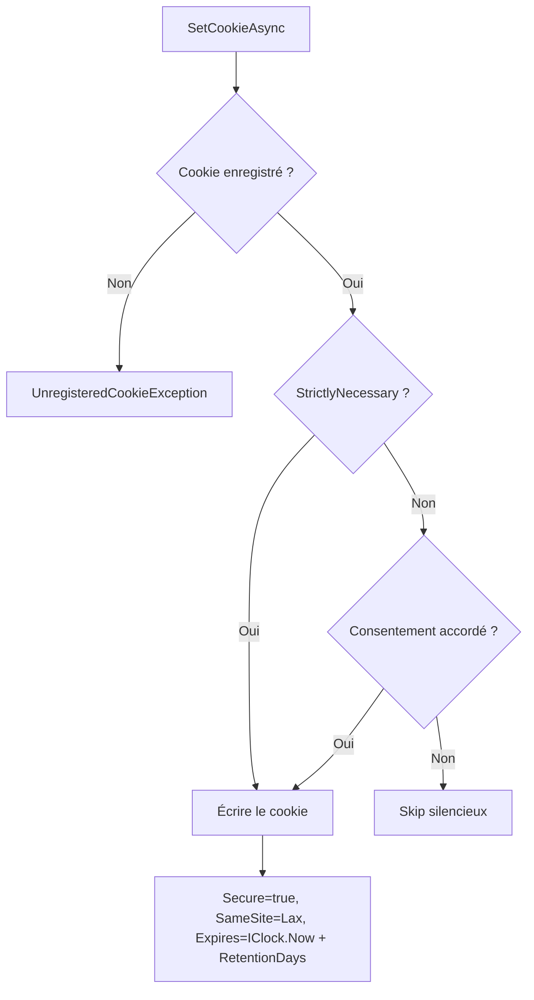

# Gestion des cookies

Package de gestion des cookies HTTP conforme RGPD/ISO 27001. Repose sur le
**Strict Registry Pattern** : chaque cookie doit être déclaré au démarrage,
toute tentative d'écrire un cookie non déclaré provoque une exception immédiate (fail-fast).

```text
Granit.Core
      ↑
Granit.Timing               ← IClock (calcul d'expiration)
      ↑
Granit.Cookies              ← ICookieRegistry, IGranitCookieManager, IConsentResolver
      ↑
Granit.Cookies.Klaro        ← KlaroConsentResolver (implémentation Klaro)
```

## Installation

```bash
dotnet add package Granit.Cookies
```

## Concepts clés

### Catégories RGPD

Quatre catégories conformes aux recommandations CNIL / EDPB :

| Catégorie | Enum | Consentement requis |
| --- | --- | --- |
| Strictement nécessaire | `StrictlyNecessary` | Non — exempt de consentement |
| Préférences | `Preferences` | Oui |
| Analytique | `Analytics` | Oui |
| Marketing | `Marketing` | Oui |

### Strict Registry Pattern

Tous les cookies doivent être déclarés au démarrage via `GranitCookiesBuilder`.
À l'exécution, toute opération sur un cookie non enregistré lève
`UnregisteredCookieException` (code `Cookies:Unregistered`).

Ce pattern garantit :

- Un **inventaire exhaustif** des cookies pour l'audit RGPD/ISO 27001
- La traçabilité du **but** (`Purpose`) de chaque cookie
- Le contrôle de la **durée de rétention** (`RetentionDays`)
- L'impossibilité d'écrire un cookie sans déclaration préalable

### Définition d'un cookie

Chaque cookie est décrit par un `CookieDefinition` :

```csharp
public sealed record CookieDefinition(
    string Name,              // Nom unique (insensible à la casse)
    CookieCategory Category,  // Catégorie RGPD
    int RetentionDays,        // Durée de rétention maximale (jours)
    bool IsHttpOnly,          // true → inaccessible au JavaScript
    string Purpose);          // But humainement lisible (audit RGPD)
```

---

## Configuration backend

### Enregistrement des services

```csharp
services.AddGranitCookies(cookies =>
{
    cookies.RegisterCookie(new CookieDefinition(
        Name: ".AspNetCore.Session",
        Category: CookieCategory.StrictlyNecessary,
        RetentionDays: 1,
        IsHttpOnly: true,
        Purpose: "Server-side session identifier"));

    cookies.RegisterCookie(new CookieDefinition(
        Name: "user_lang",
        Category: CookieCategory.Preferences,
        RetentionDays: 365,
        IsHttpOnly: false,
        Purpose: "User language preference"));

    cookies.RegisterCookie(new CookieDefinition(
        Name: "_ga",
        Category: CookieCategory.Analytics,
        RetentionDays: 730,
        IsHttpOnly: false,  // Google Analytics nécessite l'accès JS
        Purpose: "Google Analytics tracking identifier"));

    // Provider de consentement (obligatoire)
    cookies.UseConsentResolver<CookiebotConsentResolver>();
});
```

### Options

Section `appsettings.json` :

```json
{
  "Cookies": {
    "ThrowOnUnregistered": true,
    "DefaultRetentionDays": 365
  }
}
```

| Option | Type | Défaut | Description |
| --- | --- | --- | --- |
| `ThrowOnUnregistered` | `bool` | `true` | Lève `UnregisteredCookieException` si un cookie non déclaré est écrit |
| `DefaultRetentionDays` | `int` | `365` | Durée de rétention par défaut (jours) |

### Services enregistrés

| Service | Implémentation | Lifetime |
| --- | --- | --- |
| `ICookieRegistry` | `CookieRegistry` | Singleton |
| `IGranitCookieManager` | `GranitCookieManager` | Scoped |
| `IConsentResolver` | Fourni par l'application | Scoped |

### Module

```csharp
[DependsOn(typeof(GranitCookiesModule))]
public sealed class MyAppModule : GranitModule { ... }
```

`GranitCookiesModule` dépend de `GranitTimingModule` pour l'accès à `IClock`.

---

## Écriture et suppression de cookies

Toute manipulation de cookie passe par `IGranitCookieManager` :

```csharp
public interface IGranitCookieManager
{
    Task SetCookieAsync(HttpContext httpContext, string cookieName, string value);
    Task RevokeCategoryAsync(HttpContext httpContext, CookieCategory category);
    void DeleteCookie(HttpContext httpContext, string cookieName);
}
```

### Flux d'écriture



### Durcissement sécurité

Chaque cookie écrit via `IGranitCookieManager` applique automatiquement :

- **Secure** = `true` — HTTPS uniquement
- **SameSite** = `Lax` — protection CSRF
- **Expires** — calculé via `IClock.Now + RetentionDays`
- **HttpOnly** — configurable par cookie (`IsHttpOnly` dans la définition)

> `HttpOnly = false` est intentionnel pour certains cookies (ex. `_ga` qui
> nécessite un accès JavaScript). Cette exception est documentée dans la
> `CookieDefinition`.

---

## Consentement — IConsentResolver

L'interface `IConsentResolver` est le point d'extension pour intégrer une
plateforme de gestion du consentement (CMP) côté serveur :

```csharp
public interface IConsentResolver
{
    Task<bool> ResolveAsync(HttpContext httpContext, CookieCategory category);
}
```

L'application **doit** fournir une implémentation. Le module ne fournit pas
d'implémentation par défaut — c'est un choix architectural qui force chaque
application à explicitement décider de sa stratégie de consentement.

### Exemple : Cookiebot

Cookiebot stocke le consentement dans un cookie `CookieConsent` côté client.
L'implémentation serveur lit ce cookie pour résoudre le consentement :

```csharp
public sealed class CookiebotConsentResolver : IConsentResolver
{
    public Task<bool> ResolveAsync(HttpContext httpContext, CookieCategory category)
    {
        string? consentCookie = httpContext.Request.Cookies["CookieConsent"];
        if (string.IsNullOrEmpty(consentCookie))
        {
            return Task.FromResult(false);
        }

        // Le cookie CookieConsent de Cookiebot contient les préférences
        // sous forme URL-encoded : stamp=...&necessary=...&preferences=...
        // &statistics=...&marketing=...
        Dictionary<string, string> values = ParseCookiebotConsent(consentCookie);

        string key = category switch
        {
            CookieCategory.Preferences => "preferences",
            CookieCategory.Analytics => "statistics",
            CookieCategory.Marketing => "marketing",
            _ => "necessary"
        };

        bool granted = values.TryGetValue(key, out string? value)
            && string.Equals(value, "true", StringComparison.OrdinalIgnoreCase);

        return Task.FromResult(granted);
    }

    private static Dictionary<string, string> ParseCookiebotConsent(string raw)
    {
        string decoded = Uri.UnescapeDataString(raw);
        return decoded.Split('&')
            .Select(pair => pair.Split('=', 2))
            .Where(parts => parts.Length == 2)
            .ToDictionary(parts => parts[0], parts => parts[1]);
    }
}
```

### Exemple : Axeptio

```csharp
public sealed class AxeptioConsentResolver : IConsentResolver
{
    public Task<bool> ResolveAsync(HttpContext httpContext, CookieCategory category)
    {
        string? consentCookie = httpContext.Request.Cookies["axeptio_cookies"];
        if (string.IsNullOrEmpty(consentCookie))
        {
            return Task.FromResult(false);
        }

        // Axeptio stocke un JSON : {"analytics": true, "marketing": false, ...}
        JsonDocument doc = JsonDocument.Parse(consentCookie);

        string key = category switch
        {
            CookieCategory.Preferences => "preferences",
            CookieCategory.Analytics => "analytics",
            CookieCategory.Marketing => "marketing",
            _ => "necessary"
        };

        bool granted = doc.RootElement.TryGetProperty(key, out JsonElement el)
            && el.GetBoolean();

        return Task.FromResult(granted);
    }
}
```

---

## Intégration Klaro CMP — Granit.Cookies.Klaro

[Klaro](https://klaro.org/) (KIProtect GmbH, Berlin — licence BSD-3) est une CMP
self-hosted, souveraine EU, retenue comme intégration officielle pour Granit.
Le package `Granit.Cookies.Klaro` fournit un `IConsentResolver` prêt à l'emploi.

### Installation

```bash
dotnet add package Granit.Cookies.Klaro
```

### Enregistrement

Via le builder (recommandé) :

```csharp
services.AddGranitCookies(cookies =>
{
    cookies.RegisterCookie(new CookieDefinition(
        "_ga", CookieCategory.Analytics, 730, false, "Google Analytics"));
    cookies.UseKlaro();
});
```

Ou via le système de modules :

```csharp
[DependsOn(typeof(GranitCookiesKlaroModule))]
public sealed class MyAppModule : GranitModule { }
```

### Configuration appsettings.json

```json
{
  "Klaro": {
    "CookieName": "klaro",
    "ServiceMappings": {
      "google-analytics": "Analytics",
      "matomo": "Analytics",
      "youtube": "Marketing",
      "theme-preference": "Preferences"
    }
  }
}
```

| Option | Type | Défaut | Description |
| --- | --- | --- | --- |
| `CookieName` | `string` | `"klaro"` | Nom du cookie Klaro côté client |
| `ServiceMappings` | `Dictionary<string, CookieCategory>` | — (requis) | Correspondance service Klaro → catégorie RGPD |

### Logique de résolution

Klaro stocke le consentement dans un cookie JSON : `{"service": true/false, ...}`.
Le résolveur mappe chaque service vers une `CookieCategory` via `ServiceMappings` :

1. `StrictlyNecessary` → toujours `true` (sans lecture du cookie)
2. Cookie absent ou vide → `false` (fail-safe)
3. Chercher les services mappés à la catégorie demandée
4. Retourner `true` uniquement si **tous** les services de la catégorie sont consentis
5. Service absent du JSON, JSON invalide, aucun mapping → `false` (fail-safe)

> La logique « tout-ou-rien » par catégorie garantit qu'aucun service non
> consenti ne soit activé, même si un seul service de la catégorie est refusé.

### Architecture des fichiers

```text
Granit.Cookies.Klaro (NuGet)
├── KlaroConsentResolver.cs                     IConsentResolver (Klaro)
├── GranitCookiesKlaroModule.cs                 [DependsOn(GranitCookiesModule)]
├── Options/
│   └── KlaroOptions.cs                         configuration (CookieName, ServiceMappings)
└── Extensions/
    ├── KlaroServiceCollectionExtensions.cs      AddGranitCookiesKlaro()
    └── GranitCookiesBuilderExtensions.cs        UseKlaro()
```

---

## Analyzer Roslyn — GRSEC004

L'analyzer `DirectCookieAccessAnalyzer` (diagnostic `GRSEC004`) est inclus dans
`Granit.Analyzers` et émet un **warning** lorsqu'un appel direct à
`IResponseCookies.Append()` ou `IResponseCookies.Delete()` est détecté.

**Opt-in** : l'analyzer ne s'active que lorsque `Granit.Cookies` est référencé
dans le projet (présence du type `IGranitCookieManager` dans la compilation).

### Exemple

```csharp
// ⚠ GRSEC004 — Use IGranitCookieManager instead of directly calling
// IResponseCookies.Append() to enforce the Strict Registry Pattern
// and RGPD consent checks
httpContext.Response.Cookies.Append("session", "abc123");

// ✅ Correct
await cookieManager.SetCookieAsync(httpContext, "session", "abc123");
```

Un **code fix** (`DirectCookieAccessCodeFixProvider`) propose automatiquement
le remplacement par `IGranitCookieManager` dans l'IDE.

---

## Frontend React

Le package `@granit/cookies` fournit une couche d'abstraction React pour la
gestion du consentement côté client.

### Types

```typescript
type CookieCategory =
  | "strictly_necessary"
  | "preferences"
  | "analytics"
  | "marketing";

type ConsentState = Record<CookieCategory, boolean>;

interface CookieConsentProvider {
  init(): Promise<void>;
  getConsents(): ConsentState;
  onConsentChange(callback: (consents: ConsentState) => void): () => void;
}
```

### CookieConsentProvider (React Context)

Initialise le CMP et expose l'état du consentement à l'arbre de composants :

```tsx
import { CookieConsentProvider } from "@granit/cookies";

// L'application fournit son adapter CMP
const cookiebotProvider: CookieConsentProvider = {
  async init() {
    // Charger le SDK Cookiebot
    await loadScript("https://consent.cookiebot.com/uc.js");
  },
  getConsents() {
    return {
      strictly_necessary: true,
      preferences: window.Cookiebot?.consent?.preferences ?? false,
      analytics: window.Cookiebot?.consent?.statistics ?? false,
      marketing: window.Cookiebot?.consent?.marketing ?? false,
    };
  },
  onConsentChange(callback) {
    const handler = () => callback(this.getConsents());
    window.addEventListener("CookiebotOnAccept", handler);
    window.addEventListener("CookiebotOnDecline", handler);
    return () => {
      window.removeEventListener("CookiebotOnAccept", handler);
      window.removeEventListener("CookiebotOnDecline", handler);
    };
  },
};

function App() {
  return (
    <CookieConsentProvider provider={cookiebotProvider}>
      <MainLayout />
    </CookieConsentProvider>
  );
}
```

### useCookieConsent

Hook pour accéder à l'état du consentement dans les composants :

```tsx
import { useCookieConsent } from "@granit/cookies";

function AnalyticsLoader() {
  const { consents, isLoaded } = useCookieConsent();

  if (!isLoaded) return null;

  if (consents.analytics) {
    // Charger les scripts analytics
  }

  return null;
}
```

### Actions disponibles

| Action | Description |
| --- | --- |
| `acceptCategory(category)` | Accorde le consentement pour une catégorie |
| `revokeCategory(category)` | Révoque le consentement (sauf `strictly_necessary`) |
| `acceptAll()` | Accorde le consentement pour toutes les catégories |
| `revokeAll()` | Révoque toutes les catégories non essentielles |

---

## Architecture des fichiers

```text
Granit.Cookies (NuGet)
├── CookieCategory.cs                         enum (4 catégories RGPD)
├── CookieDefinition.cs                       record immuable
├── ICookieRegistry.cs                        registre centralisé
├── IGranitCookieManager.cs                   opérations managées
├── IConsentResolver.cs                       abstraction CMP
├── GranitCookiesBuilder.cs                   builder DI
├── GranitCookiesModule.cs                    [DependsOn(Timing)]
├── Options/
│   └── GranitCookiesOptions.cs               configuration appsettings
├── Exceptions/
│   └── UnregisteredCookieException.cs        fail-fast
├── Internal/
│   ├── CookieRegistry.cs                     ConcurrentDictionary, singleton
│   └── GranitCookieManager.cs                scoped, consent + sécurité
└── Extensions/
    └── CookiesServiceCollectionExtensions.cs AddGranitCookies()

Granit.Cookies.Klaro (NuGet)
├── KlaroConsentResolver.cs                     IConsentResolver (Klaro CMP)
├── GranitCookiesKlaroModule.cs                 [DependsOn(GranitCookiesModule)]
├── Options/
│   └── KlaroOptions.cs                         CookieName + ServiceMappings
└── Extensions/
    ├── KlaroServiceCollectionExtensions.cs      AddGranitCookiesKlaro()
    └── GranitCookiesBuilderExtensions.cs        UseKlaro()

frontend/granit.cookies (npm — @granit/cookies)
├── types.ts                                  CookieCategory, ConsentState, Provider
├── CookieConsentContext.tsx                   React Context + Provider
└── useCookieConsent.ts                       Hook consommateur

Granit.Analyzers
└── DirectCookieAccessAnalyzer.cs             GRSEC004 (opt-in)

Granit.Analyzers.CodeFixes
└── DirectCookieAccessCodeFixProvider.cs      Auto-fix vers IGranitCookieManager
```

## Dépendances Granit

| Package | Dépend de | Utilisé par |
| --- | --- | --- |
| `Granit.Cookies` | `Granit.Core`, `Granit.Timing` | Applications (via `AddGranitCookies()`) |
| `Granit.Cookies.Klaro` | `Granit.Cookies` | Applications utilisant Klaro (via `UseKlaro()`) |
| `Granit.Analyzers` (GRSEC004) | Compilation uniquement | Projets référençant `Granit.Cookies` |
