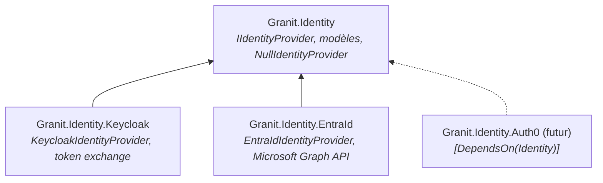
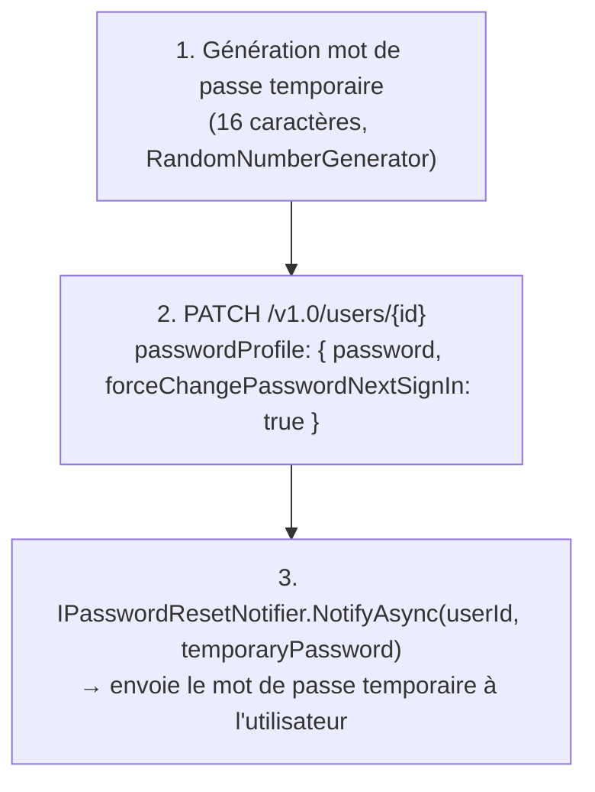

# Identity Provider

Trois packages constituent la couche d'identité de Granit :
abstractions découplées d'un côté, implémentations IDP de l'autre.



## Packages

| Package | Rôle | Module |
| --- | --- | --- |
| `Granit.Identity` | `IIdentityProvider` (abstraction), modèles, `NullIdentityProvider` | `GranitIdentityModule` |
| `Granit.Identity.Keycloak` | Keycloak Admin REST API + Account API (token exchange) | `GranitIdentityKeycloakModule` |
| `Granit.Identity.EntraId` | Microsoft Graph API v1.0, App Roles, `IPasswordResetNotifier` | `GranitIdentityEntraIdModule` |

---

## Granit.Identity

Package d'abstractions pures. Aucune dépendance externe en dehors de `Granit.Core`.

### Installation

```bash
dotnet add package Granit.Identity
```

### IIdentityProvider

Interface centrale. Un `NullIdentityProvider` est enregistré par défaut (retourne
des listes vides et des no-ops). Installer un package d'implémentation remplace le
null object.

```csharp
public interface IIdentityProvider
{
    // --- Lecture utilisateurs ---
    Task<IReadOnlyList<IdentityUser>> GetUsersAsync(
        string? search = null, int? first = null, int? max = null,
        CancellationToken cancellationToken = default);
    Task<IdentityUser?> GetUserAsync(string userId, CancellationToken cancellationToken = default);

    // --- Gestion du compte ---
    Task SetUserEnabledAsync(string userId, bool enabled, CancellationToken cancellationToken = default);
    Task<IdentityUser> CreateUserAsync(IdentityUserCreate user, CancellationToken cancellationToken = default);

    // --- Sessions ---
    Task<IReadOnlyList<IdentitySession>> GetUserSessionsAsync(string userId, CancellationToken cancellationToken = default);
    Task<IReadOnlyList<IdentityDeviceActivity>> GetUserDeviceActivityAsync(string userId, CancellationToken cancellationToken = default);
    Task TerminateSessionAsync(string userId, string sessionId, CancellationToken cancellationToken = default);
    Task TerminateAllSessionsAsync(string userId, CancellationToken cancellationToken = default);

    // --- Credentials ---
    Task<DateTimeOffset?> GetPasswordChangedAtAsync(string userId, CancellationToken cancellationToken = default);
    Task SendPasswordResetEmailAsync(string userId, CancellationToken cancellationToken = default);
    Task SetTemporaryPasswordAsync(string userId, string temporaryPassword, CancellationToken cancellationToken = default);
    Task<bool> VerifyUserCredentialsAsync(string username, string password, CancellationToken cancellationToken = default);

    // --- Rôles ---
    Task<IReadOnlyList<IdentityRole>> GetRolesAsync(CancellationToken cancellationToken = default);
    Task<IReadOnlyList<IdentityUser>> GetRoleMembersAsync(string roleName, CancellationToken cancellationToken = default);
    Task<IReadOnlyList<IdentityRole>> GetUserRolesAsync(string userId, CancellationToken cancellationToken = default);
    Task AssignRoleAsync(string userId, string roleName, CancellationToken cancellationToken = default);
    Task RemoveRoleAsync(string userId, string roleName, CancellationToken cancellationToken = default);

    // --- Groupes ---
    Task<IReadOnlyList<IdentityGroup>> GetGroupsAsync(CancellationToken cancellationToken = default);
    Task<IReadOnlyList<IdentityGroup>> GetUserGroupsAsync(string userId, CancellationToken cancellationToken = default);
    Task AddUserToGroupAsync(string userId, string groupId, CancellationToken cancellationToken = default);
    Task RemoveUserFromGroupAsync(string userId, string groupId, CancellationToken cancellationToken = default);
}
```

> **Conventions d'erreur :** les opérations de lecture appliquent la *graceful degradation*
> (log warning + retour vide/null si le provider est indisponible). `SetUserEnabledAsync`
> propage les exceptions HTTP pour que l'appelant soit informé d'un échec.

### Modèles

```csharp
// Utilisateur dans l'IDP externe
record IdentityUser(
    string Id, string? Username, string? Email,
    string? FirstName, string? LastName, bool Enabled,
    IReadOnlyDictionary<string, string>? Attributes = null);

// Données pour créer un utilisateur
record IdentityUserCreate(
    string Username, string Email,
    string? FirstName = null, string? LastName = null,
    bool Enabled = true, string? TemporaryPassword = null);

// Rôle dans l'IDP externe
record IdentityRole(string Id, string Name, string? Description);

// Groupe dans l'IDP externe (hiérarchie récursive)
record IdentityGroup(
    string Id, string Name, string? Path,
    IReadOnlyList<IdentityGroup> SubGroups);

// Session SSO active
record IdentitySession(
    string SessionId, string? IpAddress,
    DateTimeOffset StartedAt, DateTimeOffset LastAccess,
    bool RememberMe, IReadOnlyList<string> Clients);

// Activité par device (regroupe une ou plusieurs sessions)
// Device / Os / OsVersion / Browser sont null si le provider
// ne supporte pas la vue device (ex. fallback Admin API Keycloak)
record IdentityDeviceActivity(
    string? IpAddress, DateTimeOffset LastAccess,
    string? Device, string? Os, string? OsVersion, string? Browser,
    bool Mobile, bool Current,
    IReadOnlyList<IdentitySession> Sessions);
```

---

## Granit.Identity.Keycloak

Implémentation `IIdentityProvider` via le Keycloak Admin REST API.
Pour la **device activity enrichie** (OS, browser, device), utilise
optionnellement l'Account API via un token exchange OAuth 2.0.

### Installation

```bash
dotnet add package Granit.Identity.Keycloak
```

### Program.cs

Via le système de modules :

```csharp
[DependsOn(typeof(GranitIdentityKeycloakModule))]
public sealed class MyAppModule : GranitModule { ... }
```

Enregistrement direct :

```csharp
builder.Services.AddGranitIdentityKeycloak();
```

### Configuration

```json
{
  "KeycloakAdmin": {
    "BaseUrl": "https://keycloak.example.com",
    "Realm": "my-realm",
    "ClientId": "admin-service",
    "ClientSecret": "*** (Vault)",
    "UseTokenExchangeForDeviceActivity": false
  }
}
```

| Propriété | Type | Requis | Description |
| --------- | ---- | ------ | ----------- |
| `BaseUrl` | `string` | ✅ | URL de base Keycloak (sans le path realm) |
| `Realm` | `string` | ✅ | Nom du realm |
| `ClientId` | `string` | ✅ | Client ID du service account |
| `ClientSecret` | `string` | ✅ | Secret du service account — **charger depuis Vault** |
| `UseTokenExchangeForDeviceActivity` | `bool` | ❌ | Active l'Account API via token exchange pour les infos device (défaut : `false`) |
| `DirectAccessClientId` | `string?` | ❌ | Client ID public avec *Direct Access Grants* activé, utilisé par `VerifyUserCredentialsAsync` (ROPC grant) |

> `ClientSecret` ne doit **jamais** être stocké en clair.
> Utiliser [Granit.Vault](vault.md) pour injecter le secret dynamiquement.

### Rôles requis sur le service account

| Opération | Rôle Keycloak requis |
| --------- | --------------------- |
| Lecture users, sessions, credentials, rôles, groupes | `realm-management:view-users` |
| Toutes les opérations d'écriture (enable/disable, create, roles, sessions, password, groups) | `realm-management:manage-users` |
| `GetUserDeviceActivityAsync` avec token exchange | `realm-management:impersonation` + feature `admin-fine-grained-authz` |

### Endpoints Keycloak utilisés

| Méthode `IIdentityProvider` | Endpoint Keycloak Admin REST API |
| --------------------------- | -------------------------------- |
| `GetUsersAsync` | `GET /admin/realms/{realm}/users` |
| `GetUserAsync` | `GET /admin/realms/{realm}/users/{id}` |
| `SetUserEnabledAsync` | `PUT /admin/realms/{realm}/users/{id}` |
| `CreateUserAsync` | `POST /admin/realms/{realm}/users` (+ `PUT .../reset-password` si mot de passe temporaire) |
| `GetUserSessionsAsync` | `GET /admin/realms/{realm}/users/{id}/sessions` |
| `GetUserDeviceActivityAsync` (sans token exchange) | `GET /admin/realms/{realm}/users/{id}/sessions` — Device/Os/Browser = `null` |
| `GetUserDeviceActivityAsync` (avec token exchange) | `GET /realms/{realm}/account/sessions/devices` (Account API, user token) |
| `TerminateSessionAsync` | `DELETE /admin/realms/{realm}/sessions/{sessionId}` |
| `TerminateAllSessionsAsync` | `POST /admin/realms/{realm}/users/{id}/logout` |
| `GetPasswordChangedAtAsync` | `GET /admin/realms/{realm}/users/{id}/credentials` → credential `type=password`, champ `createdDate` |
| `SendPasswordResetEmailAsync` | `PUT /admin/realms/{realm}/users/{id}/execute-actions-email` body: `["UPDATE_PASSWORD"]` |
| `SetTemporaryPasswordAsync` | `PUT /admin/realms/{realm}/users/{id}/reset-password` body: `{ type, value, temporary }` |
| `GetRolesAsync` | `GET /admin/realms/{realm}/roles` |
| `GetRoleMembersAsync` | `GET /admin/realms/{realm}/roles/{name}/users` |
| `GetUserRolesAsync` | `GET /admin/realms/{realm}/users/{id}/role-mappings/realm` |
| `AssignRoleAsync` | `GET .../roles/{name}` puis `POST .../users/{id}/role-mappings/realm` |
| `RemoveRoleAsync` | `GET .../roles/{name}` puis `DELETE .../users/{id}/role-mappings/realm` |
| `GetGroupsAsync` | `GET /admin/realms/{realm}/groups` |
| `GetUserGroupsAsync` | `GET /admin/realms/{realm}/users/{id}/groups` |
| `AddUserToGroupAsync` | `PUT /admin/realms/{realm}/users/{id}/groups/{groupId}` |
| `RemoveUserFromGroupAsync` | `DELETE /admin/realms/{realm}/users/{id}/groups/{groupId}` |
| `VerifyUserCredentialsAsync` | `POST /realms/{realm}/protocol/openid-connect/token` (Resource Owner Password Grant via `DirectAccessClientId`) |

### Vérification de credentials (ROPC)

`VerifyUserCredentialsAsync` permet de ré-authentifier un utilisateur avant une
opération sensible (ex. définir un mot de passe temporaire). La vérification utilise
le **Resource Owner Password Credentials** (ROPC) grant :

```text
POST /realms/{realm}/protocol/openid-connect/token
    grant_type=password
    client_id={DirectAccessClientId}
    username={username}
    password={password}
```

**Prérequis Keycloak :**

- Un client **public** avec *Direct Access Grants Enabled* (ex. `my-frontend`)
- Configurer `DirectAccessClientId` dans `KeycloakAdmin`

```json
{
  "KeycloakAdmin": {
    "DirectAccessClientId": "my-frontend"
  }
}
```

Si `DirectAccessClientId` n'est pas configuré, l'appel lève une
`InvalidOperationException`.

### Device activity — mode token exchange

L'Account API Keycloak (`/account/sessions/devices`) identifie l'utilisateur via
le bearer token. Pour l'appeler depuis un service account admin, Granit utilise le
**OAuth 2.0 Token Exchange** (RFC 8693) :

```text
1. Admin token (service account, déjà en cache)
        │
        ▼
2. POST /realms/{realm}/protocol/openid-connect/token
        grant_type=urn:ietf:params:oauth:grant-type:token-exchange
        requested_subject={userId}
        → user token (court-lived, non caché)
        │
        ▼
3. GET /realms/{realm}/account/sessions/devices
        Authorization: Bearer {user token}
        → DeviceRepresentation[] avec Os, Browser, Device, Mobile, Current
```

**Prérequis Keycloak :**

- Feature `admin-fine-grained-authz` activée sur le realm
- Rôle `realm-management:impersonation` sur le service account

**Activer dans la configuration :**

```json
{
  "KeycloakAdmin": {
    "UseTokenExchangeForDeviceActivity": true
  }
}
```

### Services enregistrés

| Service | Implémentation | Lifetime |
| ------- | -------------- | -------- |
| `IIdentityProvider` | `KeycloakIdentityProvider` | Singleton |
| `KeycloakAdminTokenService` | — | Singleton (token admin mis en cache) |
| `KeycloakUserTokenExchangeService` | — | Transient (pas de cache, token user-specific) |

### Token admin — cache

`KeycloakAdminTokenService` met en cache le token `client_credentials` du service
account avec une marge de sécurité de 30 secondes avant expiration. La classe est
thread-safe (double-check avec `SemaphoreSlim`).

---

## Granit.Identity.EntraId

Implémentation `IIdentityProvider` via la Microsoft Graph API v1.0.
Utilise les **App Roles** (sur le Service Principal) comme modèle de rôles
et les **groupes Azure AD** (plats, sans hiérarchie).

### Installation

```bash
dotnet add package Granit.Identity.EntraId
```

### Program.cs

Via le système de modules :

```csharp
[DependsOn(typeof(GranitIdentityEntraIdModule))]
public sealed class MyAppModule : GranitModule { ... }
```

Enregistrement direct :

```csharp
builder.Services.AddGranitIdentityEntraId();
```

### Configuration

```json
{
  "EntraIdAdmin": {
    "TenantId": "xxxxxxxx-xxxx-xxxx-xxxx-xxxxxxxxxxxx",
    "ClientId": "service-principal-client-id",
    "ClientSecret": "*** (Vault)",
    "ServicePrincipalObjectId": "sp-object-id",
    "DefaultDomain": "contoso.onmicrosoft.com",
    "RopcClientId": "public-client-id"
  }
}
```

| Propriété | Type | Requis | Description |
| --------- | ---- | ------ | ----------- |
| `TenantId` | `string` | ✅ | Azure AD tenant ID |
| `ClientId` | `string` | ✅ | Service principal client ID (`client_credentials`) |
| `ClientSecret` | `string` | ✅ | Secret du service principal — **charger depuis Vault** |
| `ServicePrincipalObjectId` | `string` | ✅ | Object ID du SP pour les opérations App Roles |
| `DefaultDomain` | `string?` | ❌ | Domaine pour construire le `userPrincipalName` (`user@contoso.onmicrosoft.com`) |
| `TimeoutSeconds` | `int` | ❌ | Timeout HTTP (défaut : 30, range 1–300) |
| `RopcClientId` | `string?` | ❌ | Client public avec *Allow public client flows* activé, utilisé par `VerifyUserCredentialsAsync` (ROPC grant) |

> `ClientSecret` ne doit **jamais** être stocké en clair.
> Utiliser [Granit.Vault](vault.md) pour injecter le secret dynamiquement.

### Permissions Azure AD requises (Application)

| Permission | Usage |
| ---------- | ----- |
| `User.ReadWrite.All` | CRUD utilisateurs |
| `Group.ReadWrite.All` | Gestion des groupes |
| `AppRoleAssignment.ReadWrite.All` | Assignation des App Roles |
| `AuditLog.Read.All` | Sign-in activity et sessions |
| `Directory.ReadWrite.All` | Gestion des mots de passe |

### Endpoints Microsoft Graph utilisés

| Méthode `IIdentityProvider` | Endpoint Graph API v1.0 |
| --------------------------- | ----------------------- |
| `GetUsersAsync` | `GET /v1.0/users?$filter=startswith(displayName,...)&$skip&$top` |
| `GetUserAsync` | `GET /v1.0/users/{id}` |
| `SetUserEnabledAsync` | `PATCH /v1.0/users/{id}` (`accountEnabled`) |
| `CreateUserAsync` | `POST /v1.0/users` (requiert `DefaultDomain` pour le UPN) |
| `UpdateUserAsync` | `PATCH /v1.0/users/{id}` (mail, givenName, surname, extensionAttributes) |
| `GetUserSessionsAsync` | `GET /v1.0/auditLogs/signIns?$filter=userId eq '{id}'&$top=25` |
| `GetUserDeviceActivityAsync` | `GET /v1.0/auditLogs/signIns?$filter=userId eq '{id}'&$top=50` (groupé par IP+OS) |
| `TerminateSessionAsync` | `POST /v1.0/users/{id}/revokeSignInSessions` ⚠️ |
| `TerminateAllSessionsAsync` | `POST /v1.0/users/{id}/revokeSignInSessions` |
| `GetPasswordChangedAtAsync` | `GET /v1.0/users/{id}?$select=lastPasswordChangeDateTime` |
| `SendPasswordResetEmailAsync` | `PATCH` set temporary password + `IPasswordResetNotifier` |
| `SetTemporaryPasswordAsync` | `PATCH /v1.0/users/{id}` (`passwordProfile`) |
| `VerifyUserCredentialsAsync` | `POST /oauth2/v2.0/token` (ROPC, `grant_type=password`) |
| `GetRolesAsync` | `GET /v1.0/servicePrincipals/{spId}/appRoles` |
| `GetRoleMembersAsync` | `GET /v1.0/servicePrincipals/{spId}/appRoleAssignedTo` |
| `GetUserRolesAsync` | `GET /v1.0/users/{id}/appRoleAssignments` |
| `AssignRoleAsync` | `POST /v1.0/users/{id}/appRoleAssignments` |
| `RemoveRoleAsync` | `DELETE /v1.0/users/{id}/appRoleAssignments/{assignmentId}` |
| `GetGroupsAsync` | `GET /v1.0/groups` |
| `GetUserGroupsAsync` | `GET /v1.0/users/{id}/memberOf/microsoft.graph.group` |
| `AddUserToGroupAsync` | `POST /v1.0/groups/{groupId}/members/$ref` |
| `RemoveUserFromGroupAsync` | `DELETE /v1.0/groups/{groupId}/members/{userId}/$ref` |

### Password reset — IPasswordResetNotifier

Keycloak expose un endpoint natif `execute-actions-email` qui envoie directement
un email de réinitialisation à l'utilisateur. **Entra ID n'a pas d'équivalent** dans
la Graph API : il est impossible de déclencher l'envoi d'un email de reset via API.

Pour conserver la même interface `IIdentityProvider.SendPasswordResetEmailAsync()`,
l'implémentation Entra ID suit un processus en trois étapes :



#### Interface IPasswordResetNotifier

```csharp
/// <summary>
/// Optional hook to notify a user after a temporary password has been set.
/// Register an implementation to send emails via Granit.Notifications
/// or any other channel.
/// </summary>
public interface IPasswordResetNotifier
{
    Task NotifyAsync(string userId, string temporaryPassword,
        CancellationToken ct = default);
}
```

#### Comportement par défaut — NullPasswordResetNotifier

Par défaut, `AddGranitIdentityEntraId()` enregistre un `NullPasswordResetNotifier`
(null-object pattern) via `TryAddScoped`. Ce notifier :

- **Log un warning** à chaque appel indiquant que le mot de passe temporaire a été
  défini mais qu'aucune notification n'a été envoyée
- **Ne lève pas d'exception** — le mot de passe est bien modifié côté Entra ID,
  c'est uniquement la notification qui manque

> **En production, ce comportement est insuffisant.** L'utilisateur ne recevra pas
> son mot de passe temporaire. Il est indispensable d'enregistrer une implémentation.

#### Brancher Granit.Notifications

Pour envoyer le mot de passe temporaire par email via `Granit.Notifications` :

```csharp
// 1. Créer une implémentation
internal sealed class EmailPasswordResetNotifier(
    IIdentityProvider identityProvider,
    INotificationSender notificationSender) : IPasswordResetNotifier
{
    public async Task NotifyAsync(
        string userId, string temporaryPassword,
        CancellationToken ct = default)
    {
        // Récupérer l'email de l'utilisateur
        IdentityUser? user = await identityProvider
            .GetUserAsync(userId, ct).ConfigureAwait(false);

        if (user?.Email is null) return;

        // Envoyer via Granit.Notifications
        await notificationSender.SendAsync(new NotificationRequest
        {
            Channel = NotificationChannel.Email,
            Recipients = [user.Email],
            TemplateName = "password-reset",
            Data = new { TemporaryPassword = temporaryPassword }
        }, ct).ConfigureAwait(false);
    }
}

// 2. Enregistrer AVANT AddGranitIdentityEntraId()
// (TryAddScoped ne remplace pas une implémentation déjà enregistrée)
builder.Services.AddScoped<IPasswordResetNotifier, EmailPasswordResetNotifier>();
builder.Services.AddGranitIdentityEntraId();
```

> L'ordre d'enregistrement est important : `TryAddScoped` dans
> `AddGranitIdentityEntraId()` ne remplace pas une implémentation déjà présente.
> Enregistrer votre notifier **avant** l'appel à `AddGranitIdentityEntraId()`,
> ou après avec `Replace`.

### Services enregistrés

| Service | Implémentation | Lifetime |
| ------- | -------------- | -------- |
| `IIdentityProvider` | `EntraIdIdentityProvider` | Singleton |
| `EntraIdAdminTokenService` | — | Singleton (token admin mis en cache) |
| `IPasswordResetNotifier` | `NullPasswordResetNotifier` (défaut) | Scoped |

### Token admin — cache

`EntraIdAdminTokenService` met en cache le token `client_credentials` avec une
marge de sécurité de 30 secondes avant expiration. La classe est thread-safe
(double-check avec `SemaphoreSlim`). Même pattern que `KeycloakAdminTokenService`.

---

## Comparatif complet des providers

Le code applicatif ne change pas entre les providers : `IIdentityProvider` est
l'unique point de contact. Seule la configuration et le module DI diffèrent.

### Matrice fonctionnelle — IIdentityProvider

| Méthode | Keycloak | Entra ID | Remarques |
| ------- | -------- | -------- | --------- |
| `GetUsersAsync` | ✅ | ✅ | — |
| `GetUserAsync` | ✅ | ✅ | — |
| `SetUserEnabledAsync` | ✅ | ✅ | — |
| `UpdateUserAsync` | ✅ | ✅ | Entra ID : attributs limités à `extensionAttribute1-15` |
| `CreateUserAsync` | ✅ | ✅ | Entra ID : requiert `DefaultDomain` pour le UPN |
| `GetUserSessionsAsync` | ✅ | ✅ | Entra ID : basé sur `auditLogs/signIns` (pas des sessions live) |
| `GetUserDeviceActivityAsync` | ✅ | ✅ | Keycloak : Account API (token exchange) ; Entra ID : groupement par IP+OS |
| `TerminateSessionAsync` | ✅ | ⚠️ | **Limitation Entra ID** — voir ci-dessous |
| `TerminateAllSessionsAsync` | ✅ | ✅ | — |
| `GetPasswordChangedAtAsync` | ✅ | ✅ | Entra ID : champ natif (plus fiable) |
| `SendPasswordResetEmailAsync` | ✅ | ⚠️ | **Limitation Entra ID** — voir ci-dessous |
| `SetTemporaryPasswordAsync` | ✅ | ✅ | — |
| `VerifyUserCredentialsAsync` | ✅ | ✅ | Les deux utilisent ROPC (option `DirectAccessClientId` / `RopcClientId`) |
| `GetRolesAsync` | ✅ | ✅ | Keycloak : realm roles ; Entra ID : App Roles |
| `GetRoleMembersAsync` | ✅ | ✅ | — |
| `GetUserRolesAsync` | ✅ | ✅ | Entra ID : cross-ref assignments + App Roles |
| `AssignRoleAsync` | ✅ | ✅ | Entra ID : résolution roleName → roleId |
| `RemoveRoleAsync` | ✅ | ✅ | Entra ID : résolution assignmentId |
| `GetGroupsAsync` | ✅ | ✅ | Keycloak : hiérarchiques ; Entra ID : plats |
| `GetUserGroupsAsync` | ✅ | ✅ | — |
| `AddUserToGroupAsync` | ✅ | ✅ | — |
| `RemoveUserFromGroupAsync` | ✅ | ✅ | — |

### Limitation 1 — Révocation de session individuelle

**Keycloak** permet de révoquer une session spécifique par son `sessionId` via
`DELETE /admin/realms/{realm}/sessions/{sessionId}`.

**Entra ID** n'expose qu'un seul endpoint de révocation :
`POST /v1.0/users/{id}/revokeSignInSessions`, qui invalide **toutes** les sessions
et tous les refresh tokens de l'utilisateur en une seule opération.

**Comportement de `TerminateSessionAsync` avec Entra ID :**

1. Le paramètre `sessionId` est accepté mais **ignoré**
2. Toutes les sessions de l'utilisateur sont révoquées
3. Un **warning** est loggé :
   `"Entra ID does not support individual session termination. Session {SessionId} ignored — revoking ALL sessions for user {UserId}"`

**Impact applicatif :** si votre interface affiche une liste de sessions avec un
bouton « Déconnecter » par session, l'action déconnectera l'utilisateur de toutes
ses sessions. Il est recommandé d'afficher un avertissement dans l'UI pour les
applications utilisant Entra ID.

### Limitation 2 — Email de réinitialisation de mot de passe

**Keycloak** dispose d'un endpoint natif `execute-actions-email` qui envoie
directement un email à l'utilisateur avec un lien de réinitialisation sécurisé.
L'appel est atomique : un seul appel HTTP déclenche l'envoi.

**Entra ID** ne propose aucun endpoint Graph API pour déclencher l'envoi d'un email
de réinitialisation. `SendPasswordResetEmailAsync` suit donc un processus alternatif :

1. **Génération** d'un mot de passe temporaire (16 caractères, `RandomNumberGenerator`)
2. **PATCH** sur `passwordProfile` avec `forceChangePasswordNextSignIn: true`
3. **Notification** via `IPasswordResetNotifier.NotifyAsync(userId, temporaryPassword)`

**Par défaut**, un `NullPasswordResetNotifier` est enregistré. Il log un warning mais
**n'envoie aucune notification**. Le mot de passe est changé côté Entra ID, mais
l'utilisateur n'en est pas informé.

**En production, il faut impérativement :**

1. Créer une implémentation de `IPasswordResetNotifier` qui envoie le mot de passe
   temporaire (par email via `Granit.Notifications.Email`, par SMS, etc.)
2. L'enregistrer **avant** `AddGranitIdentityEntraId()` (car `TryAddScoped` ne
   remplace pas une implémentation existante)

Voir la section [IPasswordResetNotifier](#password-reset--ipasswordresetnotifier)
pour un exemple complet d'implémentation.

### Comparaison technique

| Aspect | Keycloak | Entra ID |
| ------ | -------- | -------- |
| API sous-jacente | Keycloak Admin REST API | Microsoft Graph API v1.0 |
| Authentification admin | `client_credentials` → Keycloak | `client_credentials` → `login.microsoftonline.com` |
| Scope du token admin | Realm roles (`realm-management:*`) | Permissions Application (`User.ReadWrite.All`, etc.) |
| Modèle de rôles | Realm roles (globaux au realm) | App Roles (liés au Service Principal) |
| Résolution de rôles | Nom → endpoint direct (`GET /roles/{name}`) | Nom → ID (cross-ref avec `appRoles` du SP) |
| Groupes | Hiérarchiques (`SubGroups`, `Path`, arbre récursif) | Plats (`SubGroups = []`, `Path = null`) |
| Sessions | Sessions SSO live (Keycloak les maintient en mémoire) | Audit logs `signIns` (historique, pas temps réel) |
| Device activity | Account API via token exchange (OS, Browser, Device natifs) | Groupement par IP+OS depuis les audit `signIns` |
| Attributs custom | Illimités (map `attributes` key→value) | Limités à `extensionAttribute1-15` |
| Création utilisateur | Pas de contrainte de format | Requiert `userPrincipalName` (`DefaultDomain`) |
| Password change date | Parcours des `credentials` (type=password, `createdDate`) | Champ natif `lastPasswordChangeDateTime` |
| Password reset email | Natif (`execute-actions-email`) | Fallback via `IPasswordResetNotifier` |
| Révocation de session | Individuelle par `sessionId` | Globale uniquement (`revokeSignInSessions`) |
| Pagination | `first` / `max` (query params) | `$skip` / `$top` + `@odata.nextLink` |
| Token cache | `SemaphoreSlim` + `IClock` (30s marge) | `SemaphoreSlim` + `IClock` (30s marge) — même pattern |
| Vérification credentials | ROPC via `DirectAccessClientId` (client public) | ROPC via `RopcClientId` (client public) |
| HTTP client | Named `"Keycloak"` | Named `"MicrosoftGraph"` (base: `https://graph.microsoft.com`) |

### Choisir son provider

| Critère | Keycloak | Entra ID |
| ------- | -------- | -------- |
| Environnement | Self-hosted, on-premise, cloud privé | Azure, Microsoft 365, environnement Microsoft |
| Groupes hiérarchiques | ✅ Natif (sous-groupes, path) | ❌ Plats uniquement |
| Attributs utilisateur | ✅ Illimités | ⚠️ 15 maximum (`extensionAttribute1-15`) |
| Révocation de session ciblée | ✅ Par session | ❌ Toutes ou rien |
| Email de reset natif | ✅ Intégré (SMTP configuré dans Keycloak) | ❌ Requiert `IPasswordResetNotifier` |
| Sessions temps réel | ✅ Sessions live | ⚠️ Audit logs (historique) |
| Licence | Open source (CNCF) | Inclus dans Azure AD / Microsoft Entra |
| Zero-config device info | ⚠️ Requiert token exchange | ✅ Natif dans les audit logs |

---

## Exemple — administration utilisateurs

```csharp
// Injecter IIdentityProvider depuis le conteneur DI
public sealed class UserAdminService(IIdentityProvider identityProvider)
{
    public async Task<IdentityUser?> GetUserAsync(string userId, CancellationToken cancellationToken)
        => await identityProvider.GetUserAsync(userId, ct);

    public async Task DisableUserAsync(string userId, CancellationToken cancellationToken)
        => await identityProvider.SetUserEnabledAsync(userId, false, ct);

    public async Task<IdentityUser> CreateUserAsync(
        string username, string email, CancellationToken cancellationToken)
        => await identityProvider.CreateUserAsync(
            new IdentityUserCreate(username, email, TemporaryPassword: "ChangeMeNow!"), ct);

    public async Task AssignRoleAsync(string userId, string role, CancellationToken cancellationToken)
        => await identityProvider.AssignRoleAsync(userId, role, ct);

    public async Task TerminateAllSessionsAsync(string userId, CancellationToken cancellationToken)
        => await identityProvider.TerminateAllSessionsAsync(userId, ct);

    public async Task SendPasswordResetAsync(string userId, CancellationToken cancellationToken)
        => await identityProvider.SendPasswordResetEmailAsync(userId, ct);
}
```

---

## Ajouter un nouveau provider (ex. Auth0)

Créer `Granit.Identity.Auth0` en dépendant uniquement de `Granit.Identity` :

```xml
<ProjectReference Include="..\Granit.Identity\..." />
```

```csharp
[DependsOn(typeof(GranitIdentityModule))]
public sealed class GranitIdentityAuth0Module : GranitModule
{
    public override void ConfigureServices(ServiceConfigurationContext context)
        => context.Services.AddIdentityProvider<Auth0IdentityProvider>();
}
```

Implémenter `IIdentityProvider` dans `Auth0IdentityProvider`.
`Device`, `Os`, `Browser` peuvent être renseignés nativement (Auth0 Management API
expose ces informations dans les sessions).

## Tests

### Granit.Identity.Tests

Les tests de `Granit.Identity` couvrent :

| Classe | Ce qui est testé |
| ------ | ---------------- |
| `NullIdentityProviderTests` | Toutes les méthodes de `NullIdentityProvider` : retours vides/null, absence d'exception pour les opérations d'écriture |
| `IdentityUserTests` | Mapping des attributs, valeur par défaut `null` pour `Attributes` |

**`FakeIdentityProvider`** — implémentation minimale fournie dans `Granit.Identity.Tests`
pour les tests d'enregistrement DI (retourne des listes vides / null / `Task.CompletedTask`
pour chaque méthode).

---

### Granit.Identity.Keycloak.Tests

Les tests de `Granit.Identity.Keycloak` couvrent :

| Classe | Ce qui est testé |
| ------ | ---------------- |
| `KeycloakAdminOptionsTests` | Génération correcte de tous les endpoints (URL, query string, encoding, trailing slash) |
| `KeycloakIdentityProviderTests` | Comportement de `KeycloakIdentityProvider` pour chaque méthode |

#### Infrastructure de test HTTP

Les tests utilisent des handlers de substitution (`HttpMessageHandler`) injectés dans
le `HttpClient` via `IHttpClientFactory` mocké (NSubstitute) :

```csharp
// MockHttpMessageHandler — réponse unique configurable, capture les requêtes
internal sealed class MockHttpMessageHandler : HttpMessageHandler
{
    public List<(string Method, string Url, string Body)> Requests { get; }
    public HttpStatusCode ResponseStatusCode { get; set; } = HttpStatusCode.OK;
    public string ResponseBody { get; set; } = string.Empty;
}

// MockHttpMessageHandlerWithLocation — comme MockHttpMessageHandler mais avec
// un header Location configurable (utilisé pour CreateUserAsync, réponse 201)
internal sealed class MockHttpMessageHandlerWithLocation : HttpMessageHandler { ... }

// MockSequenceHttpMessageHandler — réponses différentes selon l'ordre d'appel
// Utilisé pour le token exchange : réponse 1 = token, réponse 2 = données Account API
internal sealed class MockSequenceHttpMessageHandler(IReadOnlyList<string> responses)
    : HttpMessageHandler { ... }
```

#### Couverture par méthode

| Méthode | Cas couverts |
| ------- | ------------ |
| `GetUsersAsync` | Résultats avec search/pagination, liste vide, Keycloak indisponible (graceful), mapping (dont Attributes) |
| `GetUserAsync` | Utilisateur existant, Keycloak 404 (null), mapping complet, `Enabled = false` |
| `GetRolesAsync` | Liste de rôles, liste vide, Keycloak 500 (graceful), `Description = null` |
| `GetRoleMembersAsync` | Utilisateurs renvoyés, rôle vide, Keycloak 503, endpoint correct, encoding du nom de rôle |
| `SetUserEnabledAsync` | PUT avec `enabled: true/false`, Keycloak 403 (exception propagée), guard null |
| `CreateUserAsync` | Création avec mot de passe temporaire, extraction ID depuis header Location |
| `GetUserSessionsAsync` | Sessions mappées, liste vide, Keycloak 503 (graceful), guard null |
| `TerminateSessionAsync` | DELETE session, Keycloak 404, Keycloak 403 (exception), guard null |
| `TerminateAllSessionsAsync` | POST logout, guard null |
| `GetUserDeviceActivityAsync` | Fallback Admin API, Account API avec token exchange, Keycloak 503 (graceful) |
| `GetPasswordChangedAtAsync` | Credential trouvé/absent, liste vide, Keycloak 503 (graceful) |
| `SendPasswordResetEmailAsync` | PUT execute-actions-email, guard null |
| `SetTemporaryPasswordAsync` | PUT reset-password, body correct, guard null |
| `GetUserRolesAsync` | Rôles de l'utilisateur, Keycloak 503 (graceful), guard null, mapping |
| `AssignRoleAsync` | GET role + POST mapping, guard null, Keycloak 403 |
| `RemoveRoleAsync` | GET role + DELETE mapping avec body |
| `GetGroupsAsync` | Groupes avec sous-groupes, liste vide, Keycloak 503 (graceful) |
| `GetUserGroupsAsync` | Groupes de l'utilisateur, liste vide, Keycloak 503 (graceful) |
| `AddUserToGroupAsync` | PUT membership, guard null |
| `RemoveUserFromGroupAsync` | DELETE membership, guard null |
| `VerifyUserCredentialsAsync` | Credentials valides (true), invalides (false), `DirectAccessClientId` absent (exception), guards null |

#### Token exchange dans les tests

Quand `UseTokenExchangeForDeviceActivity = true`, deux appels HTTP successifs sont émis :
le POST de token exchange puis le GET Account API. Le `MockSequenceHttpMessageHandler`
permet de retourner une réponse différente à chaque appel :

```csharp
MockSequenceHttpMessageHandler seqHandler = new(
[
    // Appel 1 — POST token exchange → access_token utilisateur
    """{"access_token":"user-token","expires_in":300}""",
    // Appel 2 — GET /account/sessions/devices → liste de devices
    """[{"os":"Windows","browser":"Chrome/120.0","device":"Desktop",...}]""",
]);
```

---

### Granit.Identity.EntraId.Tests

Les tests de `Granit.Identity.EntraId` couvrent :

| Classe | Ce qui est testé |
| ------ | ---------------- |
| `EntraIdAdminOptionsTests` | Génération correcte de tous les endpoints Graph API (URL, query string, encoding) |
| `EntraIdAdminTokenServiceTests` | Cache du token, expiration, thread safety (SemaphoreSlim) |
| `EntraIdIdentityProviderTests` | Comportement de `EntraIdIdentityProvider` pour chaque méthode |
| `IdentityEntraIdServiceCollectionExtensionsTests` | Enregistrement DI correct |
| `GranitIdentityEntraIdModuleTests` | `[DependsOn]` vers `GranitIdentityModule` |

#### Infrastructure de test HTTP

Même pattern que Keycloak : `MockHttpMessageHandler` injecté dans le `HttpClient`
via `IHttpClientFactory` mocké (NSubstitute).

#### Couverture par méthode

| Méthode | Cas couverts |
| ------- | ------------ |
| `GetUsersAsync` | Résultats avec search/pagination, liste vide, Graph indisponible (graceful), mapping |
| `GetUserAsync` | Utilisateur existant, Graph 404 (null), mapping complet |
| `GetRolesAsync` | App Roles du SP, liste vide, Graph 500 (graceful) |
| `GetRoleMembersAsync` | Filtrage par role value, vide |
| `SetUserEnabledAsync` | PATCH accountEnabled, Graph 403 (exception propagée) |
| `CreateUserAsync` | Création avec UPN, extraction ID depuis réponse JSON |
| `GetUserSessionsAsync` | Mapping audit sign-ins, liste vide, Graph 503 (graceful) |
| `TerminateSessionAsync` | `revokeSignInSessions` (revoke-all + warning), Graph 403 |
| `TerminateAllSessionsAsync` | `revokeSignInSessions` |
| `GetUserDeviceActivityAsync` | Groupement par IP+OS, Graph 503 (graceful) |
| `GetPasswordChangedAtAsync` | `lastPasswordChangeDateTime`, absent (null), Graph 503 (graceful) |
| `SendPasswordResetEmailAsync` | Génération mot de passe + PATCH + `IPasswordResetNotifier` |
| `SetTemporaryPasswordAsync` | PATCH `passwordProfile`, `forceChangePasswordNextSignIn` |
| `GetUserRolesAsync` | Cross-ref assignments + App Roles, Graph 503 (graceful) |
| `AssignRoleAsync` | Résolution roleName → roleId + POST assignment |
| `RemoveRoleAsync` | Résolution assignmentId + DELETE |
| `GetGroupsAsync` | Groupes plats, liste vide, Graph 503 (graceful) |
| `GetUserGroupsAsync` | Groupes de l'utilisateur, `memberOf/microsoft.graph.group` |
| `AddUserToGroupAsync` | POST members/$ref |
| `RemoveUserFromGroupAsync` | DELETE members/{userId}/$ref |
| `VerifyUserCredentialsAsync` | ROPC valide (true), invalide (false), `RopcClientId` absent (exception) |

---

## Dépendances Granit

| Package | Dépend de | Utilisé par |
| ------- | --------- | ----------- |
| `Granit.Identity` | `Granit.Core` | `Granit.Identity.Keycloak`, `Granit.Identity.EntraId` |
| `Granit.Identity.Keycloak` | `Granit.Identity` | Module feuille |
| `Granit.Identity.EntraId` | `Granit.Identity`, `Granit.Timing` | Module feuille |

> Voir le [graphe de dépendances complet](../dependencies.md).
