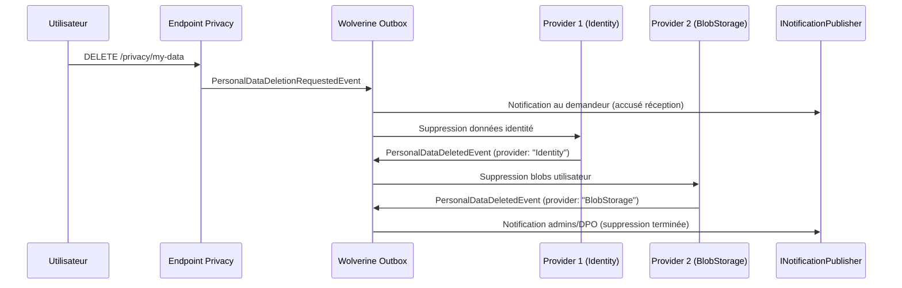

# Sécurité — Privacy & RGPD

Granit intègre la conformité RGPD (Règlement Général sur la Protection des Données)
à travers plusieurs modules coordonnés. Cette page documente les mécanismes de protection
des données personnelles et leur interaction avec les notifications.

## Principes

| Principe RGPD | Implémentation Granit |
| --- | --- |
| **Minimisation** (Art. 5) | Les payloads de notification ne contiennent que des identifiants techniques |
| **Droit à l'effacement** (Art. 17) | `Granit.Privacy` + événements d'intégration |
| **Droit d'accès** (Art. 15) | Endpoints applicatifs (hors scope framework) |
| **Pseudonymisation** | `ITransitEncryptionService` (Vault) pour les données sensibles |
| **Notification de violation** (Art. 33/34) | Notifications multi-canal obligatoires |

## Module Granit.Privacy

Le module `Granit.Privacy` fournit les abstractions pour le droit à l'effacement :

- `IPersonalDataProvider` — interface implémentée par chaque module qui stocke des PII
- `PersonalDataDeletionRequestedEvent` — événement d'intégration déclenché par l'utilisateur
- `PersonalDataDeletedEvent` — événement d'intégration émis après suppression chez un provider

### Flux de suppression

## Notifications liées à la privacy

Les événements RGPD sont câblés au système de notification **au niveau applicatif**
(pas dans le framework) car les définitions de notification sont spécifiques à l'application.

### PersonalDataDeletionRequestedEvent

- **Destinataires** : l'utilisateur qui a fait la demande
- **Canaux** : InApp + Email
- **Opt-out** : `false` (obligatoire Art. 17 RGPD — accusé de réception)
- **Données** : `RequestId` uniquement (pas de PII)

### PersonalDataDeletedEvent

- **Destinataires** : administrateurs et DPO abonnés au type de notification
- **Canaux** : InApp + Email
- **Opt-out** : `false` (obligatoire pour la piste d'audit ISO 27001)
- **Données** : `RequestId`, `ProviderName`, `AffectedRecords` (compteur)

### IdentityUserDeletedEvent

- **Destinataires** : administrateurs abonnés
- **Canaux** : InApp + Email
- **Opt-out** : `false` (piste d'audit ISO 27001)
- **Données** : `UserId` (identifiant technique uniquement)

> Voir [workflow-notifications.md](../messaging/workflow-notifications.md) pour les diagrammes
> de séquence détaillés et le tableau récapitulatif complet.

## Règles de conformité dans les notifications

### Pas de PII dans les payloads

Les données de notification (`INotificationData`) ne doivent **jamais** contenir de données
personnelles identifiantes :

| Interdit | Autorisé |
| --- | --- |
| Nom, prénom | `UserId` (GUID) |
| Adresse email | `RequestId` |
| Numéro de téléphone | `ProviderName` |
| Adresse postale | `AffectedRecords` (compteur) |

Le frontend résout les noms affichés via les endpoints Identity.

### Pas de PII dans les logs et spans

Les logs structurés et les spans OpenTelemetry suivent la même règle :

- `NotificationId`, `ChannelName`, `RecipientUserId` (GUID) — autorisés
- Email, téléphone, contenu de la notification — **interdits**

### Chiffrement des secrets

Les credentials des canaux de notification doivent être **chiffrés via Vault** :

- Clés VAPID (Web Push)
- Credentials SMTP
- Clés API Brevo
- Tokens FCM

### Conservation des données

- `NotificationDeliveryAttempt` : **INSERT-only** (immuable pour l'audit)
- Durée de conservation : **3 ans minimum** (politique de purge applicative)
- Infrastructure : **en Europe** (conformité RGPD)

## Modules concernés

| Module | Données personnelles | Mécanisme de suppression |
| --- | --- | --- |
| `Granit.Identity.EntityFrameworkCore` | Cache utilisateur (nom, email) | `IPersonalDataProvider` — purge du cache |
| `Granit.BlobStorage.EntityFrameworkCore` | Métadonnées blobs | `IPersonalDataProvider` — suppression métadonnées + blobs S3 |
| `Granit.Notifications.EntityFrameworkCore` | Préférences, tokens push | `IPersonalDataProvider` — suppression préférences et tokens |
| `Granit.Timeline.EntityFrameworkCore` | Événements timeline | `IPersonalDataProvider` — pseudonymisation des acteurs |

## Voir aussi

- [Câblage Workflow → Notifications](../messaging/workflow-notifications.md) — flux complets
  des événements lifecycle vers les notifications
- [Notifications](../messaging/notifications.md) — architecture multi-canal
- [Encryption](encryption.md) — chiffrement Vault Transit
- [Identity](identity.md) — gestion des utilisateurs et cache
