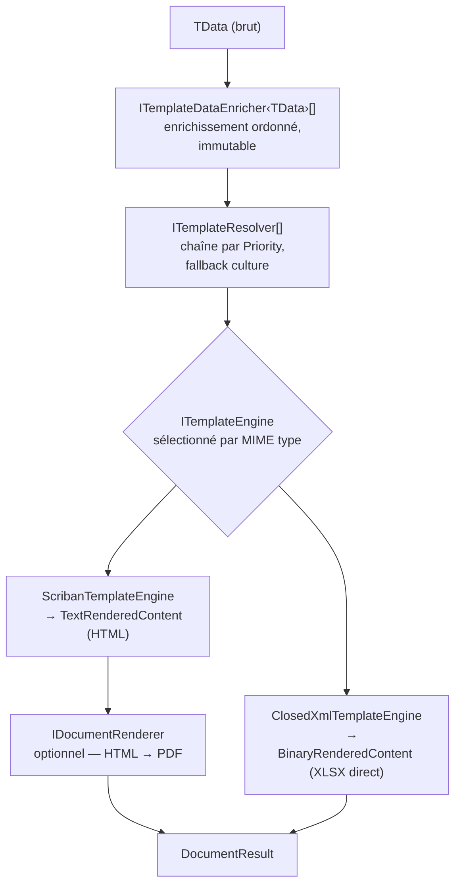
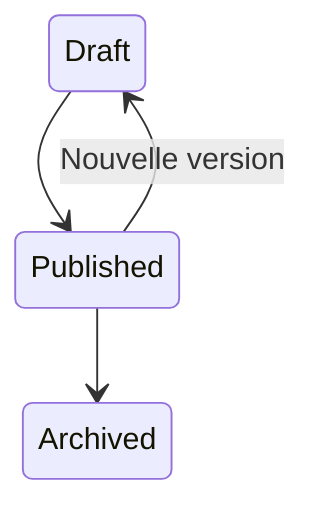
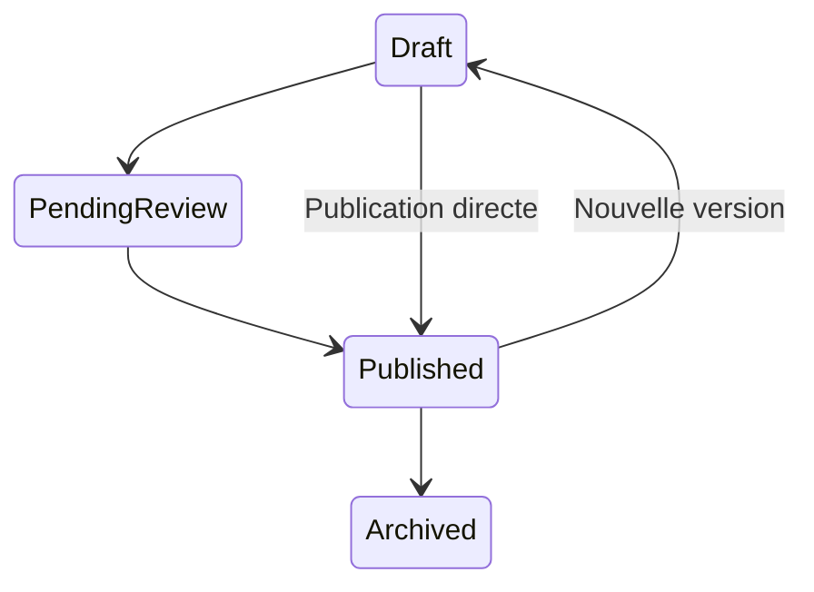

# Templating et génération documentaire — Granit.Templating

Moteur de rendu de templates et génération de documents (PDF, Excel) pour les applications
Digital Dynamics.

| Package | Rôle |
| --- | --- |
| `Granit.Templating` | Socle générique : interfaces, pipeline, enrichisseurs |
| `Granit.Templating.Scriban` | Moteur Scriban 6 sandboxé + contextes globaux (`now.*`, `context.*`) |
| `Granit.Templating.EntityFrameworkCore` | `IDocumentTemplateStoreReader` / `IDocumentTemplateStoreWriter` EF Core — cycle de vie Draft/Published/Archived + **cache hybride** |
| `Granit.DocumentGeneration` | Façade `IDocumentGenerator`, `IDocumentRenderer`, `DocumentResult` |
| `Granit.DocumentGeneration.Pdf` | `PuppeteerSharpRenderer` — HTML → PDF via Chromium sans tête *(à venir)* |
| `Granit.DocumentGeneration.Excel` | `ClosedXmlTemplateEngine` — génération de tableurs *.xlsx* natifs |
| `Granit.Templating.Endpoints` | Endpoints Minimal API d'administration (CRUD brouillons, publish/unpublish, historique) — permission `Templates.Manage` |
| `Granit.Templating.Workflow` | Pont optionnel vers `Granit.Workflow` — FSM, approbation, piste d'audit unifiée |

## Pipeline complet



La sélection du moteur est automatique : chaque `ITemplateEngine` déclare les MIME types
qu'il peut rendre via `CanRender(descriptor)`. Le premier moteur compatible est utilisé.

## Concepts clés

### Types de templates

```csharp
// Template textuel (email, SMS, notification)
public abstract class TextTemplateType<TData> : TemplateType<TData> where TData : notnull
{
    public abstract string Name { get; }
}

// Template documentaire — source HTML ou XLSX, sortie binaire
public abstract class DocumentTemplateType<TData> : TextTemplateType<TData> where TData : notnull
{
    public virtual DocumentFormat DefaultFormat => DocumentFormat.Pdf;
}
```

Définir ses propres types :

```csharp
public sealed class WelcomeEmailType : TextTemplateType<WelcomeEmailData>
{
    public override string Name => "Notifications.WelcomeEmail";
}

public sealed class InvoiceTemplateType : DocumentTemplateType<InvoiceData>
{
    public override string Name => "Billing.Invoice";
    // DefaultFormat = Pdf par défaut
}

// Template Excel natif — le contenu est un XLSX en base64 dans le store
public sealed class ExcelInvoiceTemplateType : DocumentTemplateType<InvoiceData>
{
    public override string Name => "Billing.Invoice.Excel";
    public override DocumentFormat DefaultFormat => DocumentFormat.Excel;
}
```

### Résolution de template

Les templates sont résolus par une chaîne d'`ITemplateResolver`, ordonnée par `Priority`
décroissante. La résolution tente d'abord la clé avec la culture courante, puis la clé neutre :

```text
Résolution de "Billing.Invoice" avec culture "fr-BE" :
  1. Tous les resolvers → clé (name="Billing.Invoice", culture="fr-BE")
  2. Si non trouvé → clé (name="Billing.Invoice", culture=null)
  3. Si non trouvé → TemplateNotFoundException
```

| Resolver | Priorité | Source |
| --- | --- | --- |
| `StoreTemplateResolver` | 100 | `IDocumentTemplateStoreReader` (EF Core) — templates publiés |
| `EmbeddedTemplateResolver` | -100 | Ressources embarquées dans l'assembly — fallback code |

### Enrichissement des données

`ITemplateDataEnricher<TData>` permet d'enrichir le modèle avant le rendu (ex. : génération
de QR code, pré-chargement d'un blob distant, calcul de signature). Le modèle est immutable :
les enrichisseurs retournent un nouveau `TData` via `record with`.

```csharp
public sealed class QrCodeEnricher : ITemplateDataEnricher<InvoiceData>
{
    public int Order => 10;

    public Task<InvoiceData> EnrichAsync(InvoiceData data, CancellationToken ct = default)
    {
        string svg = QrCodeGenerator.Generate(data.InvoiceNumber);
        return Task.FromResult(data with { QrCodeSvg = svg });
    }
}
```

### Moteur Scriban

Le moteur Scriban expose `TData` sous la variable `model` avec des noms en snake\_case.

```html
<!-- Template HTML Scriban -->
<h1>Facture {{ model.invoice_number }}</h1>
<p>Client : {{ model.customer_name }}</p>
<p>Date : {{ now.date }}</p>
<p>Culture : {{ context.culture }}</p>
```

Variables globales disponibles sans configuration :

| Variable | Valeur | Exemple |
| --- | --- | --- |
| `{{ now.date }}` | Date locale | `27/02/2026` |
| `{{ now.datetime }}` | Date et heure locale | `27/02/2026 14:35` |
| `{{ now.iso }}` | Format ISO 8601 | `2026-02-27T14:35:00+00:00` |
| `{{ now.year }}` | Année | `2026` |
| `{{ now.month }}` | Mois | `02` |
| `{{ now.day }}` | Jour | `27` |
| `{{ now.time }}` | Heure | `14:35` |
| `{{ context.culture }}` | Culture courante (BCP 47) | `fr-BE` |
| `{{ context.culture_name }}` | Nom de la culture | `français (Belgique)` |
| `{{ context.tenant_id }}` | ID du tenant courant | `3fa85f64-…` ou vide |
| `{{ context.tenant_name }}` | Nom du tenant | `Hôpital Saint-Luc` ou vide |

> **Sécurité :** les templates s'exécutent dans un `TemplateContext` sandboxé
> (`EnableRelaxedMemberAccess = false`). Aucun accès I/O, réseau ou réflexion .NET
> n'est possible depuis un template.

### Moteur Excel (ClosedXML)

`ClosedXmlTemplateEngine` génère des fichiers XLSX directement à partir d'un template
stocké en base64 dans le store (`MimeType = "application/vnd.openxmlformats-officedocument.spreadsheetml.sheet"`).

Les cellules de type texte peuvent contenir des placeholders `{{model.propriété}}` :

```text
Cellule A1 : "Facture {{model.invoice_number}}"
Cellule B1 : "Client : {{model.customer_name}}"
Cellule C1 : "Adresse : {{model.address.city}}"
```

Les propriétés sont exprimées en snake\_case avec notation pointée pour les objets imbriqués.
Le remplacement est effectué sur toutes les feuilles du classeur.

> **Remarque :** contrairement au moteur Scriban, le moteur Excel ne supporte pas les boucles
> ni les conditions — il effectue une substitution de chaînes simple. Pour des tableaux
> dynamiques, utilisez un renderer HTML→Excel avec Scriban comme source.

### Cycle de vie des templates (IDocumentTemplateStoreWriter)

Sans le module Workflow :



Avec `Granit.Templating.Workflow` installé :



| État | Règle |
| --- | --- |
| `Draft` | Éditable ; jamais utilisé par le pipeline de rendu |
| `PendingReview` | Soumis pour validation ; uniquement si `Granit.Templating.Workflow` est installé |
| `Published` | Version active ; une seule par clé à un instant donné |
| `Archived` | Conservé pour la piste d'audit HDS — **jamais supprimé physiquement** |

Seuls les brouillons (`Draft`) peuvent être supprimés physiquement. Les révisions dépréciées
sont conservées sans limite de durée (obligation HDS, article L. 1111-8 CSP — 3 ans minimum).

### Hook de transition (ITemplateTransitionHook)

Le cycle de vie est extensible via `ITemplateTransitionHook`, un point d'extension
enregistré par défaut avec un no-op (`NullTemplateTransitionHook`) :

- `CanTransitionAsync(from, target)` — vérifie si la transition est autorisée
- `OnTransitionedAsync(revisionId, from, target, userId)` — notifié après la persistance

Sans module externe, seules les transitions simples (Draft → Published, Published → Archived,
Published → Draft) sont autorisées. `Granit.Templating.Workflow` remplace ce hook par
`WorkflowTemplateTransitionHook` qui délègue au `IWorkflowManager<WorkflowLifecycleStatus>`
et persiste un `WorkflowTransitionRecord` pour la piste d'audit HDS unifiée.

Ce patron est identique à `ICurrentTenant` / `NullTenantContext` dans `Granit.Core` :
aucune dépendance forte vers le module Workflow n'est nécessaire dans les packages Templating.

### Cache hybride (HybridCache)

`EfDocumentTemplateStore` met en cache les templates publiés via `HybridCache` (.NET 10) :

- **L1** : in-process `MemoryCache` — accès sub-milliseconde
- **L2** : cache distribué (Redis) si configuré dans l'application hôte

Le cache est invalidé automatiquement (`RemoveAsync`) après chaque `PublishAsync` et
`UnpublishAsync`. La clé de cache suit le schéma `granit:tmpl:{name}|{culture}`.

`AddGranitTemplatingEntityFrameworkCore()` appelle `AddHybridCache()` — aucune configuration
supplémentaire n'est requise pour le L1. Pour activer le L2 Redis, configurer
`AddHybridCache().AddStackExchangeRedisCache(...)` dans l'application hôte après l'appel.

## Installation

### 1 — Modules

```csharp
// Avec moteur Scriban, store EF Core et génération Excel
[DependsOn(
    typeof(GranitTemplatingScribanModule),
    typeof(GranitTemplatingEntityFrameworkCoreModule),
    typeof(GranitDocumentGenerationModule),
    typeof(GranitDocumentGenerationExcelModule))]
public sealed class MyAppModule : GranitModule { }
```

> `GranitTemplatingScribanModule` dépend déjà de `GranitTemplatingModule`.
> `GranitDocumentGenerationModule` dépend déjà de `GranitTemplatingModule`.
> `GranitDocumentGenerationExcelModule` dépend déjà de `GranitTemplatingModule`.

### 2 — Enregistrement des services

```csharp
// Moteur Scriban (ITemplateEngine + contextes globaux now.* et context.*)
builder.Services.AddGranitTemplatingWithScriban();

// Moteur Excel ClosedXML (ITemplateEngine, additive — les deux moteurs coexistent)
builder.Services.AddGranitDocumentGenerationExcel();

// Store EF Core (IDocumentTemplateStoreReader/Writer + StoreTemplateResolver + HybridCache L1)
builder.AddGranitTemplatingEntityFrameworkCore(options =>
    options.UseNpgsql(builder.Configuration.GetConnectionString("Default")));

// Templates embarqués dans l'assembly (résolution fallback, Priority = -100)
builder.Services.AddEmbeddedTemplates(typeof(MyAppModule).Assembly);

// Enrichisseur de données (optionnel)
builder.Services.AddTemplateDataEnricher<InvoiceData, QrCodeEnricher>();

// Contexte global personnalisé (optionnel)
builder.Services.AddTemplateGlobalContext<MyCustomContext>();

// Façade de génération documentaire
builder.Services.AddGranitDocumentGeneration();

// Pont Workflow (optionnel — FSM, approbation, piste d'audit unifiée)
builder.Services.AddGranitTemplatingWorkflow();
```

### 3 — Ressources embarquées

Convention de nommage pour les templates embarqués dans l'assembly :

```text
{AssemblyName}.Templates.{TemplateName}.html        (neutre)
{AssemblyName}.Templates.{TemplateName}.fr.html     (spécifique culture)
```

Marquer les fichiers comme ressources embarquées dans le `.csproj` :

```xml
<ItemGroup>
  <!-- Fichier neutre -->
  <EmbeddedResource Include="Templates/Billing.Invoice.html"
      LogicalName="$(RootNamespace).Templates.Billing.Invoice.html" />

  <!-- Fichier spécifique à une culture -->
  <!-- WithCulture="false" empêche MSBuild de le placer dans une assembly satellite -->
  <EmbeddedResource Include="Templates/Billing.Invoice.fr.html"
      LogicalName="$(RootNamespace).Templates.Billing.Invoice.fr.html"
      WithCulture="false" />
</ItemGroup>
```

> **Important :** tout fichier dont le nom contient un code de culture reconnu
> (ex. `.fr.html`, `.fr-BE.html`) est automatiquement placé par MSBuild dans une
> assembly satellite (`fr/MyApp.resources.dll`) et devient **invisible** à
> `GetManifestResourceStream`. Les attributs `LogicalName` + `WithCulture="false"`
> sont obligatoires pour les templates culture-spécifiques embarqués.

## Utilisation

### Rendu d'un template textuel (email)

```csharp
public sealed class WelcomeEmailService(ITextTemplateRenderer renderer)
{
    public async Task<string> GetHtmlAsync(
        WelcomeEmailData data, CancellationToken ct)
    {
        RenderedTextResult result = await renderer.RenderAsync(
            new WelcomeEmailType(), data, ct);

        return result.Html;
    }
}
```

### Génération d'un document PDF (HTML → PDF)

```csharp
public sealed class InvoiceService(IDocumentGenerator generator)
{
    public async Task<DocumentResult> GenerateInvoiceAsync(
        InvoiceData data, CancellationToken ct)
    {
        return await generator.GenerateAsync(
            new InvoiceTemplateType(), data, ct: ct);
    }
}
```

### Génération d'un tableur Excel natif

Le template est un fichier *.xlsx* stocké en base64 dans le store avec le MIME type Excel.
Le moteur `ClosedXmlTemplateEngine` est sélectionné automatiquement.

```csharp
public sealed class ExcelReportService(IDocumentGenerator generator)
{
    public async Task<DocumentResult> GenerateReportAsync(
        ReportData data, CancellationToken ct)
    {
        // Le MIME type du template détermine automatiquement le moteur (ClosedXML)
        return await generator.GenerateAsync(
            new ExcelReportTemplateType(), data, ct: ct);
    }
}
```

Forcer un format différent du défaut :

```csharp
DocumentResult excel = await generator.GenerateAsync(
    new InvoiceTemplateType(), data,
    targetFormat: DocumentFormat.Excel,
    ct: ct);
```

### Administration des templates (store EF Core)

```csharp
public sealed class TemplateAdminService(
    IDocumentTemplateStoreReader storeReader,
    IDocumentTemplateStoreWriter storeWriter)
{
    // Créer ou mettre à jour un brouillon
    public Task SaveDraftAsync(TemplateKey key, string html, CancellationToken ct)
        => storeWriter.SaveDraftAsync(key, html, "text/html", "admin@digitaldynamics.be", ct);

    // Publier le brouillon courant (invalide le cache HybridCache)
    public Task PublishAsync(TemplateKey key, CancellationToken ct)
        => storeWriter.PublishAsync(key, "admin@digitaldynamics.be", ct);

    // Consulter l'historique complet (audit HDS)
    public Task<IReadOnlyList<TemplateRevision>> GetHistoryAsync(
        TemplateKey key, CancellationToken ct)
        => storeReader.GetHistoryAsync(key, ct);
}
```

## Endpoints d'administration (Granit.Templating.Endpoints)

Le package `Granit.Templating.Endpoints` fournit des endpoints Minimal API pour administrer
les templates via le store EF Core. Tous les endpoints nécessitent la permission `Templates.Manage`.

### Enregistrement

```csharp
// Module
[DependsOn(typeof(GranitTemplatingEndpointsModule))]
public sealed class MyAppModule : GranitModule { }

// Endpoints (après app.Build())
app.MapGranitTemplatingAdmin(opts =>
{
    opts.ApiPrefix = "api/v1";            // défaut : "api/v1"
    opts.RoutePrefix = "admin/templates"; // défaut : "admin/templates"
});
```

### Endpoints disponibles

| Méthode | Route | Description |
| --- | --- | --- |
| `GET /` | Liste paginée | Filtres : `page`, `pageSize`, `search`, `status`, `culture` |
| `GET /{name}` | Détail | Brouillon + version publiée (query `?culture=`) |
| `POST /` | Créer un brouillon | Corps : `SaveTemplateRequest` (name, culture, content, mimeType) |
| `PUT /{name}` | Mettre à jour un brouillon | Corps : `SaveTemplateRequest` (culture, content, mimeType) |
| `DELETE /{name}/draft` | Supprimer le brouillon | Query `?culture=` — ne supprime jamais les versions publiées/archivées |
| `POST /{name}/publish` | Publier le brouillon | Archive l'ancienne version publiée, invalide le cache. 409 si transition refusée |
| `POST /{name}/unpublish` | Dépublier | Archive la version publiée. Idempotent si rien n'est publié. 409 si refusé |
| `GET /{name}/lifecycle` | État du cycle de vie | Statut actuel, workflow actif, transitions disponibles |

Si `IDocumentTemplateStoreReader`/`IDocumentTemplateStoreWriter` ne sont pas enregistrés
(pas de module EF Core chargé), tous les endpoints retournent `501 Not Implemented`.

### Validation

Le corps des requêtes POST/PUT est validé par FluentValidation (`SaveTemplateRequestValidator`) :

- `Name` : max 200 caractères, format `Domain.Name` (requis pour POST)
- `Culture` : max 10 caractères, format BCP 47
- `Content` : non vide
- `MimeType` : non vide, max 127 caractères

Les paramètres de route et de query (`name`, `culture`, `page`, `pageSize`) sont validés
en amont dans le handler avec des réponses `400 Problem Details` (RFC 7807).

## Exceptions

| Classe | Déclencheur |
| --- | --- |
| `TemplateNotFoundException` | Aucun resolver n'a trouvé le template pour la clé et la culture demandées |
| `TemplateParseException` | Le source du template contient des erreurs de syntaxe Scriban |
| `TemplateTransitionDeniedException` | `ITemplateTransitionHook.CanTransitionAsync` a refusé la transition demandée |
| `DocumentRendererNotFoundException` | Aucun `IDocumentRenderer` enregistré pour le `DocumentFormat` demandé |
| `InvalidOperationException` | Aucun `ITemplateEngine` ne peut rendre le MIME type du template résolu |

## Architecture interne

```text
ITextTemplateRenderer (TextTemplateRenderer — internal, scoped)
  ├── IEnumerable<ITemplateDataEnricher<TData>>   (résolution via IServiceProvider)
  ├── IEnumerable<ITemplateResolver>               (ordonnés par Priority décroissante)
  │     ├── EmbeddedTemplateResolver  (Priority = -100)
  │     └── StoreTemplateResolver     (Priority = 100, via Granit.Templating.EntityFrameworkCore)
  ├── IEnumerable<ITemplateEngine>                 (sélection par CanRender — MIME type)
  │     ├── ScribanTemplateEngine    (singleton, via Granit.Templating.Scriban)
  │     └── ClosedXmlTemplateEngine  (singleton, via Granit.DocumentGeneration.Excel)
  └── IEnumerable<ITemplateGlobalContext>          (singletons)
        ├── NowGlobalContext              → now.*
        └── ExecutionContextGlobalContext → context.*

IDocumentTemplateStoreReader / IDocumentTemplateStoreWriter (EfDocumentTemplateStore — internal, scoped)
  ├── IDbContextFactory<TemplatingDbContext>
  ├── HybridCache                                  (L1 MemoryCache + L2 Redis optionnel)
  └── ITemplateTransitionHook
        ├── NullTemplateTransitionHook (défaut — transitions simples, pas de workflow)
        └── WorkflowTemplateTransitionHook (via Granit.Templating.Workflow)

IDocumentGenerator (DocumentGenerator — internal, scoped)
  ├── ITextTemplateRenderer        (rendu via pipeline ci-dessus)
  └── IEnumerable<IDocumentRenderer>
        └── PuppeteerSharpRenderer (singleton, via Granit.DocumentGeneration.Pdf — à venir)

Flux selon le type de moteur :
  Scriban (text/html) → TextRenderedContent → IDocumentRenderer → DocumentResult
  ClosedXML (xlsx)    → BinaryRenderedContent ─────────────────→ DocumentResult
```

## Roadmap

| Story | Statut | Description |
| --- | --- | --- |
| #327 | ✅ Terminé | Interfaces du pipeline (`ITextTemplateRenderer`, `ITemplateEngine`, `ITemplateResolver`) |
| #328 | ✅ Terminé | Types de template fortement typés (`TextTemplateType<TData>`, `DocumentTemplateType<TData>`) |
| #329 | ✅ Terminé | Rendu Scriban 6 sandboxé — scalaires, collections, conditions, snake_case |
| #331 | ✅ Terminé | Store EF Core — cycle de vie Draft/Published/Archived + historique audit HDS |
| #332 | ✅ Terminé | Cache hybride des templates résolus avec invalidation sur publication |
| #333 | ✅ Terminé | Traçabilité HDS — `RevisionId` propagé du store jusqu'au `DocumentResult` |
| #334 | ✅ Terminé | `Granit.DocumentGeneration.Excel` — tableurs *.xlsx* via ClosedXML |
| #335 | ✅ Terminé | Documentation complète |
| #336 | ✅ Terminé | Variables globales Scriban : `NowGlobalContext` et `ExecutionContextGlobalContext` |
| #338 | ✅ Terminé | Façade `IDocumentGenerator` et pipeline d'orchestration binaire |
| #339 | ✅ Terminé | Pipeline d'enrichissement `ITemplateDataEnricher<TData>` |
| #454 | 🔨 En cours | `Granit.Templating.Workflow` — intégration optionnelle du module Workflow |
| #330 | 🔜 Planifié | `PuppeteerSharpRenderer` — HTML → PDF via Chromium sans tête |
| #340 | ⏸ Différé | PDF/A-3b — Factur-X (loi e-facture sept. 2026, licence iText7 en attente) |

## Conformité HDS / RGPD

- **Piste d'audit** : `TemplateRevision.RevisionId` est propagé dans `RenderedContent.RevisionId`,
  permettant de tracer quelle version du template a produit chaque document.
- **Immutabilité** : les révisions `Archived` ne sont jamais supprimées physiquement.
- **Cache invalidé à la publication** : le cache hybride est vidé immédiatement après
  `PublishAsync` et `UnpublishAsync` — aucune fenêtre de stale read.
- **Données personnelles** : ne jamais exposer de PII dans les `ITemplateGlobalContext`.
  Les données sensibles (nom du patient, numéro de SS) transitent exclusivement via `TData`.
- **Sandbox Scriban** : un template compromis ne peut pas accéder au système de fichiers,
  au réseau ou à la réflexion .NET.

## Dépendances Granit

| Package | Dépend de |
| --- | --- |
| `Granit.Templating` | `Granit.Core`, `Granit.Timing` |
| `Granit.Templating.Scriban` | `Granit.Templating`, `Granit.Timing`, `Scriban 6.*` |
| `Granit.Templating.EntityFrameworkCore` | `Granit.Templating`, EF Core 10, `Microsoft.Extensions.Caching.Hybrid` |
| `Granit.DocumentGeneration` | `Granit.Templating` |
| `Granit.DocumentGeneration.Pdf` | `Granit.DocumentGeneration`, `PuppeteerSharp` |
| `Granit.DocumentGeneration.Excel` | `Granit.Templating`, `ClosedXML 0.104.*` |
| `Granit.Templating.Endpoints` | `Granit.Templating`, `Granit.Authorization`, `Granit.Security`, `Granit.Validation`, `Granit.ApiDocumentation` |
| `Granit.Templating.Workflow` | `Granit.Templating`, `Granit.Workflow`, `Granit.Workflow.EntityFrameworkCore` |

> Voir le [graphe de dépendances complet](../dependencies.md).
