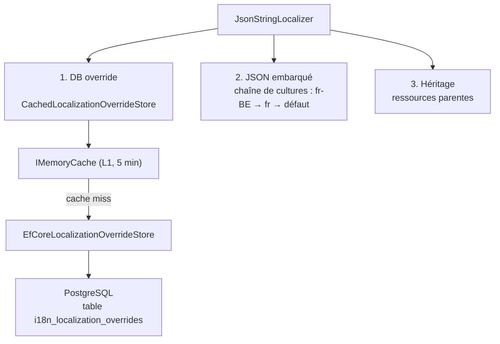

# Surcharges de traduction en base de données

`Granit.Localization` et `Granit.Localization.EntityFrameworkCore`
permettent de surcharger à chaud les traductions JSON sans redéploiement.
Les surcharges sont stockées en PostgreSQL, mises en cache en mémoire, et
prennent priorité sur les fichiers embarqués.

## Cas d'usage

- Adapter la terminologie métier par tenant (« Patient » → « Bénéficiaire »,
  « Médecin » → « Praticien ») sans toucher aux packages
- Corriger une traduction en production sans redéploiement
- Tester un libellé pour un tenant pilote avant déploiement global

## Architecture



## Packages

| Package | Rôle |
| --- | --- |
| `Granit.Localization` | `CachedLocalizationOverrideStore` (Singleton, `IMemoryCache`) — inclus dans le module de base |
| `Granit.Localization.EntityFrameworkCore` | `EfCoreLocalizationOverrideStore` (Scoped, PostgreSQL) |
| `Granit.Localization.Endpoints` | Endpoints CRUD d'administration (optionnel) |

## Installation

```bash
dotnet add package Granit.Localization.EntityFrameworkCore
```

`Granit.Localization` est tiré automatiquement en transitif.

## Configuration

### Module Granit

```csharp
[DependsOn(
    typeof(GranitLocalizationEntityFrameworkCoreModule),
    typeof(GranitPersistenceModule))]
public sealed class AppModule : GranitModule { }
```

### Enregistrement EF Core

> **Note** : les exemples utilisent `UseNpgsql()` (PostgreSQL). Granit est agnostique :
> tout provider EF Core est supporté (`UseSqlServer()`, `UseSqlite()`, etc.).

```csharp
builder.AddGranitLocalizationEntityFrameworkCore(opt =>
    opt.UseNpgsql(connectionString));
```

À placer après `builder.AddGranitModules<AppModule>()`.

### Options du cache

```json
{
  "LocalizationOverridesCache": {
    "CacheTtl": "00:05:00"
  }
}
```

La durée par défaut est **5 minutes**. Une valeur courte est recommandée
pour les environnements où les overrides changent fréquemment.

## Table PostgreSQL

La migration est générée par l'application hôte :

```bash
dotnet ef migrations add AddLocalizationOverrides
dotnet ef database update
```

Colonnes de la table `i18n_localization_overrides` :

| Colonne | Type | Description |
| --- | --- | --- |
| `id` | `uuid` | PK |
| `tenant_id` | `uuid?` | `null` = global (tous tenants) |
| `resource_name` | `varchar(200)` | Ex. `"Acme"` |
| `culture_name` | `varchar(20)` | BCP 47 : `"fr"`, `"en-US"` |
| `key` | `varchar(500)` | Clé de traduction |
| `value` | `varchar(4000)` | Valeur de remplacement |
| `created_at` | `timestamptz` | Audit ISO 27001 |
| `created_by` | `varchar(450)` | Audit ISO 27001 |
| `modified_at` | `timestamptz?` | Audit ISO 27001 |
| `modified_by` | `varchar(450)?` | Audit ISO 27001 |

Index unique sur `(tenant_id, resource_name, culture_name, key)`.

## Utilisation programmatique

Injecter `ILocalizationOverrideStoreReader` et/ou `ILocalizationOverrideStoreWriter`
dans un service :

```csharp
public sealed class TranslationAdminService(
    ILocalizationOverrideStoreReader storeReader,
    ILocalizationOverrideStoreWriter storeWriter)
{
    public Task<Dictionary<string, string>> GetAsync(CancellationToken cancellationToken) =>
        storeReader.GetOverridesAsync("Acme", "fr", ct);

    public Task SetAsync(string key, string value, CancellationToken cancellationToken) =>
        storeWriter.SetOverrideAsync("Acme", "fr", key, value, ct);

    public Task RemoveAsync(string key, CancellationToken cancellationToken) =>
        storeWriter.RemoveOverrideAsync("Acme", "fr", key, ct);
}
```

`ILocalizationOverrideStoreReader` est automatiquement injecté dans `JsonStringLocalizerFactory`.
Après chaque `SetOverrideAsync` ou `RemoveOverrideAsync`, le cache L1 est invalidé
pour la culture concernée — la prochaine résolution relit PostgreSQL.

## Endpoints CRUD (administration)

Le package `Granit.Localization.Endpoints` expose 3 endpoints protégés par la
permission `Localization.Overrides.Manage` :

```csharp
app.MapGranitLocalizationOverrides();
```

### `GET /api/granit/localization/overrides`

Retourne toutes les surcharges d'une ressource pour une culture :

```http
GET /api/granit/localization/overrides?resourceName=Acme&cultureName=fr
Authorization: Bearer <token>
```

```json
{
  "Patient.Title": "Bénéficiaire",
  "Doctor.Title": "Praticien de santé"
}
```

### `PUT /api/granit/localization/overrides/{resourceName}/{cultureName}/{key}`

Crée ou met à jour une surcharge (upsert) :

```http
PUT /api/granit/localization/overrides/Acme/fr/Patient.Title
Authorization: Bearer <token>
Content-Type: application/json

{ "value": "Bénéficiaire" }
```

Réponse : `204 No Content`.

### `DELETE /api/granit/localization/overrides/{resourceName}/{cultureName}/{key}`

Supprime une surcharge (no-op si la clé n'existe pas) :

```http
DELETE /api/granit/localization/overrides/Acme/fr/Patient.Title
Authorization: Bearer <token>
```

Réponse : `204 No Content`.

### Codes d'erreur

| Code | Cause |
| --- | --- |
| `400` | `cultureName` non valide (BCP 47), `value` vide, paramètres manquants, `resourceName` > 200 car., `key` > 500 car., `value` > 4000 car. |
| `401` | Non authentifié |
| `403` | Permission `Localization.Overrides.Manage` non accordée |
| `501` | `ILocalizationOverrideStoreReader` / `ILocalizationOverrideStoreWriter` non enregistré (module EF Core absent) |

## Gestion des permissions

La permission `Localization.Overrides.Manage` est déclarée automatiquement
par `GranitLocalizationEndpointsModule`. Pour l'accorder :

```csharp
// Via options (rôle Keycloak admin)
{
  "Authorization": {
    "AdminRoles": ["granit-admin"]
  }
}

// Via IPermissionManager (grant par rôle)
await permissionManager.SetAsync(
    LocalizationOverridesPermissions.Manage,
    "role-name", tenantId, granted: true, ct);
```

## Multi-tenancy

Les surcharges sont isolées par tenant via `ICurrentTenant` :

- Tenant A (`TenantId = guid-a`) voit ses propres surcharges
- Hôte (pas de tenant actif) voit les surcharges globales (`TenantId = null`)

Le cache L1 est segmenté par tenant :
`localization:{tenantId|"host"}:{resourceName}:{culture}`.

## Audit ISO 27001

Chaque write (`SetOverrideAsync`, `RemoveOverrideAsync`) passe par
`AuditedEntityInterceptor` (Scoped) qui renseigne automatiquement :

- `created_at` / `created_by` à la création
- `modified_at` / `modified_by` à la mise à jour

`CachedLocalizationOverrideStore` crée un `AsyncServiceScope` par opération DB
pour que l'intercepteur Scoped soit disponible depuis le Singleton de cache.

## Services enregistrés

### `AddGranitLocalization()` — module de base

| Service | Implémentation | Lifetime |
| --- | --- | --- |
| `IMemoryCache` | `MemoryCache` | Singleton |
| `ILocalizationOverrideStoreReader` | `CachedLocalizationOverrideStore` | Singleton |
| `ILocalizationOverrideStoreWriter` | `CachedLocalizationOverrideStore` | Singleton |

Sans `Granit.Localization.EntityFrameworkCore`, le store renvoie des dictionnaires
vides — les traductions proviennent uniquement des fichiers JSON embarqués.

### `AddGranitLocalizationEntityFrameworkCore()`

| Service | Implémentation | Lifetime |
| --- | --- | --- |
| `IDbContextFactory<GranitLocalizationOverridesDbContext>` | EF Core factory | Scoped |
| `ILocalizationOverrideStoreReader` (keyed: `"localization-override-raw"`) | `EfCoreLocalizationOverrideStore` | Scoped |
| `ILocalizationOverrideStoreWriter` (keyed: `"localization-override-raw"`) | `EfCoreLocalizationOverrideStore` | Scoped |
