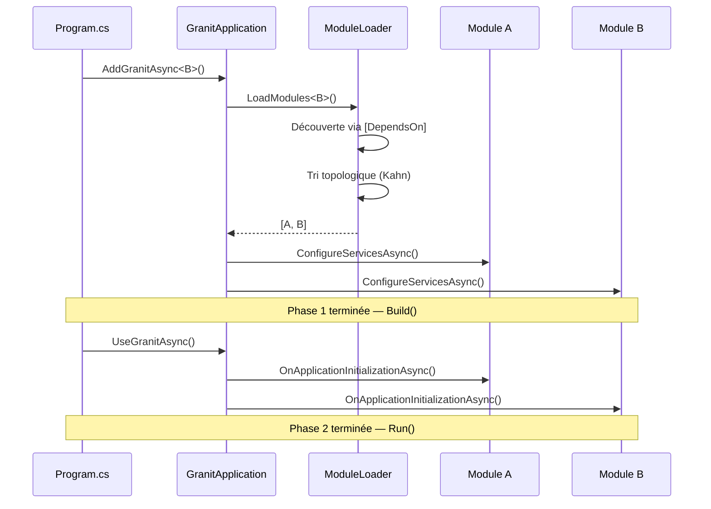

# Étape 1 — Système de modules

Granit organise le code en **modules**. Chaque module est une unité autonome
qui déclare ses dépendances et enregistre ses services.

## Concepts clés

### GranitModule

Toute fonctionnalité Granit hérite de `GranitModule`. Cette classe de base
expose quatre hooks de cycle de vie :

```csharp
public abstract class GranitModule
{
    // Phase 1 : enregistrement des services (avant Build)
    public virtual void ConfigureServices(ServiceConfigurationContext context) { }
    public virtual Task ConfigureServicesAsync(ServiceConfigurationContext context) { ... }

    // Phase 2 : initialisation de l'application (après Build, avant Run)
    public virtual void OnApplicationInitialization(ApplicationInitializationContext context) { }
    public virtual Task OnApplicationInitializationAsync(ApplicationInitializationContext context) { ... }
}
```

### Dépendances avec `[DependsOn]`

L'attribut `[DependsOn]` déclare les modules requis. Granit les charge
automatiquement dans l'ordre topologique (dépendances d'abord) :

```csharp
[DependsOn(typeof(GranitTimingModule))]
[DependsOn(typeof(GranitPersistenceModule))]
public sealed class MyAppModule : GranitModule
{
    public override void ConfigureServices(ServiceConfigurationContext context)
    {
        // GranitTimingModule et GranitPersistenceModule sont déjà configurés ici
    }
}
```

### Point d'entrée unique

Un seul appel dans `Program.cs` remplace tous les enregistrements manuels :

```csharp
await builder.AddGranitAsync<MyAppModule>();
```

Granit découvre `MyAppModule`, résout ses `[DependsOn]`, et appelle
`ConfigureServices` sur chaque module dans l'ordre.

## Diagramme de chargement



## Règles importantes

- **Un module = un package NuGet** : `Granit.Timing` contient `GranitTimingModule`
- **Pas de dépendances circulaires** : le `ModuleLoader` détecte les cycles et lève une exception
- **Constructeur sans paramètre** : les modules sont instanciés par `Activator.CreateInstance()`

## Prochaine étape

Passons à la pratique : [créer le programme minimal](02-programme.md).

## Référence

- [Documentation du système de modules](../../framework/core/modularity.md)
- [Pattern Module System](../../patterns/architecture/module-system.md)
