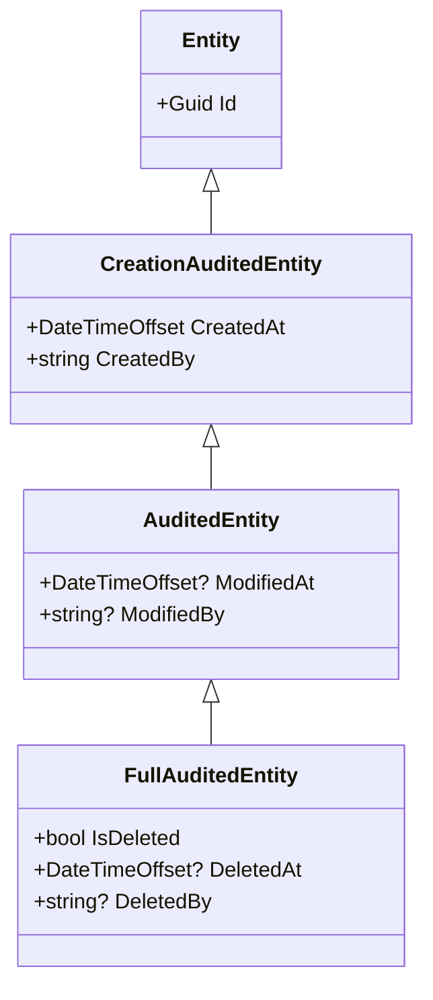

# Étape 3 — Modèle domaine

Granit fournit une hiérarchie d'entités avec audit trail intégré,
conforme aux exigences HDS.

## Hiérarchie d'entités



| Classe | Champs ajoutés | Usage |
| --- | --- | --- |
| `Entity` | `Id` (Guid) | Entité simple sans audit |
| `CreationAuditedEntity` | `CreatedAt`, `CreatedBy` | Traçabilité de la création |
| `AuditedEntity` | `ModifiedAt`, `ModifiedBy` | Traçabilité création + modification |
| `FullAuditedEntity` | `IsDeleted`, `DeletedAt`, `DeletedBy` | Soft delete RGPD (droit à l'effacement) |

## Créer l'entité TaskItem

Créer `Domain/TaskItem.cs` :

```csharp
using Granit.Core.Domain;

namespace TaskManagement.Api.Domain;

/// <summary>
/// A task item in the task management system.
/// Uses <see cref="AuditedEntity"/> for HDS-compliant audit trail.
/// </summary>
public sealed class TaskItem : AuditedEntity
{
    /// <summary>Title of the task.</summary>
    public string Title { get; set; } = string.Empty;

    /// <summary>Optional description with details.</summary>
    public string? Description { get; set; }

    /// <summary>Whether the task has been completed.</summary>
    public bool IsCompleted { get; set; }

    /// <summary>Optional due date (UTC).</summary>
    public DateTimeOffset? DueDate { get; set; }
}
```

## Pourquoi `AuditedEntity` ?

En héritant de `AuditedEntity`, chaque `TaskItem` possède automatiquement :

- `Id` — identifiant unique (GUID séquentiel si `IGuidGenerator` est enregistré)
- `CreatedAt` — horodatage de création (UTC, via `IClock`)
- `CreatedBy` — identifiant de l'utilisateur créateur (via `ICurrentUserService`)
- `ModifiedAt` — horodatage de dernière modification
- `ModifiedBy` — identifiant du dernier modificateur

Ces champs sont **remplis automatiquement** par l'intercepteur `AuditedEntityInterceptor`
de `Granit.Persistence` (étape suivante). Aucun code manuel requis.

## Quand utiliser FullAuditedEntity ?

Si l'application doit supporter le **droit à l'effacement RGPD** avec suppression
logique (soft delete), utiliser `FullAuditedEntity` à la place. Les enregistrements
ne sont jamais physiquement supprimés — un filtre global EF Core les masque
automatiquement.

## Prochaine étape

Connectons cette entité à PostgreSQL : [persistance EF Core](04-persistance.md).

## Référence

- [Hiérarchie d'entités](../../framework/data/domain.md)
- [Soft delete RGPD](../../framework/data/persistence.md)
