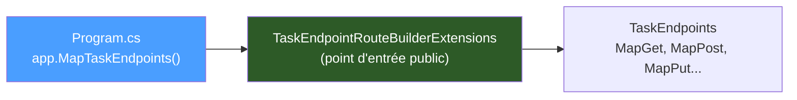

# Étape 5 — Endpoints CRUD

Granit utilise le pattern **Minimal API** avec des méthodes d'extension statiques
pour organiser les endpoints. Pas de contrôleurs MVC, pas d'interface magique :
des méthodes statiques regroupées par responsabilité.

## Le pattern d'endpoints Granit

Le pattern se compose de deux niveaux :

1. **Extension sur `IEndpointRouteBuilder`** : point d'entrée public appelé dans `Program.cs`
2. **Extension sur `RouteGroupBuilder`** : organisation interne des routes par catégorie



## Point d'entrée public

Créer `Endpoints/TaskEndpointRouteBuilderExtensions.cs` :

```csharp
using Microsoft.AspNetCore.Builder;
using Microsoft.AspNetCore.Routing;

namespace TaskManagement.Api.Endpoints;

/// <summary>
/// Extension methods for registering task management endpoints.
/// </summary>
public static class TaskEndpointRouteBuilderExtensions
{
    /// <summary>
    /// Maps the task management CRUD endpoints onto the given route builder.
    /// </summary>
    public static RouteGroupBuilder MapTaskEndpoints(
        this IEndpointRouteBuilder endpoints)
    {
        RouteGroupBuilder group = endpoints
            .MapGroup("/api/tasks")
            .WithTags("Tasks");

        group.MapTaskRoutes();

        return group;
    }
}
```

## Routes CRUD

Créer `Endpoints/TaskEndpoints.cs` :

```csharp
using Microsoft.AspNetCore.Builder;
using Microsoft.AspNetCore.Http;
using Microsoft.AspNetCore.Http.HttpResults;
using Microsoft.AspNetCore.Routing;
using Microsoft.EntityFrameworkCore;
using TaskManagement.Api.Data;
using TaskManagement.Api.Domain;

namespace TaskManagement.Api.Endpoints;

/// <summary>
/// Task CRUD endpoint handlers.
/// </summary>
internal static class TaskEndpoints
{
    internal static RouteGroupBuilder MapTaskRoutes(this RouteGroupBuilder group)
    {
        group.MapGet("/", GetAllAsync)
            .WithName("GetAllTasks")
            .WithSummary("Returns all tasks.");

        group.MapGet("/{id:guid}", GetByIdAsync)
            .WithName("GetTaskById")
            .WithSummary("Returns a specific task.");

        group.MapPost("/", CreateAsync)
            .WithName("CreateTask")
            .WithSummary("Creates a new task.");

        group.MapPut("/{id:guid}", UpdateAsync)
            .WithName("UpdateTask")
            .WithSummary("Updates an existing task.");

        group.MapDelete("/{id:guid}", DeleteAsync)
            .WithName("DeleteTask")
            .WithSummary("Deletes a task.");

        return group;
    }

    private static async Task<Ok<List<TaskItem>>> GetAllAsync(
        TaskDbContext db,
        CancellationToken cancellationToken) =>
        TypedResults.Ok(await db.Tasks.ToListAsync(ct));

    private static async Task<Results<Ok<TaskItem>, NotFound>> GetByIdAsync(
        Guid id,
        TaskDbContext db,
        CancellationToken cancellationToken)
    {
        TaskItem? task = await db.Tasks.FindAsync([id], ct);
        if (task is null)
        {
            return TypedResults.NotFound();
        }

        return TypedResults.Ok(task);
    }

    private static async Task<Created<TaskItem>> CreateAsync(
        CreateTaskRequest request,
        TaskDbContext db,
        CancellationToken cancellationToken)
    {
        TaskItem task = new()
        {
            Title = request.Title,
            Description = request.Description,
            DueDate = request.DueDate
        };

        db.Tasks.Add(task);
        await db.SaveChangesAsync(ct);

        // CreatedAt, CreatedBy et Id sont remplis automatiquement
        // par AuditedEntityInterceptor et IGuidGenerator
        return TypedResults.Created($"/api/tasks/{task.Id}", task);
    }

    private static async Task<Results<NoContent, NotFound>> UpdateAsync(
        Guid id,
        UpdateTaskRequest request,
        TaskDbContext db,
        CancellationToken cancellationToken)
    {
        TaskItem? task = await db.Tasks.FindAsync([id], ct);
        if (task is null)
        {
            return TypedResults.NotFound();
        }

        task.Title = request.Title;
        task.Description = request.Description;
        task.IsCompleted = request.IsCompleted;
        task.DueDate = request.DueDate;

        // ModifiedAt et ModifiedBy sont remplis automatiquement
        await db.SaveChangesAsync(ct);

        return TypedResults.NoContent();
    }

    private static async Task<Results<NoContent, NotFound>> DeleteAsync(
        Guid id,
        TaskDbContext db,
        CancellationToken cancellationToken)
    {
        TaskItem? task = await db.Tasks.FindAsync([id], ct);
        if (task is null)
        {
            return TypedResults.NotFound();
        }

        db.Tasks.Remove(task);
        await db.SaveChangesAsync(ct);

        return TypedResults.NoContent();
    }
}

/// <summary>Request body for task creation.</summary>
/// <param name="Title">Title of the task (required).</param>
/// <param name="Description">Optional description.</param>
/// <param name="DueDate">Optional due date (UTC).</param>
public sealed record CreateTaskRequest(
    string Title,
    string? Description = null,
    DateTimeOffset? DueDate = null);

/// <summary>Request body for task update.</summary>
/// <param name="Title">Updated title.</param>
/// <param name="Description">Updated description.</param>
/// <param name="IsCompleted">Whether the task is completed.</param>
/// <param name="DueDate">Updated due date.</param>
public sealed record UpdateTaskRequest(
    string Title,
    string? Description = null,
    bool IsCompleted = false,
    DateTimeOffset? DueDate = null);
```

## Enregistrer dans Program.cs

Ajouter l'appel dans `Program.cs`, après `UseGranitAsync()` :

```csharp
await app.UseGranitAsync();

app.MapTaskEndpoints();

await app.RunAsync();
```

## Tester

```bash
dotnet run
```

```bash
# Créer une tâche
curl -X POST http://localhost:5000/api/tasks \
  -H "Content-Type: application/json" \
  -d '{"title": "Lire la doc Granit", "description": "Étapes 1 à 8"}'

# Lister les tâches
curl http://localhost:5000/api/tasks
```

La réponse du `POST` contient les champs `createdAt` et `id` remplis
automatiquement par les intercepteurs Granit.

## Prochaine étape

Les endpoints sont ouverts à tous. Ajoutons une [authentification JWT](06-securite.md).

## Référence

- [Pattern endpoints Granit](../../patterns/architecture/middleware-pipeline.md)
- [API Documentation (OpenAPI)](../../framework/api/api-documentation.md)
