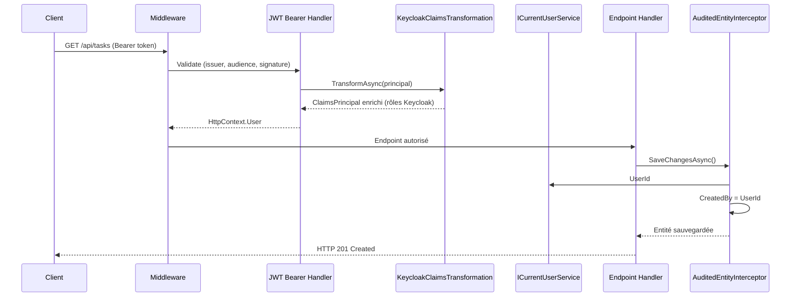

# Étape 6 — Sécurité JWT Keycloak

Granit intègre Keycloak pour l'authentification JWT et fournit un
`ICurrentUserService` qui alimente automatiquement les champs `CreatedBy`
et `ModifiedBy` de l'audit trail.

## Ajouter les packages

```bash
dotnet add package Granit.Authentication.JwtBearer
dotnet add package Granit.Authentication.Keycloak
```

## Configuration

Ajouter la section Keycloak dans `appsettings.Development.json` :

```json
{
  "JwtBearer": {
    "Authority": "http://localhost:8080/realms/task-management",
    "Audience": "task-management-api",
    "RequireHttpsMetadata": false
  },
  "Keycloak": {
    "AdminRoleName": "admin"
  }
}
```

> En production, `RequireHttpsMetadata` doit être `true` (valeur par défaut).

## Mettre à jour le module

```csharp
using Granit.Authentication.JwtBearer;
using Granit.Authentication.Keycloak;
using Granit.Core.Modularity;
using Granit.Guids;
using Granit.Persistence;
using Granit.Security;
using Granit.Timing;

namespace TaskManagement.Api;

[DependsOn(typeof(GranitTimingModule))]
[DependsOn(typeof(GranitGuidsModule))]
[DependsOn(typeof(GranitSecurityModule))]
[DependsOn(typeof(GranitPersistenceModule))]
[DependsOn(typeof(GranitJwtBearerModule))]
[DependsOn(typeof(GranitAuthenticationKeycloakModule))]
public sealed class TaskManagementModule : GranitModule
{
    public override void ConfigureServices(ServiceConfigurationContext context)
    {
        // ... DbContext registration (étape 4)
    }
}
```

Les modules `GranitJwtBearerModule` et `GranitAuthenticationKeycloakModule`
enregistrent automatiquement :

- Le middleware d'authentification JWT Bearer
- La transformation des claims Keycloak (`KeycloakClaimsTransformation`)
- `ICurrentUserService` → `CurrentUserService` (extrait `UserId`, `UserName`, `Roles` du JWT)

## Protéger les endpoints

Modifier `TaskEndpointRouteBuilderExtensions.cs` :

```csharp
public static RouteGroupBuilder MapTaskEndpoints(
    this IEndpointRouteBuilder endpoints)
{
    RouteGroupBuilder group = endpoints
        .MapGroup("/api/tasks")
        .WithTags("Tasks")
        .RequireAuthorization();  // Tous les endpoints nécessitent un JWT valide

    group.MapTaskRoutes();

    return group;
}
```

## Ajouter le middleware dans Program.cs

```csharp
WebApplication app = builder.Build();

await app.UseGranitAsync();

app.UseAuthentication();
app.UseAuthorization();

app.MapTaskEndpoints();

await app.RunAsync();
```

## Flux d'authentification



## Tester avec un token

```bash
# Obtenir un token depuis Keycloak
TOKEN=$(curl -s -X POST \
  http://localhost:8080/realms/task-management/protocol/openid-connect/token \
  -d "grant_type=client_credentials" \
  -d "client_id=task-management-api" \
  -d "client_secret=<secret>" | jq -r '.access_token')

# Appeler l'API avec le token
curl -H "Authorization: Bearer $TOKEN" http://localhost:5000/api/tasks
```

Sans token valide, l'API retourne `401 Unauthorized`.

## Prochaine étape

L'API est sécurisée. Ajoutons l'[observabilité](07-observabilite.md)
pour tracer les requêtes en production.

## Référence

- [Authentification](../../framework/security/authentication.md)
- [Authorisation](../../framework/security/authorization.md)
- [Pattern Claims-Based Identity](../../patterns/security/claims-based-identity.md)
