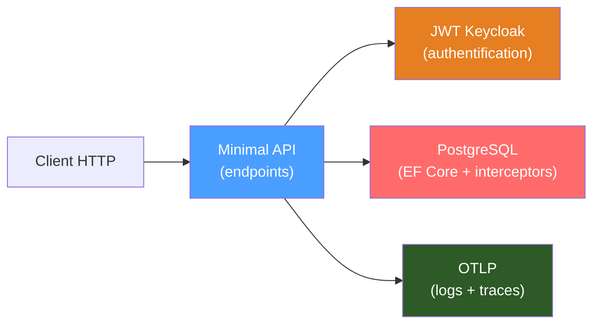

# Démarrage rapide — API de gestion de tâches

Ce tutoriel guide un nouveau développeur dans la création d'une API REST complète
avec Granit, étape par étape.

## Ce que nous allons construire

Une API de gestion de tâches (*task management*) avec :

- Un modèle domaine audité (création, modification)
- Une persistance PostgreSQL avec intercepteurs HDS
- Des endpoints CRUD en Minimal API
- Une authentification JWT Keycloak
- Une observabilité Serilog + OpenTelemetry
- Des tests unitaires et d'intégration



## Étapes

| Étape | Fichier | Sujet |
| --- | --- | --- |
| 1 | [01-modules.md](01-modules.md) | Système de modules |
| 2 | [02-programme.md](02-programme.md) | Programme minimal |
| 3 | [03-domaine.md](03-domaine.md) | Modèle domaine |
| 4 | [04-persistance.md](04-persistance.md) | Persistance EF Core |
| 5 | [05-endpoints.md](05-endpoints.md) | Endpoints CRUD |
| 6 | [06-securite.md](06-securite.md) | Sécurité JWT |
| 7 | [07-observabilite.md](07-observabilite.md) | Observabilité |
| 8 | [08-tests.md](08-tests.md) | Tests |

## Prérequis

- .NET 10 SDK
- PostgreSQL 16+ (ou Docker)
- Un éditeur (VS Code, Rider, Visual Studio)

## Structure finale du projet

```text
TaskManagement/
├── src/
│   └── TaskManagement.Api/
│       ├── Program.cs
│       ├── TaskManagementModule.cs
│       ├── Domain/
│       │   └── TaskItem.cs
│       ├── Data/
│       │   └── TaskDbContext.cs
│       └── Endpoints/
│           ├── TaskEndpointRouteBuilderExtensions.cs
│           └── TaskEndpoints.cs
└── tests/
    └── TaskManagement.Api.Tests/
        ├── TaskItemTests.cs
        └── TaskEndpointsTests.cs
```
