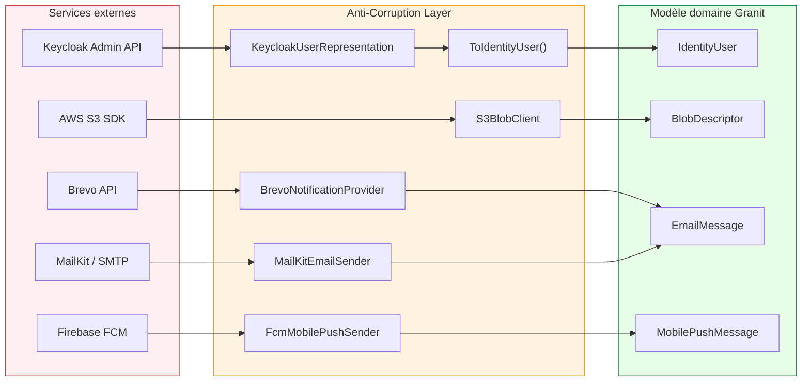

# Anti-Corruption Layer

## Définition

L'Anti-Corruption Layer (ACL) isole le modèle domaine interne des modèles
externes (APIs tierces, SDKs, formats legacy). Une couche de traduction
convertit les DTOs externes en types domaine Granit, empêchant les concepts
étrangers de "polluer" le cœur du framework.

## Schéma



## Implémentation dans Granit

### Keycloak — le cas le plus complet

`Granit.Identity.Keycloak` est l'ACL canonique du framework. Les réponses
Keycloak sont désérialisées dans des DTOs `internal` (`KeycloakUserRepresentation`,
`KeycloakSessionRepresentation`, etc.) puis converties en modèles domaine via
des méthodes `private static` :

```csharp
// DTO externe (internal, jamais exposé)
internal sealed record KeycloakUserRepresentation(
    [property: JsonPropertyName("id")] string Id,
    [property: JsonPropertyName("username")] string Username,
    [property: JsonPropertyName("email")] string? Email,
    // ...
);

// Conversion → modèle domaine
private static IdentityUser ToIdentityUser(KeycloakUserRepresentation user) =>
    new(user.Id, user.Username, user.Email, user.FirstName, user.LastName,
        user.Enabled, FlattenAttributes(user.Attributes));
```

**Particularités** :

- `FlattenAttributes()` — convertit `Dictionary<string, List<string>>` Keycloak
  en `Dictionary<string, string>` Granit (attributs multi-valeurs → valeur unique)
- `ToIdentitySession()` — convertit timestamps Unix (millisecondes) en `DateTimeOffset`
- `ToIdentityGroup()` — mapping récursif pour les sous-groupes

### Claims Transformation (JWT)

`KeycloakClaimsTransformation` et `EntraIdClaimsTransformation` extraient les
rôles des structures JSON propriétaires (`realm_access.roles`,
`resource_access.{client}.roles`) et les convertissent en claims
`ClaimTypes.Role` standard .NET.

### Inventaire des ACL dans Granit

| Service externe | Package ACL | DTO externe → Modèle interne |
| --- | --- | --- |
| Keycloak Admin API | `Granit.Identity.Keycloak` | `KeycloakUserRepresentation` → `IdentityUser` |
| Keycloak JWT | `Granit.Authentication.Keycloak` | JSON `realm_access` → `ClaimTypes.Role` |
| Entra ID JWT | `Granit.Authentication.EntraId` | JSON `roles` (v1.0/v2.0) → `ClaimTypes.Role` |
| AWS S3 SDK | `Granit.BlobStorage.S3` | `GetPreSignedUrlRequest` ← `BlobUploadRequest` |
| MailKit SMTP | `Granit.Notifications.Email.Smtp` | `MimeMessage` ← `EmailMessage` |
| Brevo API | `Granit.Notifications.Brevo` | JSON payload ← `EmailMessage` / `SmsMessage` / `WhatsAppMessage` |
| Firebase FCM | `Granit.Notifications.MobilePush.Fcm` | `FcmPayload` ← `MobilePushMessage` |
| ImageMagick | `Granit.Imaging.MagickNet` | `MagickFormat` ↔ `ImageFormat` (bidirectionnel) |
| Systèmes d'import | `Granit.DataExchange.EntityFrameworkCore` | External ID (Odoo `__export__`) → Entity ID interne |

### Principes architecturaux

1. **DTOs externes `internal`** — jamais exposés en dehors du package adaptateur
2. **Méthodes de conversion `private static`** — isolées du reste du code
3. **Transformation d'erreurs** — les erreurs externes sont parsées et
   encapsulées dans des exceptions domaine
4. **Dégradation gracieuse** — les lectures logguent un warning et retournent
   `null` ; les écritures propagent l'exception
5. **`[ExcludeFromCodeCoverage]`** — sur les adaptateurs nécessitant un
   service live (S3, SMTP)

### Fichiers de référence

| Fichier | Rôle |
| --- | --- |
| `src/Granit.Identity.Keycloak/Internal/KeycloakIdentityProvider.cs` | ACL principal (9 méthodes de conversion) |
| `src/Granit.Identity.Keycloak/Internal/KeycloakUserRepresentation.cs` | DTO externe Keycloak |
| `src/Granit.Authentication.Keycloak/Authentication/KeycloakClaimsTransformation.cs` | Claims JWT → Role |
| `src/Granit.BlobStorage.S3/Internal/S3BlobClient.cs` | Adaptateur S3 |
| `src/Granit.Notifications.Email.Smtp/Internal/MailKitEmailSender.cs` | Adaptateur SMTP |
| `src/Granit.Notifications.Brevo/Internal/BrevoNotificationProvider.cs` | Multi-channel Brevo |
| `src/Granit.Notifications.MobilePush.Fcm/Internal/FcmMobilePushSender.cs` | Adaptateur FCM |
| `src/Granit.Imaging.MagickNet/Internal/MagickFormatMapper.cs` | Mapping format image |

## Justification

| Problème | Solution ACL |
| --- | --- |
| Modèles Keycloak dans le domaine → couplage fort | DTOs `internal` + conversion statique |
| Changement d'API Keycloak → impact dans tout le code | Seul l'adaptateur change, le domaine reste stable |
| Format de claims JWT différent entre Keycloak et Entra ID | Transformations dédiées, modèle `ClaimTypes.Role` unifié |
| Attributs multi-valeurs Keycloak vs single-value Granit | `FlattenAttributes()` dans l'ACL |
| Timestamps Unix (ms) Keycloak vs `DateTimeOffset` .NET | Conversion dans `ToIdentitySession()` |

## Exemple d'usage

```csharp
// L'endpoint ne connaît que le modèle domaine IdentityUser,
// jamais les DTOs Keycloak

private static async Task<Results<Ok<IdentityUser>, NotFound>> GetUserAsync(
    string userId,
    IIdentityProvider identityProvider,
    CancellationToken cancellationToken)
{
    // IIdentityProvider est implémenté par KeycloakIdentityProvider
    // qui fait : API call → KeycloakUserRepresentation → ToIdentityUser()
    IdentityUser? user = await identityProvider
        .FindByIdAsync(userId, cancellationToken)
        .ConfigureAwait(false);

    return user is not null
        ? TypedResults.Ok(user)
        : TypedResults.NotFound();
}
```

## Pour en savoir plus

- [Anti-Corruption Layer — Microsoft Cloud Design Patterns](https://learn.microsoft.com/en-us/azure/architecture/patterns/anti-corruption-layer)
