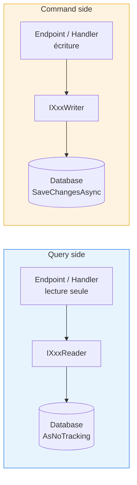
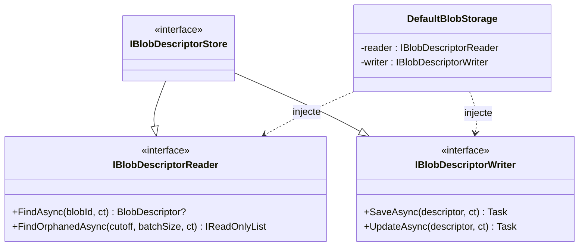

# CQRS — Command Query Responsibility Segregation

## Définition

CQRS sépare les opérations de **lecture** (Query) et d'**écriture** (Command)
en interfaces distinctes. Chaque consommateur injecte uniquement l'interface
correspondant à son intention, rendant les dépendances explicites et le code
plus facile à auditer.

## Schéma





## Implémentation dans Granit

### Convention Reader / Writer / Store

Chaque module de données expose **trois interfaces** :

| Interface | Rôle | Exemple |
| --- | --- | --- |
| `IXxxReader` | Opérations de lecture uniquement | `IBlobDescriptorReader`, `IFeatureStoreReader` |
| `IXxxWriter` | Opérations d'écriture uniquement | `IBlobDescriptorWriter`, `IFeatureStoreWriter` |
| `IXxxStore` | Union Reader + Writer (pour l'enregistrement DI) | `IBlobDescriptorStore : IBlobDescriptorReader, IBlobDescriptorWriter` |

**Règle stricte** : le `Store` combiné existe pour l'enregistrement DI.
Les constructeurs de handlers, endpoints et services **doivent** injecter
`IXxxReader` ou `IXxxWriter` séparément, jamais le `Store` combiné.

### Enforcement architectural

**Tests ArchUnitNET** (`tests/Granit.ArchitectureTests/CqrsConventionTests.cs`) :

```csharp
[Fact]
public void Reader_interfaces_should_end_with_Reader() =>
    NamingConventionRules.ReaderInterfacesShouldEndWithReader(Architecture);

[Fact]
public void Writer_interfaces_should_end_with_Writer() =>
    NamingConventionRules.WriterInterfacesShouldEndWithWriter(Architecture);
```

### Inventaire des paires Reader/Writer (extrait)

| Module | Reader | Writer |
| --- | --- | --- |
| BlobStorage | `IBlobDescriptorReader` | `IBlobDescriptorWriter` |
| Features | `IFeatureStoreReader` | `IFeatureStoreWriter` |
| Settings | `ISettingStoreReader` | `ISettingStoreWriter` |
| BackgroundJobs | `IBackgroundJobReader` | `IBackgroundJobWriter` |
| Webhooks | `IWebhookSubscriptionReader` | `IWebhookSubscriptionWriter` |
| Notifications | `IUserNotificationReader` | `IUserNotificationWriter` |
| Authorization | `IPermissionManagerReader` | `IPermissionManagerWriter` |
| Localization | `ILocalizationOverrideStoreReader` | `ILocalizationOverrideStoreWriter` |
| Templating | `IDocumentTemplateStoreReader` | `IDocumentTemplateStoreWriter` |
| Timeline | `ITimelineReader` | `ITimelineWriter` |
| DataExchange | `IImportJobReader` / `IExportJobReader` | `IImportJobWriter` / `IExportJobWriter` |
| ReferenceData | `IReferenceDataStoreReader` | `IReferenceDataStoreWriter` |

### Fichiers de référence

| Fichier | Rôle |
| --- | --- |
| `src/Granit.BlobStorage/IBlobDescriptorReader.cs` | Interface Reader canonique |
| `src/Granit.BlobStorage/IBlobDescriptorWriter.cs` | Interface Writer canonique |
| `src/Granit.BlobStorage/IBlobDescriptorStore.cs` | Interface Store combinée (DI uniquement) |
| `src/Granit.BlobStorage/Internal/DefaultBlobStorage.cs` | Injection séparée Reader + Writer |
| `src/Granit.BackgroundJobs.Endpoints/Endpoints/BackgroundJobsReadEndpoints.cs` | Endpoint injectant uniquement `IBackgroundJobReader` |
| `src/Granit.BackgroundJobs.Endpoints/Endpoints/BackgroundJobsWriteEndpoints.cs` | Endpoint injectant uniquement `IBackgroundJobWriter` |
| `tests/Granit.ArchitectureTests/CqrsConventionTests.cs` | Tests de convention CQRS |

## Justification

| Problème | Solution CQRS |
| --- | --- |
| Un service injecte un store complet alors qu'il ne fait que lire | L'injection du Reader seul rend l'intention explicite |
| Audit ISO 27001 : qui peut écrire quoi ? | Le graphe DI montre immédiatement les composants avec accès en écriture |
| RGPD : pas de hard-delete sur les readers | Les interfaces Writer n'exposent pas de méthode `Delete` physique |
| Refactoring : fusionner Reader/Writer par facilité | Les tests ArchUnitNET bloquent la régression |
| Wolverine handlers : responsabilité claire | Les command handlers injectent le Writer, les query handlers le Reader |

## Exemple d'usage

```csharp
// --- Endpoint de lecture — injecte UNIQUEMENT le Reader ---
private static async Task<Ok<PagedResult<BackgroundJobStatus>>> GetAllJobsAsync(
    IBackgroundJobReader reader,
    [FromQuery] int page = 1,
    [FromQuery] int pageSize = 20,
    CancellationToken cancellationToken = default)
{
    IReadOnlyList<BackgroundJobStatus> all = await reader
        .GetAllAsync(cancellationToken).ConfigureAwait(false);
    return TypedResults.Ok(new PagedResult<BackgroundJobStatus>(/* ... */));
}

// --- Endpoint d'écriture — injecte UNIQUEMENT le Writer ---
private static async Task<Results<NoContent, NotFound>> PauseJobAsync(
    string name,
    IBackgroundJobWriter writer,
    CancellationToken cancellationToken)
{
    await writer.PauseAsync(name, cancellationToken).ConfigureAwait(false);
    return TypedResults.NoContent();
}

// --- Wolverine command handler — Writer uniquement ---
public static async Task Handle(
    SendWebhookCommand command,
    IWebhookDeliveryWriter deliveryWriter,
    CancellationToken cancellationToken)
{
    await deliveryWriter.RecordSuccessAsync(command, /* ... */, cancellationToken)
        .ConfigureAwait(false);
}
```

## Pour en savoir plus

- [CQRS pattern — Microsoft Cloud Design Patterns](https://learn.microsoft.com/en-us/azure/architecture/patterns/cqrs)
- [CQRS — Martin Fowler](https://martinfowler.com/bliki/CQRS.html)
