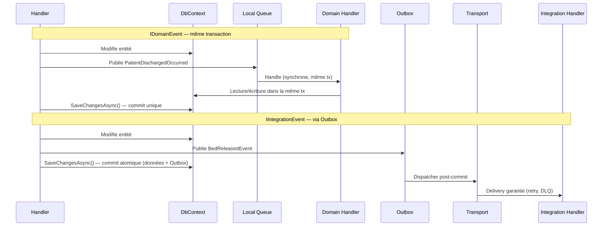

# Architecture événementielle (Event-Driven Architecture)

## Définition

L'architecture événementielle découple les composants d'un système via la
publication et la consommation d'événements. Au lieu d'appeler directement un
service, un composant publie un événement ; les intéressés y réagissent de
manière asynchrone.

Granit distingue deux catégories d'événements avec des garanties radicalement
différentes :

- **IDomainEvent** : in-process, synchrone, même transaction. Ne traverse
  jamais l'Outbox. Convention de nommage : `XxxOccurred`.
- **IIntegrationEvent** : cross-module, durable via Wolverine Outbox,
  dispatché uniquement après le commit de la transaction. Convention :
  `XxxEvent`. DTOs plats uniquement (jamais d'entités EF Core).

## Schéma



## Implémentation dans Granit

### Interfaces marqueur

| Interface | Fichier | Routage |
|-----------|---------|---------|
| `IDomainEvent` | `src/Granit.Core/Events/IDomainEvent.cs` | Queue locale uniquement — jamais l'Outbox |
| `IIntegrationEvent` | `src/Granit.Core/Events/IIntegrationEvent.cs` | Transport configuré (PostgreSQL, RabbitMQ…) via Outbox |

### Configuration Wolverine

Dans `src/Granit.Wolverine/Extensions/WolverineHostApplicationBuilderExtensions.cs` :

```csharp
// Ligne 74-77 : force les domain events en local
opts.PublishMessage<IDomainEvent>()
    .ToLocalQueue("domain-events");
```

### Handlers existants

| Handler | Événement | Type | Fichier |
|---------|-----------|------|---------|
| `FeatureCacheInvalidationHandler` | `FeatureValueChangedEvent` | Domain | `src/Granit.Features/Cache/FeatureCacheInvalidationHandler.cs` |
| `WebhookFanoutHandler` | `WebhookTrigger` | Integration | `src/Granit.Webhooks/Handlers/WebhookFanoutHandler.cs` |

### Wolverine Sidecar pattern

Les handlers Wolverine peuvent retourner des événements via `yield return` ou
en retournant un `IEnumerable<T>`. Wolverine les dispatche automatiquement :
les `IDomainEvent` vont en local, les `IIntegrationEvent` vont dans l'Outbox.

## Justification

| Problème | Solution |
|----------|----------|
| Besoin de réagir à un changement sans coupler les modules | Les handlers s'abonnent aux événements sans connaître le publisher |
| Garantie transactionnelle : « si le patient est sorti, le lit doit être libéré » | `IDomainEvent` dans la même transaction assure l'atomicité |
| Garantie de livraison : « le webhook doit être envoyé même si le serveur redémarre » | `IIntegrationEvent` via Outbox persiste l'événement avant dispatch |
| Prévention de la perte d'événements sur rollback | L'Outbox n'est dispatché qu'après le commit réussi |
| Sérialisation : les entités EF Core ne doivent pas traverser les frontières | `IIntegrationEvent` impose des DTOs plats sérialisables |

## Exemple d'usage

```csharp
// 1. Définir un domain event (in-process, même transaction)
public sealed class PatientDischargedOccurred : IDomainEvent
{
    public required Guid PatientId { get; init; }
    public required Guid BedId { get; init; }
}

// 2. Définir un integration event (durable, cross-module)
public sealed class BedReleasedEvent : IIntegrationEvent
{
    public required Guid BedId { get; init; }
    public required Guid WardId { get; init; }
    public required DateTimeOffset ReleasedAt { get; init; }
}

// 3. Handler qui publie les deux types
public static class DischargePatientHandler
{
    public static IEnumerable<object> Handle(
        DischargePatientCommand command,
        PatientDbContext db)
    {
        Patient patient = db.Patients.Find(command.PatientId)
            ?? throw new EntityNotFoundException(typeof(Patient), command.PatientId);

        patient.Discharge();

        // Domain event — traité dans la même transaction
        yield return new PatientDischargedOccurred
        {
            PatientId = patient.Id,
            BedId = patient.BedId
        };

        // Integration event — persisté dans l'Outbox, dispatché après commit
        yield return new BedReleasedEvent
        {
            BedId = patient.BedId,
            WardId = patient.WardId,
            ReleasedAt = DateTimeOffset.UtcNow
        };
    }
}
```
