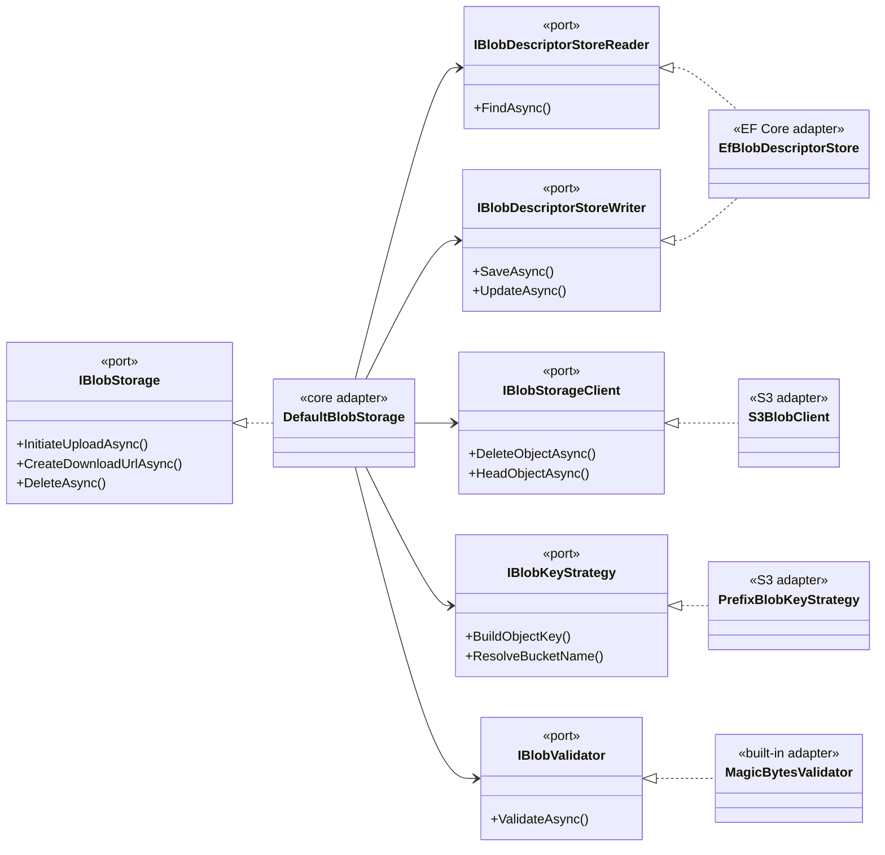

# Architecture hexagonale (Ports & Adapters)

## Définition

L'architecture hexagonale sépare la logique métier (le « cœur ») des détails
d'infrastructure (bases de données, services cloud, frameworks) via des **ports**
(interfaces) et des **adaptateurs** (implémentations interchangeables). Le cœur
ne connaît que les ports ; les adaptateurs sont branchés au moment de la
composition (DI).

Dans Granit, chaque module fonctionnel (BlobStorage, Features, BackgroundJobs,
Webhooks, Settings) suit ce pattern : un package « cœur » définit les ports,
et des packages séparés (`*.EntityFrameworkCore`, `*.S3`) fournissent les
adaptateurs.

## Schéma



## Implémentation dans Granit

### BlobStorage (exemple principal)

| Port (interface) | Fichier | Adaptateur(s) |
| ---------------- | ------- | ------------- |
| `IBlobStorage` | `src/Granit.BlobStorage/IBlobStorage.cs` | `DefaultBlobStorage` (orchestrateur) |
| `IBlobDescriptorStoreReader` / `IBlobDescriptorStoreWriter` | `src/Granit.BlobStorage/` | `EfBlobDescriptorStore` dans `Granit.BlobStorage.EntityFrameworkCore` |
| `IBlobStorageClient` | `src/Granit.BlobStorage/Internal/IBlobStorageClient.cs` | `S3BlobClient` dans `Granit.BlobStorage.S3` |
| `IBlobKeyStrategy` | `src/Granit.BlobStorage/IBlobKeyStrategy.cs` | `PrefixBlobKeyStrategy` dans `Granit.BlobStorage.S3` |
| `IBlobValidator` | `src/Granit.BlobStorage/IBlobValidator.cs` | `MagicBytesValidator`, `MaxSizeValidator` (built-in) + custom |

### Même pattern dans les autres modules

| Module | Port | Adaptateurs |
| ------ | ---- | ----------- |
| Features | `IFeatureStoreReader` / `IFeatureStoreWriter` | `InMemoryFeatureStore`, `EfCoreFeatureStore` |
| BackgroundJobs | `IBackgroundJobStoreReader` / `IBackgroundJobStoreWriter` | `InMemoryBackgroundJobStore`, `EfBackgroundJobStore` |
| Webhooks | `IWebhookSubscriptionStoreReader` / `IWebhookSubscriptionStoreWriter` | `EfWebhookSubscriptionStore` |
| Settings | `ISettingStoreReader` / `ISettingStoreWriter` | `EfCoreSettingStore` |
| Caching | `ICacheService<T>` | `DistributedCacheService`, `HybridCacheService` |
| Encryption | `IStringEncryptionProvider` | `AesStringEncryptionProvider` |

## Justification

| Problème | Solution |
| -------- | -------- |
| Couplage à un fournisseur cloud (S3, Azure Blob) | Les ports permettent de changer d'adaptateur sans toucher au cœur |
| Tests unitaires nécessitant une base de données | `InMemoryFeatureStore` et `InMemoryBackgroundJobStore` implémentent les interfaces Reader/Writer et remplacent EF Core en test |
| Conformité ISO 27001 — pouvoir migrer d'S3-compatible storage vers un autre provider souverain | Implémenter `IBlobStorageClient` pour le nouveau provider suffit |
| Packages NuGet indépendants | Le cœur (`Granit.BlobStorage`) n'a aucune dépendance sur EF Core ou AWS SDK |

## Exemple d'usage

```csharp
// Remplacer S3 par MinIO — seul l'adaptateur change
services.AddSingleton<IBlobStorageClient, MinioBlobClient>();
services.AddSingleton<IBlobKeyStrategy, MinioBlobKeyStrategy>();

// Le reste du code applicatif ne change pas
IBlobStorage blobStorage = serviceProvider.GetRequiredService<IBlobStorage>();
PresignedUploadTicket ticket = await blobStorage.InitiateUploadAsync(
    "medical-documents",
    new BlobUploadRequest("rapport-irm.pdf", "application/pdf", MaxAllowedBytes: 50_000_000),
    cancellationToken);
```

## Pour en savoir plus

- [Hexagonal Architecture — Alistair Cockburn (article original, 2005)](https://alistair.cockburn.us/hexagonal-architecture/)
