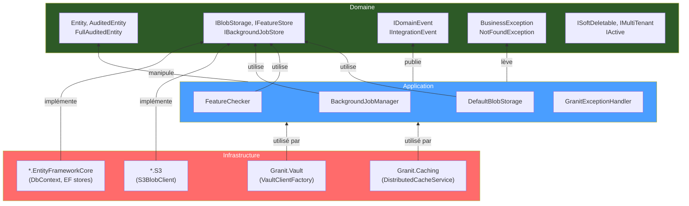

# Architecture en couches (Layered Architecture)

## Définition

L'architecture en couches organise le code en niveaux de responsabilité
strictement hiérarchisés. Chaque couche ne dépend que de la couche inférieure,
jamais de la couche supérieure. Dans Granit, trois couches principales
structurent chaque module :

- **Domaine** : entités, interfaces marqueur, événements, exceptions métier
- **Application** : services d'orchestration, checkers, managers
- **Infrastructure** : persistence EF Core, clients S3, Vault, cache Redis

## Schéma



## Implémentation dans Granit

### Couche Domaine (`Granit.Core`)

| Composant | Fichier |
|-----------|---------|
| `Entity` → `CreationAuditedEntity` → `AuditedEntity` → `FullAuditedEntity` | `src/Granit.Core/Domain/` |
| `ISoftDeletable`, `IMultiTenant`, `IActive` | `src/Granit.Core/Domain/` |
| `IDomainEvent`, `IIntegrationEvent` | `src/Granit.Core/Events/` |
| `BusinessException`, `NotFoundException`, `ConflictException` | `src/Granit.Core/Exceptions/` |
| `ICurrentTenant`, `NullTenantContext` | `src/Granit.Core/MultiTenancy/` |

### Couche Application (packages fonctionnels)

| Service | Fichier |
|---------|---------|
| `FeatureChecker` | `src/Granit.Features/Checker/FeatureChecker.cs` |
| `BackgroundJobManager` | `src/Granit.BackgroundJobs/Internal/BackgroundJobManager.cs` |
| `DefaultBlobStorage` | `src/Granit.BlobStorage/Internal/DefaultBlobStorage.cs` |
| `PermissionChecker` | `src/Granit.Authorization/Services/PermissionChecker.cs` |
| `GranitExceptionHandler` | `src/Granit.ExceptionHandling/GranitExceptionHandler.cs` |

### Couche Infrastructure (`*.EntityFrameworkCore`, `*.S3`, etc.)

| Composant | Fichier |
|-----------|---------|
| `EfBlobDescriptorStore` | `src/Granit.BlobStorage.EntityFrameworkCore/Internal/EfBlobDescriptorStore.cs` |
| `EfCoreFeatureStore` | `src/Granit.Features.EntityFrameworkCore/Internal/EfCoreFeatureStore.cs` |
| `EfBackgroundJobStore` | `src/Granit.BackgroundJobs.EntityFrameworkCore/Internal/EfBackgroundJobStore.cs` |
| `S3BlobClient` | `src/Granit.BlobStorage.S3/Internal/S3BlobClient.cs` |
| `VaultClientFactory` | `src/Granit.Vault/Services/VaultClientFactory.cs` |

### Règle de dépendance

```
Infrastructure → Application → Domaine
         ✗ Jamais en sens inverse
```

Les packages `*.EntityFrameworkCore` référencent le package cœur (ex :
`Granit.BlobStorage`) mais jamais l'inverse. Le package cœur ne contient
aucune dépendance vers EF Core ou AWS SDK.

## Justification

| Problème | Solution |
|----------|----------|
| Couplage entre logique métier et base de données | Le domaine ne connaît que des interfaces (ports) |
| Difficulté à tester la logique métier isolément | Les services applicatifs sont testables avec des mocks |
| Changement de provider (S3 → autre) impacte tout le code | Seule la couche infrastructure change |
| Entités EF Core qui fuient dans les DTOs API | Séparation stricte empêche les raccourcis |

## Exemple d'usage

```csharp
// Hiérarchie d'entités — couche Domaine
public sealed class Patient : FullAuditedEntity, IMultiTenant
{
    public Guid? TenantId { get; set; }
    public string FirstName { get; set; } = string.Empty;
    public string LastName { get; set; } = string.Empty;
    public DateOnly BirthDate { get; set; }
}

// FullAuditedEntity fournit automatiquement :
// - Id (Guid, séquentiel via IGuidGenerator)
// - CreatedAt, CreatedBy (audit HDS — création)
// - ModifiedAt, ModifiedBy (audit HDS — modification)
// - IsDeleted, DeletedAt, DeletedBy (soft delete RGPD)
// - TenantId (isolation multi-tenant via IMultiTenant)
```
