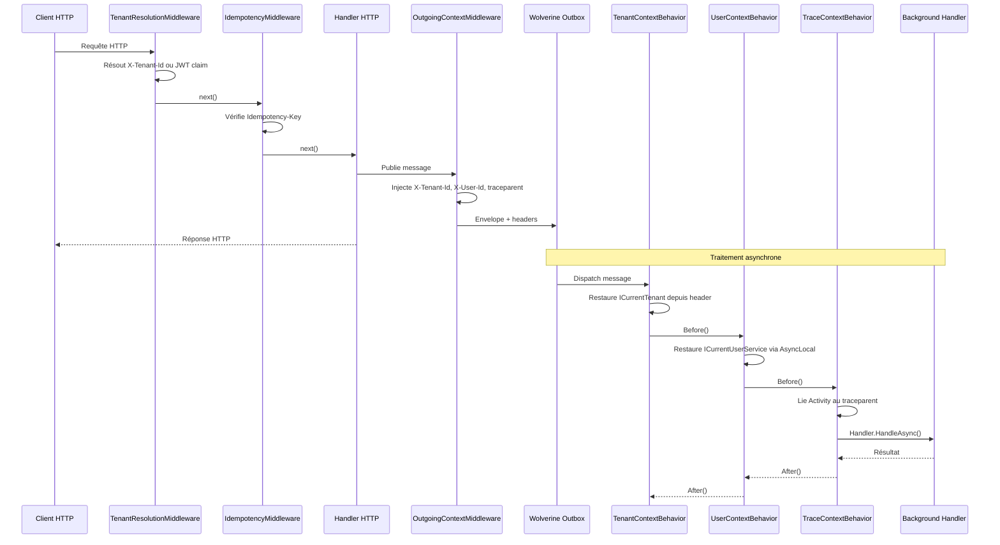

# Pipeline Middleware (Dual ASP.NET Core + Wolverine)

## Définition

Le pattern Middleware Pipeline chaîne des composants intercepteurs autour du
traitement principal d'une requête ou d'un message. Chaque middleware peut
exécuter de la logique avant et après le handler, court-circuiter la chaîne,
ou enrichir le contexte.

Granit implémente un **double pipeline** :

1. **ASP.NET Core Middleware** : pour les requêtes HTTP (résolution tenant,
   idempotence)
2. **Wolverine Behaviors/Middleware** : pour les messages asynchrones
   (propagation tenant, user, trace context)

Les deux pipelines convergent via l'`OutgoingContextMiddleware` qui injecte
les headers de contexte dans les enveloppes Wolverine sortantes.

## Schéma



## Implémentation dans Granit

### Pipeline ASP.NET Core

| Middleware | Fichier | Rôle |
|-----------|---------|------|
| `TenantResolutionMiddleware` | `src/Granit.MultiTenancy/Middleware/TenantResolutionMiddleware.cs` | Résout le tenant via `TenantResolverPipeline` (Header → JWT) |
| `IdempotencyMiddleware` | `src/Granit.Idempotency/Internal/IdempotencyMiddleware.cs` | Idempotence HTTP Stripe-style avec state machine |

### Pipeline Wolverine — Incoming Behaviors

| Behavior | Fichier | Rôle |
|----------|---------|------|
| `TenantContextBehavior` | `src/Granit.Wolverine/Behaviors/TenantContextBehavior.cs` | Restaure `ICurrentTenant` depuis `X-Tenant-Id` header |
| `UserContextBehavior` | `src/Granit.Wolverine/Behaviors/UserContextBehavior.cs` | Restaure `ICurrentUserService` via `IWolverineUserContextSetter` |
| `TraceContextBehavior` | `src/Granit.Wolverine/Behaviors/TraceContextBehavior.cs` | Lie le `traceparent` W3C à l'Activity du handler |

### Pipeline Wolverine — Outgoing Middleware

| Middleware | Fichier | Rôle |
|-----------|---------|------|
| `OutgoingContextMiddleware` | `src/Granit.Wolverine/Middleware/OutgoingContextMiddleware.cs` | Injecte `X-Tenant-Id`, `X-User-Id`, `traceparent` dans les enveloppes sortantes |

### Enregistrement global

Tous les behaviors et middlewares sont enregistrés dans
`src/Granit.Wolverine/Extensions/WolverineHostApplicationBuilderExtensions.cs` via
`opts.Policies.AddMiddleware<T>()`.

## Justification

| Problème | Solution |
|----------|----------|
| Le handler HTTP connaît le tenant, mais le background handler non | `OutgoingContextMiddleware` → headers → `TenantContextBehavior` restaure le contexte |
| L'intercepteur d'audit EF Core a besoin du `ModifiedBy` en background | `UserContextBehavior` restaure `ICurrentUserService` via `AsyncLocal` |
| Les traces OpenTelemetry sont disjointes entre HTTP et async | `TraceContextBehavior` lie les spans via `traceparent` (W3C Trace Context) |
| Les cross-cutting concerns polluent les handlers | Logique extraite dans des middlewares réutilisables et composables |

## Exemple d'usage

```csharp
// Le handler n'a aucune conscience des middlewares —
// le contexte tenant/user/trace est déjà restauré quand il s'exécute

public static class SendInvoiceHandler
{
    // Wolverine découvre ce handler automatiquement
    public static async Task Handle(
        SendInvoiceCommand command,
        ICurrentTenant currentTenant,      // ← restauré par TenantContextBehavior
        ICurrentUserService currentUser,   // ← restauré par UserContextBehavior
        InvoiceDbContext db,
        CancellationToken cancellationToken)
    {
        // currentTenant.Id est correct même en background
        // currentUser.UserId est correct pour l'audit trail
        Invoice invoice = await db.Invoices.FindAsync([command.InvoiceId], ct)
            ?? throw new EntityNotFoundException(typeof(Invoice), command.InvoiceId);

        invoice.MarkAsSent();
        await db.SaveChangesAsync(ct);
        // AuditedEntityInterceptor enregistre ModifiedBy = currentUser.UserId
    }
}
```

## Pour en savoir plus

- [Sidecar pattern — Microsoft Cloud Design Patterns](https://learn.microsoft.com/en-us/azure/architecture/patterns/sidecar)
