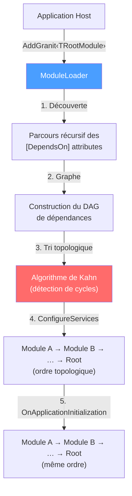

# Système de modules (Module / Plugin System)

## Définition

Le pattern Module System organise une application en unités autonomes (modules)
possédant chacune leur propre cycle de vie d'enregistrement de services et
d'initialisation. Un chargeur central résout l'ordre de démarrage par tri
topologique des dépendances déclarées, garantissant qu'un module ne démarre
jamais avant ses prérequis.

Granit implémente une variante inspirée du framework ABP (ASP.NET Boilerplate),
adaptée à un écosystème de packages NuGet indépendants.

## Schéma



## Implémentation dans Granit

| Composant | Fichier | Rôle |
|-----------|---------|------|
| `GranitModule` | `src/Granit.Core/Modularity/GranitModule.cs` | Classe abstraite de base : `ConfigureServices()`, `ConfigureServicesAsync()`, `OnApplicationInitialization()`, `OnApplicationInitializationAsync()` |
| `DependsOnAttribute` | `src/Granit.Core/Modularity/DependsOnAttribute.cs` | Déclare les dépendances d'un module via `[DependsOn(typeof(...))]` |
| `ModuleLoader` | `src/Granit.Core/Modularity/ModuleLoader.cs` | Tri topologique (algorithme de Kahn) avec détection de dépendances circulaires |
| `ModuleDescriptor` | `src/Granit.Core/Modularity/ModuleDescriptor.cs` | Métadonnées d'un module (type, instance, dépendances) |
| `GranitApplication` | `src/Granit.Core/Modularity/GranitApplication.cs` | Coordinateur du cycle de vie complet |
| `AddGranit<TModule>()` | `src/Granit.Core/Extensions/GranitHostBuilderExtensions.cs` | Point d'entrée pour l'application hôte |

**Variante maison — Dual Sync/Async** : les hooks async (`ConfigureServicesAsync`,
`OnApplicationInitializationAsync`) délèguent par défaut à leur version sync.
Un module peut surcharger l'un ou l'autre sans obligation d'implémenter les deux.

## Justification

| Problème | Solution apportée |
|----------|-------------------|
| Packages NuGet indépendants qui doivent s'auto-configurer | Chaque package expose un `GranitModule` avec son propre `ConfigureServices()` |
| Ordre d'initialisation imprévisible avec le DI natif | Tri topologique garantit que les dépendances sont enregistrées en premier |
| Dépendances circulaires silencieuses | L'algorithme de Kahn lève une exception explicite listant les modules impliqués |
| Duplication de code dans les `Program.cs` applicatifs | Un seul appel `builder.AddGranit<MyAppModule>()` remplace des dizaines de lignes |

## Exemple d'usage

```csharp
// Déclaration d'un module applicatif
[DependsOn(typeof(GranitPersistenceModule))]
[DependsOn(typeof(GranitWolverineModule))]
[DependsOn(typeof(GranitFeaturesModule))]
public sealed class GuavaHostModule : GranitModule
{
    public override void ConfigureServices(ServiceConfigurationContext context)
    {
        ServiceCollection services = context.Services;
        services.AddScoped<IPatientService, PatientService>();
    }

    public override void OnApplicationInitialization(ApplicationInitializationContext context)
    {
        WebApplication app = context.GetApplicationBuilder();
        app.MapHealthChecks("/healthz");
    }
}

// Point d'entrée — une seule ligne
WebApplicationBuilder builder = WebApplication.CreateBuilder(args);
builder.AddGranit<GuavaHostModule>();

WebApplication app = builder.Build();
await app.UseGranitAsync();
app.Run();
```
