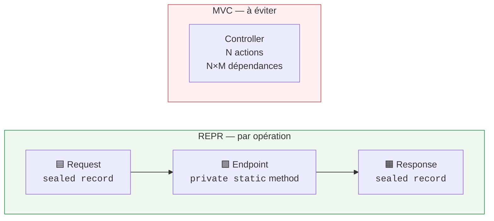
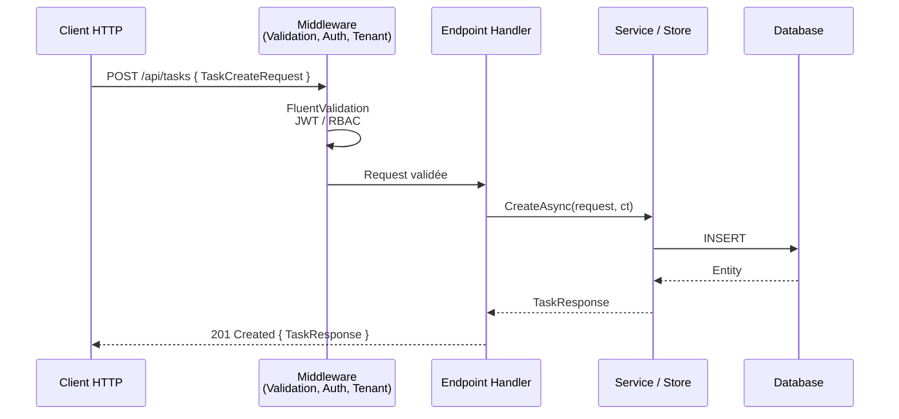

# REPR — Request-Endpoint-Response

## Définition

Le [REPR design pattern](https://deviq.com/design-patterns/repr-design-pattern)
formalise la séparation entre trois responsabilités distinctes dans une API :

1. **Request** — un type dédié qui modélise les données entrantes
2. **Endpoint** — un handler unique qui traite la requête
3. **Response** — un type dédié qui modélise la sortie, découplé du modèle domaine

Ce pattern s'oppose aux contrôleurs MVC monolithiques qui regroupent des dizaines
d'actions sans lien entre elles, chacune avec des dépendances différentes.

## Schéma





## Implémentation dans Granit

Granit adopte les **principes** REPR en les adaptant aux Minimal API natives de .NET,
sans dépendance externe (FastEndpoints, MediatR, Ardalis).

### Adaptation : groupement par feature

Le REPR strict prescrit **une classe par endpoint**. Granit regroupe les handlers
dans une **classe d'extensions statiques sur `RouteGroupBuilder`**, organisée par
feature (lecture, admin, sync, etc.). Ce choix pragmatique réduit le nombre de
fichiers tout en préservant la séparation Request / Endpoint / Response.

| Caractéristique | REPR strict (FastEndpoints / Ardalis) | Granit |
| --- | --- | --- |
| Request/Response dédiés par opération | Oui | **Oui** |
| Pas de retour d'entité EF | Oui | **Oui** |
| Un fichier/classe par endpoint | Oui | **Non** — groupés par feature |
| Dépendance externe | Oui | **Non** — Minimal API natif |
| Testabilité | Via base class / harness | **Méthodes statiques pures** |

### Structure type d'un package Endpoints

```text
src/Granit.{Module}.Endpoints/
├── Dtos/
│   ├── {Module}{Action}Request.cs      ← Request (input body / query)
│   └── {Module}{Action}Response.cs     ← Response (output)
├── Endpoints/
│   ├── {Module}ReadEndpoints.cs        ← Endpoint (handlers lecture)
│   └── {Module}AdminEndpoints.cs       ← Endpoint (handlers admin)
├── Extensions/
│   └── {Module}EndpointRouteBuilderExtensions.cs  ← Point d'entrée public
└── Granit{Module}EndpointsModule.cs
```

### Pilier Request

Un `sealed record` par opération d'écriture ou de recherche.

| Type de binding | Convention |
| --- | --- |
| Body (POST/PUT) | `{Module}{Action}Request` — record positionnel ou avec `required` |
| Query string | `{Module}ListRequest` avec `[AsParameters]` |
| Route | Paramètres primitifs directs (`Guid id`, `string code`) |

Règles :

- **Suffixe `Request`** obligatoire (jamais `Dto`)
- **Préfixe métier** obligatoire : `WorkflowTransitionRequest`, pas `TransitionRequest`
  (OpenAPI aplatit les namespaces → collisions de schémas)
- **Types cross-cutting exemptés** du préfixe : `PagedResult<T>`, `ProblemDetails`

### Pilier Endpoint

Une méthode `private static` nommée dans une classe d'extensions `internal static`.

| Règle | Détail |
| --- | --- |
| Visibilité | `private static` (handler), `internal static` (méthode de mapping) |
| Async | `async Task<T>`, `ConfigureAwait(false)` en code library |
| Dernier paramètre | `CancellationToken cancellationToken` |
| Retour | `TypedResults.*` (jamais `Results.*` ni `IResult`) |
| Métadonnées | `.WithName()`, `.WithSummary()`, `.WithTags()` obligatoires |
| Lambdas inline | **Interdites** — pas d'inférence de type, illisibles |

### Pilier Response

Un `sealed record` distinct de l'entité EF Core.

| Règle | Détail |
| --- | --- |
| Suffixe | `Response` (jamais `Dto`) |
| Types anonymes | **Interdits** — schéma OpenAPI non nommé |
| Entités EF directes | **Interdites** — couplage schéma DB ↔ contrat API |
| Erreurs | `TypedResults.Problem()` (RFC 7807), jamais `BadRequest<string>()` |
| Retour multi-état | `Results<Ok<T>, NotFound>`, `Results<Created<T>, ProblemHttpResult>` |

### Fichiers de référence

| Module | Fichier | Particularité |
| --- | --- | --- |
| Identity | `src/Granit.Identity.Endpoints/Endpoints/IdentityUserCacheReadEndpoints.cs` | CRUD complet, DTOs séparés dans `Dtos/` |
| Notifications | `src/Granit.Notifications.Endpoints/Endpoints/MobilePushTokenEndpoints.cs` | DTOs inline dans le fichier endpoint |
| ReferenceData | `src/Granit.ReferenceData.Endpoints/Endpoints/ReferenceDataAdminEndpoints.cs` | Endpoints génériques `<TEntity>` |
| DataExchange | `src/Granit.DataExchange.Endpoints/Endpoints/Import/ImportUploadEndpoints.cs` | Upload `IFormFile`, validation complexe |
| Authorization | `src/Granit.Authorization.Endpoints/Endpoints/MyPermissionsEndpoints.cs` | Response-only, pas de Request body |

## Justification

| Problème | Solution REPR |
| --- | --- |
| Contrôleurs MVC monolithiques avec N dépendances injectées | Chaque handler ne reçoit que ses propres dépendances via DI de paramètres |
| Entité EF retournée → couplage schéma DB ↔ contrat API | Response record dédié, contrat OpenAPI stable |
| Schéma OpenAPI opaque ou non nommé | `TypedResults` + records typés = schéma déterministe |
| Dépendance framework tier (FastEndpoints, MediatR) | Minimal API natif, zéro dépendance pour les consommateurs |
| Explosion de fichiers (un par endpoint × N modules) | Groupement par feature dans des extensions sur `RouteGroupBuilder` |

## Exemple d'usage

```csharp
// --- Dtos/TaskCreateRequest.cs ---

/// <summary>Request to create a new task.</summary>
public sealed record TaskCreateRequest(string Title, string? Description = null);

// --- Dtos/TaskResponse.cs ---

/// <summary>Represents a task returned by the API.</summary>
public sealed record TaskResponse(Guid Id, string Title, string? Description);

// --- Endpoints/TaskEndpoints.cs ---

internal static class TaskEndpoints
{
    internal static void MapTaskRoutes(this RouteGroupBuilder group)
    {
        group.MapGet("/{id:guid}", GetByIdAsync)
            .WithName("GetTask")
            .WithSummary("Returns a task by its unique identifier.");

        group.MapPost("/", CreateAsync)
            .WithName("CreateTask")
            .WithSummary("Creates a new task.");
    }

    private static async Task<Results<Ok<TaskResponse>, NotFound>> GetByIdAsync(
        Guid id,
        ITaskReader reader,
        CancellationToken cancellationToken)
    {
        TaskResponse? task = await reader.FindAsync(id, cancellationToken)
            .ConfigureAwait(false);
        return task is not null
            ? TypedResults.Ok(task)
            : TypedResults.NotFound();
    }

    private static async Task<Created<TaskResponse>> CreateAsync(
        TaskCreateRequest request,
        ITaskWriter writer,
        CancellationToken cancellationToken)
    {
        TaskResponse created = await writer.CreateAsync(request, cancellationToken)
            .ConfigureAwait(false);
        return TypedResults.Created($"/{created.Id}", created);
    }
}

// --- Extensions/TaskEndpointRouteBuilderExtensions.cs ---

public static class TaskEndpointRouteBuilderExtensions
{
    public static RouteGroupBuilder MapTaskEndpoints(
        this IEndpointRouteBuilder endpoints)
    {
        RouteGroupBuilder group = endpoints
            .MapGroup("/api/tasks")
            .WithTags("Tasks")
            .RequireAuthorization();

        group.MapTaskRoutes();
        return group;
    }
}
```

## Pour en savoir plus

- [REPR Design Pattern — deviq.com (Ardalis)](https://deviq.com/design-patterns/repr-design-pattern)
