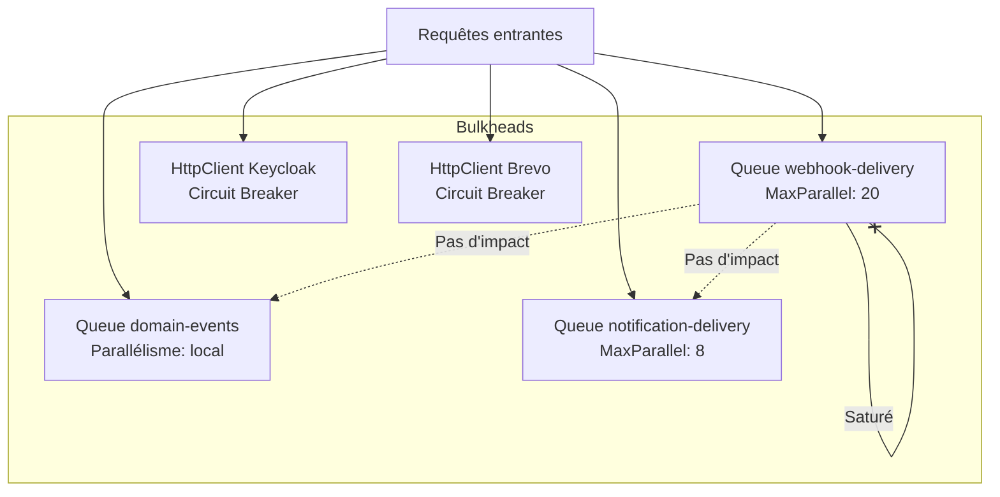
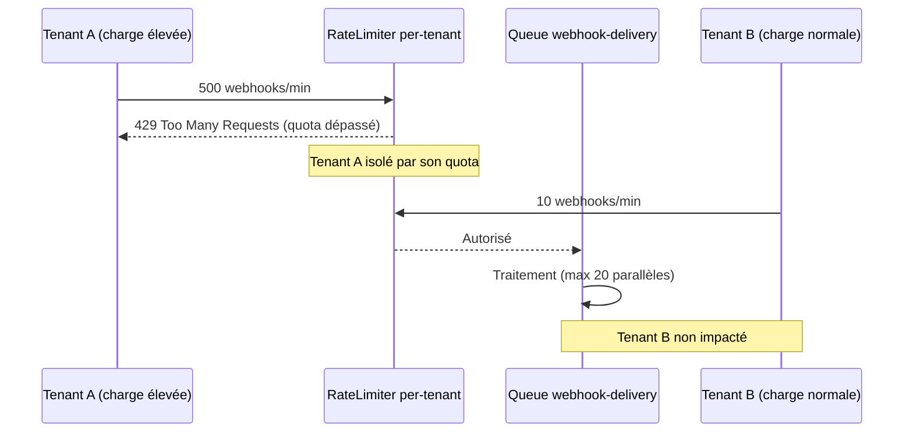

# Bulkhead Isolation

## Définition

Le **Bulkhead** (cloison étanche) isole les ressources d'un système en
compartiments indépendants, de sorte qu'une défaillance ou surcharge dans un
compartiment ne se propage pas aux autres. En contexte SaaS multi-tenant, le
pattern empêche un tenant gourmand, un canal de notification lent ou un service
externe en panne de dégrader l'ensemble de la plateforme. Granit implémente ce
pattern via une combinaison de mécanismes : partitionnement de queues Wolverine,
limites de parallélisme par pipeline, isolation de quota par tenant et circuit
breakers HTTP.

## Schéma





## Implémentation dans Granit

Granit implémente le Bulkhead Isolation via 5 mécanismes complémentaires, chacun
ciblant un niveau d'isolation différent :

### 1. Queue Partitioning — Isolation par type de message (Wolverine)

Les messages sont routés vers des queues dédiées avec un parallélisme contrôlé.
Chaque queue fonctionne comme un compartiment indépendant.

| Queue | Messages | Isolation |
| --- | --- | --- |
| `domain-events` | `IDomainEvent` | Local uniquement, jamais routé vers un transport externe |
| `notification-delivery` | `DeliverNotificationCommand` | Parallélisme configurable (défaut: 8) |
| `webhook-delivery` | `SendWebhookCommand` | Parallélisme configurable (défaut: 20) |
| Error queue (DLQ) | `ValidationException` | Échecs déterministes, pas de retry |

```csharp
// Routage explicite vers queue locale (AddGranitWolverine)
opts.PublishMessage<Core.Events.IDomainEvent>()
    .ToLocalQueue("domain-events");
```

### 2. MaxParallelDeliveries — Limites de concurrence par pipeline

Chaque pipeline de livraison limite le nombre d'opérations simultanées, empêchant
un canal saturé de consommer toutes les ressources du pod.

| Module | Paramètre | Défaut | Plage |
| --- | --- | --- | --- |
| `Granit.Notifications` | `MaxParallelDeliveries` | 8 | 1–100 |
| `Granit.Webhooks` | `MaxParallelDeliveries` | 20 | 1–100 |

### 3. Per-Tenant Rate Limiting — Isolation des quotas par tenant

`Granit.RateLimiting` partitionne les compteurs Redis par tenant. Chaque tenant
possède ses propres compteurs indépendants — un tenant ne peut jamais consommer
le quota d'un autre.

| Élément | Détail |
| --- | --- |
| Clé Redis | `{prefix}:{tenantId}:{policyName}` |
| Hash tag | `{tenantId}` garantit la colocalisation en Redis Cluster |
| Bypass | Rôles configurables exemptés |

### 4. Circuit Breaker — Isolation des services HTTP externes

`AddStandardResilienceHandler()` (Microsoft.Extensions.Http.Resilience) est
appliqué à chaque `HttpClient` ciblant un service externe. Quand un service
externe est en panne, le circuit s'ouvre et les requêtes échouent immédiatement
sans consommer de ressources.

| Service | Circuit Breaker | Retry | Timeout |
| --- | --- | --- | --- |
| Keycloak Admin API | ✓ | 3 tentatives, backoff exponentiel | 30s / 2min |
| Brevo API | ✓ | 3 tentatives, backoff exponentiel | 30s / 2min |

```csharp
// Chaque HttpClient externe est isolé par son propre circuit breaker
services.AddHttpClient("keycloak-admin")
    .AddStandardResilienceHandler();
```

### 5. SemaphoreSlim — Anti-stampede par ressource

Les ressources partagées (token cache, cache distribué) utilisent
`SemaphoreSlim(1, 1)` pour sérialiser les accès concurrents lors d'un cache miss.
Ce mécanisme empêche un pic de requêtes de générer N appels parallèles vers le
même service externe.

| Composant | Ressource protégée | Pattern |
| --- | --- | --- |
| `KeycloakAdminTokenService` | Token Keycloak | Double-check locking |
| `DistributedCacheService` | Cache distribué | Double-check locking |

### 6. Channel-Based Isolation — Webhooks

Le `WebhookDispatchWorker` utilise deux `System.Threading.Channels.Channel<T>`
séparés pour isoler la phase de fan-out (trigger → commands) de la phase de
livraison (command → HTTP POST). Les deux phases s'exécutent en parallèle via
`Task.WhenAll()` sans interférence.

### Fichiers de référence

| Fichier | Rôle |
| --- | --- |
| `src/Granit.Wolverine/Extensions/WolverineHostApplicationBuilderExtensions.cs` | Queue routing domain-events |
| `src/Granit.RateLimiting/Internal/TenantPartitionedRateLimiter.cs` | Isolation per-tenant |
| `src/Granit.Identity.Keycloak/Internal/KeycloakAdminTokenService.cs` | SemaphoreSlim anti-stampede |
| `src/Granit.Caching/DistributedCacheService.cs` | SemaphoreSlim cache miss |
| `src/Granit.Webhooks/Internal/WebhookDispatchWorker.cs` | Channels séparés trigger/delivery |
| `docs/patterns/cloud-saas/circuit-breaker-retry.md` | Circuit breaker & retry |
| `docs/patterns/cloud-saas/rate-limiting.md` | Rate limiting per-tenant |

## Justification

| Problème | Solution |
| --- | --- |
| Webhook vers un service lent bloque les notifications | Queues séparées avec parallélisme indépendant |
| Tenant gourmand sature l'API pour tous | Compteurs de quota partitionnés par tenant |
| Service externe en panne consomme les threads | Circuit breaker coupe les appels après seuil |
| Cache miss simultané → N appels vers le provider | SemaphoreSlim sérialise, un seul appel passe |
| Fan-out webhooks bloque la phase de livraison | Channels séparés trigger vs delivery |

## Exemple d'usage

```csharp
// --- Isolation par queue Wolverine ---
// IDomainEvent → queue locale dédiée, pas d'interférence avec les integration events
opts.PublishMessage<Core.Events.IDomainEvent>()
    .ToLocalQueue("domain-events");

// --- Parallélisme configurable par module ---
// appsettings.json
// {
//   "Webhooks": { "MaxParallelDeliveries": 20 },
//   "Notifications": { "MaxParallelDeliveries": 8 }
// }

// --- Circuit breaker par service externe ---
services.AddHttpClient("keycloak-admin", client =>
    client.BaseAddress = new Uri(keycloakUrl))
    .AddStandardResilienceHandler();

// --- Rate limiting per-tenant (isolation automatique) ---
app.MapGet("/api/v1/patients", GetPatientsAsync)
   .RequireGranitRateLimiting("api");
// Chaque tenant a ses propres compteurs Redis — quota indépendant
```

## Pour en savoir plus

- [Bulkhead pattern — Microsoft Cloud Design Patterns](https://learn.microsoft.com/en-us/azure/architecture/patterns/bulkhead)
- [Documentation Rate Limiting](../../framework/api/rate-limiting.md)
- [Pattern Circuit Breaker & Retry](circuit-breaker-retry.md)
- [Pattern Double-Check Locking](../concurrency/double-check-locking.md)
