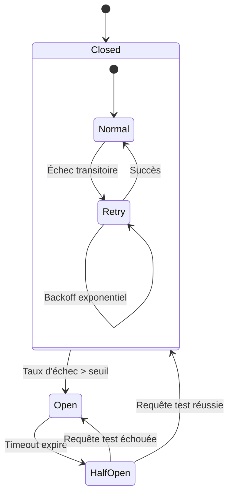
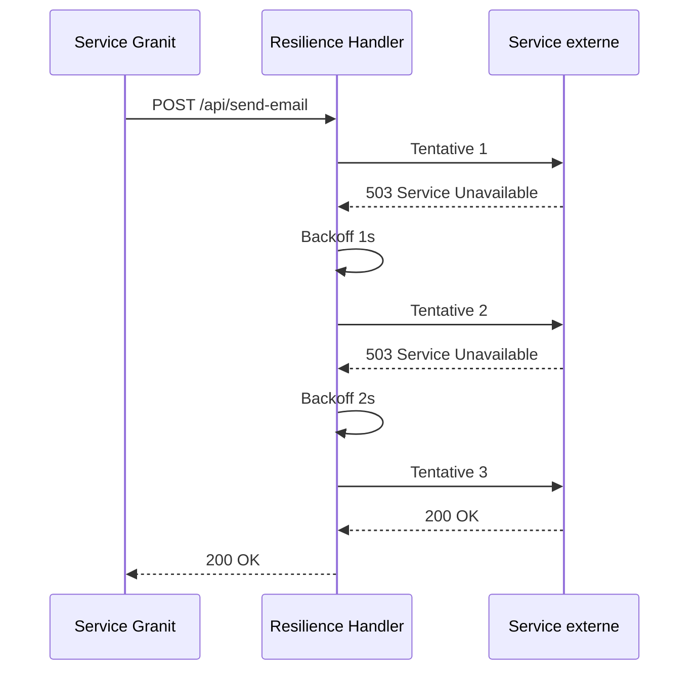

# Circuit Breaker & Retry (Resilience)

## Définition

Le **Circuit Breaker** coupe les appels vers un service défaillant pour éviter
la saturation en cascade. Le **Retry** relance automatiquement les requêtes
échouées avec backoff exponentiel. Granit combine les deux via
`Microsoft.Extensions.Http.Resilience` pour les appels HTTP sortants et
Wolverine `RetryWithCooldown` pour les messages asynchrones.

## Schéma





## Implémentation dans Granit

### HTTP — AddStandardResilienceHandler

Chaque `HttpClient` vers un service externe est configuré avec le handler de
résilience standard de .NET :

| Service | Fichier d'enregistrement |
| --- | --- |
| Keycloak Admin API | `src/Granit.Identity.Keycloak/Extensions/IdentityKeycloakServiceCollectionExtensions.cs` |
| Microsoft Graph (Entra ID) | `src/Granit.Identity.EntraId/Extensions/IdentityEntraIdServiceCollectionExtensions.cs` |
| Brevo (email/SMS/WhatsApp) | `src/Granit.Notifications.Brevo/Extensions/BrevoNotificationsServiceCollectionExtensions.cs` |
| Zulip (chat) | `src/Granit.Notifications.Zulip/Extensions/ZulipNotificationsServiceCollectionExtensions.cs` |
| Firebase FCM (push) | `src/Granit.Notifications.MobilePush.Fcm/Extensions/FcmMobilePushServiceCollectionExtensions.cs` |

```csharp
services.AddHttpClient("KeycloakAdmin", client =>
    {
        client.BaseAddress = new Uri(options.BaseUrl);
        client.Timeout = TimeSpan.FromSeconds(options.TimeoutSeconds);
    })
    .AddStandardResilienceHandler();
```

`AddStandardResilienceHandler()` ajoute automatiquement :

- **Retry** — 3 tentatives, backoff exponentiel sur erreurs transitoires (429, 5xx)
- **Circuit Breaker** — coupe après dépassement du seuil d'échecs sur 30s
- **Timeout** — par requête (30s) et total (2min)
- **Rate Limiter** — contrôle de concurrence

### Messaging — Wolverine RetryWithCooldown

Pour les messages asynchrones, Wolverine offre un retry avec cooldown progressif.
Exemple avec les webhooks (6 niveaux, 30s → 12h) :

```csharp
opts.OnException<WebhookDeliveryException>()
    .RetryWithCooldown(
        TimeSpan.FromSeconds(30),     // Niveau 1
        TimeSpan.FromMinutes(2),      // Niveau 2
        TimeSpan.FromMinutes(10),     // Niveau 3
        TimeSpan.FromMinutes(30),     // Niveau 4
        TimeSpan.FromHours(2),        // Niveau 5
        TimeSpan.FromHours(12));      // Niveau 6 → Dead-Letter Queue
```

### Matrice de résilience par service

| Service | Resilience HTTP | Retry messaging | Comportement spécial |
| --- | --- | --- | --- |
| Keycloak Admin | Standard handler | — | Dégradation gracieuse en lecture |
| Brevo | Standard handler | Wolverine retry | — |
| SMTP | Timeout configurable | Wolverine retry | — |
| Web Push | Standard handler | Wolverine retry | Auto-cleanup sur HTTP 410 |
| Webhooks | Timeout 5-120s | 6 niveaux (30s → 12h) | Auto-suspension sur 401/403/410 |
| Vault | — | Renouvellement de lease | Auto-refresh credentials |
| S3 | AWS SDK built-in retry | — | Backoff natif du SDK |
| OTLP | — | Buffer batch export | — |

### Timeouts configurables

Chaque service externe expose un timeout via le Options pattern :

| Options | Propriété | Défaut | Range |
| --- | --- | --- | --- |
| `KeycloakAdminOptions` | `TimeoutSeconds` | 30 | — |
| `BrevoOptions` | `TimeoutSeconds` | 30 | 1–300 |
| `SmtpOptions` | `TimeoutSeconds` | 30 | — |
| `WebhooksOptions` | `HttpTimeoutSeconds` | 10 | 5–120 |

### Fichiers de référence

| Fichier | Rôle |
| --- | --- |
| `src/Granit.Identity.Keycloak/Extensions/IdentityKeycloakServiceCollectionExtensions.cs` | Standard resilience sur Keycloak |
| `src/Granit.Notifications.Brevo/Extensions/BrevoNotificationsServiceCollectionExtensions.cs` | Standard resilience sur Brevo |
| `src/Granit.Webhooks/Extensions/WebhooksHostApplicationBuilderExtensions.cs` | RetryWithCooldown 6 niveaux |
| `docs/guide/conventions/architecture.md` | Documentation `AddStandardResilienceHandler()` |

## Justification

| Problème | Solution |
| --- | --- |
| Service externe temporairement down → cascade de 500 | Circuit Breaker coupe les appels, évite la saturation |
| Erreur réseau transitoire → perte de données | Retry avec backoff relance automatiquement |
| Webhook endpoint down pendant des heures | 6 niveaux progressifs (30s → 12h) avant dead-letter |
| Token expiré sur un service externe | Auto-refresh via Vault lease renewal |
| `new HttpClient()` sans résilience | `IHttpClientFactory` + `AddStandardResilienceHandler()` systématique |

## Exemple d'usage

```csharp
// --- Enregistrement avec résilience standard ---
services.AddHttpClient<GeoService>(client =>
    {
        client.BaseAddress = new Uri("https://api.geo.example.com");
    })
    .AddStandardResilienceHandler();

// --- Le service n'a aucune conscience de la résilience ---
public sealed class GeoService(HttpClient httpClient)
{
    public async Task<GeoResult?> GeocodeAsync(
        string address,
        CancellationToken cancellationToken = default)
    {
        // Retry + Circuit Breaker + Timeout transparents
        return await httpClient
            .GetFromJsonAsync<GeoResult>(
                $"/geocode?q={Uri.EscapeDataString(address)}",
                cancellationToken)
            .ConfigureAwait(false);
    }
}
```

## Pour en savoir plus

- [Circuit Breaker pattern — Microsoft Cloud Design Patterns](https://learn.microsoft.com/en-us/azure/architecture/patterns/circuit-breaker)
- [Retry pattern — Microsoft Cloud Design Patterns](https://learn.microsoft.com/en-us/azure/architecture/patterns/retry)
