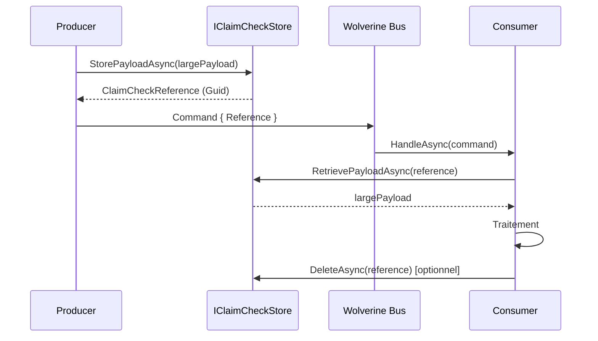
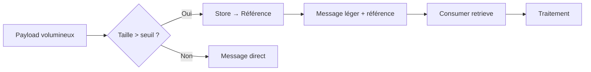

# Claim Check

## Définition

Le **Claim Check** (ou Reference-Based Messaging) remplace les payloads volumineux
dans les messages par une référence légère vers un stockage externe. Le producteur
sérialise le payload, le stocke dans un blob store ou un cache, et envoie uniquement
un identifiant de référence. Le consommateur utilise cette référence pour récupérer
le payload complet avant de le traiter. Ce pattern réduit la taille des messages,
diminue la pression sur le bus de messages et évite les dépassements de limites de
taille de transport.

## Schéma





## Implémentation dans Granit

Granit fournit une abstraction `IClaimCheckStore` dans `Granit.Wolverine` avec une
**soft dependency** : si aucune implémentation n'est enregistrée dans le conteneur DI,
la fonctionnalité est simplement indisponible. Les handlers résolvent le store via
`IServiceProvider.GetService<IClaimCheckStore>()`.

### Abstraction

| Élément | Détail |
| --- | --- |
| Interface | `IClaimCheckStore` |
| Package | `Granit.Wolverine` |
| Méthodes | `StoreAsync`, `RetrieveAsync`, `DeleteAsync` |
| Soft dependency | Résolu via `GetService()`, pas de `[DependsOn]` requis |

```csharp
public interface IClaimCheckStore
{
    Task<Guid> StoreAsync(
        ReadOnlyMemory<byte> data,
        string? contentType = null,
        TimeSpan? expiry = null,
        CancellationToken cancellationToken = default);

    Task<byte[]?> RetrieveAsync(
        Guid referenceId,
        CancellationToken cancellationToken = default);

    Task<bool> DeleteAsync(
        Guid referenceId,
        CancellationToken cancellationToken = default);
}
```

### Extensions typées

Les extensions `ClaimCheckExtensions` gèrent la sérialisation JSON automatiquement :

| Méthode | Rôle |
| --- | --- |
| `StorePayloadAsync<T>` | Sérialise en JSON UTF-8 et stocke |
| `RetrievePayloadAsync<T>` | Récupère et désérialise |
| `ConsumePayloadAsync<T>` | Récupère, désérialise et supprime (consume-once) |

### Référence

`ClaimCheckReference` est un record immuable qui porte l'identifiant de stockage,
le type du payload et le content type :

```csharp
public sealed record ClaimCheckReference(
    Guid ReferenceId,
    string PayloadType,
    string ContentType = "application/json");
```

### Implémentations disponibles

| Implémentation | Package | Usage |
| --- | --- | --- |
| `InMemoryClaimCheckStore` | `Granit.Wolverine` | Développement et tests |
| BlobStorage-backed (custom) | Application | Production (S3, Azure Blob, Redis) |

L'implémentation in-memory utilise un `ConcurrentDictionary` et n'applique pas
d'expiry. En production, l'application enregistre sa propre implémentation via DI.

### Pattern de soft dependency

Le Claim Check suit le même pattern que `IFeatureChecker` dans `Granit.RateLimiting` :

1. L'interface est définie dans le package framework (`Granit.Wolverine`)
2. Aucune implémentation n'est enregistrée par défaut par `AddGranitWolverine()`
3. Les handlers qui en ont besoin résolvent via `GetService<IClaimCheckStore>()`
4. Si `Granit.BlobStorage` est installé, l'application peut enregistrer un store
   adossé au blob storage
5. Si aucun store n'est enregistré, la fonctionnalité est désactivée

### Fichiers de référence

| Fichier | Rôle |
| --- | --- |
| `src/Granit.Wolverine/ClaimCheck/IClaimCheckStore.cs` | Abstraction du store |
| `src/Granit.Wolverine/ClaimCheck/ClaimCheckReference.cs` | Record de référence |
| `src/Granit.Wolverine/ClaimCheck/ClaimCheckExtensions.cs` | Helpers JSON typés |
| `src/Granit.Wolverine/ClaimCheck/Internal/InMemoryClaimCheckStore.cs` | Store dev/test |
| `src/Granit.Wolverine/ClaimCheck/ClaimCheckServiceCollectionExtensions.cs` | DI registration |

## Justification

| Problème | Solution |
| --- | --- |
| Message Wolverine > 1 Mo → pression transport | Payload stocké externement, message réduit à un Guid |
| Export RGPD avec données volumineuses dans le saga state | Seul le `BlobReferenceId` est stocké (ISO 27001) |
| Couplage fort entre Wolverine et BlobStorage | Soft dependency — fonctionne sans BlobStorage installé |
| Payload temporaire oublié dans le store | `ConsumePayloadAsync` (consume-once) + TTL configurable |
| Sérialisation/désérialisation manuelle | Extensions typées `StorePayloadAsync<T>` / `RetrievePayloadAsync<T>` |

## Exemple d'usage

```csharp
// --- Producteur : offloader un payload volumineux ---
public sealed record ProcessMedicalRecordCommand(
    Guid PatientId,
    ClaimCheckReference RecordDataRef);

// Dans un handler ou un service
IClaimCheckStore claimCheckStore = serviceProvider
    .GetService<IClaimCheckStore>()
    ?? throw new InvalidOperationException("Claim check store not configured.");

MedicalRecordData largePayload = await BuildLargePayloadAsync(patientId, cancellationToken)
    .ConfigureAwait(false);

ClaimCheckReference reference = await claimCheckStore
    .StorePayloadAsync(largePayload, TimeSpan.FromHours(1), cancellationToken)
    .ConfigureAwait(false);

await messageBus.PublishAsync(
    new ProcessMedicalRecordCommand(patientId, reference),
    cancellationToken).ConfigureAwait(false);

// --- Consommateur : récupérer et consommer ---
public static async Task HandleAsync(
    ProcessMedicalRecordCommand command,
    IClaimCheckStore claimCheckStore,
    CancellationToken cancellationToken)
{
    MedicalRecordData? data = await claimCheckStore
        .ConsumePayloadAsync<MedicalRecordData>(
            command.RecordDataRef, cancellationToken)
        .ConfigureAwait(false)
        ?? throw new InvalidOperationException("Payload expired or already consumed.");

    // Traitement du dossier médical...
}

// --- Enregistrement DI (application) ---
// Développement :
builder.Services.AddInMemoryClaimCheckStore();

// Production (implémentation custom) :
builder.Services.AddSingleton<IClaimCheckStore, S3ClaimCheckStore>();
```

## Pour en savoir plus

- [Claim-Check pattern — Microsoft Cloud Design Patterns](https://learn.microsoft.com/en-us/azure/architecture/patterns/claim-check)
- [Enterprise Integration Patterns — Claim Check](https://www.enterpriseintegrationpatterns.com/patterns/messaging/StoreInLibrary.html)
- [Documentation Granit.Wolverine](../../framework/messaging/wolverine.md)
