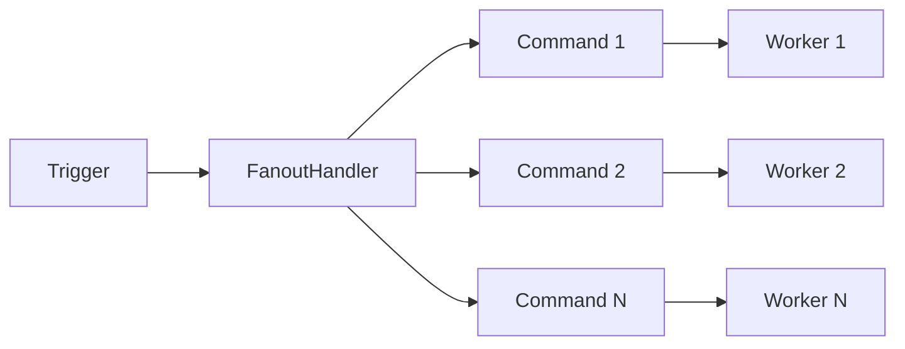
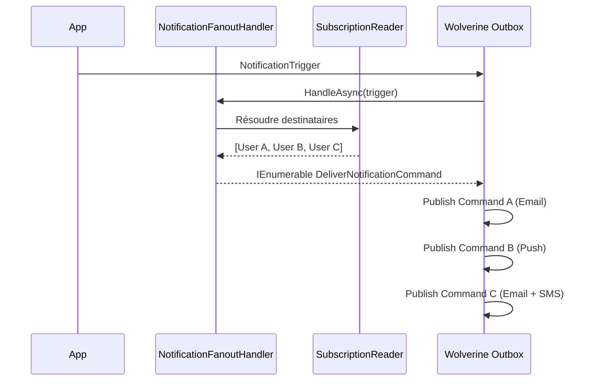

# Fan-Out

## Définition

Le **Fan-Out** (ou Scatter) transforme un message unique en N messages indépendants,
chacun traité en parallèle. En contexte messaging, le handler reçoit un trigger et
retourne une collection de commandes — le bus publie chaque commande individuellement
dans la même transaction Outbox. Granit utilise ce pattern dans les notifications
(un trigger → N deliveries par destinataire × canal) et les webhooks (un événement
→ N envois par abonnement actif).

## Schéma





## Implémentation dans Granit

Granit implémente le Fan-Out dans 2 modules distincts, en exploitant la convention
Wolverine `Task<IEnumerable<TCommand>>` : chaque élément retourné est publié comme
message indépendant dans la même transaction Outbox.

### 1. NotificationFanoutHandler — Notifications multi-canal

Transforme un `NotificationTrigger` en N `DeliverNotificationCommand` (un par
destinataire × canal préféré).

| Élément | Détail |
| --- | --- |
| Classe | `NotificationFanoutHandler` |
| Package | `Granit.Notifications` |
| Input | `NotificationTrigger` |
| Output | `IEnumerable<DeliverNotificationCommand>` |
| Résolution | Explicite → Followers → Subscribers (priorité décroissante) |

```csharp
public async Task<IEnumerable<DeliverNotificationCommand>> HandleAsync(
    NotificationTrigger trigger,
    CancellationToken cancellationToken)
{
    // 1. Résoudre les destinataires (explicit > followers > subscribers)
    // 2. Charger les préférences de canal par utilisateur
    // 3. Créer un DeliverNotificationCommand par destinataire × canal
    // Retour vide si aucun destinataire — pas d'exception
}
```

**Logique de résolution des canaux** : chaque destinataire peut avoir des
préférences (opt-out par canal). La `NotificationDefinition` fournit les canaux
par défaut. Le handler filtre les canaux désactivés avant de créer les commandes.

### 2. WebhookFanoutHandler — Webhooks par abonnement

Transforme un `WebhookTrigger` en N `SendWebhookCommand` (un par abonnement actif
pour le type d'événement).

| Élément | Détail |
| --- | --- |
| Classe | `WebhookFanoutHandler` |
| Package | `Granit.Webhooks` |
| Input | `WebhookTrigger` |
| Output | `IEnumerable<SendWebhookCommand>` |
| Filtrage | Abonnements actifs pour `EventType` |

```csharp
public async Task<IEnumerable<SendWebhookCommand>> HandleAsync(
    WebhookTrigger trigger,
    CancellationToken cancellationToken)
{
    // 1. Requêter les abonnements actifs pour trigger.EventType
    // 2. Créer un WebhookEnvelope standardisé (metadata + payload)
    // 3. Créer un SendWebhookCommand par abonnement
    // Retour vide si aucun abonnement — pas d'exception
}
```

Chaque commande reçoit un `DeliveryId` distinct (séparé du `EventId` partagé),
permettant le suivi individuel et le retry isolé.

### Propriétés architecturales communes

| Propriété | Détail |
| --- | --- |
| Convention Wolverine | `Task<IEnumerable<T>>` — cascade automatique dans l'Outbox |
| Garantie transactionnelle | Toutes les commandes publiées dans la même transaction Outbox |
| Cas vide | Retour `Enumerable.Empty<T>()` — pas d'exception |
| Idempotence | `DeliveryId` unique par commande pour audit et retry |
| Multi-tenancy | Contexte ambient `ICurrentTenant` avec fallback sur `TenantId` embarqué |
| Observabilité | Activity OpenTelemetry avec cardinalité du fan-out |

### Fichiers de référence

| Fichier | Rôle |
| --- | --- |
| `src/Granit.Notifications/Handlers/NotificationFanoutHandler.cs` | Fan-out notifications |
| `src/Granit.Notifications/Messages/NotificationTrigger.cs` | Message déclencheur |
| `src/Granit.Notifications/Messages/DeliverNotificationCommand.cs` | Commande de livraison |
| `src/Granit.Webhooks/Handlers/WebhookFanoutHandler.cs` | Fan-out webhooks |
| `src/Granit.Webhooks/Messages/WebhookTrigger.cs` | Message déclencheur |
| `src/Granit.Webhooks/Messages/SendWebhookCommand.cs` | Commande d'envoi |

## Justification

| Problème | Solution |
| --- | --- |
| Notification vers 100 destinataires bloque le handler | Fan-out en 100 commandes indépendantes, traitées en parallèle |
| Échec d'un webhook ne doit pas bloquer les autres | Chaque `SendWebhookCommand` a son propre retry isolé |
| Perte de messages si crash pendant le fan-out | Wolverine Outbox — commit atomique de toutes les commandes |
| Destinataire opt-out sur un canal | Filtrage par préférences avant création des commandes |
| Audit trail par livraison | `DeliveryId` unique par commande (distinct du `EventId`) |

## Exemple d'usage

```csharp
// --- Déclencher une notification (fan-out automatique) ---
await messageBus.PublishAsync(
    new NotificationTrigger(
        NotificationId: guidGenerator.Create(),
        NotificationTypeName: "appointment.reminder",
        Data: JsonSerializer.SerializeToElement(new { PatientName = "Dupont" }),
        RecipientUserIds: [doctorId, secretaryId]),
    cancellationToken).ConfigureAwait(false);

// Le NotificationFanoutHandler résout les canaux préférés de chaque destinataire
// et publie un DeliverNotificationCommand par destinataire × canal.

// --- Déclencher un webhook (fan-out automatique) ---
await messageBus.PublishAsync(
    new WebhookTrigger(
        EventId: guidGenerator.Create(),
        EventType: "invoice.paid",
        Payload: JsonSerializer.SerializeToElement(invoiceDto),
        OccurredAt: timeProvider.GetUtcNow()),
    cancellationToken).ConfigureAwait(false);

// Le WebhookFanoutHandler crée un SendWebhookCommand par abonnement actif
// pour "invoice.paid". Chaque envoi est signé et livré indépendamment.
```

## Pour en savoir plus

- [Enterprise Integration Patterns — Splitter](https://www.enterpriseintegrationpatterns.com/patterns/messaging/Sequencer.html)
- [Wolverine Cascading Messages](https://wolverine.netlify.app/guide/handlers/cascading.html)
- [Documentation Granit.Notifications](../../framework/messaging/notifications.md)
- [Documentation Granit.Webhooks](../../framework/messaging/webhooks.md)
